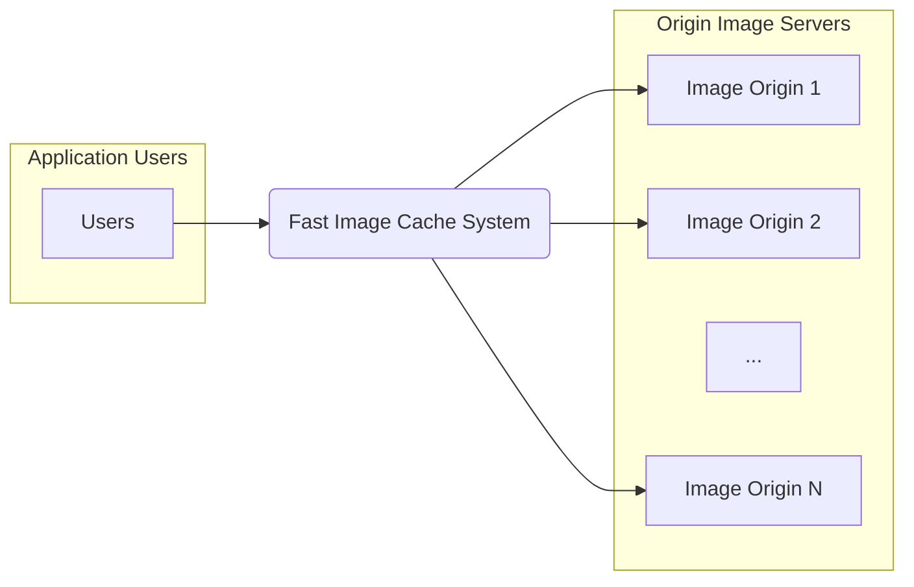
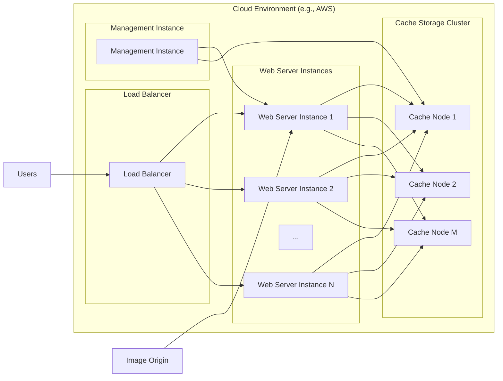

# BUSINESS POSTURE

- Business Priorities and Goals:
 - Priority is to improve application performance by reducing image loading times.
 - Goal is to provide a fast and efficient image caching service.
 - Goal is to reduce bandwidth costs associated with serving images directly from origin servers.
 - Goal is to improve user experience by serving images quickly and reliably.

- Business Risks:
 - Risk of service unavailability impacting application performance and user experience.
 - Risk of serving stale or incorrect images leading to data integrity issues.
 - Risk of increased operational costs if the caching system is not efficient or scalable.
 - Risk of security vulnerabilities in the caching system leading to data breaches or service disruptions.

# SECURITY POSTURE

- Existing Security Controls:
 - security control: Code reviews are likely performed as part of the development process. (Location: GitHub repository workflow)
 - security control: Basic unit and integration tests are likely in place. (Location: GitHub repository workflow)
 - security control: Project is likely deployed in a cloud environment. (Location: Assumption based on modern software development practices)

- Accepted Risks:
 - accepted risk: Potential for minor service disruptions during deployment updates.
 - accepted risk: Reliance on cloud provider's security for infrastructure.

- Recommended Security Controls:
 - security control: Implement automated security scanning (SAST/DAST) in the CI/CD pipeline.
 - security control: Implement input validation for image URLs and cache keys.
 - security control: Implement access control to the cache management interface.
 - security control: Use HTTPS for all communication to and from the cache.
 - security control: Implement monitoring and logging for security events.

- Security Requirements:
 - Authentication:
  - Requirement: Implement authentication for accessing the cache management interface.
  - Requirement: Consider API key or token-based authentication for programmatic access.
 - Authorization:
  - Requirement: Implement role-based access control (RBAC) for the cache management interface to restrict access to sensitive operations.
  - Requirement: Ensure that only authorized services or users can invalidate cache entries.
 - Input Validation:
  - Requirement: Validate image URLs to prevent injection attacks and ensure they are valid image resources.
  - Requirement: Validate cache keys to prevent manipulation and ensure proper cache retrieval.
  - Requirement: Sanitize and validate any user-provided data used in cache operations.
 - Cryptography:
  - Requirement: Use HTTPS for all communication between clients and the cache service to protect data in transit.
  - Requirement: Consider encryption at rest for cached images if they contain sensitive data.

# DESIGN

- C4 CONTEXT



- C4 CONTEXT Elements:
 - Element:
  - Name: Users
  - Type: Person
  - Description: End-users of the application who access images.
  - Responsibilities: Requesting images through the application.
  - Security controls: User authentication and authorization are handled by the application, not directly by the cache.
 - Element:
  - Name: Image Origin 1, Image Origin 2, ..., Image Origin N
  - Type: External System
  - Description: External servers that host the original images.
  - Responsibilities: Providing original images when requested by the cache.
  - Security controls: Security of origin servers is managed independently. Fast Image Cache system should only access publicly available images or use appropriate authentication if required by origin servers.
 - Element:
  - Name: Fast Image Cache System
  - Type: System
  - Description: System responsible for caching images to improve application performance.
  - Responsibilities: Caching images fetched from origin servers, serving cached images to users, managing cache invalidation.
  - Security controls: Input validation, access control for management interface, HTTPS for communication, monitoring and logging.

- C4 CONTAINER

```mermaid
flowchart LR
    subgraph "Fast Image Cache System"
        A["Web Server"
        \nTechnology: Nginx/Apache]
        B["Cache Storage"
        \nTechnology: Redis/Memcached/Disk]
        C["Management Interface"
        \nTechnology: Web UI/CLI"]
    end
    D[Users]
    E[Image Origin]

    D --> A
    A --> B
    A --> E
    C --> A
    C --> B
```

- C4 CONTAINER Elements:
 - Element:
  - Name: Web Server
  - Type: Container
  - Description: Handles incoming image requests from users, checks the cache, and serves cached images or fetches from origin servers.
  - Responsibilities: Receiving image requests, cache lookup, image retrieval from origin, serving images, cache invalidation requests.
  - Security controls: Input validation for image URLs, HTTPS termination, rate limiting, logging of access attempts.
 - Element:
  - Name: Cache Storage
  - Type: Container
  - Description: Stores cached images and metadata for efficient retrieval.
  - Responsibilities: Storing and retrieving images based on cache keys, managing cache eviction policies.
  - Security controls: Access control to the cache storage, potential encryption at rest, monitoring of storage usage.
 - Element:
  - Name: Management Interface
  - Type: Container
  - Description: Provides an interface for administrators to manage the cache, such as invalidating entries, monitoring cache statistics, and configuring settings.
  - Responsibilities: Cache management operations, monitoring, configuration.
  - Security controls: Authentication and authorization for access, audit logging of management actions, secure communication (HTTPS).

- DEPLOYMENT



- DEPLOYMENT Elements:
 - Element:
  - Name: Load Balancer
  - Type: Infrastructure
  - Description: Distributes incoming traffic across multiple web server instances for high availability and scalability.
  - Responsibilities: Traffic distribution, health checks for web server instances.
  - Security controls: DDoS protection, TLS termination, access control lists.
 - Element:
  - Name: Web Server Instance 1, Web Server Instance 2, ..., Web Server Instance N
  - Type: Infrastructure (Virtual Machine/Container)
  - Description: Instances of the web server container running the image caching logic.
  - Responsibilities: Handling image requests, interacting with cache storage and origin servers.
  - Security controls: Security hardening of the operating system and runtime environment, network firewalls, intrusion detection systems.
 - Element:
  - Name: Cache Node 1, Cache Node 2, ..., Cache Node M
  - Type: Infrastructure (Virtual Machine/Container/Managed Service)
  - Description: Nodes in the cache storage cluster providing distributed and scalable caching.
  - Responsibilities: Storing and retrieving cached images, data replication and persistence.
  - Security controls: Access control to the cache cluster, data encryption at rest and in transit within the cluster, monitoring of cluster health.
 - Element:
  - Name: Management Instance
  - Type: Infrastructure (Virtual Machine/Container)
  - Description: Instance hosting the management interface for the cache system.
  - Responsibilities: Providing access to the management interface.
  - Security controls: Security hardening, network firewalls, access control, HTTPS only access.

- BUILD

```mermaid
flowchart LR
    A[Developer] --> B{Code Changes};
    B --> C[Version Control (e.g., GitHub)];
    C --> D[CI/CD Pipeline (e.g., GitHub Actions)];
    D --> E{Build Process
    \n- Compilation
    \n- Linting
    \n- SAST Scanning
    \n- Unit Tests
    \n- Integration Tests};
    E --> F[Build Artifacts
    \n(e.g., Container Image, Binaries)];
    F --> G[Artifact Repository
    \n(e.g., Container Registry, Package Repository)];
```

- BUILD Elements:
 - Element:
  - Name: Developer
  - Type: Person
  - Description: Software developer writing and modifying the code.
  - Responsibilities: Writing secure code, performing local testing.
  - Security controls: Secure coding practices training, code review participation.
 - Element:
  - Name: Version Control (e.g., GitHub)
  - Type: Tool
  - Description: System for managing and tracking changes to the codebase.
  - Responsibilities: Source code management, access control to codebase, audit logging of changes.
  - Security controls: Access control (authentication and authorization), branch protection, audit logs.
 - Element:
  - Name: CI/CD Pipeline (e.g., GitHub Actions)
  - Type: Tool
  - Description: Automated system for building, testing, and deploying the application.
  - Responsibilities: Automating build process, running security scans, deploying artifacts.
  - Security controls: Secure pipeline configuration, secret management, access control to pipeline definitions and execution.
 - Element:
  - Name: Build Process
  - Type: Process
  - Description: Steps involved in transforming source code into deployable artifacts. Includes compilation, linting, security scanning, and testing.
  - Responsibilities: Creating secure and functional build artifacts.
  - Security controls: SAST scanning, dependency scanning, linting, unit and integration tests, secure build environment.
 - Element:
  - Name: Build Artifacts (e.g., Container Image, Binaries)
  - Type: Artifact
  - Description: Deployable packages created by the build process.
  - Responsibilities: Being deployable and containing the application code and dependencies.
  - Security controls: Artifact signing, vulnerability scanning of artifacts.
 - Element:
  - Name: Artifact Repository (e.g., Container Registry, Package Repository)
  - Type: Tool
  - Description: System for storing and managing build artifacts.
  - Responsibilities: Securely storing and distributing build artifacts.
  - Security controls: Access control, vulnerability scanning, audit logging, secure storage.

# RISK ASSESSMENT

- Critical Business Processes:
 - Serving images to application users quickly and reliably.
 - Maintaining cache availability and integrity.
 - Efficiently managing cache storage and resources.

- Data to Protect and Sensitivity:
 - Cached images: Sensitivity depends on the application using the cache. Assuming publicly available images, sensitivity is low in terms of confidentiality, but high in terms of availability and integrity (serving correct images).
 - Cache metadata: Low sensitivity.
 - Logs and monitoring data: Low to medium sensitivity, depending on the information logged.

# QUESTIONS & ASSUMPTIONS

- Questions:
 - What is the expected scale of image requests and cache size?
 - What are the performance requirements (latency, throughput)?
 - What type of images will be cached (public, private, sensitive)?
 - Are there any specific compliance requirements (e.g., GDPR, HIPAA)?
 - What is the budget for security controls and infrastructure?
 - What is the expected lifespan of the project?

- Assumptions:
 - BUSINESS POSTURE:
  - The primary business goal is to improve application performance.
  - The application serves publicly accessible images.
  - Cost-effectiveness is a consideration.
 - SECURITY POSTURE:
  - Basic security controls like code reviews and testing are in place.
  - The system will be deployed in a cloud environment.
  - Security is important but should be balanced with performance and cost.
 - DESIGN:
  - A standard web server (Nginx/Apache) will be used.
  - A distributed cache storage (Redis/Memcached/Disk) will be used.
  - Deployment will be in a typical cloud environment with load balancers and auto-scaling.
  - CI/CD pipeline will be used for build and deployment automation.