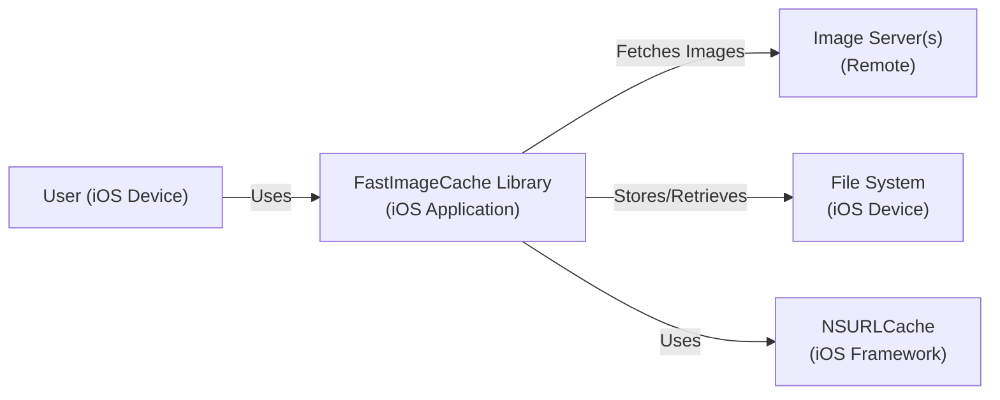
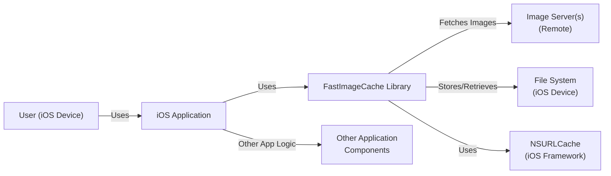
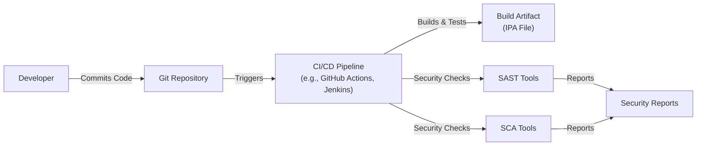

Okay, let's create a design document for the FastImageCache project, keeping in mind its purpose and potential security considerations.

# BUSINESS POSTURE

Business Priorities and Goals:

*   Improve application performance by reducing image loading times.
*   Reduce bandwidth consumption by efficiently caching images.
*   Provide a simple and easy-to-use library for iOS developers.
*   Minimize storage space used for cached images.
*   Maintain image data integrity and prevent corruption.

Most Important Business Risks:

*   Application performance degradation due to caching issues.
*   Increased storage costs due to inefficient cache management.
*   Negative user experience due to slow image loading or incorrect images.
*   Potential security vulnerabilities if the cache is compromised.
*   Compatibility issues with different iOS versions or device configurations.

# SECURITY POSTURE

Existing Security Controls:

*   security control: The library uses `NSURLCache` and file system storage, inheriting some security features from the underlying iOS framework. (Implicit in the use of Apple's APIs)
*   security control: Data integrity checks (using UUIDs and file extensions) to ensure that cached data is not corrupted. (Mentioned in the README and source code)
*   security control: Expiration of cached images based on time and usage, reducing the risk of stale data. (Mentioned in the README)
*   security control: Limited access to the cache directory, leveraging iOS's sandboxing features. (Implicit in iOS application sandboxing)

Accepted Risks:

*   accepted risk: The library does not explicitly encrypt cached images, relying on the underlying file system security. This could be a risk if the device is compromised.
*   accepted risk: The library does not implement any specific protection against denial-of-service attacks that might attempt to fill the cache.
*   accepted risk: The library does not provide built-in mechanisms for validating the authenticity of image sources.

Recommended Security Controls:

*   security control: Consider adding an option for encrypting cached images, especially for sensitive data.
*   security control: Implement a mechanism to limit the total size of the cache and prevent excessive disk usage.
*   security control: Add integrity checks using cryptographic hashes (e.g., SHA-256) to verify that cached images have not been tampered with.
*   security control: Provide documentation and guidance on securely configuring the library, including recommendations for image source validation.

Security Requirements:

*   Authentication: Not directly applicable, as the library itself does not handle authentication. However, if images are fetched from authenticated sources, the application using the library should handle authentication securely.
*   Authorization: Not directly applicable, as the library does not manage access control to images. The application using the library should implement appropriate authorization mechanisms if required.
*   Input Validation: The library should validate file paths and URLs to prevent path traversal vulnerabilities. It should also validate image data to prevent processing malformed or malicious images.
*   Cryptography: Consider using cryptographic hashes for integrity checks. Encryption of cached images should be an option, especially for sensitive data.

# DESIGN

## C4 CONTEXT

Element Descriptions:

*   Element:
    *   Name: User (iOS Device)
    *   Type: Person
    *   Description: A user interacting with an iOS application that utilizes the FastImageCache library.
    *   Responsibilities: Interacts with the application's UI, triggering image loading requests.
    *   Security Controls: Relies on the security of the iOS device and the application.

*   Element:
    *   Name: FastImageCache Library (iOS Application)
    *   Type: Software System
    *   Description: The FastImageCache library integrated into an iOS application.
    *   Responsibilities: Manages image caching, fetching, and retrieval.
    *   Security Controls: Data integrity checks, expiration policies, sandboxed file system access.

*   Element:
    *   Name: Image Server(s) (Remote)
    *   Type: Software System
    *   Description: Remote servers hosting the original images.
    *   Responsibilities: Provides images to the application upon request.
    *   Security Controls: Should implement appropriate security measures (HTTPS, authentication, etc.).

*   Element:
    *   Name: File System (iOS Device)
    *   Type: Software System
    *   Description: The iOS device's file system used for storing cached images.
    *   Responsibilities: Stores and retrieves image data.
    *   Security Controls: iOS sandboxing, file system permissions.

*   Element:
    *   Name: NSURLCache (iOS Framework)
    *   Type: Software System
    *   Description: Apple's built-in caching mechanism for network requests.
    *   Responsibilities: Caches network responses, including images.
    *   Security Controls: Inherits security features from the iOS framework.

## C4 CONTAINER

Since FastImageCache is a library integrated directly into an iOS application, the container diagram is essentially an extension of the context diagram.

Element Descriptions:

*   Element:
    *   Name: User (iOS Device)
    *   Type: Person
    *   Description: A user interacting with an iOS application.
    *   Responsibilities: Interacts with the application's UI.
    *   Security Controls: Relies on the security of the iOS device and the application.

*   Element:
    *   Name: iOS Application
    *   Type: Container
    *   Description: The iOS application that integrates FastImageCache.
    *   Responsibilities: Handles user interactions, displays images, and manages application logic.
    *   Security Controls: Application-specific security measures.

*   Element:
    *   Name: FastImageCache Library
    *   Type: Component
    *   Description: The FastImageCache library.
    *   Responsibilities: Manages image caching, fetching, and retrieval.
    *   Security Controls: Data integrity checks, expiration policies, sandboxed file system access.

*   Element:
    *   Name: Image Server(s) (Remote)
    *   Type: Software System
    *   Description: Remote servers hosting the original images.
    *   Responsibilities: Provides images to the application upon request.
    *   Security Controls: Should implement appropriate security measures (HTTPS, authentication, etc.).

*   Element:
    *   Name: File System (iOS Device)
    *   Type: Software System
    *   Description: The iOS device's file system.
    *   Responsibilities: Stores and retrieves image data.
    *   Security Controls: iOS sandboxing, file system permissions.

*   Element:
    *   Name: NSURLCache (iOS Framework)
    *   Type: Software System
    *   Description: Apple's built-in caching mechanism.
    *   Responsibilities: Caches network responses.
    *   Security Controls: Inherits security features from the iOS framework.

*   Element:
    *   Name: Other Application Components
    *   Type: Component
    *   Description: Other components of the iOS application.
    *   Responsibilities: Handle various application logic unrelated to image caching.
    *   Security Controls: Application-specific security measures.

## DEPLOYMENT

Deployment Solutions:

1.  Direct Integration: The library is directly integrated into the application's source code. This is the most likely scenario.
2.  CocoaPods: The library can be included as a dependency via CocoaPods.
3.  Carthage: The library can be included as a dependency via Carthage.
4.  Swift Package Manager: The library can be included as a dependency via Swift Package Manager.

Chosen Solution (Direct Integration):

Element Descriptions:

*   Element:
    *   Name: Developer Machine
    *   Type: Node
    *   Description: The developer's workstation.
    *   Responsibilities: Hosts the source code, development tools, and the FastImageCache library.
    *   Security Controls: Developer machine security best practices.

*   Element:
    *   Name: Xcode
    *   Type: Software System
    *   Description: Apple's integrated development environment (IDE).
    *   Responsibilities: Compiles the application code and integrates the library.
    *   Security Controls: Xcode security features, code signing.

*   Element:
    *   Name: IPA File (iOS Application Archive)
    *   Type: Artifact
    *   Description: The compiled application package.
    *   Responsibilities: Contains the application code, resources, and the integrated FastImageCache library.
    *   Security Controls: Code signing, encryption (if enabled).

*   Element:
    *   Name: App Store / TestFlight / Enterprise Distribution
    *   Type: Software System
    *   Description: Mechanisms for distributing the application to users.
    *   Responsibilities: Delivers the application to iOS devices.
    *   Security Controls: App Store security review process, TestFlight beta testing, enterprise distribution policies.

*   Element:
    *   Name: iOS Device
    *   Type: Node
    *   Description: The user's iOS device.
    *   Responsibilities: Runs the application and utilizes the FastImageCache library.
    *   Security Controls: iOS security features, sandboxing.

## BUILD

Build Process Description:

1.  Developer commits code changes to the Git repository.
2.  The commit triggers a CI/CD pipeline (e.g., GitHub Actions, Jenkins).
3.  The CI pipeline checks out the code, builds the application, and integrates the FastImageCache library.
4.  The CI pipeline runs unit and integration tests.
5.  The CI pipeline performs security checks:
    *   Static Application Security Testing (SAST): Analyzes the source code for potential vulnerabilities.
    *   Software Composition Analysis (SCA): Identifies and analyzes third-party dependencies (if any) for known vulnerabilities.
6.  If all checks pass, the CI pipeline creates a build artifact (IPA file).
7.  Security reports are generated from SAST and SCA tools.

Security Controls in Build Process:

*   security control: Git repository access control: Restricting access to the source code repository.
*   security control: CI/CD pipeline security: Securing the build environment and preventing unauthorized access.
*   security control: SAST: Identifying vulnerabilities in the application's code.
*   security control: SCA: Identifying vulnerabilities in third-party dependencies.
*   security control: Code signing: Ensuring the integrity and authenticity of the build artifact.
*   security control: Dependency management: Using a dependency manager (CocoaPods, Carthage, SPM) to manage and update dependencies securely.

# RISK ASSESSMENT

Critical Business Processes:

*   Image loading and display: Ensuring a smooth and fast user experience.
*   Application performance: Maintaining overall application responsiveness.

Data to Protect:

*   Cached images:
    *   Sensitivity: Depends on the nature of the images. If the application handles sensitive images (e.g., user profile pictures, personal photos), the cached data should be considered sensitive. If the images are publicly available, the sensitivity is lower.
*   File paths and URLs:
    *   Sensitivity: Low, but could be used in path traversal attacks if not properly validated.

# QUESTIONS & ASSUMPTIONS

Questions:

*   What types of images will the application be caching (public, private, sensitive)?
*   Are there any specific regulatory requirements (e.g., GDPR, HIPAA) that apply to the image data?
*   What is the expected size and number of cached images?
*   What is the acceptable latency for image loading?
*   Are there any existing security policies or guidelines that need to be followed?
*   Will the application be fetching images from authenticated sources?
*   What is the target iOS version(s) and device(s)?

Assumptions:

*   BUSINESS POSTURE: The primary goal is to improve application performance and user experience. Cost optimization is a secondary concern.
*   SECURITY POSTURE: The application relies on the underlying iOS security features for basic protection. The library itself does not handle highly sensitive data.
*   DESIGN: The library is integrated directly into the application's source code. The application fetches images from remote servers. The iOS file system is used for caching.