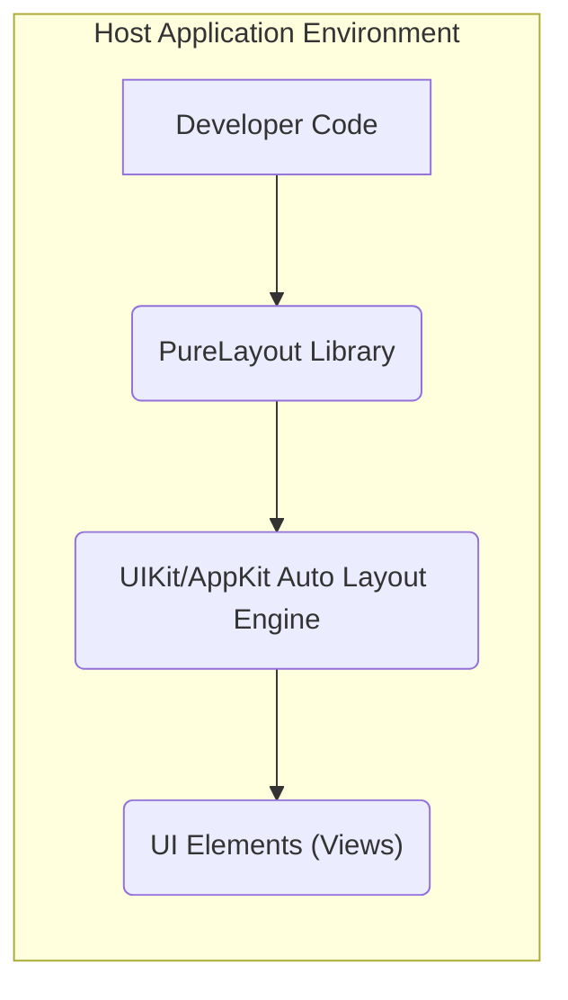
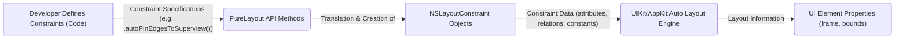

# Project Design Document: PureLayout

**Version:** 1.1
**Date:** October 26, 2023
**Author:** AI Software Architect

## 1. Introduction

This document provides an enhanced design overview of the PureLayout library, an Objective-C library that simplifies programmatic Auto Layout for iOS and macOS applications. This detailed design serves as a robust foundation for subsequent threat modeling activities. It elaborates on the library's architecture, data flow, and key components, offering a comprehensive understanding necessary for identifying potential security vulnerabilities.

## 2. Goals and Objectives

The fundamental goal of PureLayout is to offer a more intuitive and readable approach to creating and managing Auto Layout constraints within iOS and macOS development. Key objectives include:

* **Simplified Constraint Definition:** Providing a fluent and expressive Domain Specific Language (DSL) for defining layout constraints programmatically.
* **Reduced Code Verbosity:** Minimizing the amount of boilerplate code typically associated with manual Auto Layout constraint creation.
* **Improved Code Comprehensibility:** Enhancing the readability and maintainability of layout code through a clearer syntax.
* **Type Safety and Compile-Time Checks:** Leveraging Objective-C's type system to catch potential layout errors during compilation.
* **Direct Interaction with Underlying Frameworks:**  Operating directly with the native Auto Layout engine provided by UIKit and AppKit, ensuring compatibility and performance.

## 3. System Architecture

PureLayout functions as an embedded library within a host application, either on iOS or macOS. It does not operate as an independent service. Its core responsibility is the programmatic manipulation of layout constraints applied to `UIView` (iOS) or `NSView` (macOS) objects.

**Component Breakdown:**

* **"Developer Code"**: This represents the application code written by developers. This code utilizes the PureLayout library's API to define the desired layout constraints for UI elements.
* **"PureLayout Library"**: The central component, providing the API for constraint creation and management. This encompasses:
    * Categories on `UIView` and `NSView`: Extending these fundamental UI classes with PureLayout's constraint-related methods (e.g., `autoPinEdgeToSuperview:withInset:`).
    * Helper Classes: Internal classes that facilitate the creation and management of `NSLayoutConstraint` objects.
    * Macros and Inline Functions: Providing syntactic sugar and convenience methods for common layout tasks.
* **"UIKit/AppKit Auto Layout Engine"**: The underlying layout engine provided by Apple's frameworks. This engine takes the `NSLayoutConstraint` objects created by PureLayout (on behalf of the developer) and calculates the final layout of the UI elements.
* **"UI Elements (Views)"**: The `UIView` or `NSView` instances within the application whose layout is being governed by the constraints defined using PureLayout.

**Interaction Flow:**

1. The developer invokes PureLayout's API methods within their code to specify layout relationships between UI elements (e.g., aligning edges, setting dimensions).
2. PureLayout's methods internally translate these high-level API calls into the creation and activation of `NSLayoutConstraint` objects, which are the fundamental building blocks of Auto Layout.
3. These `NSLayoutConstraint` objects are then passed to the UIKit or AppKit Auto Layout engine.
4. The Auto Layout engine performs calculations based on the constraints, priorities, and other factors to determine the final size and position (frame) of each UI element.
5. The UI elements are rendered on the screen according to the layout determined by the Auto Layout engine.

## 4. Data Flow

The primary data manipulated by PureLayout consists of layout constraint definitions. This data originates in the developer's code and flows through the PureLayout library to the underlying Auto Layout engine.

**Detailed Data Elements:**

* **"Constraint Specifications (e.g., .autoPinEdgesToSuperview())"**:  The high-level, human-readable instructions for layout relationships expressed using PureLayout's API. These represent the developer's intent.
* **"PureLayout API Methods"**: The specific methods called within the PureLayout library (e.g., `autoPinEdge:toEdge:ofView:withOffset:`). These methods encapsulate the logic for creating `NSLayoutConstraint` objects.
* **"NSLayoutConstraint Objects"**: The fundamental data structures representing individual layout constraints. These objects contain information about:
    * Attributes: The specific properties being constrained (e.g., leading, trailing, top, bottom, width, height, centerX, centerY).
    * Relations: The type of relationship between the attributes (e.g., equal to, greater than or equal to, less than or equal to).
    * Constants: Fixed numerical values used in the constraint equation.
    * Multipliers: Factors used to scale the related attribute.
    * Priorities:  Values indicating the importance of a constraint relative to others.
* **"Constraint Data (attributes, relations, constants)"**: The specific values and configurations within the `NSLayoutConstraint` objects that define the layout rules.
* **"UIKit/AppKit Auto Layout Engine"**: This engine receives the `NSLayoutConstraint` objects as input.
* **"Layout Information"**: The output of the Auto Layout engine's calculations, determining the final size and position of UI elements.
* **"UI Element Properties (frame, bounds)"**: The properties of `UIView` or `NSView` that are directly modified by the Auto Layout engine based on the applied constraints.

## 5. Security Considerations (Detailed)

While PureLayout primarily deals with UI layout and does not directly handle sensitive data or network operations, potential security considerations arise from its usage within the broader application context:

* **Denial of Service (DoS) through Constraint Overload:**  Maliciously crafted or excessively complex layout constraints, while typically a developer error, could theoretically lead to performance degradation or even application crashes due to the Auto Layout engine consuming excessive resources. PureLayout simplifies constraint creation, potentially making it easier to introduce such issues unintentionally or intentionally.
* **Information Disclosure via Unexpected Layout:**  Incorrectly defined constraints, whether accidental or intentional, could lead to UI elements being positioned or sized in ways that unintentionally reveal sensitive information or hidden UI components. This highlights the importance of careful constraint design and testing.
* **Indirect Code Injection through Data-Driven Layout:** If the data used to determine layout constraints originates from an untrusted source (e.g., a remote server or user input), an attacker could potentially manipulate this data to inject malicious layout configurations. This could lead to unexpected UI behavior or, in extreme cases, UI rendering vulnerabilities that might be exploitable. While PureLayout itself doesn't fetch this data, it acts upon it.
* **Dependency Chain Vulnerabilities:** Although PureLayout has minimal direct dependencies, vulnerabilities in the underlying UIKit or AppKit frameworks could indirectly impact applications using PureLayout. Keeping these system frameworks updated is crucial. Future versions of PureLayout might introduce new dependencies, which would need careful scrutiny for potential vulnerabilities.
* **Tampering with Layout for Phishing or Deception:**  An attacker who can influence the layout constraints could potentially manipulate the UI to mimic legitimate system interfaces or other applications for phishing or deceptive purposes. This is more likely in scenarios where the application dynamically adjusts its layout based on external factors.
* **Resource Exhaustion through Layout Thrashing:**  Rapid and repeated changes to layout constraints can lead to "layout thrashing," where the Auto Layout engine performs excessive calculations, potentially draining device resources and impacting performance. While not a direct vulnerability in PureLayout, its ease of use could contribute to this issue if not used judiciously.

**Recommendations for Mitigation:**

* **Input Validation:** If layout constraints are derived from external data, rigorously validate and sanitize this data to prevent malicious manipulation.
* **Regular Security Audits:** Conduct periodic security reviews of the application's layout logic, especially in areas where dynamic layout adjustments are made.
* **Secure Development Practices:** Follow secure coding practices to minimize the risk of introducing unintended or exploitable layout configurations.
* **Keep Dependencies Updated:** Ensure that the underlying operating system and frameworks (UIKit/AppKit) are kept up-to-date with the latest security patches.

## 6. Dependencies

PureLayout is designed to be lightweight and has minimal external dependencies. Its primary reliance is on the core Apple frameworks:

* **Foundation Framework (Apple):** Provides fundamental data types, collections, and operating system services.
* **CoreGraphics Framework (Apple):**  Used for low-level 2D rendering and drawing operations, potentially used internally for some layout calculations.
* **UIKit Framework (Apple - for iOS):** The essential framework for building iOS applications, including UI elements and the Auto Layout engine.
* **AppKit Framework (Apple - for macOS):** The equivalent framework for building macOS applications.

The specific versions of these frameworks that PureLayout is compatible with should be considered during development and threat modeling, as changes in these frameworks could potentially introduce compatibility issues or security concerns.

## 7. Deployment

PureLayout is typically integrated into an application project during the development phase. Common deployment methods include:

* **Source Code Integration:** Directly including the PureLayout source files (`.h` and `.m` files) into the project. This offers the most control but requires manual management.
* **CocoaPods:** A popular dependency manager for Objective-C and Swift projects. PureLayout can be easily integrated by adding it to the project's `Podfile`.
* **Carthage:** Another dependency manager that builds dependencies and provides binary frameworks. PureLayout can be integrated by adding it to the `Cartfile`.
* **Swift Package Manager (SPM):** While PureLayout is an Objective-C library, it can sometimes be integrated into Swift projects using SPM with appropriate configuration.
* **Git Submodules:** Adding the PureLayout repository as a Git submodule to the project.

The chosen deployment method can have implications for build processes and dependency management, but generally does not directly introduce significant security vulnerabilities to the library itself. However, using outdated or compromised dependency management tools could pose a risk.

## 8. Future Considerations

* **Swift API Modernization:**  Exploring the possibility of creating a more idiomatic Swift API for PureLayout, potentially as a separate library or an extension.
* **Enhanced Layout Debugging Tools:**  Developing or integrating with more advanced debugging tools specifically tailored for layouts created with PureLayout, to aid in identifying and resolving complex constraint issues.
* **Performance Profiling and Optimization:**  Continuously monitoring and optimizing PureLayout's performance, particularly in scenarios with a large number of constraints.
* **Accessibility Considerations:**  Ensuring that layouts created with PureLayout are easily adaptable for accessibility features.
* **Community Contributions and Maintenance:**  Maintaining active community engagement and ensuring ongoing maintenance and updates to address bug fixes and potential security issues.

This enhanced design document provides a more in-depth understanding of the PureLayout library's architecture, data flow, and potential security considerations. This detailed information is crucial for conducting a thorough threat model to identify and mitigate potential risks associated with its use in iOS and macOS applications.