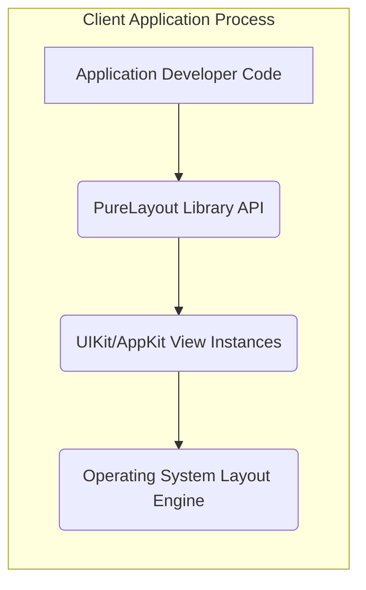
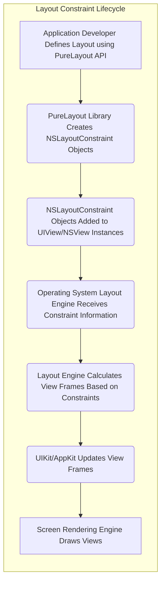

## Project Design Document: PureLayout

**Version:** 1.1
**Date:** October 26, 2023
**Author:** AI Software Architecture Expert

### 1. Introduction

This document provides a detailed design overview of the PureLayout project, a Swift library for programmatic UI layout using Auto Layout. This document is intended to serve as a comprehensive resource for understanding the library's architecture, components, and data flow, specifically to facilitate subsequent threat modeling activities.

### 2. Project Overview

PureLayout is a Swift library designed to simplify the creation and management of Auto Layout constraints programmatically within Apple platform applications (iOS, macOS, tvOS, and watchOS). It offers a more intuitive and less verbose syntax compared to directly using `NSLayoutConstraint`. By providing a fluent interface, PureLayout empowers developers to define complex layout rules efficiently.

**Key Features:**

*   Provides a fluent, chainable, and readable syntax for defining Auto Layout constraints.
*   Offers a comprehensive set of methods for aligning and distributing views.
*   Supports a wide range of common layout scenarios, including pinning edges, centering views, and setting dimensions.
*   Seamlessly integrates with standard UIKit and AppKit view classes.
*   Maintains cross-platform compatibility across Apple's ecosystem.

### 3. System Architecture

PureLayout operates exclusively as a client-side library that is integrated directly into the application's codebase. It does not involve any server-side components, external network communication, or persistent data storage. Its core functionality revolves around manipulating and managing the layout constraints of UI elements within the application's UI rendering pipeline.



**Components:**

*   **Application Developer Code:** The Swift code written by the application developer that utilizes the PureLayout library to programmatically define the layout of UI elements.
*   **PureLayout Library API:** The set of classes, structs, enums, and methods provided by the PureLayout library that developers interact with to create and manage Auto Layout constraints.
*   **UIKit/AppKit View Instances:** Instances of standard UI elements (e.g., `UIView`, `UILabel`, `UIImageView` on iOS; `NSView`, `NSTextField`, `NSImageView` on macOS) whose layout is managed by PureLayout.
*   **Operating System Layout Engine:** The underlying operating system component responsible for calculating and applying the defined Auto Layout constraints to determine the size and position of views during the rendering process.

### 4. Component Details

This section provides a more detailed description of the key components within the PureLayout library and their respective functionalities.

*   **Layout Anchor Types:**
    *   Represent specific layout attributes of a view, such as `leadingAnchor`, `trailingAnchor`, `topAnchor`, `bottomAnchor`, `centerXAnchor`, `centerYAnchor`, `widthAnchor`, and `heightAnchor`.
    *   Serve as the fundamental building blocks for establishing relationships between different views or within the same view.
    *   Enforce type safety during constraint creation, ensuring that only compatible anchors are used together (e.g., you can't directly constrain a `leadingAnchor` to a `heightAnchor`).
    *   Example: `myView.leadingAnchor`, `otherView.trailingAnchor`.

*   **Layout Constraint Objects:**
    *   Represent the actual layout rules that define the relationships between layout anchors.
    *   Encapsulate attributes like the first item, first attribute, relation (equal to, greater than or equal to, less than or equal to), second item, second attribute, multiplier, and constant.
    *   PureLayout simplifies the creation of these `NSLayoutConstraint` objects through its expressive API.
    *   Example: `myView.leadingAnchor.constraint(equalTo: superview.leadingAnchor, constant: 10)`.

*   **View Extension Methods:**
    *   PureLayout extends `UIView` (and its subclasses) and `NSView` (and its subclasses) with a suite of convenience methods for creating and activating constraints.
    *   These extensions provide a more concise and readable syntax for common layout tasks, reducing boilerplate code.
    *   Examples include methods for pinning edges to a superview (`autoPinEdgesToSuperviewEdges()`), centering within a superview (`autoCenterInSuperview()`), and setting specific dimensions (`autoSetDimension(.width, toSize: 100.0)`).
    *   These methods internally create and activate the underlying `NSLayoutConstraint` objects.

### 5. Data Flow

The primary data flow within the system centers around the creation, activation, and application of layout constraints to determine the visual layout of the user interface.



**Detailed Steps:**

1. **Application Developer Defines Layout using PureLayout API:** The developer writes Swift code, utilizing PureLayout's methods and properties to express the desired layout relationships between UI elements. This involves specifying anchors, relationships (e.g., equal, greater than), and optional constants or multipliers.
2. **PureLayout Library Creates NSLayoutConstraint Objects:**  Behind the scenes, PureLayout translates the developer's high-level layout instructions into concrete instances of `NSLayoutConstraint`. This involves setting the appropriate attributes of the `NSLayoutConstraint` based on the PureLayout method called.
3. **NSLayoutConstraint Objects Added to UIView/NSView Instances:** The newly created `NSLayoutConstraint` objects are added to the `constraints` array of the relevant `UIView` or `NSView` instances. This action registers the constraints with the view hierarchy.
4. **Operating System Layout Engine Receives Constraint Information:** The operating system's Auto Layout engine monitors the view hierarchy for changes, including the addition or removal of constraints. When constraints are added, the Layout Engine receives this information.
5. **Layout Engine Calculates View Frames Based on Constraints:**  The Layout Engine performs complex calculations based on the active constraints within the view hierarchy. It resolves the relationships defined by the constraints to determine the optimal size and position (frame) for each view.
6. **UIKit/AppKit Updates View Frames:** Once the Layout Engine has calculated the frames, UIKit or AppKit updates the `frame` property of the affected `UIView` or `NSView` instances.
7. **Screen Rendering Engine Draws Views:** Finally, the operating system's rendering engine uses the updated frame information to draw the views on the screen, reflecting the layout defined by the PureLayout constraints.

### 6. Security Considerations (For Threat Modeling)

Given that PureLayout is a client-side UI layout library, the primary security considerations revolve around potential misuse or unintended consequences arising from how constraints are defined and managed within the application.

*   **Denial of Service (DoS) through Layout Thrashing:**
    *   **Attack Vector:**  Maliciously crafted or excessively complex constraint configurations could lead to a situation where the Layout Engine spends an inordinate amount of time recalculating layouts. This can manifest as UI freezes, application slowdowns, and potentially even crashes due to resource exhaustion.
    *   **Mitigation:**  Careful design of layout logic, performance testing, and potentially implementing safeguards to limit the complexity of dynamic layout changes.

*   **Unexpected UI Rendering and Information Obfuscation:**
    *   **Attack Vector:** Intentionally creating conflicting or illogical constraints could result in UI elements being rendered in unexpected positions, sizes, or even being completely obscured. This could be exploited to hide critical information or mislead the user.
    *   **Mitigation:** Thorough testing of UI layouts under various conditions and ensuring that constraint logic is robust and predictable.

*   **Integer Overflow/Underflow in Constraint Calculations (Less Likely):**
    *   **Attack Vector:** While less probable due to Swift's type safety and the underlying implementation of Auto Layout, theoretical vulnerabilities could arise if extremely large or small constant or multiplier values are used in constraints, potentially leading to integer overflow or underflow during layout calculations.
    *   **Mitigation:**  Adhering to reasonable ranges for constraint values and relying on the inherent safety features of the Swift language and the operating system frameworks.

*   **Resource Exhaustion through Excessive Constraint Creation:**
    *   **Attack Vector:**  Dynamically creating and adding a very large number of constraints without proper management (e.g., not deactivating or removing them when no longer needed) could lead to excessive memory consumption and potentially crash the application.
    *   **Mitigation:**  Implementing proper constraint management practices, such as deactivating or removing constraints when they are no longer required.

*   **Indirect Information Disclosure through UI Layout (Context Dependent):**
    *   **Attack Vector:** In specific application contexts, subtle manipulations of UI layout through constraints could be used to infer information or leak details that should not be readily apparent. This is highly dependent on the specific application and the sensitivity of the information being displayed.
    *   **Mitigation:**  Careful consideration of the information being presented in the UI and ensuring that layout constraints do not inadvertently reveal sensitive details.

**Note:** This list represents initial security considerations for threat modeling. A dedicated threat modeling exercise would involve a more in-depth analysis of potential threats and vulnerabilities.

### 7. Deployment

PureLayout is typically integrated into an application project as a dependency using one of the common Swift package management tools.

**Deployment Methods:**

*   **Swift Package Manager (SPM):**
    *   The recommended approach for modern Swift projects.
    *   To integrate, add the following dependency to your `Package.swift` file's `dependencies` array:
        ```swift
        dependencies: [
            .package(url: "https://github.com/PureLayout/PureLayout.git", from: "3.1.0") // Replace with the desired version
        ]
        ```
    *   Then, add `"PureLayout"` to the `dependencies` array of your target.

*   **CocoaPods:**
    *   A widely used dependency manager for Swift and Objective-C projects.
    *   To integrate, add the following line to your project's `Podfile`:
        ```ruby
        pod 'PureLayout'
        ```
    *   Then, run `pod install` or `pod update` in your terminal.

*   **Carthage:**
    *   A decentralized dependency manager for macOS and iOS applications.
    *   To integrate, add the following line to your project's `Cartfile`:
        ```
        github "PureLayout/PureLayout" ~> 3.1.0 // Replace with the desired version
        ```
    *   Then, run `carthage update` and follow the instructions to link the framework.

Once integrated using any of these methods, the PureLayout library is compiled along with the application code and becomes part of the application's bundle.

### 8. Technology Stack

*   **Primary Programming Language:** Swift
*   **Target Operating Systems:** iOS, macOS, tvOS, watchOS
*   **Core UI Frameworks:** UIKit (for iOS, tvOS), AppKit (for macOS), WatchKit (for watchOS)
*   **Underlying Layout Technology:** Auto Layout (`NSLayoutConstraint`)

### 9. Non-Goals

This design document specifically focuses on the architecture and functionality of the PureLayout library for the purpose of threat modeling. It does not aim to cover:

*   The internal implementation details of the underlying Auto Layout engine.
*   Detailed performance benchmarks of PureLayout compared to other layout methods.
*   Specific UI/UX design principles or best practices for using PureLayout.
*   The process of contributing to the PureLayout open-source project.