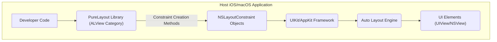
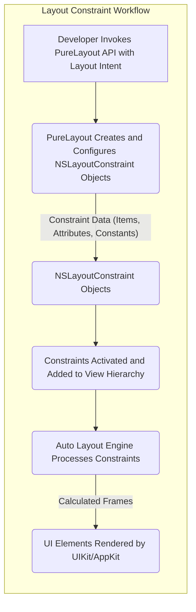

# Project Design Document: PureLayout

**Version:** 1.1
**Date:** October 26, 2023
**Author:** AI Software Architect

## 1. Project Overview

PureLayout is an Objective-C library designed to streamline the use of Auto Layout in iOS and macOS development. It offers a programmatic, type-safe, and more readable syntax for defining and managing layout constraints. By abstracting away some of the complexities of directly working with `NSLayoutConstraint`, PureLayout aims to improve developer productivity and code maintainability when building user interfaces. This document details the architectural design of PureLayout, focusing on aspects relevant to security considerations and threat modeling.

## 2. Goals

* To provide a developer-friendly and intuitive API for Auto Layout.
* To enhance the type safety and reduce runtime errors associated with constraint creation.
* To minimize the amount of verbose code typically required for programmatic Auto Layout.
* To offer a consistent and predictable way to define complex layout relationships.
* To seamlessly integrate with Apple's UIKit and AppKit frameworks without introducing significant overhead.

## 3. Non-Goals

* To provide a visual interface for designing layouts (it remains a programmatic library).
* To replace or modify the core functionality of the underlying Auto Layout engine.
* To handle data binding, network communication, or any business logic.
* To support cross-platform UI development beyond Apple's ecosystem.
* To offer advanced animation or custom drawing capabilities beyond layout management.

## 4. Architecture and Components

PureLayout operates as a library that extends the capabilities of `UIView` (iOS) and `NSView` (macOS) through category extensions. Its core functionality revolves around simplifying the creation and management of `NSLayoutConstraint` objects.

* **Core Library (`PureLayout.framework` or `PureLayout.xcframework`):** The primary deliverable, containing the compiled Objective-C code.
    * **`ALView` Category on `UIView` and `NSView`:** This is the main interface developers interact with. It adds methods for creating and managing constraints directly on view instances. Examples include:
        * `autoPinEdgesToSuperviewEdgesWithInsets:`
        * `autoSetDimension:toSize:`
        * `autoAlignAxis:toSameAxisOfView:withOffset:`
    * **Constraint Factory Methods:** These methods encapsulate the logic for creating `NSLayoutConstraint` instances with the correct properties and relationships based on the provided parameters. They abstract away the manual instantiation and configuration of `NSLayoutConstraint`.
    * **Constraint Activation and Deactivation Management:** PureLayout provides mechanisms to easily activate and deactivate sets of constraints, simplifying conditional layout changes.
    * **Internal Helper Classes and Methods:** These facilitate the core functionality, such as parsing parameters, creating appropriate constraints, and managing their activation state. These are generally not directly exposed to the developer.
    * **Type Safety Mechanisms:**  Utilizes Objective-C generics and specific method signatures to enforce type safety during constraint creation, reducing the likelihood of runtime errors due to incorrect parameter types.

* **Integration with Host Application's UI Framework:** PureLayout functions within the lifecycle of the host application's UI. When PureLayout methods are called, they ultimately interact with the underlying UIKit/AppKit framework to create and manage `NSLayoutConstraint` objects, which are then processed by the Auto Layout engine.

## 5. Data Flow

The data flow in PureLayout centers around the definition and application of layout constraints.

1. **Developer Defines Layout Intent:** The developer uses PureLayout's API within their application code to express the desired layout relationships between UI elements. This involves calling methods on `UIView` or `NSView` instances provided by the `ALView` category, passing parameters that define the constraints (e.g., edges, dimensions, alignment).
2. **PureLayout Creates Constraint Objects:**  The called PureLayout methods internally instantiate and configure `NSLayoutConstraint` objects based on the provided parameters. This involves setting properties like `firstItem`, `secondItem`, `firstAttribute`, `secondAttribute`, `relation`, `multiplier`, and `constant`.
3. **Constraints are Activated:** The newly created `NSLayoutConstraint` objects are typically activated, which means they are added to the view hierarchy and become active participants in the Auto Layout engine's calculations.
4. **Auto Layout Engine Calculates Layout:** The underlying Auto Layout engine processes the active constraints for all views in the hierarchy. It solves the system of equations defined by the constraints to determine the optimal frames (position and size) for each view.
5. **UI Rendering:**  The UIKit/AppKit framework uses the calculated frames to render the UI elements on the screen.

## 6. Security Considerations

While PureLayout primarily deals with UI layout, security considerations arise from its role within the application and its potential for misuse or vulnerabilities.

* **Dependency Vulnerabilities:**
    * **Risk:** If vulnerabilities exist within the PureLayout library itself (e.g., due to memory safety issues or unexpected behavior with specific input), these could be exploited if an attacker gains control or influences the application's execution.
    * **Mitigation:** Regularly update PureLayout to the latest stable version to benefit from bug fixes and security patches. Obtain the library from trusted sources like the official GitHub repository or reputable package managers. Consider using static analysis tools on the library's source code if feasible.

* **Misuse Leading to Unexpected UI Behavior or Denial of Service:**
    * **Risk:** Incorrect or excessive use of PureLayout could lead to the creation of a large number of complex constraints, potentially causing performance issues, UI freezes, or even application crashes due to excessive resource consumption by the Auto Layout engine. While not a direct security vulnerability in the traditional sense, this could be exploited for denial-of-service.
    * **Mitigation:** Provide clear documentation and examples to guide developers on best practices for using PureLayout. Implement code reviews to identify potential misuse or inefficient constraint configurations. Consider performance testing with a large number of constraints.

* **Information Disclosure through UI Layout Issues:**
    * **Risk:** Although PureLayout doesn't handle data directly, improper layout configurations could inadvertently lead to the disclosure of sensitive information on the screen. For example, overlapping views might partially reveal data that should be hidden, or incorrect sizing could expose more information than intended.
    * **Mitigation:** Emphasize the importance of thorough UI testing and design reviews to ensure that layout configurations do not unintentionally expose sensitive data. This is primarily the responsibility of the application developer, but understanding PureLayout's behavior is crucial.

* **Supply Chain Security:**
    * **Risk:** If the PureLayout library is compromised at its source (e.g., malicious code injection into the repository or distribution channels), applications using it could be vulnerable.
    * **Mitigation:** Verify the integrity of the library using checksums or signatures if available. Use trusted package managers with security scanning capabilities. Be cautious about using unofficial or unverified sources of the library. Consider using a Software Bill of Materials (SBOM) to track dependencies.

* **Potential for Logic Errors Leading to Security Flaws:**
    * **Risk:** While less likely, subtle logic errors within PureLayout's constraint creation or management logic could potentially lead to unexpected layout behavior that, in combination with other application vulnerabilities, could be exploited.
    * **Mitigation:** Encourage community review and contributions to the library. Implement thorough unit and integration testing for PureLayout itself. Follow secure coding practices during development.

* **Impact of Underlying Auto Layout Engine Vulnerabilities:**
    * **Risk:** PureLayout relies on the underlying Auto Layout engine provided by Apple. If vulnerabilities exist within the Auto Layout engine itself, these could indirectly affect applications using PureLayout.
    * **Mitigation:** Stay informed about security updates and advisories from Apple regarding the iOS and macOS SDKs. Encourage developers to update their development environments and target the latest SDKs.

## 7. Deployment

PureLayout is typically integrated into iOS and macOS projects using dependency management tools.

* **CocoaPods:** Add `pod 'PureLayout'` to your `Podfile` and run `pod install`.
* **Carthage:** Add `github "PureLayout/PureLayout"` to your `Cartfile` and run `carthage update`.
* **Swift Package Manager:** Add the repository URL (e.g., `https://github.com/purelayout/purelayout.git`) as a package dependency in Xcode.
* **Manual Integration:** Download the source code or pre-built framework and manually add it to your project's frameworks and libraries.

Once integrated, the PureLayout library is linked with the application during the build process, making its classes and methods available for use in the application's code.

## 8. Technologies Used

* **Objective-C:** The primary programming language in which PureLayout is written.
* **Auto Layout (UIKit/AppKit):** The fundamental layout technology that PureLayout simplifies and extends.
* **Foundation Framework (iOS/macOS):** Provides essential data types and system interfaces.
* **CoreGraphics (iOS/macOS):** May be used internally for some layout-related calculations and geometry.