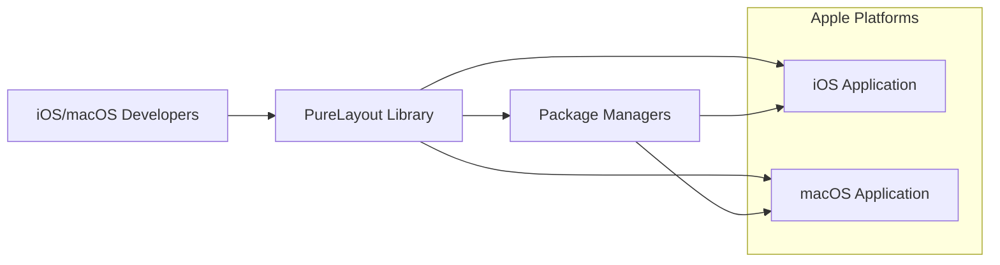
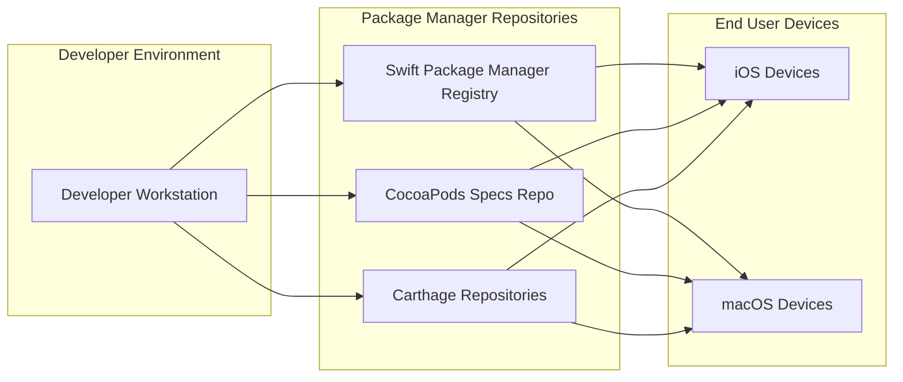

# BUSINESS POSTURE

- Business Priorities and Goals:
  - Provide a flexible and intuitive Auto Layout library for iOS and macOS developers.
  - Simplify and enhance the process of creating user interfaces programmatically.
  - Encourage adoption and widespread use within the Apple development community.
  - Maintain stability, performance, and ease of integration.
- Business Risks:
  - Code defects leading to incorrect layout behavior in applications using PureLayout.
  - Security vulnerabilities within PureLayout that could be exploited in dependent applications.
  - Lack of community support or maintenance leading to stagnation and reduced adoption.
  - Compatibility issues with new versions of Xcode, Swift, or Apple operating systems.

# SECURITY POSTURE

- Existing Security Controls:
  - security control: Open Source Code - The source code is publicly available on GitHub, allowing for community review and scrutiny. Implemented: GitHub Repository.
  - security control: Version Control - Git is used for version control, providing history and traceability of changes. Implemented: GitHub Repository.
  - accepted risk: No Formal Security Audits -  There is no indication of formal security audits being conducted on the project.
  - accepted risk: Reliance on Community Security Review - Security relies on the open-source community to identify and report vulnerabilities.

- Recommended Security Controls:
  - security control: Dependency Scanning - Implement automated dependency scanning to identify known vulnerabilities in third-party libraries used during development or testing.
  - security control: Static Application Security Testing (SAST) - Integrate SAST tools into the development process to automatically analyze the codebase for potential security flaws.
  - security control: Contribution Security Guidelines - Establish clear guidelines for contributors regarding secure coding practices and vulnerability reporting.

- Security Requirements:
  - Authentication: Not applicable - PureLayout is a client-side library and does not handle user authentication.
  - Authorization: Not applicable - PureLayout does not manage access control or authorization.
  - Input Validation: Limited relevance - PureLayout primarily deals with layout constraints and calculations. Input validation is generally handled by the applications using the library when providing data to be displayed. However, ensure that internal calculations are robust and prevent unexpected behavior from extreme or invalid inputs.
  - Cryptography: Not applicable - PureLayout does not require cryptographic operations.

# DESIGN

## C4 CONTEXT



- Context Diagram Elements:
  - Element:
    - Name: iOS/macOS Developers
    - Type: Person
    - Description: Software developers who use PureLayout to build iOS and macOS applications.
    - Responsibilities: Integrate PureLayout into their projects, define layouts using PureLayout API.
    - Security controls: Responsible for securely using libraries in their applications, following secure coding practices in their own application code.
  - Element:
    - Name: PureLayout Library
    - Type: Software System
    - Description: An open-source Swift library providing a DSL for Auto Layout in iOS and macOS.
    - Responsibilities: Provide layout functionalities, be easily integrable, performant, and stable.
    - Security controls: Code reviews, community scrutiny, potential future SAST and dependency scanning.
  - Element:
    - Name: iOS Application
    - Type: Software System
    - Description: Applications developed for the iOS platform that utilize PureLayout for UI layout.
    - Responsibilities: Provide user functionality, manage user data, handle user interactions.
    - Security controls: Application level security controls, input validation, authorization, authentication, data protection.
  - Element:
    - Name: macOS Application
    - Type: Software System
    - Description: Applications developed for the macOS platform that utilize PureLayout for UI layout.
    - Responsibilities: Provide user functionality, manage user data, handle user interactions.
    - Security controls: Application level security controls, input validation, authorization, authentication, data protection.
  - Element:
    - Name: Package Managers
    - Type: Software System
    - Description: Systems like Swift Package Manager, CocoaPods, and Carthage used to distribute and manage dependencies, including PureLayout.
    - Responsibilities: Distribute PureLayout library, manage versions, facilitate integration into developer projects.
    - Security controls: Package integrity checks, secure distribution channels (HTTPS), vulnerability scanning of package manager infrastructure.

## C4 CONTAINER

```mermaid
flowchart LR
    subgraph GitHub Repository
        A[Source Code]
        B[Issue Tracker]
    end
    C[PureLayout Library Code]
    D[Package Managers]
    E[Developer Workstation]

    E --> A
    E --> C
    A --> B
    C --> D
    D --> iOS/macOS Applications
```

- Container Diagram Elements:
  - Element:
    - Name: PureLayout Library Code
    - Type: Container
    - Description: The Swift code comprising the PureLayout library, hosted on GitHub.
    - Responsibilities: Implement layout logic, provide API for developers, maintain code quality.
    - Security controls: Code reviews, version control, branch protection, potential future SAST.
  - Element:
    - Name: GitHub Repository
    - Type: Container
    - Description: The Git repository on GitHub hosting the PureLayout source code, issue tracker, and documentation.
    - Responsibilities: Version control, issue tracking, collaboration platform, code hosting.
    - Security controls: GitHub security features (access control, audit logs), branch protection, vulnerability scanning (GitHub Dependabot).
  - Element:
    - Name: Package Managers
    - Type: Container
    - Description: Distribution platforms like Swift Package Manager, CocoaPods, and Carthage that package and distribute PureLayout.
    - Responsibilities: Package distribution, version management, dependency resolution for developers.
    - Security controls: Package signing, integrity checks, secure distribution infrastructure.
  - Element:
    - Name: Developer Workstation
    - Type: Container
    - Description: Developer's local machine used to develop applications and integrate PureLayout.
    - Responsibilities: Code development, building applications, testing, dependency management.
    - Security controls: Local security controls, developer training on secure coding practices, secure development environment.

## DEPLOYMENT



- Deployment Diagram Elements:
  - Element:
    - Name: Developer Workstation
    - Type: Environment
    - Description: The environment where developers build applications using PureLayout.
    - Responsibilities: Application development, integration of PureLayout, building and testing.
    - Security controls: Local workstation security, developer access controls, secure development practices.
  - Element:
    - Name: Swift Package Manager Registry
    - Type: Environment
    - Description: Apple's Swift Package Manager registry where PureLayout package is published.
    - Responsibilities: Hosting and distributing Swift packages, version management.
    - Security controls: Registry security, package integrity checks, secure distribution infrastructure.
  - Element:
    - Name: CocoaPods Specs Repo
    - Type: Environment
    - Description: CocoaPods specification repository where PureLayout podspec is hosted.
    - Responsibilities: Hosting pod specifications, facilitating CocoaPods integration.
    - Security controls: Repository security, access control, integrity of podspecs.
  - Element:
    - Name: Carthage Repositories
    - Type: Environment
    - Description: Distributed repositories (like GitHub releases) used by Carthage to manage PureLayout.
    - Responsibilities: Hosting release binaries or build instructions for Carthage.
    - Security controls: Repository security, integrity of releases, secure distribution.
  - Element:
    - Name: iOS Devices
    - Type: Environment
    - Description: End-user iOS devices where applications using PureLayout are deployed and run.
    - Responsibilities: Running applications, providing user interface, executing layout code.
    - Security controls: Device security, operating system security, application sandboxing.
  - Element:
    - Name: macOS Devices
    - Type: Environment
    - Description: End-user macOS devices where applications using PureLayout are deployed and run.
    - Responsibilities: Running applications, providing user interface, executing layout code.
    - Security controls: Device security, operating system security, application sandboxing.

## BUILD

```mermaid
flowchart LR
    A[Developer] --> B{Code Changes}
    B --> C[GitHub Repository]
    C --> D{CI/CD Pipeline (Optional)}
    D --> E[Build Artifacts (Library)]
    E --> F[Package Managers]
```

- Build Diagram Elements:
  - Element:
    - Name: Developer
    - Type: Person
    - Description: Software developer contributing to or using PureLayout.
    - Responsibilities: Writing code, committing changes, potentially triggering builds.
    - Security controls: Secure coding practices, access control to repository.
  - Element:
    - Name: Code Changes
    - Type: Data Flow
    - Description: Modifications to the PureLayout source code.
    - Responsibilities: Representing code updates.
    - Security controls: Version control, code review.
  - Element:
    - Name: GitHub Repository
    - Type: System
    - Description: Central repository hosting the source code.
    - Responsibilities: Storing code, managing versions, triggering CI/CD.
    - Security controls: Access control, branch protection, audit logs.
  - Element:
    - Name: CI/CD Pipeline (Optional)
    - Type: System
    - Description: Automated build and testing system (e.g., GitHub Actions, Jenkins). For PureLayout, this might be for testing and release preparation, but not necessarily automated package publishing.
    - Responsibilities: Automated building, testing, potentially releasing.
    - Security controls: Secure CI/CD configuration, access control, build environment security.
  - Element:
    - Name: Build Artifacts (Library)
    - Type: Data
    - Description: Compiled PureLayout library (e.g., Swift Package, Podspec, Carthage release).
    - Responsibilities: Distributable library package.
    - Security controls: Signing of packages, integrity checks.
  - Element:
    - Name: Package Managers
    - Type: System
    - Description: Distribution platforms (Swift Package Manager, CocoaPods, Carthage).
    - Responsibilities: Distributing the library to developers.
    - Security controls: Secure package distribution, integrity checks.

# RISK ASSESSMENT

- Critical Business Processes:
  - Adoption and integration of PureLayout by iOS and macOS developers.
  - Maintaining the reputation and trustworthiness of the library.
  - Ensuring the stability and reliability of applications using PureLayout.
- Data to Protect:
  - Source Code: Sensitivity: Publicly available, but integrity and availability are important to prevent malicious modifications or loss.
  - Releases/Build Artifacts: Sensitivity: Publicly available, but integrity is crucial to ensure developers are using a safe and unmodified library.

# QUESTIONS & ASSUMPTIONS

- Questions:
  - Are there any plans to implement automated security scanning tools (SAST, dependency scanning) for PureLayout?
  - Is there a process for handling and disclosing security vulnerabilities reported by the community?
  - Are there any specific security requirements or concerns from the project maintainers or community?
- Assumptions:
  - BUSINESS POSTURE: The primary goal is to provide a useful and widely adopted open-source layout library. Security is important for maintaining trust and preventing negative impact on users.
  - SECURITY POSTURE: Current security relies on open-source community review. There are no dedicated security resources or formal security processes in place.
  - DESIGN: The project is designed as a client-side library distributed through standard package managers. Deployment is handled by developers integrating the library into their applications. Build process is likely developer-driven with potential for optional CI for testing and release preparation.