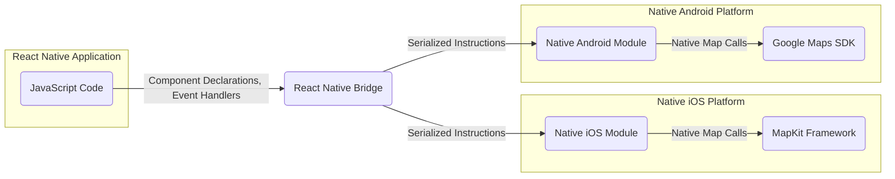
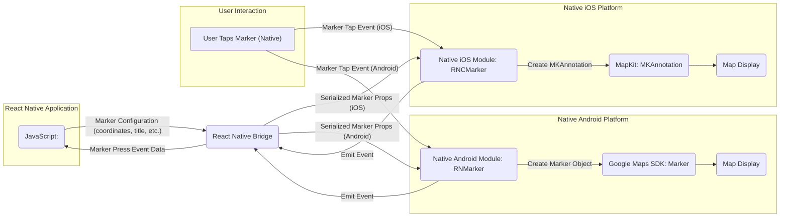

## Project Design Document: react-native-maps

**Version:** 1.1
**Date:** October 26, 2023
**Author:** Gemini (AI Language Model)

### 1. Project Overview

The `react-native-maps` library offers a suite of React Native components designed to seamlessly integrate interactive maps into iOS and Android applications. Functioning as a bridge, it facilitates communication between the React Native JavaScript environment and the native mapping capabilities provided by each operating system (specifically, MapKit on iOS and the Google Maps SDK on Android). This empowers developers to embed comprehensive map features, including markers, polylines, polygons, and interactive elements, directly within their React Native applications.

### 2. Goals

* To establish a unified, cross-platform JavaScript API for map integration across both iOS and Android.
* To enable the display of dynamic and interactive map views, allowing users to pan, zoom, and explore.
* To provide support for essential map features, such as markers, polylines, polygons, and circular overlays.
* To facilitate user interaction with map elements and provide mechanisms for handling user gestures and events.
* To offer a range of customization options for tailoring the visual appearance and behavior of maps and their components.
* To maintain optimal performance and responsiveness in map rendering and interactions on mobile devices.

### 3. Non-Goals

* The library is not intended to provide a custom, independent map rendering engine. It relies directly on the native map implementations of the respective operating systems.
* Implementing advanced, turn-by-turn routing or complex navigation functionalities is outside the scope. While route visualization is possible, intricate routing logic is typically delegated to external services.
* Out-of-the-box support for offline map capabilities is not a primary goal. Offline map functionality often depends on the underlying native map providers and may necessitate additional configuration or external libraries.
* Direct management of map tile data is not within the library's responsibilities. It leverages the tile providers configured within the native map implementations.
* The library does not aim to provide a backend service for storing or managing map data. Its focus is on client-side map rendering and interaction.

### 4. Architecture Overview

`react-native-maps` employs a bridge architecture to enable communication between the React Native JavaScript domain and the native map implementations.

* **JavaScript Code:** This encompasses the developer's React Native code where `react-native-maps` components are utilized to define map views and interact with map elements.
* **React Native Bridge:** This is the fundamental communication layer within React Native, responsible for serializing data from JavaScript and deserializing it for native consumption, and vice-versa.
* **Native iOS Module:** This module, written in Objective-C or Swift, acts as an intermediary, translating instructions received from the JavaScript side via the bridge into specific calls to the iOS MapKit framework.
* **MapKit Framework:** Apple's native framework for rendering maps and providing map-related services on iOS devices.
* **Native Android Module:** This module, implemented in Java or Kotlin, serves a similar purpose to the iOS module, translating JavaScript instructions into calls to the Google Maps SDK for Android.
* **Google Maps SDK:** Google's library for providing map rendering and related functionalities on Android devices.

### 5. Detailed Design

The library comprises the following key components:

* **JavaScript Components:**
    * **`<MapView>`:** The primary component responsible for rendering the map interface. It accepts properties for setting the initial map region, zoom level, map type (e.g., standard, satellite), and other general map configurations.
    * **`<Marker>`:**  Used to place visual markers on the map at specific coordinates. It accepts properties for location, title, description (displayed in a callout), and the ability to use custom marker icons.
    * **`<Polyline>`:**  Allows drawing lines on the map by connecting a series of geographical coordinates. Properties include the array of coordinates, stroke color, and stroke width.
    * **`<Polygon>`:** Enables the creation of filled areas on the map, defined by a set of geographical coordinates forming a closed shape. Properties include the array of coordinates, fill color, and stroke properties.
    * **`<Circle>`:**  Draws circular overlays on the map, defined by a center coordinate and a radius. Properties include the center coordinate, radius, fill color, and stroke properties.
    * **`<Callout>`:**  Provides a customizable informational popup that can be associated with a marker, typically displayed when the marker is tapped.
    * **Event Handlers:**  A set of props (e.g., `onRegionChange`, `onPress`, `onMarkerPress`, `onLongPress`) that allow developers to subscribe to and handle user interactions and map-related events.

* **Native Modules (iOS):**
    * **`RNCMapView`:** The core Objective-C/Swift class that manages the underlying `MKMapView` instance, handling map initialization, updates, and event propagation.
    * **`RNCMarker`:** Responsible for creating and updating `MKAnnotation` objects, which represent markers on the iOS map.
    * **`RNCPolyline`:** Manages the creation and updates of `MKPolyline` overlays to display lines on the map.
    * **`RNCPolygon`:** Handles the creation and updates of `MKPolygon` overlays for displaying filled areas.
    * **`RNCCircle`:** Manages the creation and updates of `MKCircle` overlays for displaying circular areas.
    * **Event Emitters:**  The mechanism used to send native map events (e.g., map region changes, marker taps) back to the JavaScript environment via the React Native bridge.

* **Native Modules (Android):**
    * **`RNCMapViewManager`:** The primary Java/Kotlin class responsible for creating and managing the `MapView` instance provided by the Google Maps SDK for Android.
    * **`RNMarker`:** Manages the creation and updates of `com.google.android.gms.maps.model.Marker` objects.
    * **`RNPolyline`:** Handles the creation and updates of `com.google.android.gms.maps.model.Polyline` objects.
    * **`RNPolygon`:** Handles the creation and updates of `com.google.android.gms.maps.model.Polygon` objects.
    * **`RNCCircle`:** Handles the creation and updates of `com.google.android.gms.maps.model.Circle` objects.
    * **Event Emitters:**  The mechanism used to send native map events back to the JavaScript environment via the React Native bridge.

### 6. Data Flow

The following illustrates the data flow for rendering a marker on the map and handling a marker press event:

1. The developer declares a `<Marker>` component in JavaScript, including its properties (coordinates, title) and an `onPress` event handler.
2. The React Native Bridge serializes the marker's configuration and sends it to the appropriate native module based on the operating system.
3. On iOS, `RNCMarker` receives the data and creates an `MKAnnotation` object, which is then added to the `MKMapView` for rendering.
4. On Android, `RNMarker` receives the data and creates a `Marker` object using the Google Maps SDK, which is added to the `MapView` for rendering.
5. The map is displayed with the rendered marker.
6. When the user taps the marker on the native map view:
    * On iOS, the `MKMapView` detects the tap and notifies the `RNCMarker` module.
    * On Android, the Google Maps SDK detects the tap and notifies the `RNMarker` module.
7. The native module creates an event object containing information about the tap (e.g., marker ID, coordinates).
8. This event is emitted back to the JavaScript side via the React Native Bridge.
9. The JavaScript code receives the event data and executes the corresponding `onPress` handler defined for the `<Marker>` component.

### 7. Key Technologies and Dependencies

* **React Native:** The foundational framework for building cross-platform mobile applications using JavaScript.
* **JavaScript (ES6+):** The primary programming language for the React Native codebase.
* **Objective-C/Swift (iOS):** The native languages used for developing the iOS native module of the library.
* **Java/Kotlin (Android):** The native languages used for developing the Android native module of the library.
* **MapKit (iOS):** Apple's framework providing map display and related functionalities on iOS.
* **Google Maps SDK for Android:** Google's library providing map display and related functionalities on Android.
* **Gradle (Android):** The build automation system used for the Android native module.
* **CocoaPods/Swift Package Manager (iOS):** Dependency management tools used for the iOS native module.

### 8. Security Considerations (For Threat Modeling)

This section outlines potential security considerations to be thoroughly investigated during the threat modeling process.

* **Data Privacy (Location Data Handling):**
    * **User Location Tracking:** If features like "show user location" are enabled, how is the user's location data accessed, processed, and potentially stored? Are platform-specific privacy permissions (e.g., `NSLocationWhenInUseUsageDescription` on iOS, `ACCESS_FINE_LOCATION` on Android) correctly requested and handled according to best practices and user expectations?
    * **Data Minimization:** Is location data used only when necessary and for the intended purpose? Is the granularity of location data appropriate for the feature being implemented?
    * **Data Retention:** Is location data cached or persisted? If so, for how long and with what security measures?
* **API Key Security (Android):**
    * **API Key Exposure:** The Google Maps SDK on Android requires an API key. How is this key managed and embedded within applications using `react-native-maps`? Are there risks of the API key being exposed through reverse engineering or other means?
    * **API Key Restrictions:** Are API keys properly restricted to the specific application package name and signing certificate to prevent unauthorized usage?
* **Input Validation and Sanitization:**
    * **Coordinate Validation:** Are geographical coordinates received from the JavaScript side validated in the native modules to prevent issues caused by invalid or out-of-range values (e.g., causing crashes or unexpected behavior in the native map SDKs)?
    * **Data Type Validation:** Is the data type and format of properties passed from JavaScript to native modules strictly validated to prevent type confusion or injection vulnerabilities?
* **Communication Channel Security (React Native Bridge):**
    * **Data Integrity:** While the bridge itself provides a communication channel, are there any specific security considerations regarding the integrity of the data being passed between JavaScript and native code within this library? Could data be tampered with in transit?
    * **Potential for Malicious Payloads:** Could carefully crafted JavaScript code send malicious payloads through the bridge that could exploit vulnerabilities in the native modules?
* **Dependency Management and Vulnerabilities:**
    * **Third-Party SDK Vulnerabilities:** Are the underlying native map SDKs (MapKit and Google Maps SDK) and any other dependencies regularly updated to patch known security vulnerabilities?
    * **Dependency Scanning:** Does the library's development process include mechanisms for scanning dependencies for known vulnerabilities?
* **Permissions and Access Control:**
    * **Principle of Least Privilege:** Are only the necessary permissions requested by the library? Are there any unnecessary permissions that could be exploited?
    * **Secure Defaults:** Are default configurations and settings secure? Do developers need to take explicit steps to enhance security?
* **Event Handling Security:**
    * **Event Data Integrity:** When events are passed from native modules back to JavaScript, is the integrity of the event data ensured? Could malicious native code inject fabricated events?
    * **Cross-Site Scripting (XSS) Potential in Callouts:** If custom HTML or JavaScript is allowed within callouts, are there measures to prevent XSS vulnerabilities?
* **Secure Storage of Sensitive Data:** If the library or applications using it need to store sensitive map-related data (e.g., user preferences, cached data), are secure storage mechanisms used?

This improved design document provides a more detailed and refined understanding of the `react-native-maps` library's architecture and operation, specifically highlighting areas relevant to security considerations for effective threat modeling.