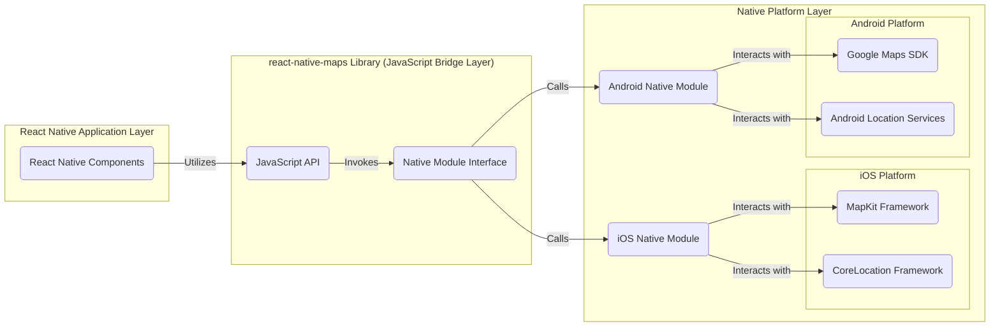

# Project Design Document: React Native Maps

**Version:** 1.1
**Date:** October 26, 2023
**Author:** Gemini (AI Language Model)

## 1. Introduction

This document provides an enhanced design overview of the `react-native-maps` project, a crucial library for integrating map functionalities into React Native applications on both iOS and Android platforms. This detailed design serves as a foundational resource for subsequent threat modeling exercises, enabling a comprehensive understanding of the system's architecture, data pathways, and core components.

## 2. Goals and Objectives

The fundamental objectives of the `react-native-maps` project are:

*   To offer a unified, cross-platform JavaScript API for rendering interactive maps within React Native applications.
*   To abstract the intricacies of platform-specific native map Software Development Kits (SDKs), such as Google Maps SDK for Android and MapKit for iOS.
*   To facilitate the implementation of a wide array of map-related features, encompassing markers, polygons, polylines, custom map tiles, and real-time user location tracking.
*   To ensure optimal performance and responsiveness, delivering a seamless user experience on mobile devices.
*   To provide extensive customization options, allowing developers to tailor the map's appearance and behavior to meet specific application requirements.

## 3. System Architecture

The `react-native-maps` library operates as a bridge, seamlessly connecting the JavaScript environment of React Native with the native map SDKs inherent to iOS and Android. The architectural structure can be conceptualized as a series of distinct layers:

**Detailed Layer Descriptions:**

*   **React Native Application Layer:** This represents the developer's application code, typically written in JavaScript or TypeScript, leveraging the React Native framework. It integrates `react-native-maps` components to display and interact with map views.
*   **react-native-maps Library (JavaScript Bridge Layer):** This layer encompasses the JavaScript Application Programming Interface (API) exposed to the React Native application developers. It also includes the native module interface, which serves as the communication channel with the underlying platform-specific native code.
*   **Native Platform Layer:** This layer embodies the platform-specific implementations for both iOS and Android.
    *   **iOS Native Module:** Implemented in Objective-C or Swift, this module manages the interaction with Apple's MapKit framework for map rendering and the CoreLocation framework for location services.
    *   **Android Native Module:** Developed in Java or Kotlin, this module facilitates communication with the Google Maps SDK for map functionalities and Android Location Services for location data.
    *   **MapKit Framework (iOS Platform):** Apple's native framework responsible for rendering maps, handling user interactions, and providing map-related features on iOS.
    *   **CoreLocation Framework (iOS Platform):** Apple's framework for accessing location and heading information.
    *   **Google Maps SDK (Android Platform):** Google's SDK offering comprehensive map functionalities, including rendering, markers, and overlays, on the Android platform.
    *   **Android Location Services (Android Platform):** The Android system service providing access to device location information.

## 4. Data Flow

The following describes the typical data flow for common map operations within the `react-native-maps` library:

*   **Initial Map Rendering:**
    *   A `MapView` component is instantiated within the React Native application.
    *   The JavaScript bridge layer translates the component's properties (e.g., initial region, map style) into commands for the native module.
    *   The appropriate native module (iOS or Android) initializes the corresponding map SDK (MapKit or Google Maps SDK).
    *   The native map view is created and rendered, displaying the initial map state within the React Native application's view hierarchy.

*   **Adding and Updating Map Markers:**
    *   The React Native application utilizes the `Marker` component, providing properties such as coordinates, title, and optional custom icons.
    *   The JavaScript bridge transmits this marker data to the relevant native module.
    *   The native module uses the native map SDK's API to create and position the marker on the map. Updates to marker properties follow a similar flow.

*   **User Location Acquisition and Display:**
    *   The application requests user location tracking through the `react-native-maps` API.
    *   The JavaScript bridge invokes the location services functionality within the native module.
    *   The native module utilizes the platform's location services (CoreLocation on iOS, Android Location Services) to request location updates, potentially prompting the user for permissions.
    *   Location updates are received by the native module and relayed back to the JavaScript bridge.
    *   The React Native application can then use this location data to display a user location marker or update the map's viewport.

*   **Handling Map Interactions (Gestures and Events):**
    *   User interactions with the map view (e.g., panning, zooming, tapping on markers) are initially handled by the native map SDK.
    *   The native module intercepts these events and translates them into a format understandable by the JavaScript bridge.
    *   The JavaScript bridge emits corresponding events that can be handled by the React Native application (e.g., `onRegionChange`, `onPress`).

*   **Rendering Map Overlays (Polygons, Polylines, Circles):**
    *   Similar to markers, components like `Polygon`, `Polyline`, and `Circle` are used in the React Native application, defining their shape and style through properties.
    *   This data is passed through the JavaScript bridge to the native module.
    *   The native module utilizes the native map SDK's drawing capabilities to render these overlays on the map.

## 5. Key Components

*   **`MapView`:** The primary React Native component responsible for embedding and managing the map view. It accepts crucial props like `initialRegion`, `provider`, `style`, and event handlers.
*   **`Marker`:**  Represents a specific point of interest on the map. It accepts properties such as `coordinate`, `title`, `description`, `pinColor`, and `image`.
*   **`Polygon`:**  Allows rendering filled polygon shapes on the map, defined by an array of geographic coordinates (`coordinates`).
*   **`Polyline`:** Enables drawing lines on the map, specified by a sequence of geographic coordinates (`coordinates`).
*   **`Circle`:**  Used to draw circles on the map, requiring a `center` coordinate and a `radius`.
*   **`Callout`:** Provides a customizable popup view that can be associated with a `Marker`.
*   **Native Module Implementations (iOS and Android):** Platform-specific code that interfaces with the native map SDKs and location services. These modules handle the core map rendering and interaction logic.
*   **JavaScript Bridge:** The communication layer facilitating data exchange and method invocation between the React Native JavaScript code and the native modules.

## 6. Security Considerations (Detailed)

This section elaborates on potential security considerations relevant to the `react-native-maps` project:

*   **User Location Data Privacy:** The handling of sensitive user location data necessitates strict adherence to privacy regulations and obtaining explicit user consent. Secure transmission (HTTPS) and, where applicable, secure storage of location data are paramount.
*   **API Key Security:** If utilizing map providers requiring API keys (e.g., Google Maps Platform), secure storage and restriction of these keys are critical to prevent unauthorized access and potential billing fraud. Techniques like restricting API key usage to specific platforms or application identifiers should be employed.
*   **Data Injection Vulnerabilities:**  Care must be taken to sanitize any user-provided data that is displayed on the map (e.g., marker titles, callout content) to mitigate potential cross-site scripting (XSS) or other injection attacks.
*   **Man-in-the-Middle (MITM) Attacks:** All communication between the application and external map provider services must be secured using HTTPS to prevent eavesdropping and data tampering during transit.
*   **Denial of Service (DoS) Considerations:**  The library should be designed to handle unexpected or excessive requests gracefully to prevent resource exhaustion or application crashes. Rate limiting or other defensive mechanisms might be necessary.
*   **Platform-Specific Security Best Practices:** Adherence to platform-specific security guidelines for iOS and Android development is crucial. This includes secure data storage, proper permission handling, and protection against common mobile vulnerabilities.
*   **Third-Party Dependency Vulnerabilities:** The security of the underlying native map SDKs and any other third-party libraries used by `react-native-maps` is a concern. Regular updates and monitoring for known vulnerabilities in these dependencies are essential.
*   **Native Bridge Security:** The interface between the JavaScript and native code (the bridge) should be carefully designed to prevent malicious JavaScript code from executing arbitrary native code or accessing sensitive resources. Input validation and secure coding practices within the native modules are crucial.
*   **Data Validation and Error Handling:** Robust input validation should be implemented at both the JavaScript and native levels to prevent unexpected behavior or crashes due to malformed data. Proper error handling can also prevent sensitive information from being exposed.

## 7. Dependencies

*   **React Native:** The foundational framework for building cross-platform mobile applications.
*   **Native Map SDKs:**
    *   **iOS:** MapKit framework (provided by Apple, integrated into the operating system).
    *   **Android:** Google Maps Android SDK (typically requires Google Play Services to be installed on the device).
*   **Native Location Services APIs:**
    *   **iOS:** CoreLocation framework (for accessing device location).
    *   **Android:** Android Location Services (part of the Android operating system).
*   **Potentially other native libraries or SDKs:**  Depending on specific features or platform requirements, such as libraries for handling network requests or image processing.

## 8. Deployment

The `react-native-maps` library is integrated into a React Native application as a project dependency. The deployment process involves:

*   Installation via a package manager (npm or yarn): `npm install react-native-maps` or `yarn add react-native-maps`.
*   Native dependency linking: This step connects the JavaScript code with the platform-specific native modules. This might involve manual linking or using autolinking features provided by React Native.
*   Platform-specific configuration: This often includes setting up API keys for map providers (e.g., adding the Google Maps API key to the Android manifest and iOS `AppDelegate.m`).
*   Building and deploying the React Native application to the respective app stores (Apple App Store for iOS, Google Play Store for Android). This process involves compiling the JavaScript code and packaging the native components for each platform.

## 9. Future Considerations

*   **Enhanced Support for Custom Map Styles:** Providing more comprehensive options for customizing the visual appearance of the map beyond the basic styles offered by the native SDKs.
*   **Improved Performance and Memory Management:** Continuously optimizing the library for better performance, especially when rendering a large number of markers or complex overlays, and minimizing memory footprint.
*   **Expanded Support for Map Providers:**  Exploring and potentially integrating with other map providers like OpenStreetMap to offer developers more flexibility.
*   **Advanced Map Interactions and Gestures:**  Adding support for more sophisticated map interactions and gesture recognizers.
*   **Accessibility Enhancements:**  Improving the accessibility of map components for users with disabilities, adhering to accessibility guidelines for both iOS and Android.
*   **Integration with Navigation and Routing Libraries:**  Facilitating seamless integration with popular navigation and routing libraries within the React Native ecosystem.

This enhanced design document provides a more in-depth understanding of the `react-native-maps` project's architecture, data flow, and security considerations. This detailed information will be instrumental in conducting a thorough and effective threat model to identify and mitigate potential security vulnerabilities.