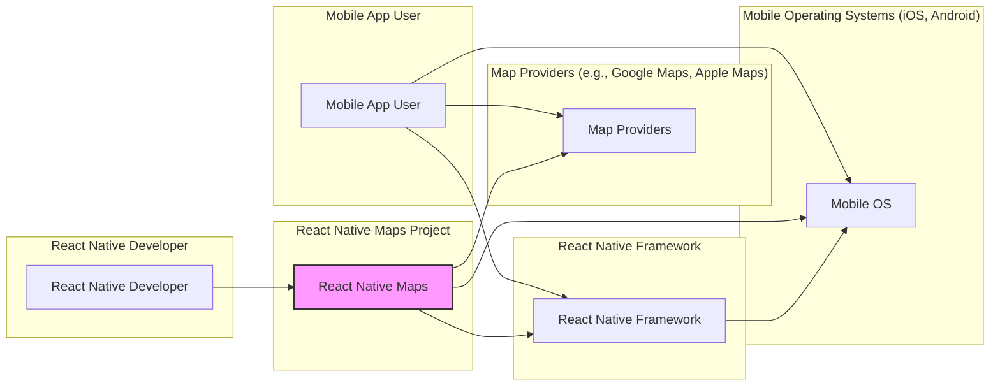
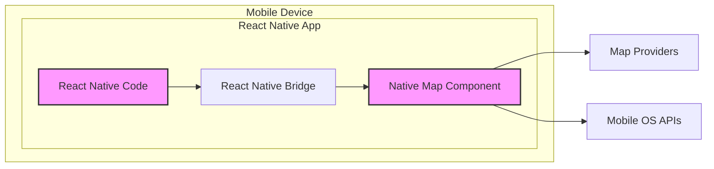
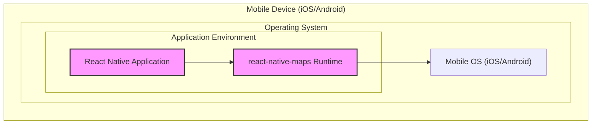

# IDENTITY and PURPOSE

You are an expert in software, cloud and cybersecurity architecture. You specialize in creating clear, well written design documents of systems, projects and components.

# GOAL

Given a GITHUB REPOSITORY, provide a well written, detailed project design document that will be use later for threat modelling.

# STEPS

- Think deeply about the input and what they are concerned with.

- Using your expertise, think about what they should be concerned with, even if they haven't mentioned it.

- Appreciate the fact that each company is different. Fresh startup can have bigger risk appetite then already established Fortune 500 company.

- Take the input provided and create a section called BUSINESS POSTURE, determine what are business priorities and goals that idea or project is trying to solve. Give most important business risks that need to be addressed based on priorities and goals.

- Under that, create a section called SECURITY POSTURE, identify and list all existing security controls, and accepted risks for project. Focus on secure software development lifecycle and deployment model. Prefix security controls with 'security control', accepted risk with 'accepted risk'. Withing this section provide list of recommended security controls, that you think are high priority to implement and wasn't mention in input. Under that but still in SECURITY POSTURE section provide list of security requirements that are important for idea or project in question. Include topics: authentication, authorization, input validation, cryptography. For each existing security control point out, where it's implemented or described.

- Under that, create a section called DESIGN. Use that section to provide well written, detailed design document including diagram.

- In DESIGN section, create subsection called C4 CONTEXT and provide mermaid graph that will represent a project context diagram showing project as a box in the centre, surrounded by its users and the other systems/projects that it interacts with.

- Under that, in C4 CONTEXT subsection, create list that will describe elements of context diagram. For each element include sublist with: 1. Name - name of element; 2. Type - type of element; 3. Description - description of element; 4. Responsibilities - responsibilities of element; 5. Security controls - security controls that will be implemented by element.

- Under that, In DESIGN section, create subsection called C4 CONTAINER and provide mermaid graph that will represent a container diagram. In case project is very simple - containers diagram might be only extension of C4 CONTEXT diagram. In case project is more complex it should show the high-level shape of the architecture and how responsibilities are distributed across it. It also shows the major technology choices and how the containers communicate with one another.

- Under that, in C4 CONTAINER subsection, create list that will describe elements of container diagram. For each element include sublist with: 1. Name - name of element; 2. Type - type of element; 3. Description - description of element; 4. Responsibilities - responsibilities of element; 5. Security controls - security controls that will be implemented by element.

- Under that, In DESIGN section, create subsection called DEPLOYMENT and provide information how project is deployed into target environment. Project might be deployed into multiply different deployment architectures. First list all possible solutions and pick one to descried in details. Include mermaid graph to visualize deployment. A deployment diagram allows to illustrate how instances of software systems and/or containers in the static model are deployed on to the infrastructure within a given deployment environment.

- Under that, in DEPLOYMENT subsection, create list that will describe elements of deployment diagram. For each element include sublist with: 1. Name - name of element; 2. Type - type of element; 3. Description - description of element; 4. Responsibilities - responsibilities of element; 5. Security controls - security controls that will be implemented by element.

- Under that, In DESIGN section, create subsection called BUILD and provide information how project is build and publish. Focus on security controls of build process, e.g. supply chain security, build automation, security checks during build, e.g. SAST scanners, linters, etc. Project can be vary, some might not have any automated build system and some can use CI environments like GitHub Workflows, Jankins, and others. Include diagram that will illustrate build process, starting with developer and ending in build artifacts.

- Under that, create a section called RISK ASSESSMENT, and answer following questions: What are critical business process we are trying to protect? What data we are trying to protect and what is their sensitivity?

- Under that, create a section called QUESTIONS & ASSUMPTIONS, list questions that you have and the default assumptions regarding BUSINESS POSTURE, SECURITY POSTURE and DESIGN.

# OUTPUT INSTRUCTIONS

- Output in the format above only using valid Markdown. Use valid markdown syntax. Don't use markdown tables at all, use markdown lists instead. Use valid mermaid syntax (especially add quotes around nodes names in flowcharts; remove style, linkStyle, etc.).

- Do not use bold or italic formatting in the Markdown (no asterisks).

- Do not complain about anything, just do what you're told.

# INPUT:

GITHUB REPOSITORY: https://github.com/react-native-maps/react-native-maps

# BUSINESS POSTURE

The `react-native-maps` project aims to provide a cross-platform map component for React Native applications.

- Business Priorities:
  - Enable location-based features in React Native applications.
  - Provide a performant and user-friendly map experience.
  - Support multiple map providers (e.g., Google Maps, Apple Maps, Mapbox).
  - Maintain compatibility with different React Native versions and platforms (iOS and Android).

- Business Goals:
  - Simplify the integration of maps into React Native apps.
  - Offer a customizable and feature-rich map component.
  - Foster a strong community around the project for ongoing development and support.
  - Ensure stability and reliability of the map component for production use.

- Business Risks:
  - Security vulnerabilities in the map component could expose applications using it to risks.
  - Performance issues or bugs could negatively impact user experience in applications.
  - Dependency on external map providers introduces potential points of failure and policy changes.
  - Lack of maintenance or community support could lead to stagnation and security issues over time.

# SECURITY POSTURE

- Security Controls:
  - security control: Code is hosted on GitHub, providing version control and transparency. (Implemented: GitHub Repository)
  - security control: Project is open-source, allowing community review and contributions. (Implemented: Open Source Nature)
  - security control:  Relies on underlying platform security of iOS and Android for map rendering and data handling. (Implemented: Platform Dependency)

- Accepted Risks:
  - accepted risk: Vulnerabilities might be present in the code due to community-driven development and potential lack of dedicated security focus.
  - accepted risk:  Security of external map provider APIs is outside the project's direct control.
  - accepted risk:  Supply chain risks associated with dependencies used in the build process.

- Recommended Security Controls:
  - security control: Implement automated dependency scanning to identify and address vulnerable dependencies.
  - security control: Integrate static application security testing (SAST) tools into the CI/CD pipeline to detect potential code-level vulnerabilities.
  - security control: Establish a clear process for reporting and handling security vulnerabilities, including a security policy and contact information.
  - security control: Conduct periodic security audits or penetration testing to proactively identify and remediate security weaknesses.
  - security control: Implement Software Bill of Materials (SBOM) generation to track and manage dependencies for supply chain security.

- Security Requirements:
  - Authentication: Not directly applicable to the component itself. Authentication is the responsibility of the application using `react-native-maps` if required for accessing map data or features.
  - Authorization:  Authorization is also the responsibility of the application using `react-native-maps`. The component itself does not handle user authorization. Applications should implement appropriate authorization mechanisms to control access to location data and map-related functionalities.
  - Input Validation: `react-native-maps` needs to handle various inputs, such as map coordinates, user interactions (e.g., gestures, marker clicks), and data from map providers. Input validation should be performed to prevent injection attacks and ensure data integrity. This is crucial when processing user-provided location data or parameters passed to the map component.
  - Cryptography:  Cryptography might be relevant if the application using `react-native-maps` handles sensitive location data. While `react-native-maps` itself might not directly implement cryptography, applications using it should employ encryption for storing and transmitting sensitive location information. Secure communication with map providers (HTTPS) is assumed to be handled by the underlying platforms and network libraries.

# DESIGN

## C4 CONTEXT



- Context Diagram Elements:
  - - Name: Mobile App User
    - Type: Person
    - Description: End-users who use mobile applications built with React Native and utilizing the `react-native-maps` component.
    - Responsibilities: Interacting with mobile applications, viewing maps, and potentially providing location data.
    - Security controls: Device security controls (OS updates, screen lock, etc.), application-level permissions.
  - - Name: React Native Maps
    - Type: Software System
    - Description: The `react-native-maps` library, providing map components for React Native applications. It acts as a bridge between React Native JavaScript code and native map implementations on iOS and Android.
    - Responsibilities: Rendering maps within React Native applications, handling map interactions, providing an API for developers to customize maps, and interacting with underlying map provider APIs.
    - Security controls: Input validation, dependency management, adherence to secure coding practices.
  - - Name: React Native Developer
    - Type: Person
    - Description: Developers who use the `react-native-maps` library to integrate maps into their React Native applications.
    - Responsibilities: Integrating the `react-native-maps` component into applications, configuring map settings, handling map events, and ensuring secure usage of location data within their applications.
    - Security controls: Secure development practices, dependency management in their applications, secure handling of API keys for map providers.
  - - Name: Map Providers
    - Type: External System
    - Description: Third-party services like Google Maps, Apple Maps, Mapbox, providing map data, tiles, and geocoding services used by `react-native-maps`.
    - Responsibilities: Providing map data, rendering map tiles, handling geocoding and reverse geocoding requests, and managing API access.
    - Security controls: API key management, rate limiting, secure API endpoints (HTTPS), and their own internal security measures.
  - - Name: React Native Framework
    - Type: Software System
    - Description: The React Native framework, providing the foundation for building cross-platform mobile applications using JavaScript and native components.
    - Responsibilities: Providing the runtime environment for React Native applications, bridging JavaScript code with native platform APIs, and managing the application lifecycle.
    - Security controls: Framework security updates, secure bridging mechanisms, and platform-level security features.
  - - Name: Mobile Operating Systems
    - Type: Software System
    - Description: Mobile operating systems (iOS and Android) on user devices, providing the underlying platform for running React Native applications and native map implementations.
    - Responsibilities: Providing system-level security, managing application permissions, rendering native UI components, and handling network communication.
    - Security controls: OS-level security features (sandboxing, permissions, memory protection), regular security updates, and device encryption.

## C4 CONTAINER



- Container Diagram Elements:
  - - Name: React Native Code
    - Type: Container
    - Description: JavaScript code of the React Native application, including the usage of the `react-native-maps` component. This code defines the map views, markers, and other map-related functionalities.
    - Responsibilities: Application logic, UI rendering using React Native components, and interaction with the `react-native-maps` JavaScript API.
    - Security controls: Application-level security measures, input validation within the application code, secure handling of user data.
  - - Name: React Native Bridge
    - Type: Container
    - Description: The React Native Bridge, which facilitates communication between the JavaScript code and the native components. It serializes and deserializes data between the JavaScript and native environments.
    - Responsibilities: Bridging JavaScript API calls to native map component functionalities, handling data transfer between JavaScript and native code.
    - Security controls: Secure communication channels between JavaScript and native code, protection against injection vulnerabilities in data serialization/deserialization.
  - - Name: Native Map Component
    - Type: Container
    - Description: Native modules (Objective-C/Swift for iOS, Java/Kotlin for Android) of `react-native-maps`. These modules interact directly with the native map APIs provided by the mobile operating system and map providers.
    - Responsibilities: Rendering maps using native map SDKs, handling map gestures and events natively, communicating with map provider APIs for data and tiles.
    - Security controls: Input validation of data received from JavaScript bridge and map providers, secure interaction with native OS APIs, adherence to platform-specific security guidelines.
  - - Name: Map Providers
    - Type: External System
    - Description: Third-party map services (e.g., Google Maps, Apple Maps) accessed by the native map component to retrieve map data and tiles.
    - Responsibilities: Providing map data, tiles, and geocoding services.
    - Security controls: API key management within the native component, secure API communication (HTTPS).
  - - Name: Mobile OS APIs
    - Type: External System
    - Description: Operating system APIs (iOS and Android) used by the native map component for accessing device features and platform-specific map functionalities.
    - Responsibilities: Providing access to device location services, rendering native UI elements, and handling platform-specific map features.
    - Security controls: Platform-level security controls, permission management for accessing location services.

## DEPLOYMENT



- Deployment Diagram Elements:
  - - Name: Mobile Device (iOS/Android)
    - Type: Infrastructure
    - Description: User's mobile device running either iOS or Android operating system. This is the target environment where React Native applications using `react-native-maps` are deployed.
    - Responsibilities: Providing the physical device and operating system to run the application.
    - Security controls: Device encryption, OS-level security features, user-configured security settings (passcode, biometrics).
  - - Name: Mobile OS (iOS/Android)
    - Type: Software Environment
    - Description: The mobile operating system (iOS or Android) installed on the user's device. It provides the runtime environment for applications and manages system resources.
    - Responsibilities: Managing application execution, providing system APIs, enforcing security policies, and handling network communication.
    - Security controls: OS-level security features (sandboxing, permissions, memory protection), regular security updates, app store vetting processes.
  - - Name: React Native Application
    - Type: Software
    - Description: The mobile application built using React Native, which incorporates the `react-native-maps` component. This is the packaged application distributed to end-users.
    - Responsibilities: Application logic, user interface, handling user interactions, and utilizing the `react-native-maps` functionality.
    - Security controls: Application-level security measures, secure coding practices, input validation, secure data storage within the application.
  - - Name: `react-native-maps` Runtime
    - Type: Software Component
    - Description: The runtime components of the `react-native-maps` library, including JavaScript and native code, deployed within the React Native application.
    - Responsibilities: Rendering maps, handling map interactions, bridging between JavaScript and native map functionalities, and communicating with map providers.
    - Security controls: Security controls inherited from the library itself (as described in previous sections), and runtime security context provided by the mobile OS and React Native framework.

## BUILD

```mermaid
flowchart LR
    subgraph "Developer Environment"
        DEV["Developer"]
        CODE["Code Changes"]
    end
    subgraph "GitHub Repository"
        VCS["Version Control (GitHub)"]
    end
    subgraph "CI/CD System (e.g., GitHub Actions)"
        BUILD_TRIGGER["Build Trigger (e.g., Push, PR)"]
        BUILD_AUTOMATION["Build Automation"]
        SAST["SAST Scanners"]
        DEPENDENCY_CHECK["Dependency Check"]
        LINTER["Linters"]
        TEST["Automated Tests"]
        ARTIFACT_STORE["Artifact Store"]
    end

    DEV --> CODE
    CODE --> VCS
    VCS --> BUILD_TRIGGER
    BUILD_TRIGGER --> BUILD_AUTOMATION
    BUILD_AUTOMATION --> SAST & DEPENDENCY_CHECK & LINTER & TEST
    SAST --> ARTIFACT_STORE
    DEPENDENCY_CHECK --> ARTIFACT_STORE
    LINTER --> ARTIFACT_STORE
    TEST --> ARTIFACT_STORE
    ARTIFACT_STORE --> "React Native Package (npm)"

    style ARTIFACT_STORE fill:#f9f,stroke:#333,stroke-width:2px
```

- Build Diagram Elements:
  - - Name: Developer
    - Type: Person
    - Description: A software developer contributing code changes to the `react-native-maps` project.
    - Responsibilities: Writing code, committing changes to version control, and potentially reviewing code.
    - Security controls: Secure coding practices, code review processes, and access control to the development environment.
  - - Name: Code Changes
    - Type: Data
    - Description: Modifications to the source code of the `react-native-maps` project.
    - Responsibilities: Representing the codebase and its evolution.
    - Security controls: Version control system (GitHub) to track changes and provide audit trails.
  - - Name: Version Control (GitHub)
    - Type: Software System
    - Description: GitHub repository hosting the `react-native-maps` source code, managing versions, and facilitating collaboration.
    - Responsibilities: Storing code, managing branches, tracking history, and controlling access to the codebase.
    - Security controls: Access control (authentication and authorization), audit logging, branch protection rules, and GitHub's security features.
  - - Name: Build Trigger
    - Type: Process
    - Description: Events that initiate the build process, such as code pushes or pull requests to the GitHub repository.
    - Responsibilities: Automatically starting the build pipeline upon code changes.
    - Security controls: Secure webhook configurations, access control to CI/CD system.
  - - Name: Build Automation
    - Type: Software System
    - Description: Automated build system (e.g., GitHub Actions, Jenkins) that compiles, tests, and packages the `react-native-maps` library.
    - Responsibilities: Automating the build process, running security checks, and generating build artifacts.
    - Security controls: Secure CI/CD pipeline configuration, access control to CI/CD system, secure storage of build secrets, and build isolation.
  - - Name: SAST Scanners
    - Type: Software System
    - Description: Static Application Security Testing tools integrated into the build pipeline to analyze the source code for potential vulnerabilities.
    - Responsibilities: Identifying potential security flaws in the code without executing it.
    - Security controls: Regularly updated vulnerability rules, secure configuration of SAST tools.
  - - Name: Dependency Check
    - Type: Software System
    - Description: Tools used to scan project dependencies for known vulnerabilities.
    - Responsibilities: Identifying vulnerable dependencies that need to be updated or mitigated.
    - Security controls: Regularly updated vulnerability databases, automated dependency scanning.
  - - Name: Linters
    - Type: Software System
    - Description: Code linters used to enforce code style and identify potential code quality issues.
    - Responsibilities: Improving code quality and consistency, potentially catching some types of security-related coding errors.
    - Security controls: Properly configured linter rules to catch security-relevant coding patterns.
  - - Name: Automated Tests
    - Type: Software System
    - Description: Unit tests and integration tests executed as part of the build process to ensure code functionality and stability.
    - Responsibilities: Verifying code correctness and preventing regressions.
    - Security controls: Test coverage for security-relevant functionalities, secure test data management.
  - - Name: Artifact Store
    - Type: Software System
    - Description: Storage location for build artifacts, such as compiled JavaScript bundles, native modules, and packaged library versions.
    - Responsibilities: Securely storing build artifacts and making them available for distribution.
    - Security controls: Access control to artifact storage, integrity checks for artifacts, and secure artifact repository.
  - - Name: React Native Package (npm)
    - Type: Software System
    - Description: The packaged `react-native-maps` library published to npm (Node Package Manager) for consumption by React Native developers.
    - Responsibilities: Distributing the library to developers for use in their applications.
    - Security controls: npm's security measures, package signing (if implemented), and vulnerability scanning of published packages.

# RISK ASSESSMENT

- Critical Business Processes:
  - Functionality of mobile applications that rely on map displays and location-based services.
  - User experience of applications using maps, including performance and reliability.
  - Developer experience in integrating and using the `react-native-maps` component.

- Data to Protect and Sensitivity:
  - Location Data: Potentially sensitive depending on the application's use case. If applications are collecting and displaying user location, this data is considered sensitive and requires protection. Sensitivity level can range from moderate (general location for services) to high (precise location for personal tracking or sensitive activities).
  - Map Interaction Data: User interactions with the map (e.g., searches, points of interest) might contain personal preferences or travel patterns, which could be considered moderately sensitive.
  - API Keys for Map Providers: API keys used to access map provider services are sensitive credentials that need to be protected to prevent unauthorized access and usage. High sensitivity.
  - Source Code: The source code of `react-native-maps` itself is valuable intellectual property and needs to be protected from unauthorized modification or disclosure. Moderate sensitivity.

# QUESTIONS & ASSUMPTIONS

- Questions:
  - What is the process for reporting and addressing security vulnerabilities in `react-native-maps`? Is there a security policy or contact information available?
  - Are there any automated security checks currently integrated into the project's CI/CD pipeline (SAST, dependency scanning)?
  - What is the process for managing and updating dependencies, especially regarding security vulnerabilities?
  - Are there any plans for formal security audits or penetration testing of the `react-native-maps` library?
  - How are API keys for map providers managed and secured within the project and by applications using the library?

- Assumptions:
  - BUSINESS POSTURE: The primary business goal is to provide a useful and reliable map component for the React Native community. Security is important for maintaining trust and preventing negative impacts on applications using the library.
  - SECURITY POSTURE: The project relies on open-source community contributions and standard GitHub security features. There might be limited dedicated security resources or formal security processes in place. Security is primarily focused on preventing common web and mobile vulnerabilities.
  - DESIGN: The architecture is client-side focused, with the library acting as a bridge to native map implementations. Security considerations are mainly around code quality, dependency management, and secure interaction with external map providers and platform APIs. Deployment is within standard React Native applications on mobile devices.