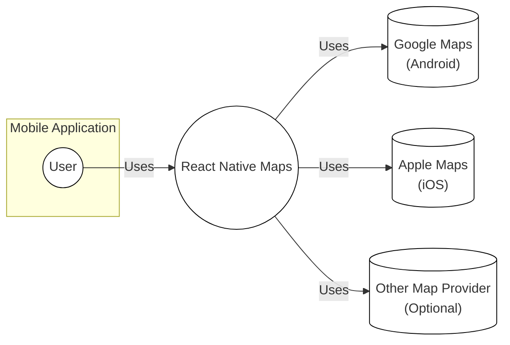
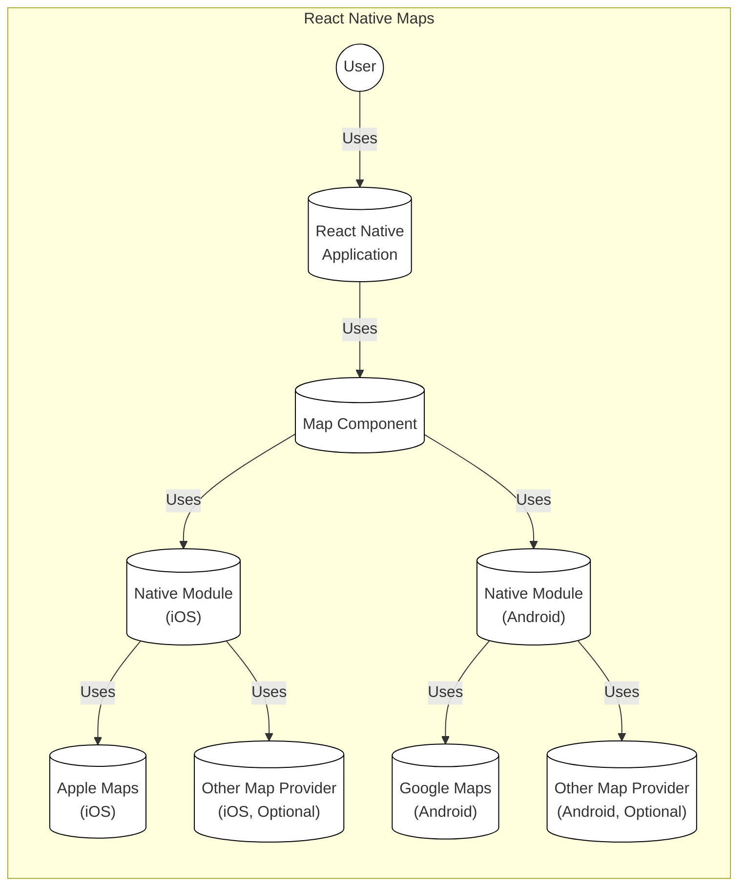
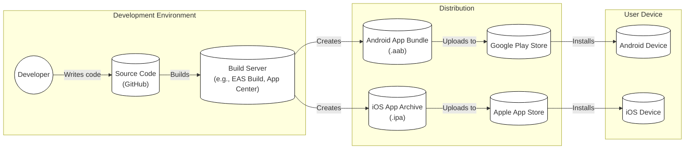

# Project Design Document: react-native-maps

## BUSINESS POSTURE

_Priorities and Goals:_

*   Provide a comprehensive and customizable map component for React Native applications.
*   Offer a unified API across iOS and Android platforms, abstracting away platform-specific implementations.
*   Enable developers to easily integrate maps with various features like markers, polygons, polylines, callouts, and custom overlays.
*   Maintain high performance and responsiveness, even with a large number of map elements.
*   Provide good documentation and community support.
*   Support latest React Native versions.

_Business Risks:_

*   Inconsistent map behavior across different devices and operating system versions, leading to a poor user experience.
*   Performance bottlenecks, especially when rendering a large number of markers or complex overlays.
*   Security vulnerabilities related to map data or user location information.
*   Lack of support for specific map providers or features, limiting developer options.
*   Difficulty in customizing the map's appearance and behavior to match application branding.
*   Breaking changes with React Native upgrades.

## SECURITY POSTURE

_Existing Security Controls:_

*   security control: The project is open-source, allowing for community review and contributions to identify and address security issues. (GitHub repository)
*   security control: The project uses platform-specific map SDKs (Google Maps SDK for Android, Apple Maps SDK for iOS), which are assumed to have their own security controls. (Platform SDK documentation)
*   security control: The project follows standard React Native development practices, which include some inherent security benefits. (React Native documentation)
*   security control: Basic input validation is likely performed on user-provided data, such as marker coordinates and callout content. (Code review needed for confirmation)

_Accepted Risks:_

*   accepted risk: The project relies on the security of third-party map providers (e.g., Google Maps, Apple Maps) and their SDKs.
*   accepted risk: The project may not have comprehensive security audits or penetration testing performed regularly.
*   accepted risk: User location data privacy depends on the application developer's implementation and adherence to platform guidelines.

_Recommended Security Controls:_

*   security control: Implement a Content Security Policy (CSP) to mitigate XSS vulnerabilities.
*   security control: Conduct regular security audits and penetration testing.
*   security control: Implement robust input validation and sanitization for all user-provided data.
*   security control: Provide clear guidelines and best practices for developers on handling user location data securely and responsibly.
*   security control: Implement a mechanism for securely storing and transmitting API keys, if required by the map provider.
*   security control: Regularly update dependencies to address known vulnerabilities.
*   security control: Implement a mechanism to check for and prevent map-related denial-of-service attacks (e.g., excessive marker creation).

_Security Requirements:_

*   Authentication:
    *   Not directly applicable to the map component itself, but applications using the component should implement appropriate authentication mechanisms if user-specific map data is displayed or stored.
*   Authorization:
    *   If the application uses different map features based on user roles, the component should support mechanisms to control access to those features.
*   Input Validation:
    *   All user-provided data, such as coordinates, marker titles, descriptions, and custom overlay data, must be validated to prevent injection attacks and ensure data integrity.
    *   Coordinate values should be checked for valid ranges.
    *   Text inputs should be sanitized to prevent XSS attacks.
*   Cryptography:
    *   If sensitive data is transmitted or stored, appropriate encryption mechanisms should be used. This is primarily the responsibility of the application using the component, not the component itself. However, if API keys are used, they should be stored and transmitted securely.
*   Data Privacy
    *   Follow platform guidelines (iOS and Android) for handling user location data.
    *   Provide clear and concise privacy policies to users.
    *   Obtain user consent before collecting and using location data.
    *   Minimize data collection and retention.
    *   Allow users to control their location data (e.g., enable/disable location services, delete their data).

## DESIGN

### C4 CONTEXT

_Context Diagram Elements:_

*   Element:
    *   Name: User
    *   Type: Person
    *   Description: A user of the mobile application that utilizes the React Native Maps component.
    *   Responsibilities: Interacts with the map, views map data, and potentially provides input (e.g., location, search queries).
    *   Security controls: Relies on the mobile application's security controls for authentication, authorization, and data protection.

*   Element:
    *   Name: React Native Maps
    *   Type: Software System
    *   Description: The React Native Maps library, providing a map component for React Native applications.
    *   Responsibilities: Provides a unified API for interacting with maps on iOS and Android, handles map rendering, manages map elements (markers, polygons, etc.), and communicates with platform-specific map providers.
    *   Security controls: Input validation, reliance on platform SDK security, potential for CSP implementation.

*   Element:
    *   Name: Google Maps (Android)
    *   Type: Software System
    *   Description: The Google Maps SDK for Android, providing map data and functionality on Android devices.
    *   Responsibilities: Renders map tiles, handles user interaction, provides location services, and manages map data.
    *   Security controls: Implemented by Google, including data encryption, access controls, and vulnerability management.

*   Element:
    *   Name: Apple Maps (iOS)
    *   Type: Software System
    *   Description: The Apple Maps SDK (MapKit) for iOS, providing map data and functionality on iOS devices.
    *   Responsibilities: Renders map tiles, handles user interaction, provides location services, and manages map data.
    *   Security controls: Implemented by Apple, including data encryption, access controls, and vulnerability management.

*   Element:
    *   Name: Other Map Provider (Optional)
    *   Type: Software System
    *   Description: An alternative map provider, such as Mapbox or Leaflet, that can be integrated with React Native Maps.
    *   Responsibilities: Varies depending on the provider, but generally includes providing map data and rendering capabilities.
    *   Security controls: Dependent on the specific provider's implementation and security practices.

### C4 CONTAINER

_Container Diagram Elements:_

*   Element:
    *   Name: User
    *   Type: Person
    *   Description: A user interacting with the React Native application.
    *   Responsibilities: Interacts with the map through the application's UI.
    *   Security controls: Relies on the mobile application's security.

*   Element:
    *   Name: React Native Application
    *   Type: Mobile App
    *   Description: The application built using React Native that incorporates the React Native Maps component.
    *   Responsibilities: Handles user input, manages application state, and interacts with the Map Component.
    *   Security controls: Application-level security controls, including authentication, authorization, and data validation.

*   Element:
    *   Name: Map Component
    *   Type: Component
    *   Description: The React Native Maps component, providing a JavaScript API for interacting with maps.
    *   Responsibilities: Handles map configuration, manages map elements, and communicates with the native modules.
    *   Security controls: Input validation, data sanitization.

*   Element:
    *   Name: Native Module (iOS)
    *   Type: Native Module
    *   Description: The native iOS module that bridges the React Native Map Component with the Apple Maps SDK.
    *   Responsibilities: Handles communication between JavaScript and the Apple Maps SDK, manages map view lifecycle, and processes map events.
    *   Security controls: Relies on Apple Maps SDK security.

*   Element:
    *   Name: Native Module (Android)
    *   Type: Native Module
    *   Description: The native Android module that bridges the React Native Map Component with the Google Maps SDK.
    *   Responsibilities: Handles communication between JavaScript and the Google Maps SDK, manages map view lifecycle, and processes map events.
    *   Security controls: Relies on Google Maps SDK security.

*   Element:
    *   Name: Apple Maps (iOS)
    *   Type: Software System
    *   Description: The Apple Maps SDK for iOS.
    *   Responsibilities: Renders map tiles, handles user interaction, provides location services.
    *   Security controls: Implemented by Apple.

*   Element:
    *   Name: Google Maps (Android)
    *   Type: Software System
    *   Description: The Google Maps SDK for Android.
    *   Responsibilities: Renders map tiles, handles user interaction, provides location services.
    *   Security controls: Implemented by Google.

*   Element:
    *   Name: Other Map Provider (iOS, Optional)
    *   Type: Library/SDK
    *   Description: An optional alternative map provider for iOS.
    *   Responsibilities: Provides map data and rendering capabilities.
    *   Security controls: Dependent on the specific provider.

*   Element:
    *   Name: Other Map Provider (Android, Optional)
    *   Type: Library/SDK
    *   Description: An optional alternative map provider for Android.
    *   Responsibilities: Provides map data and rendering capabilities.
    *   Security controls: Dependent on the specific provider.

### DEPLOYMENT

_Possible Deployment Solutions:_

1.  Standard React Native deployment: The React Native application, including the react-native-maps component, is built and deployed as a standard mobile application through the respective app stores (Google Play Store for Android and Apple App Store for iOS).
2.  Over-the-Air (OTA) updates: Services like CodePush can be used to deploy updates to the JavaScript bundle and assets without requiring a full app store release. This can be used to update the react-native-maps component if the update only involves changes to the JavaScript code and doesn't require native module modifications.
3.  Embedded in a native application: In some cases, a React Native application might be embedded within a larger native application. The deployment process would then be specific to the native application's build and deployment pipeline.

_Chosen Deployment Solution (Standard React Native Deployment):_

_Deployment Diagram Elements:_

*   Element:
    *   Name: Developer
    *   Type: Person
    *   Description: A developer working on the React Native application.
    *   Responsibilities: Writes code, commits changes to the source code repository.
    *   Security controls: Access controls to the source code repository.

*   Element:
    *   Name: Source Code (GitHub)
    *   Type: Repository
    *   Description: The source code repository for the React Native application, including the react-native-maps component.
    *   Responsibilities: Stores the application's code, tracks changes, and facilitates collaboration.
    *   Security controls: Access controls, branch protection rules, code review processes.

*   Element:
    *   Name: Build Server (e.g., EAS Build, App Center)
    *   Type: CI/CD System
    *   Description: A build server that automates the process of building the React Native application.
    *   Responsibilities: Fetches the source code, installs dependencies, builds the application for Android and iOS, and potentially runs tests.
    *   Security controls: Secure access to the build server, secure storage of build credentials, code signing certificates.

*   Element:
    *   Name: Android App Bundle (.aab)
    *   Type: Artifact
    *   Description: The Android application package created by the build server.
    *   Responsibilities: Contains the compiled code and resources for the Android application.
    *   Security controls: Code signing, integrity checks.

*   Element:
    *   Name: iOS App Archive (.ipa)
    *   Type: Artifact
    *   Description: The iOS application archive created by the build server.
    *   Responsibilities: Contains the compiled code and resources for the iOS application.
    *   Security controls: Code signing, integrity checks.

*   Element:
    *   Name: Google Play Store
    *   Type: App Store
    *   Description: The official app store for Android applications.
    *   Responsibilities: Distributes the Android application to users.
    *   Security controls: Google Play Protect, app review process.

*   Element:
    *   Name: Apple App Store
    *   Type: App Store
    *   Description: The official app store for iOS applications.
    *   Responsibilities: Distributes the iOS application to users.
    *   Security controls: Apple's app review process, sandboxing.

*   Element:
    *   Name: Android Device
    *   Type: Device
    *   Description: An Android device running the React Native application.
    *   Responsibilities: Executes the application code, interacts with the map component.
    *   Security controls: Android operating system security features, app sandboxing.

*   Element:
    *   Name: iOS Device
    *   Type: Device
    *   Description: An iOS device running the React Native application.
    *   Responsibilities: Executes the application code, interacts with the map component.
    *   Security controls: iOS operating system security features, app sandboxing.

### BUILD

```mermaid
graph LR
    Developer(("Developer")) -- "Commits code" --> GitHub[("GitHub Repository")]
    GitHub -- "Triggers" --> CI[("CI/CD Pipeline\n(e.g., GitHub Actions)")]
    CI -- "Checks out code" --> Checkout[("Checkout Code")]
    Checkout -- "Installs dependencies" --> Install[("Install Dependencies\n(npm install)")]
    Install -- "Runs linters" --> Linters[("Run Linters\n(ESLint, etc.)")]
    Linters -- "Runs tests" --> Tests[("Run Tests\n(Jest, etc.)")]
    Tests -- "Builds native code" --> Build[("Build Native Code\n(Android & iOS)")]
    Build -- "Creates artifacts" --> Artifacts[("Create Artifacts\n(.aab, .ipa)")]
    Artifacts -- "Publishes artifacts" --> Publish[("Publish Artifacts\n(e.g., to App Store Connect, Google Play Console)")]
    classDef element stroke:#000,fill:#fff;
    class Developer,GitHub,CI,Checkout,Install,Linters,Tests,Build,Artifacts,Publish element
```

_Build Process Description:_

1.  Developer commits code changes to the GitHub repository.
2.  A CI/CD pipeline (e.g., GitHub Actions) is triggered by the commit.
3.  The pipeline checks out the code from the repository.
4.  Dependencies are installed using npm install.
5.  Linters (e.g., ESLint) are run to check for code style and potential errors.
6.  Tests (e.g., Jest) are run to ensure code quality and functionality.
7.  The native code for Android and iOS is built, creating the application artifacts (.aab and .ipa).
8.  The artifacts are published to the respective app stores (App Store Connect for iOS, Google Play Console for Android) or to a distribution platform.

_Build Process Security Controls:_

*   security control: Use of a CI/CD pipeline ensures consistent and automated builds.
*   security control: Dependency management with npm helps track and manage dependencies, reducing the risk of using vulnerable libraries.
*   security control: Linters enforce code style and identify potential security issues.
*   security control: Automated tests help catch bugs and regressions early in the development process.
*   security control: Code signing of the application artifacts ensures authenticity and integrity.
*   security control: Secure storage of build credentials and API keys within the CI/CD environment.
*   security control: Regular updates to the CI/CD pipeline and build tools to address security vulnerabilities.
*   security control: Static Application Security Testing (SAST) tools can be integrated into the pipeline to scan for security vulnerabilities in the code.
*   security control: Software Composition Analysis (SCA) tools can be used to identify and manage vulnerabilities in third-party dependencies.

## RISK ASSESSMENT

_Critical Business Processes to Protect:_

*   User experience: Ensuring a smooth and reliable map experience for users is crucial.
*   Application functionality: The map component is likely a core feature of the application, and its failure would significantly impact the application's usability.
*   Data integrity: Maintaining the accuracy and integrity of map data is important.
*   User privacy: Protecting user location data and other sensitive information is paramount.

_Data to Protect and Sensitivity:_

*   User location data: Highly sensitive. Requires strict adherence to privacy regulations and best practices.
*   Map data (e.g., markers, polygons, routes): Sensitivity depends on the specific application. May contain user-generated content or business-sensitive information.
*   API keys (if used): Sensitive. Should be stored and transmitted securely.
*   User credentials (if the application uses authentication): Highly sensitive. Requires robust security measures.

## QUESTIONS & ASSUMPTIONS

_Questions:_

*   Are there any specific compliance requirements (e.g., GDPR, CCPA) that need to be considered?
*   What are the specific map providers being used (Google Maps, Apple Maps, others)?
*   Are there any custom map overlays or data sources being used?
*   What level of map customization is required by the application?
*   What is the expected scale of the application (number of users, map interactions)?
*   Are there any existing security audits or penetration testing reports for the application or the react-native-maps component?
*   What is the process for handling security vulnerabilities reported by the community or discovered internally?

_Assumptions:_

*   _BUSINESS POSTURE:_ The primary goal is to provide a functional and reliable map component for React Native applications.
*   _BUSINESS POSTURE:_ The project aims to support a wide range of use cases and customization options.
*   _SECURITY POSTURE:_ The project relies on the security of the underlying platform-specific map SDKs.
*   _SECURITY POSTURE:_ The application developer is responsible for implementing appropriate security controls for user authentication, authorization, and data protection.
*   _DESIGN:_ The project uses a standard React Native architecture with native modules for interacting with platform-specific APIs.
*   _DESIGN:_ The deployment process follows standard React Native practices.
*   _DESIGN:_ The build process utilizes a CI/CD pipeline for automation and consistency.