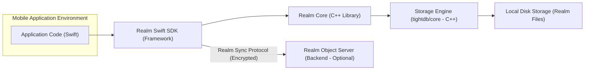
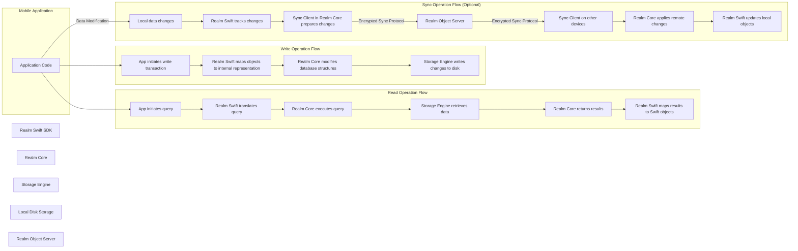

# Project Design Document: Realm Swift (Improved)

**1. Introduction**

This document provides an enhanced design overview of the Realm Swift project, an open-source mobile database. It is specifically tailored to serve as a robust foundation for subsequent threat modeling activities. The document details the system's architecture, key components, and data flow, with a strong emphasis on security-relevant aspects. The design focuses on the core Realm Swift library as found in the provided GitHub repository: [https://github.com/realm/realm-swift](https://github.com/realm/realm-swift).

**2. Goals and Objectives**

The primary goals of Realm Swift are to:

* Provide a developer-friendly and efficient mobile database solution for Apple platforms (iOS, macOS, watchOS, and tvOS).
* Offer a straightforward API for data persistence, querying, and manipulation.
* Guarantee data consistency and integrity through transactional operations.
* Optionally enable seamless data synchronization across multiple devices via Realm Sync.
* Deliver high performance for both read and write operations, crucial for mobile application responsiveness.

**3. Scope**

This design document focuses on the architectural elements and components within the core Realm Swift library codebase. This includes:

* The internal workings of the database engine and its core functionalities exposed through the Swift API.
* The Swift API and its mechanisms for object mapping, querying, and transaction management.
* The schema management and migration processes.
* A high-level overview of the optional Realm Sync feature and its interaction with the core library.

This document does *not* delve into:

* Specific implementation details of applications utilizing the Realm Swift SDK.
* The intricate details of the Realm Object Server's architecture and implementation (beyond its interaction points with Realm Swift).
* The low-level implementation of the underlying storage engine (tightdb/core) except where it directly impacts the Swift layer's security or functionality.
* Detailed performance benchmarks, optimization techniques, or specific code implementations within the Realm Swift library.

**4. High-Level Architecture**

**Description:**

* **Mobile Application Environment:** Represents the context in which the application using Realm Swift runs.
* **Application Code (Swift):** The custom Swift code developed by application developers that integrates and utilizes the Realm Swift SDK for data management.
* **Realm Swift SDK (Framework):** The Swift framework providing the primary API for developers to interact with the Realm database. This includes defining data models (Realm Objects), performing queries, managing transactions, and handling synchronization.
* **Realm Core (C++ Library):** The underlying C++ engine that implements the core database functionalities, including data storage, indexing, query processing, and transaction management. It provides a lower-level interface for the Swift SDK.
* **Storage Engine (tightdb/core - C++):** The low-level C++ storage engine responsible for the efficient and persistent storage of data on the device's local storage. It handles file management and data serialization.
* **Local Disk Storage (Realm Files):** The actual files stored on the device's file system where the Realm database is persisted. These files contain the structured data managed by the storage engine.
* **Realm Object Server (Backend - Optional):** A backend service (not part of the Realm Swift library itself) that facilitates data synchronization between multiple devices and users. It communicates with the Realm Swift SDK using a specific, encrypted protocol.

**5. Component Details**

* **Realm Instance:**
    - Represents a single, isolated Realm database file on disk or in memory.
    - Serves as the primary entry point for all database operations within an application.
    - Manages the lifecycle of transactions and ensures data consistency within its scope.
    - Can be configured with various options, including in-memory storage, encryption keys, and synchronization settings.
* **Realm Objects:**
    - Swift classes that inherit from the `RealmSwift.Object` base class or conform to the `RealmSwift.Persistable` protocol.
    - Represent the data entities stored within the Realm database.
    - Properties of Realm Objects are automatically persisted to the database.
    - Supports relationships between objects (one-to-one, one-to-many, many-to-many).
* **Schemas:**
    - Define the structure and data types of the information stored within a Realm database.
    - Implicitly derived from the properties of the defined Realm Objects.
    - Schema migrations are required when the data model changes to ensure data compatibility and prevent data loss.
* **Queries:**
    - Mechanisms for retrieving specific subsets of data from the Realm database.
    - Expressed using a type-safe, fluent API or through the Realm Query Language (RQL), a string-based query language.
    - Return `Results` objects, which are live-updating collections reflecting the current state of the database.
* **Transactions:**
    - Enforce the Atomicity, Consistency, Isolation, and Durability (ACID) properties for all database modifications.
    - All write operations (creating, updating, deleting objects) must be performed within the context of a write transaction.
    - Read transactions provide a consistent view of the database at a specific point in time.
* **Notifications:**
    - Allow observing changes to specific Realm objects or collections of objects.
    - Enable applications to react to data modifications in real-time, facilitating UI updates and other reactive behaviors.
* **Encryption:**
    - Realm databases can be optionally encrypted using a 64-byte encryption key provided during Realm instance creation.
    - Protects the database contents at rest on the device's storage, making it unreadable without the correct key.
* **Realm Sync (Optional):**
    - Enables the synchronization of Realm data between multiple devices and users through the Realm Object Server.
    - Manages conflict resolution and data merging when concurrent modifications occur on different devices.
    - Utilizes a proprietary synchronization protocol over secure network connections.

**6. Data Flow**

**Description:**

* **Write Operation Flow:** When the application needs to persist data, it initiates a write transaction. The Realm Swift SDK handles the mapping of Swift objects to the internal data structures used by Realm Core. Realm Core then performs the necessary modifications to the database, and the Storage Engine writes these changes to the local disk storage.
* **Read Operation Flow:** When the application queries data, the Realm Swift SDK translates the query into a format understood by Realm Core. Realm Core executes the query against the data managed by the Storage Engine. The retrieved data is then passed back to the Realm Swift SDK, which maps it back to Swift objects for use in the application.
* **Sync Operation Flow (Optional):** When Realm Sync is enabled, local data modifications are tracked by the Realm Swift SDK. The Sync Client within Realm Core prepares these changes and transmits them to the Realm Object Server using an encrypted synchronization protocol. The server then relays these changes to other connected devices, where their respective Sync Clients apply the remote modifications to their local Realm databases.

**7. Security Considerations**

* **Data at Rest Security:**
    - **Encryption:** Realm's optional encryption feature, when enabled with a strong, securely managed key, provides robust protection against unauthorized access to the database files on the device. Without encryption, the data is stored in plain text.
    - **File System Permissions:** The security of the Realm database files also relies on the underlying operating system's file permission system. Applications should adhere to best practices for file storage and access.
    - **Key Management Vulnerabilities:** The security of encrypted Realm databases is directly tied to the secure generation, storage, and management of the encryption key. Weak key management practices can negate the benefits of encryption. Consider using the device's keychain or secure enclave for key storage.
* **Data in Transit Security (Realm Sync):**
    - **TLS/SSL Encryption:** Communication between the Realm Swift SDK and the Realm Object Server *must* be encrypted using TLS/SSL to protect data from eavesdropping and tampering during transmission.
    - **Authentication and Authorization:** The Realm Object Server enforces authentication to verify the identity of users and devices attempting to access or modify data. Authorization rules define which users have permissions to access specific data. Weak authentication or authorization schemes can lead to unauthorized data access.
    - **Man-in-the-Middle Attacks:** Without proper TLS/SSL implementation and certificate validation, the communication channel is vulnerable to man-in-the-middle attacks.
* **Local Access Control:**
    - **Limited Granularity:** Realm Swift itself does not offer fine-grained access control within a single local database file. Any process with sufficient operating system privileges to access the file can potentially read or write data. Security relies on the application's design and the operating system's security mechanisms.
    - **Inter-Process Communication (IPC):** If the application uses IPC, ensure that communication channels are secure to prevent unauthorized access to the Realm database.
* **Query Injection Vulnerabilities:**
    - **Risk of RQL Injection:** Constructing Realm Query Language (RQL) queries by directly concatenating user input can create vulnerabilities to RQL injection attacks, potentially allowing attackers to bypass intended data access restrictions or perform unauthorized operations. Always use parameterized queries or the fluent API to construct queries safely.
* **Denial of Service (DoS):**
    - **Complex Queries:** Executing excessively complex or resource-intensive queries could potentially lead to performance degradation or denial of service, especially on resource-constrained mobile devices. Implement proper query optimization and consider resource limits.
    - **Sync-Related DoS:**  Malicious actors could potentially attempt to overload the Realm Object Server with excessive sync requests, leading to a denial of service for legitimate users. Rate limiting and other server-side protections are necessary.
* **Data Integrity Threats:**
    - **Schema Migration Issues:** Incorrectly implemented schema migrations can lead to data corruption or loss. Thorough testing of migration logic is crucial.
    - **Concurrency Issues (without proper transaction management):**  Failing to properly use transactions for write operations can lead to data inconsistencies and race conditions.
* **Dependency Vulnerabilities:**
    - **Third-Party Libraries:** Realm Swift relies on underlying libraries (like the C++ core). Vulnerabilities in these dependencies could potentially impact the security of Realm Swift. Regularly update dependencies and monitor for security advisories.
* **Side-Channel Attacks (Theoretical):**
    - While less likely on mobile platforms, theoretical vulnerabilities related to side-channel attacks (e.g., timing attacks) on data access patterns could exist at the storage engine level. Mitigations typically involve careful implementation of the underlying storage mechanisms.

**8. Deployment Considerations**

* Realm Swift is typically deployed as an embedded database within mobile applications.
* The database files are stored locally within the application's sandbox on the device.
* For applications utilizing Realm Sync, the Realm Object Server needs to be deployed and configured in a secure and reliable environment.
* Key security considerations during deployment include:
    - **Secure Key Provisioning:** If encryption is used, ensure a secure mechanism for providing the encryption key to the application (avoid hardcoding).
    - **Network Security for Sync:**  Proper configuration of network firewalls and security groups to protect communication with the Realm Object Server.
    - **Realm Object Server Security:** Implementing robust security measures for the Realm Object Server, including access controls, regular security updates, and protection against common web application vulnerabilities.
    - **Data Backup and Recovery:** Implementing strategies for backing up and recovering Realm data, especially for synchronized data.

**9. Future Considerations**

* Further investigation into potential security enhancements within the Realm Swift library itself, such as more granular access control mechanisms.
* Deeper analysis of the Realm Sync protocol and its resilience against various attack vectors.
* Continued monitoring of the security landscape and addressing any newly discovered vulnerabilities in dependencies.
* Exploring integration with platform-specific security features and APIs for enhanced data protection.
