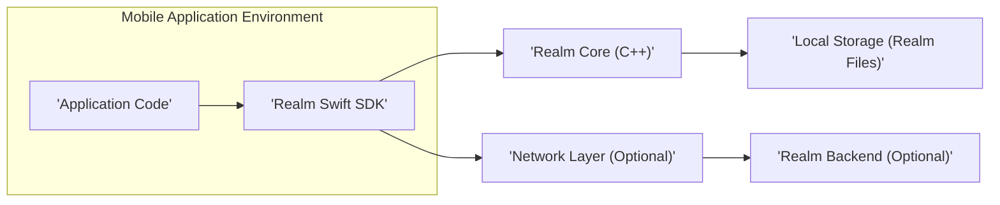
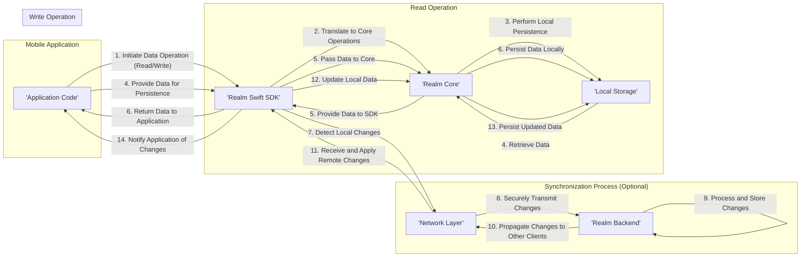

## Project Design Document: Realm Swift (Improved)

**1. Introduction**

This document provides an enhanced architectural overview of the Realm Swift SDK, building upon the previous version. It aims to offer a more detailed description of the key components, data flow, and interactions within the system, specifically tailored for threat modeling. This refined design document will serve as a more robust foundation for identifying and analyzing potential security vulnerabilities.

**2. Project Overview**

Realm Swift is a mobile database solution enabling efficient and reactive data management for applications on Apple platforms (iOS, macOS, tvOS, and watchOS). It distinguishes itself through features such as live data updates, robust offline capabilities, and optional seamless synchronization with backend services like Realm Cloud or Atlas App Services. This document primarily focuses on the client-side Realm Swift SDK architecture and its security implications.

**3. Goals**

*   Provide a more granular and detailed definition of the Realm Swift SDK's architecture and components.
*   Offer a clearer and more comprehensive illustration of the data flow within the SDK and its interactions with external systems.
*   Provide richer detail and context to facilitate more effective and targeted threat modeling.
*   Strictly adhere to the specified formatting guidelines (markdown, mermaid syntax with quoted node names, no markdown tables).

**4. Target Audience**

This document is intended for a technical audience, including:

*   Security engineers responsible for performing threat modeling and security assessments.
*   Software architects and developers involved in the design, implementation, and maintenance of applications using Realm Swift.
*   Quality assurance engineers focusing on security testing.
*   Anyone requiring a deep understanding of the Realm Swift architecture from a security perspective.

**5. High-Level Architecture**

*   **'Application Code'**: The custom Swift code developed for the mobile application that utilizes the Realm Swift SDK to interact with data. This layer initiates all Realm operations.
*   **'Realm Swift SDK'**: The Swift framework providing a type-safe and developer-friendly API for interacting with the underlying Realm database engine. It manages Realm instances, schemas, and transactions.
*   **'Realm Core (C++)'**: The core database engine implemented in C++, responsible for low-level database operations, data persistence, indexing, and ensuring ACID properties.
*   **'Local Storage (Realm Files)'**: Persistent storage on the device where Realm databases are stored as files. These files can be optionally encrypted.
*   **'Network Layer (Optional)'**:  Handles network communication for data synchronization with a backend service. This includes establishing connections, managing sessions, and transferring data.
*   **'Realm Backend (Optional)'**: A backend service (e.g., Realm Cloud, Atlas App Services) providing a centralized data store and synchronization capabilities across multiple devices and users.

**6. Detailed Component Description**

*   **'Application Code'**:
    *   Responsible for defining Realm object models (schemas).
    *   Initiates read, write, update, and delete operations on Realm objects.
    *   Handles user interface updates based on Realm data changes (using notifications).
    *   Manages user authentication and authorization logic if not entirely delegated to the backend.
    *   Potential security concerns include insecure data handling, improper error handling, and vulnerabilities in custom logic.

*   **'Realm Swift SDK'**:
    *   Provides APIs for:
        *   Opening and closing Realm instances.
        *   Creating, querying, and modifying Realm objects.
        *   Managing transactions for data consistency.
        *   Handling schema migrations when the data model changes.
        *   Subscribing to data change notifications.
        *   Configuring encryption for local Realm files.
        *   Initiating and managing synchronization with a backend.
    *   Security features include optional database encryption and adherence to secure coding practices within the SDK itself.
    *   Potential security concerns include vulnerabilities within the SDK that could be exploited by malicious applications or data.

*   **'Realm Core (C++)'**:
    *   Manages the underlying database engine, including:
        *   Data storage and retrieval mechanisms.
        *   Transaction management and concurrency control.
        *   Indexing and query optimization.
        *   File management and persistence.
        *   Encryption and decryption of data at rest (if enabled).
    *   Security is paramount at this level, focusing on preventing data corruption, unauthorized access, and ensuring data integrity.
    *   Potential security concerns include vulnerabilities in the C++ codebase that could lead to data breaches or denial of service.

*   **'Local Storage (Realm Files)'**:
    *   Realm data is persisted in platform-specific file formats on the device's file system.
    *   Files can be optionally encrypted using AES-256 encryption with a user-provided key or a key managed by the application.
    *   File permissions are managed by the operating system.
    *   Security concerns revolve around unauthorized access to these files, especially on rooted or jailbroken devices, and the secure management of encryption keys.

*   **'Network Layer (Optional)'**:
    *   Responsible for establishing and maintaining secure connections with the Realm Backend.
    *   Handles authentication and authorization with the backend service.
    *   Serializes and deserializes Realm data for transmission over the network.
    *   Implements conflict resolution strategies during data synchronization.
    *   Typically uses a proprietary protocol over WebSockets or HTTPS, often secured with TLS/SSL.
    *   Security concerns include man-in-the-middle attacks, replay attacks, and vulnerabilities in the synchronization protocol or implementation.

*   **'Realm Backend (Optional)'**:
    *   Provides a centralized and scalable data store for Realm data.
    *   Offers features like user authentication, access control rules, server-side functions (triggers, functions), and data connectors.
    *   Manages data synchronization across multiple clients.
    *   Security is a critical aspect, encompassing server-side security, access control policies, data encryption at rest and in transit, and protection against common web application vulnerabilities.

**7. Data Flow (Detailed)**

*   **Local Data Operations:**
    1. The **'Application Code'** initiates a data operation (read, write, update, delete) through the **'Realm Swift SDK'**.
    2. The **'Realm Swift SDK'** translates this operation into a set of instructions for the **'Realm Core'**.
    3. The **'Realm Core'** performs the necessary database operations, interacting with the **'Local Storage'**.
    4. **Read Operation:** Data is retrieved from **'Local Storage'** by **'Realm Core'**, passed to the **'Realm Swift SDK'**, and finally returned to the **'Application Code'**.
    5. **Write Operation:** Data to be persisted is passed from the **'Application Code'** to the **'Realm Swift SDK'**, then to **'Realm Core'**, which writes the data to the **'Local Storage'**.

*   **Synchronization Process (Optional):**
    6. The **'Realm Swift SDK'** detects local data changes.
    7. The **'Network Layer'** securely transmits these changes to the **'Realm Backend'**.
    8. The **'Realm Backend'** processes and stores the received changes.
    9. The **'Realm Backend'** propagates these changes to other connected clients.
    10. The **'Network Layer'** receives these remote changes.
    11. The **'Realm Swift SDK'** applies these changes to the local Realm.
    12. **'Realm Core'** updates the **'Local Storage'** with the synchronized data.
    13. The **'Realm Swift SDK'** notifies the **'Application Code'** of the data changes.

**8. Security Considerations (Detailed)**

This section provides a more detailed overview of potential security threats and considerations.

*   **Local Data Security:**
    *   **Threat:** Unauthorized access to sensitive data stored locally on the device.
        *   **Mitigation:** Enforce database encryption using strong encryption algorithms (AES-256). Implement secure key management practices, potentially leveraging platform-specific secure storage mechanisms (Keychain on iOS).
    *   **Threat:** Data leakage through insecure file permissions or vulnerabilities in the operating system.
        *   **Mitigation:** Adhere to platform-specific best practices for file storage and permissions. Educate users about the risks of rooted or jailbroken devices.
    *   **Threat:** Exposure of encryption keys if not handled securely.
        *   **Mitigation:** Avoid hardcoding encryption keys. Utilize secure storage mechanisms provided by the operating system. Consider using key derivation functions (KDFs) if deriving keys from user passwords.

*   **Network Security (If Synchronization is Enabled):**
    *   **Threat:** Man-in-the-middle (MITM) attacks intercepting sensitive data during transmission.
        *   **Mitigation:** Enforce HTTPS/TLS for all communication with the backend. Utilize certificate pinning to prevent attackers from using rogue certificates.
    *   **Threat:** Unauthorized access to the backend due to weak or compromised authentication credentials.
        *   **Mitigation:** Implement strong authentication mechanisms (e.g., multi-factor authentication). Follow secure password storage practices. Regularly rotate API keys or tokens.
    *   **Threat:** Replay attacks where captured network requests are re-sent to the backend.
        *   **Mitigation:** Implement nonce-based authentication or other mechanisms to prevent replay attacks.
    *   **Threat:** Injection attacks through data synchronized from untrusted sources.
        *   **Mitigation:** Implement robust input validation and sanitization on both the client and the backend.

*   **Application Security:**
    *   **Threat:** Code injection vulnerabilities through maliciously crafted Realm queries or data.
        *   **Mitigation:** Use parameterized queries or Realm's query language features that prevent code injection. Avoid constructing queries from user-provided input without proper sanitization.
    *   **Threat:** Data corruption or unexpected behavior due to invalid or malicious data written to the Realm.
        *   **Mitigation:** Implement client-side and server-side data validation to ensure data integrity.
    *   **Threat:** Improper handling of errors or exceptions potentially revealing sensitive information.
        *   **Mitigation:** Implement secure error handling and logging practices. Avoid displaying sensitive error details to the user.

*   **Backend Security (If Applicable):**
    *   **Threat:** Server-side vulnerabilities leading to data breaches or unauthorized access.
        *   **Mitigation:** Follow secure development practices for backend services. Regularly patch and update server software. Implement robust access control policies.
    *   **Threat:** Weak access control rules allowing unauthorized users to access or modify data.
        *   **Mitigation:** Implement a principle of least privilege for access control. Regularly review and update access rules.
    *   **Threat:** Data breaches due to insecure storage or handling of data on the backend.
        *   **Mitigation:** Encrypt data at rest and in transit on the backend. Implement strong security measures for the backend infrastructure.

**9. Future Considerations**

*   Detailed sequence diagrams illustrating specific use cases and their associated security implications.
*   Analysis of the security implications of different Realm Backend configurations (e.g., self-hosted vs. managed).
*   Exploration of advanced security features offered by Realm, such as fine-grained permissions.
*   Integration with mobile device management (MDM) solutions and their impact on Realm security.

**10. Conclusion**

This improved design document provides a more comprehensive and detailed architectural overview of the Realm Swift SDK, with a strong focus on security considerations. By elaborating on the components, data flow, and potential threats, this document serves as a more effective foundation for conducting thorough threat modeling activities. This enhanced understanding will contribute significantly to building secure and resilient applications using Realm Swift.
