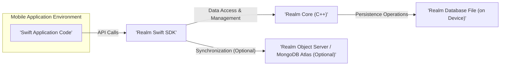
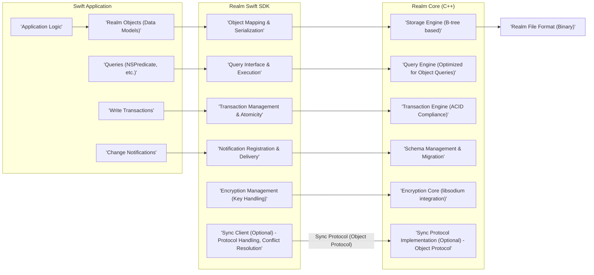

# Project Design Document: Realm Swift

**Version:** 1.1
**Date:** October 26, 2023
**Prepared By:** Gemini (AI Language Model)

## 1. Introduction

This document provides an enhanced and more detailed design overview of the Realm Swift project, an open-source mobile database. This document is specifically tailored to serve as a robust foundation for subsequent threat modeling activities. It meticulously outlines the system's architecture, dissects key components and their interactions, elaborates on data flow with greater precision, and provides a more in-depth analysis of security considerations.

## 2. Goals and Objectives

*   Deliver a comprehensive and granular architectural overview of Realm Swift, suitable for security analysis.
*   Clearly identify and describe key components, detailing their specific responsibilities and interactions within the system.
*   Illustrate the data flow within the system with a focus on potential security implications at each stage.
*   Thoroughly highlight security-relevant aspects of the design, including potential vulnerabilities and implemented safeguards.
*   Serve as a precise and actionable basis for identifying potential threats, attack vectors, and vulnerabilities during threat modeling exercises.

## 3. System Architecture

Realm Swift is a mobile database solution enabling developers to persist and manage data directly on devices. It offers features such as object-relational mapping, efficient querying, and real-time change notifications. Optionally, it provides robust data synchronization capabilities through integration with a backend like Realm Object Server or MongoDB Atlas.

### 3.1. High-Level Architecture

*   **Swift Application Code:** The custom application logic developed using the Swift programming language, which utilizes the Realm Swift SDK to interact with the database.
*   **Realm Swift SDK:** The Swift framework providing a developer-friendly API for interacting with the underlying Realm database engine. This includes functionalities for defining data models, performing queries, managing transactions, and handling synchronization.
*   **Realm Core (C++):** The foundational C++ database engine that handles the core functionalities of data storage, retrieval, indexing, and transaction management. It provides a performant and efficient storage layer.
*   **Realm Database File (on Device):** The local file system location where the persisted data resides on the user's device. This file contains the actual database contents.
*   **Realm Object Server / MongoDB Atlas (Optional):** The backend service responsible for facilitating data synchronization across multiple devices and users. It manages data consistency, conflict resolution, and user authentication for synchronized Realms.

### 3.2. Detailed Architecture

*   **Swift Application:**
    *   **Application Logic:** The core business logic of the application, responsible for data manipulation and user interaction.
    *   **Realm Objects (Data Models):** Swift classes that define the structure of the data to be stored in Realm. These objects conform to the `Object` protocol.
    *   **Queries (NSPredicate, etc.):** Mechanisms used to retrieve specific subsets of data from the Realm database based on defined criteria.
    *   **Write Transactions:**  Code blocks that encapsulate a series of data modification operations, ensuring atomicity (all or nothing).
    *   **Change Notifications:**  A system that allows the application to observe changes in Realm data and react accordingly.
*   **Realm Swift SDK:**
    *   **Object Mapping & Serialization:**  Handles the conversion between Swift `Realm` objects and the underlying binary representation used by Realm Core. This includes serialization and deserialization.
    *   **Query Interface & Execution:** Provides methods for constructing queries (using `NSPredicate` or Realm's query language) and executing them against the database.
    *   **Transaction Management & Atomicity:**  Manages the lifecycle of write transactions, ensuring that data modifications are performed atomically and consistently.
    *   **Notification Registration & Delivery:**  Handles the registration of notification listeners and the delivery of change notifications when data is modified.
    *   **Sync Client (Optional) - Protocol Handling, Conflict Resolution:**  Responsible for communicating with the backend synchronization service, managing the synchronization protocol, and resolving data conflicts that may arise from concurrent modifications.
    *   **Encryption Management (Key Handling):** Provides APIs for configuring and managing the encryption key used to protect the local Realm database file.
*   **Realm Core (C++):**
    *   **Storage Engine (B-tree based):** The core component responsible for the efficient storage and retrieval of data on disk, typically utilizing a B-tree data structure for indexing.
    *   **Query Engine (Optimized for Object Queries):**  Executes queries against the stored data, optimized for the specific structure of Realm objects and relationships.
    *   **Transaction Engine (ACID Compliance):** Ensures that all database transactions adhere to the ACID properties (Atomicity, Consistency, Isolation, Durability).
    *   **Schema Management & Migration:**  Handles the definition and evolution of the database schema, including mechanisms for migrating data when the schema changes.
    *   **Encryption Core (libsodium integration):** Implements the cryptographic algorithms used to encrypt and decrypt the database file, often leveraging a library like libsodium.
    *   **Sync Protocol Implementation (Optional) - Object Protocol:** Implements the specific protocol used for synchronizing data with the backend server, often referred to as the "Object Protocol."
*   **Realm File Format (Binary):** The specific binary format used to serialize and store data persistently on the device. This format is internal to Realm.

## 4. Key Components

*   **Realm Object:** A Swift class inheriting from `RealmSwift.Object` (or `Realm.Object` in older versions) that represents a persistent entity in the database. Properties of these objects are directly mapped to the database schema.
*   **Realm Instance:** Represents a connection to a specific Realm database. Applications interact with Realm through these instances, which are typically obtained using `Realm()`.
*   **Realm Configuration:** An object that defines the settings for a Realm instance, such as the database file path, in-memory identifier, encryption key, and synchronization configuration. Proper configuration is crucial for security and functionality.
*   **Write Transaction:** An explicit block of code initiated using `realm.write { ... }` that allows for atomic modifications to Realm objects. If an error occurs within the transaction, all changes are rolled back.
*   **Results:** A lazily-loaded, auto-updating collection of `Realm` objects returned by a query. `Results` are live views of the data, reflecting changes as they occur.
*   **Notifications:** Mechanisms for observing changes in `Realm` objects or collections. These can be object-level notifications or collection notifications on `Results`.
*   **Sync Agent (Optional):** The client-side component responsible for managing the synchronization process. This includes establishing connections with the server, uploading local changes, downloading remote changes, and handling conflict resolution.
*   **Encryption Key (Optional):** A 64-byte `Data` object used to encrypt the local Realm database file. This key must be kept secret and managed securely by the application.

## 5. Data Flow

### 5.1. Writing Data

1. The application creates a new instance of a `Realm` object or modifies an existing one within a write transaction.
2. The application initiates a write transaction using `realm.write { ... }`.
3. The Realm Swift SDK serializes the object changes into a format understood by Realm Core.
4. The Realm Core (C++) applies these changes within the transaction, ensuring ACID properties.
5. Upon successful commit of the transaction, the changes are persisted to the Realm database file on disk.
6. If synchronization is enabled, the Sync Agent detects the local changes and prepares them to be sent to the configured backend server (Realm Object Server or MongoDB Atlas). This involves packaging the changes according to the synchronization protocol.

### 5.2. Reading Data

1. The application constructs a query using methods provided by the Realm Swift SDK (e.g., `realm.objects(MyObject.self).filter("...")`).
2. The SDK translates this query into a format that can be executed by the Realm Core query engine.
3. The Realm Core (C++) query engine efficiently retrieves the matching data from the database file, potentially utilizing indexes for optimization.
4. The Realm Swift SDK materializes the retrieved data into `Realm` objects or returns a `Results` collection.
5. The application can then access the properties of these `Realm` objects.

### 5.3. Synchronization (Optional)

1. The Sync Agent on the client establishes a secure, persistent connection with the Realm Object Server or MongoDB Atlas.
2. Local changes (writes) are packaged and transmitted to the server using the defined synchronization protocol (Object Protocol).
3. The server receives these changes, validates them, and potentially broadcasts them to other connected clients that are subscribed to the same Realm.
4. Changes originating from the server are received by the client's Sync Agent.
5. The Sync Agent applies these remote changes to the local Realm database, potentially triggering change notifications within the application.
6. If concurrent modifications occur on different clients, the synchronization service employs conflict resolution strategies (e.g., last-write-wins, custom resolvers) to maintain data consistency. The outcome of conflict resolution is then synchronized back to all clients involved.

## 6. Security Considerations

*   **Local Data Encryption:** Realm Swift offers robust encryption of the local database file using AES-256 encryption via integration with `libsodium`.
    *   **Key Management Vulnerabilities:** The primary security risk lies in the secure generation, storage, and management of the 64-byte encryption key by the application developer. Storing the key insecurely (e.g., hardcoded, in shared preferences without proper protection) can completely negate the encryption.
    *   **Brute-force Attacks:** While the encryption algorithm is strong, if an attacker gains physical access to the device and can attempt offline brute-force attacks on the encryption key (if key derivation is weak or predictable), the data could be compromised.
*   **Authentication and Authorization (Sync):** When using Realm Sync, secure authentication is critical to verify the identity of users connecting to the backend.
    *   **Weak Authentication Methods:** Using weak or default authentication methods can allow unauthorized access to the synchronized data.
    *   **Authorization Bypass:** Improperly configured permissions on the Realm Object Server or MongoDB Atlas can lead to users accessing or modifying data they are not authorized to.
    *   **Session Management:**  Insecure session management (e.g., long-lived, easily guessable session tokens) can lead to account compromise.
*   **Data Integrity (Sync):** Realm Sync employs mechanisms to ensure data integrity during synchronization, but vulnerabilities can still arise.
    *   **Conflict Resolution Issues:**  While conflict resolution aims to maintain consistency, flaws in its implementation or configuration could lead to data loss or corruption.
    *   **Man-in-the-Middle Attacks:** If TLS/SSL is not properly enforced for all communication between the client and the server, attackers could intercept and potentially modify data in transit.
*   **Transport Security (Sync):** All communication between the Realm Swift client and the Realm Object Server or MongoDB Atlas *must* be encrypted using TLS/SSL to protect data in transit from eavesdropping and tampering.
    *   **TLS/SSL Downgrade Attacks:**  Ensure that the client and server configurations prevent downgrade attacks to weaker or insecure versions of TLS/SSL.
*   **Input Validation:** While Realm handles data serialization, the application must validate user inputs *before* storing them in the database to prevent data integrity issues and potential injection attacks (though less common in this context than in web applications).
*   **Code Security:** As an open-source project, the security of Realm Swift benefits from community scrutiny, but developers should still be mindful of potential vulnerabilities.
    *   **Third-Party Dependencies:**  Vulnerabilities in the dependencies used by Realm Swift (e.g., `libsodium`) could indirectly affect the security of applications using Realm. Regular updates and security audits of dependencies are important.
*   **Device Security:** The overall security of the data is also dependent on the security of the device itself.
    *   **Compromised Devices:** If a device is compromised (e.g., rooted/jailbroken, malware infection), the encryption key and the database itself could be at risk.
*   **Schema Security:** The design of the database schema can impact security.
    *   **Storing Sensitive Data Unnecessarily:** Avoid storing sensitive information that is not absolutely required.
    *   **Lack of Data Sanitization:** Ensure that sensitive data is properly sanitized or masked when necessary.
*   **Vulnerability Management:**  It's crucial to stay informed about reported security vulnerabilities in Realm Swift and to apply necessary updates and patches promptly.

## 7. Deployment

Realm Swift is typically deployed as a framework embedded directly within the mobile application's bundle. The Realm database file resides within the application's private data container on the device. When utilizing Realm Sync, a separate instance of the Realm Object Server or a MongoDB Atlas App Services application needs to be deployed and properly configured to handle backend synchronization and user management.

## 8. Future Considerations

*   Exploration of hardware-backed key storage options for enhanced encryption key security.
*   Implementation of more granular and role-based access control mechanisms within the local database.
*   Enhanced security auditing features to track data access and modifications.
*   Deeper integration with platform-specific security features and APIs.
*   Continued focus on addressing and mitigating potential vulnerabilities identified through ongoing security assessments and community feedback.

This enhanced document provides a more detailed and security-focused understanding of the Realm Swift project's design. This information is essential for conducting a comprehensive threat model to identify potential security vulnerabilities, assess associated risks, and design appropriate mitigation strategies.