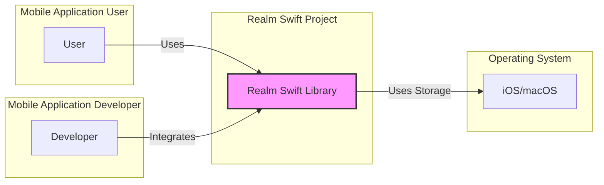
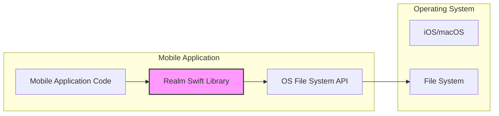
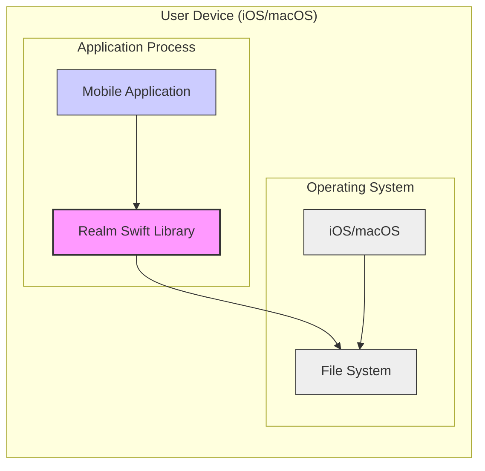

# BUSINESS POSTURE

The Realm Swift project provides a mobile database solution designed for building offline-first and reactive mobile applications. It aims to simplify local data persistence and synchronization for mobile developers, offering a developer-friendly API and efficient data management.

Business Priorities and Goals:
- Provide a performant and reliable mobile database solution for iOS and macOS applications.
- Offer a developer-friendly API to reduce development time and complexity related to data persistence.
- Enable offline-first application architectures by providing robust local data storage.
- Support data synchronization capabilities (potentially with Realm Cloud or similar services, though not explicitly stated in the repository itself, it's a common use case for mobile databases).
- Maintain an active open-source community and project.

Business Risks:
- Data breaches due to vulnerabilities in the database library or its usage.
- Data corruption or loss due to software bugs or improper handling of data.
- Performance issues leading to poor user experience and application instability.
- Lack of developer adoption if the library is perceived as insecure, unreliable, or difficult to use.
- Supply chain risks if dependencies are compromised or vulnerabilities are introduced during the build process.

# SECURITY POSTURE

Existing Security Controls:
- security control: Code review process for contributions (implicitly through GitHub pull requests). Implemented in: GitHub repository contribution guidelines and workflow.
- security control: Reliance on operating system level security features for data storage protection (file system permissions, encryption at rest if enabled by the OS). Implemented in: Operating system level.
- accepted risk:  Security vulnerabilities in dependencies. Accepted risk: Assumed to be managed reactively through dependency updates.
- accepted risk:  Insecure coding practices by developers using the library. Accepted risk: Developers are responsible for secure usage of the library.
- accepted risk:  Lack of built-in authentication and authorization mechanisms within Realm Swift itself. Accepted risk: Assumed to be handled at the application level.

Recommended Security Controls:
- recommended security control: Implement automated Static Application Security Testing (SAST) in the CI/CD pipeline to identify potential code vulnerabilities.
- recommended security control: Implement automated Dependency Scanning in the CI/CD pipeline to identify vulnerabilities in third-party libraries.
- recommended security control: Provide security guidelines and best practices documentation for developers using Realm Swift, focusing on secure data handling, input validation, and encryption.
- recommended security control: Establish a clear vulnerability reporting and response process for the project.
- recommended security control: Consider providing optional encryption at rest within Realm Swift itself, beyond OS-level encryption, for enhanced control.

Security Requirements:
- Authentication: Realm Swift itself does not handle user authentication. Applications using Realm Swift are responsible for implementing their own authentication mechanisms to verify user identity.
- Authorization: Realm Swift provides a permissions system to control access to Realm objects. Applications should utilize these permissions to enforce authorization policies and ensure users only access data they are allowed to.
- Input Validation: Realm Swift relies on developers to perform input validation on data being stored in the database. Applications must validate data to prevent injection attacks and ensure data integrity.
- Cryptography: Realm Swift supports encryption at rest using platform-level encryption features. Applications requiring stronger encryption or encryption in transit need to implement these features at the application level or rely on OS capabilities.

# DESIGN

## C4 CONTEXT



Context Diagram Elements:

- Element:
  - Name: User
  - Type: Person
  - Description: End-user of mobile applications that utilize Realm Swift for data storage.
  - Responsibilities: Interacts with mobile applications, generating data that is persisted using Realm Swift.
  - Security controls: Device-level security controls (passcode, biometrics), application-level authentication and authorization.

- Element:
  - Name: Developer
  - Type: Person
  - Description: Software developer who integrates the Realm Swift library into mobile applications.
  - Responsibilities: Uses Realm Swift API to manage data persistence, implements application logic, and ensures secure usage of the library.
  - Security controls: Secure development practices, code review, static analysis tools.

- Element:
  - Name: Realm Swift Library
  - Type: Software System
  - Description: Open-source mobile database library for iOS and macOS, providing local data persistence and management.
  - Responsibilities: Provides API for data storage, retrieval, and querying; manages data persistence on the device; enforces basic authorization through permissions.
  - Security controls: Code review, vulnerability scanning (recommended), input validation (developer responsibility), authorization mechanisms within Realm Swift.

- Element:
  - Name: Operating System (iOS/macOS)
  - Type: Software System
  - Description: Underlying operating system on mobile devices and macOS computers where applications using Realm Swift are deployed.
  - Responsibilities: Provides file system for data storage, manages process isolation, offers system-level security features like file encryption.
  - Security controls: File system permissions, operating system updates, encryption at rest (optional, OS-level).

## C4 CONTAINER



Container Diagram Elements:

- Element:
  - Name: Mobile Application Code
  - Type: Application
  - Description: The custom application code developed by mobile developers, written in Swift or Objective-C, that utilizes the Realm Swift library.
  - Responsibilities: Implements application logic, user interface, interacts with Realm Swift API for data management, handles user authentication and authorization (application-level).
  - Security controls: Application-level authentication, authorization, input validation, secure coding practices, code review, static analysis (recommended).

- Element:
  - Name: Realm Swift Library
  - Type: Library
  - Description: The Realm Swift library, a container providing the core database functionality. It's integrated directly into the mobile application process.
  - Responsibilities: Provides in-process database functionality, manages data persistence in files, offers query API, enforces Realm-level permissions.
  - Security controls: Realm-level authorization, input validation (within Realm library), memory management, vulnerability scanning (recommended), secure build process (recommended).

- Element:
  - Name: OS File System API
  - Type: System Interface
  - Description: Operating System APIs used by Realm Swift to interact with the file system for data storage.
  - Responsibilities: Provides interface for file creation, reading, writing, and deletion. Enforces file system permissions.
  - Security controls: File system permissions enforced by the OS, access control to file system APIs by the OS.

- Element:
  - Name: File System
  - Type: Data Store
  - Description: The file system provided by the operating system where Realm Swift stores database files.
  - Responsibilities: Persistently stores data, manages file access permissions, potentially provides encryption at rest (OS-level).
  - Security controls: File system permissions, encryption at rest (OS-level), access control lists.

## DEPLOYMENT

Deployment Architecture: Single Device Deployment



Deployment Diagram Elements:

- Element:
  - Name: User Device (iOS/macOS)
  - Type: Infrastructure
  - Description: A user's mobile device (iPhone, iPad) or macOS computer where the mobile application is installed and runs.
  - Responsibilities: Provides the execution environment for the mobile application and Realm Swift, including CPU, memory, and storage.
  - Security controls: Device passcode/biometrics, operating system security updates, app sandboxing, device encryption.

- Element:
  - Name: Operating System (iOS/macOS)
  - Type: Software Environment
  - Description: The operating system running on the user device, providing system services and security features.
  - Responsibilities: Manages processes, file system access, enforces security policies, provides system-level encryption.
  - Security controls: Operating system security features (ASLR, DEP), kernel hardening, security updates, file system permissions, encryption at rest (optional, OS-level).

- Element:
  - Name: File System
  - Type: Data Store
  - Description: The local file system on the user device where Realm Swift database files are stored.
  - Responsibilities: Persistent storage of Realm database files, managing file access permissions.
  - Security controls: File system permissions, encryption at rest (OS-level), access control lists.

- Element:
  - Name: Application Process
  - Type: Software Runtime
  - Description: The process in which the mobile application and the Realm Swift library are executed.
  - Responsibilities: Executes application code and Realm Swift library code, manages memory and resources for the application.
  - Security controls: Process isolation, memory protection, application sandbox (iOS).

- Element:
  - Name: Mobile Application
  - Type: Software Component
  - Description: The deployed mobile application package containing the application code and integrated Realm Swift library.
  - Responsibilities: Provides application functionality to the user, interacts with Realm Swift for data management.
  - Security controls: Application signing, code obfuscation (optional), application-level security features.

- Element:
  - Name: Realm Swift Library
  - Type: Software Component
  - Description: The Realm Swift library deployed as part of the mobile application package.
  - Responsibilities: Provides database functionality within the application process.
  - Security controls: Included in application security review, benefits from application sandbox.

## BUILD

Build Process Diagram:

```mermaid
graph LR
    subgraph "Developer Workstation"
        DEV[Developer]
        CODE[Source Code (GitHub)]
    end
    subgraph "CI/CD System (e.g., GitHub Actions)"
        BC[Build Container]
        BUILD[Build Process (Swift Package Manager, Xcode Build)]
        SAST[SAST Scanner (Recommended)]
        DEP_SCAN[Dependency Scanner (Recommended)]
        ARTIFACTS[Build Artifacts (Realm Swift Library)]
    end
    subgraph "Package Repository (e.g., GitHub Releases, CocoaPods)"
        REPO[Package Repository]
    end
    DEV --> CODE
    CODE --> BUILD
    BUILD --> SAST
    BUILD --> DEP_SCAN
    BUILD --> ARTIFACTS
    ARTIFACTS --> REPO
    style ARTIFACTS fill:#ccf,stroke:#333,stroke-width:1px
    style BUILD fill:#f9f,stroke:#333,stroke-width:2px
```

Build Process Description:

1. Developer (DEV) writes code and commits it to the Source Code repository (CODE) on GitHub.
2. CI/CD System (e.g., GitHub Actions) is triggered by code changes.
3. A Build Container (BC) is provisioned in the CI/CD environment.
4. The Build Process (BUILD) is executed within the container, using Swift Package Manager and Xcode Build to compile the Realm Swift library.
5. Recommended Security Checks:
    - Static Application Security Testing (SAST) Scanner (SAST) analyzes the source code for potential vulnerabilities.
    - Dependency Scanner (DEP_SCAN) checks for known vulnerabilities in third-party dependencies.
6. Build Artifacts (ARTIFACTS), including the compiled Realm Swift library, are produced.
7. Build Artifacts are published to a Package Repository (REPO) such as GitHub Releases or CocoaPods, making them available for developers to integrate into their mobile applications.

Build Process Security Controls:

- security control: Source code repository (GitHub) with access controls and version history. Implemented in: GitHub.
- security control: Build automation using CI/CD system (e.g., GitHub Actions). Implemented in: CI/CD configuration.
- security control: Secure build environment (Build Container) with controlled access and hardened configuration. Implemented in: CI/CD infrastructure.
- security control: Code compilation and linking using Swift Package Manager and Xcode Build. Implemented in: Build scripts and tools.
- recommended security control: Static Application Security Testing (SAST) integrated into the build pipeline. Implemented in: CI/CD pipeline configuration.
- recommended security control: Dependency Scanning integrated into the build pipeline. Implemented in: CI/CD pipeline configuration.
- security control: Signing of build artifacts (if applicable for distribution). Implemented in: Build scripts and distribution process.
- security control: Access control to the Package Repository. Implemented in: Package repository access management.

# RISK ASSESSMENT

Critical Business Processes:
- Providing reliable and secure data persistence for mobile applications.
- Maintaining developer trust and adoption of the Realm Swift library.
- Ensuring the integrity and availability of the Realm Swift library.

Data to Protect:
- Source code of the Realm Swift library (intellectual property). Sensitivity: High.
- Build artifacts (Realm Swift library releases). Sensitivity: Medium (integrity and availability).
- User data stored in applications using Realm Swift. Sensitivity: Varies depending on the application, potentially high (personal data, financial data, etc.).

Data Sensitivity:
- Source code: Confidential, Integrity, Availability.
- Build artifacts: Integrity, Availability.
- User data in applications: Confidentiality, Integrity, Availability (sensitivity level depends on the application context).

# QUESTIONS & ASSUMPTIONS

BUSINESS POSTURE:
- Question: What is the primary target audience for Realm Swift? Is it all mobile developers or specific industries/application types?
- Assumption: Realm Swift is intended for a broad range of mobile application developers needing local data persistence.
- Question: What is the business model for Realm Swift? Is it purely open-source, or are there commercial offerings (support, enterprise features)?
- Assumption: Realm Swift is primarily an open-source project, potentially with commercial support options available separately (though not evident from the repository itself).

SECURITY POSTURE:
- Question: Are there any specific security features planned for future releases of Realm Swift beyond the current capabilities?
- Assumption: Security enhancements are an ongoing consideration for the project, but specific future features are not detailed in the provided input.
- Question: What are the assumptions about the security posture of applications using Realm Swift? Are developers expected to handle all application-level security, or are there built-in features to assist?
- Assumption: Developers are primarily responsible for application-level security, while Realm Swift focuses on providing a secure and reliable database library within its scope.
- Question: Is there a documented vulnerability reporting and response process for Realm Swift?
- Assumption: A standard open-source vulnerability reporting process is expected, likely through GitHub security advisories, but explicit documentation was not provided in the input.

DESIGN:
- Question: Are there any plans to support cloud synchronization or backend integration directly within Realm Swift itself (beyond potential application-level implementations)?
- Assumption: Cloud synchronization is likely considered an application-level feature or handled by separate Realm products (like Realm Cloud, if still relevant), and not directly within the core Realm Swift library.
- Question: What are the performance and security trade-offs considered in the design of Realm Swift, particularly regarding encryption and data access control?
- Assumption: Performance and ease of use are prioritized, with security features being implemented where they do not significantly impact these aspects, while relying on developers to implement application-specific security measures.
- Question: Are there alternative deployment scenarios for Realm Swift beyond single-device mobile applications (e.g., embedded systems, server-side usage)?
- Assumption: Realm Swift is primarily designed for mobile and macOS applications running on user devices, with limited or no support for server-side or embedded system deployments directly from this library.