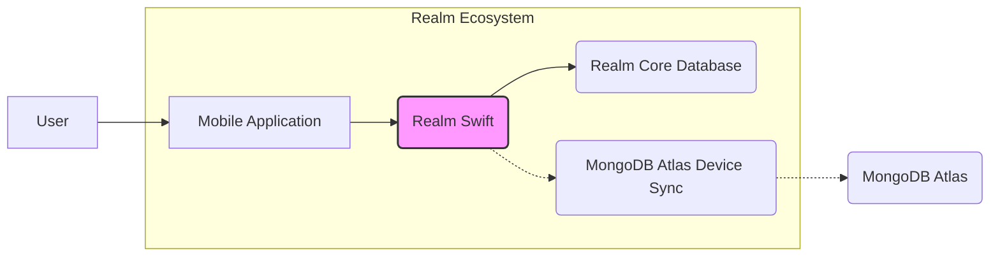
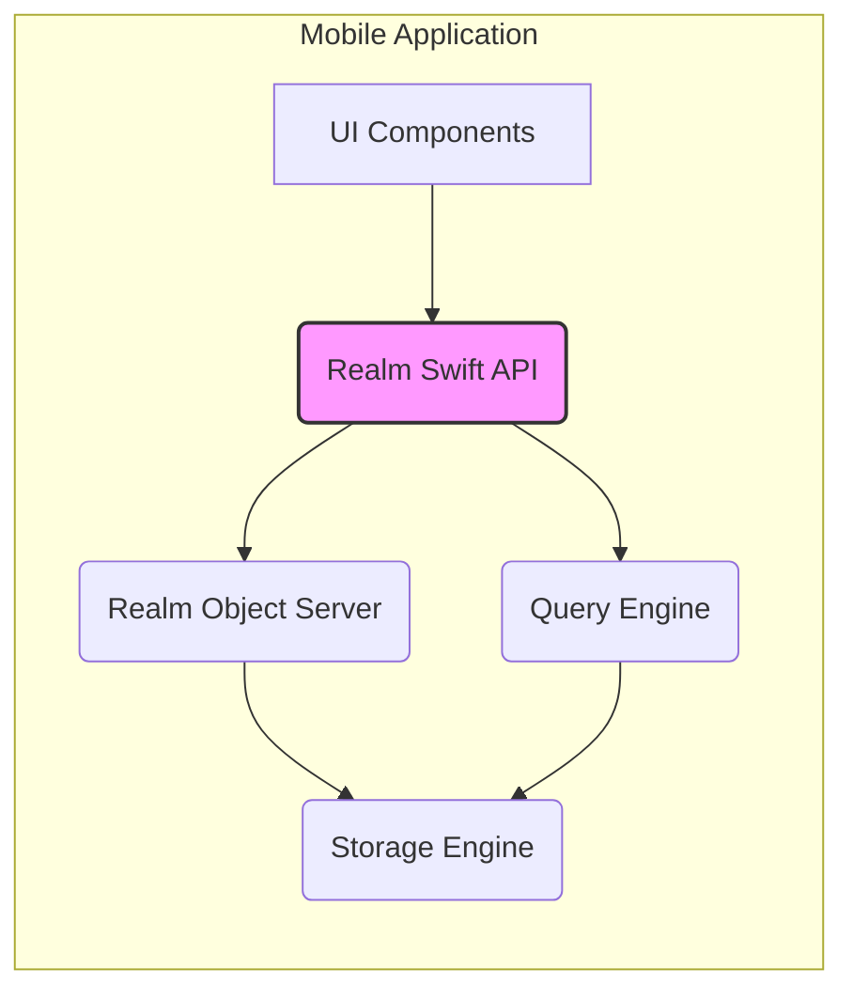
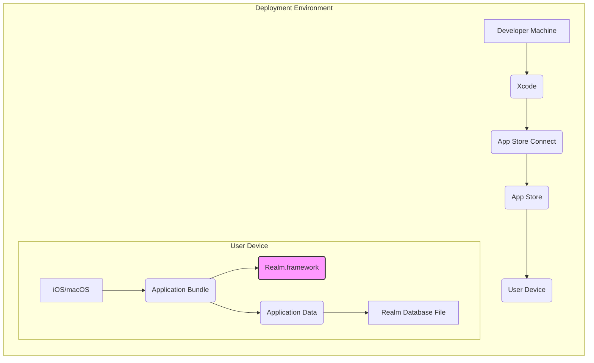
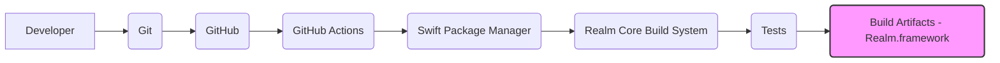

Okay, let's create a design document for the Realm Swift project.

# BUSINESS POSTURE

Realm Swift is a mobile database solution designed as an alternative to SQLite and Core Data.  It's part of the broader MongoDB Realm ecosystem, focusing on local data persistence and synchronization with MongoDB Atlas Device Sync. The business priorities appear to be:

*   Developer Productivity: Providing a simple, intuitive, and performant API for developers to manage local data in their mobile applications.  This reduces development time and complexity.
*   Offline Functionality: Enabling applications to function seamlessly even without a network connection, a critical feature for many mobile use cases.
*   Data Synchronization: Offering a robust and reliable synchronization mechanism (via MongoDB Atlas Device Sync) to keep local data consistent with a cloud backend.
*   Cross-Platform Support: While this document focuses on Realm Swift (for iOS/macOS), the broader Realm project supports multiple platforms (Android/Kotlin, .NET, Node.js, React Native), indicating a priority on reaching a wide developer audience.
*   Performance: Offering a fast and efficient database solution that minimizes resource consumption on mobile devices.
*   Open Source: The project is open source, fostering community contributions and transparency.

Business Goals:

*   Increase adoption of Realm as the preferred mobile database solution.
*   Drive usage of MongoDB Atlas Device Sync as the backend for Realm-based applications.
*   Maintain a high level of developer satisfaction and community engagement.
*   Provide a reliable and secure data management solution for mobile applications.

Most Important Business Risks:

*   Data Loss/Corruption:  Any vulnerability leading to data loss or corruption on the device would severely damage the reputation and trustworthiness of Realm.
*   Security Breaches:  Unauthorized access to sensitive data stored in Realm databases could have significant legal and financial consequences.
*   Synchronization Failures:  Issues with the synchronization mechanism could lead to data inconsistencies and application malfunctions.
*   Performance Bottlenecks:  Poor performance could lead to negative user experiences and drive developers to alternative solutions.
*   Lack of Adoption:  Failure to attract and retain developers would hinder the growth and sustainability of the project.
*   Supply Chain Attacks: Vulnerabilities introduced through compromised dependencies could expose users to significant risks.

# SECURITY POSTURE

Existing Security Controls:

*   security control: Encryption at Rest: Realm provides optional encryption at rest using AES-256 + SHA-2. The encryption key is managed using the platform's Keychain (iOS/macOS). (Described in Realm documentation and source code).
*   security control: Access Control: Realm files are protected by standard operating system file permissions. On iOS/macOS, this means they are only accessible by the application that created them. (Implicit in the OS and documented by Apple).
*   security control: Secure Development Practices: The project appears to follow secure coding practices, including code reviews and static analysis (evident from the GitHub repository and contribution guidelines).
*   security control: Dependency Management: The project uses Swift Package Manager, which includes integrity checking of downloaded packages. (Implicit in Swift Package Manager).
*   security control: Regular Updates: The project is actively maintained, with regular releases addressing bug fixes and security vulnerabilities. (Evident from the GitHub repository).
*   security control: Fuzz Testing: The core Realm database engine (written in C++) undergoes extensive fuzz testing. (Mentioned in Realm documentation).

Accepted Risks:

*   accepted risk: No built-in user authentication/authorization within Realm itself: Realm focuses on local data storage and leaves user authentication and authorization to the application layer or the backend synchronization service (MongoDB Atlas Device Sync).
*   accepted risk: Reliance on platform security: Realm relies on the underlying operating system (iOS/macOS) for key management (Keychain) and file system security. Any vulnerabilities in these platform components could impact Realm's security.
*   accepted risk: Limited input validation within Realm Swift: Realm Swift primarily acts as a binding layer to the core C++ database. While it performs some type checking, extensive input validation is often left to the application layer or the core database engine.

Recommended Security Controls:

*   security control: Implement more comprehensive input validation within Realm Swift to prevent potential injection vulnerabilities or data corruption issues.
*   security control: Provide detailed security guidance and best practices in the documentation, specifically addressing common security pitfalls and how to avoid them.
*   security control: Conduct regular security audits and penetration testing to identify and address potential vulnerabilities.
*   security control: Implement a Software Bill of Materials (SBOM) to track all dependencies and their versions, making it easier to identify and respond to vulnerabilities.
*   security control: Consider integrating with platform-specific security features, such as biometric authentication, to enhance data protection.

Security Requirements:

*   Authentication: Not directly handled by Realm Swift. Relies on application-level or backend (MongoDB Atlas Device Sync) authentication.
*   Authorization: Not directly handled by Realm Swift. Relies on application-level or backend (MongoDB Atlas Device Sync) authorization.
*   Input Validation:
    *   Realm Swift should perform basic type checking to ensure data conforms to the defined schema.
    *   More comprehensive input validation (e.g., range checks, format validation) should be implemented in the application layer or the core database engine.
    *   Sanitize all user inputs to prevent injection attacks.
*   Cryptography:
    *   Realm should continue to use strong encryption algorithms (AES-256 + SHA-2) for encryption at rest.
    *   Encryption keys should be securely managed using the platform's Keychain.
    *   Regularly review and update cryptographic implementations to address any newly discovered vulnerabilities.

# DESIGN

## C4 CONTEXT

C4 Context Element List:

*   Element:
    *   Name: User
    *   Type: Person
    *   Description: The user of the mobile application.
    *   Responsibilities: Interacts with the mobile application, providing input and receiving output.
    *   Security controls: None directly implemented by Realm. Relies on application-level security.

*   Element:
    *   Name: Mobile Application
    *   Type: Software System
    *   Description: The application built using Realm Swift.
    *   Responsibilities: Provides the user interface, handles user interactions, and manages data using Realm Swift.
    *   Security controls: Implements application-level security, including authentication, authorization, and input validation.

*   Element:
    *   Name: Realm Swift
    *   Type: Software System
    *   Description: The Swift library providing an API for interacting with the Realm Core Database.
    *   Responsibilities: Provides a convenient and type-safe way to access and manipulate data stored in Realm.
    *   Security controls: Encryption at rest, basic type checking.

*   Element:
    *   Name: Realm Core Database
    *   Type: Software System
    *   Description: The underlying C++ database engine that stores and manages data.
    *   Responsibilities: Handles data storage, retrieval, querying, and transactions.
    *   Security controls: Encryption at rest, fuzz testing.

*   Element:
    *   Name: MongoDB Atlas Device Sync
    *   Type: Software System
    *   Description: A service that synchronizes data between Realm mobile databases and MongoDB Atlas.
    *   Responsibilities: Handles data synchronization, conflict resolution, and offline access.
    *   Security controls: Authentication, authorization, encryption in transit, encryption at rest (on MongoDB Atlas).

*   Element:
    *   Name: MongoDB Atlas
    *   Type: Software System
    *   Description: A cloud-based database service provided by MongoDB.
    *   Responsibilities: Stores and manages data synchronized from Realm mobile databases.
    *   Security controls: Authentication, authorization, encryption in transit, encryption at rest, network security, access controls.

## C4 CONTAINER

C4 Container Element List:

*   Element:
    *   Name: UI Components
    *   Type: Container
    *   Description: The user interface elements of the mobile application.
    *   Responsibilities: Display data to the user and handle user interactions.
    *   Security controls: None directly implemented by Realm. Relies on application-level security.

*   Element:
    *   Name: Realm Swift API
    *   Type: Container
    *   Description: The public API of the Realm Swift library.
    *   Responsibilities: Provides methods for creating, reading, updating, and deleting data in Realm.
    *   Security controls: Basic type checking.

*   Element:
    *   Name: Realm Object Server
    *   Type: Container
    *   Description: Handles object-level operations and manages object relationships.
    *   Responsibilities: Manages object graphs, relationships, and notifications.
    *   Security controls: None.

*   Element:
    *   Name: Query Engine
    *   Type: Container
    *   Description: Processes queries and retrieves data from the storage engine.
    *   Responsibilities: Executes queries, filters data, and returns results.
    *   Security controls: None.

*   Element:
    *   Name: Storage Engine
    *   Type: Container
    *   Description: Manages the underlying data storage and retrieval.
    *   Responsibilities: Handles data persistence, transactions, and encryption.
    *   Security controls: Encryption at rest.

## DEPLOYMENT

Possible Deployment Solutions:

1.  **Standard iOS/macOS Application Deployment:** The Realm Swift library is embedded within the application bundle and deployed through the App Store or other distribution mechanisms. This is the most common and recommended approach.
2.  **Embedded Framework:** Realm Swift can be packaged as a framework and embedded within other applications or frameworks.
3.  **Command-Line Tools:** Realm Swift can be used in command-line tools for tasks such as data migration or database management.

Chosen Deployment Solution (Standard iOS/macOS Application Deployment):

Deployment Element List:

*   Element:
    *   Name: Developer Machine
    *   Type: Node
    *   Description: The developer's computer used for building and signing the application.
    *   Responsibilities: Hosts the development environment, source code, and build tools.
    *   Security controls: Standard developer machine security practices.

*   Element:
    *   Name: Xcode
    *   Type: Software
    *   Description: The integrated development environment (IDE) for building iOS/macOS applications.
    *   Responsibilities: Compiles the code, links libraries, and creates the application bundle.
    *   Security controls: Code signing, build settings security.

*   Element:
    *   Name: App Store Connect
    *   Type: Software
    *   Description: Apple's platform for managing and distributing applications.
    *   Responsibilities: Handles app submission, review, and distribution.
    *   Security controls: Apple's security infrastructure and review process.

*   Element:
    *   Name: App Store
    *   Type: Software
    *   Description: Apple's online store for distributing applications to users.
    *   Responsibilities: Provides a secure platform for users to download and install applications.
    *   Security controls: Apple's security infrastructure.

*   Element:
    *   Name: User Device
    *   Type: Node
    *   Description: The user's iPhone, iPad, or Mac.
    *   Responsibilities: Runs the application and stores its data.
    *   Security controls: iOS/macOS security features, including sandboxing, code signing verification, and data protection.

*   Element:
    *   Name: iOS/macOS
    *   Type: Software
    *   Description: The operating system running on the user's device.
    *   Responsibilities: Provides the runtime environment for the application.
    *   Security controls: Sandboxing, code signing verification, data protection, keychain.

*   Element:
    *   Name: Application Bundle
    *   Type: Container
    *   Description: The packaged application containing the executable code, resources, and embedded frameworks.
    *   Responsibilities: Contains all the necessary components to run the application.
    *   Security controls: Code signing.

*   Element:
    *   Name: Realm.framework
    *   Type: Container
    *   Description: The embedded Realm Swift framework.
    *   Responsibilities: Provides the Realm database functionality.
    *   Security controls: Encryption at rest (if enabled).

*   Element:
    *   Name: Application Data
    *   Type: Container
    *   Description: The directory where the application stores its data.
    *   Responsibilities: Contains the Realm database file and other application-specific data.
    *   Security controls: Operating system file permissions.

*   Element:
    *   Name: Realm Database File
    *   Type: Container
    *   Description: The file containing the Realm database.
    *   Responsibilities: Stores the application's data.
    *   Security controls: Encryption at rest (if enabled), operating system file permissions.

## BUILD

Build Process Description:

1.  **Developer:** The developer writes code and commits changes to a local Git repository.
2.  **Git:** The local Git repository stores the source code and tracks changes.
3.  **GitHub:** The code is pushed to a remote GitHub repository, which serves as the central code repository and triggers the build process.
4.  **GitHub Actions:** GitHub Actions is used as the CI/CD system. It automatically triggers builds and tests on every push to the repository.
5.  **Swift Package Manager:** Swift Package Manager is used to manage dependencies, including the Realm Core library.
6.  **Realm Core Build System:** The Realm Core library (written in C++) has its own build system (using CMake) that is invoked as part of the overall build process.
7.  **Tests:** A comprehensive suite of tests (unit tests, integration tests, and potentially fuzz tests) is executed to ensure the quality and stability of the build.
8.  **Build Artifacts:** The build process produces the Realm.framework, which is the final product that can be embedded in iOS/macOS applications.

Security Controls in Build Process:

*   security control: **Dependency Management:** Swift Package Manager performs integrity checks on downloaded packages, reducing the risk of compromised dependencies.
*   security control: **Automated Testing:** GitHub Actions ensures that tests are run automatically on every code change, catching potential issues early.
*   security control: **Static Analysis:** The project uses linters and static analysis tools to identify potential code quality and security issues.
*   security control: **Code Review:** All code changes are reviewed by other developers before being merged, reducing the risk of introducing vulnerabilities.
*   security control: **Fuzz Testing:** The core Realm database engine undergoes fuzz testing, which helps to identify potential security vulnerabilities related to unexpected inputs.

# RISK ASSESSMENT

Critical Business Processes to Protect:

*   Data Persistence: Ensuring that user data is reliably stored and retrieved.
*   Data Synchronization: Maintaining data consistency between the mobile device and the cloud backend (if using MongoDB Atlas Device Sync).
*   Application Functionality: Ensuring that the application functions correctly and without errors.

Data to Protect and Sensitivity:

*   User Data: This can range from non-sensitive data (e.g., application preferences) to highly sensitive data (e.g., personal information, financial data, health data). The sensitivity depends on the specific application using Realm.
*   Realm Database File: This file contains all the data stored in the Realm database. Its sensitivity is directly related to the sensitivity of the user data it contains.
*   Encryption Keys (if encryption is enabled): These keys are used to encrypt and decrypt the Realm database. They are highly sensitive and must be protected at all costs.

# QUESTIONS & ASSUMPTIONS

Questions:

*   What specific types of user data are expected to be stored in Realm databases by applications using Realm Swift? This will help to better assess the sensitivity of the data and the required security controls.
*   What is the expected usage of MongoDB Atlas Device Sync? Understanding the synchronization requirements will help to identify potential security risks related to data synchronization.
*   Are there any specific compliance requirements (e.g., GDPR, HIPAA) that need to be considered?
*   What level of security auditing and penetration testing is currently performed?
*   What is the process for handling security vulnerabilities reported by external researchers?

Assumptions:

*   BUSINESS POSTURE: It's assumed that the primary business goal is to provide a reliable and performant mobile database solution that is easy to use and integrates well with the MongoDB ecosystem.
*   SECURITY POSTURE: It's assumed that the project follows secure coding practices and that the core Realm database engine is well-tested and secure. It's also assumed that developers using Realm Swift will implement appropriate application-level security measures.
*   DESIGN: It's assumed that the standard iOS/macOS application deployment model will be used. It's also assumed that GitHub Actions is the primary CI/CD system.