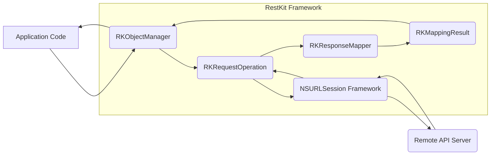
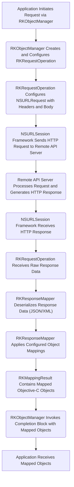

# Project Design Document: RestKit

**Version:** 1.1
**Date:** October 26, 2023
**Prepared By:** AI Software Architect

## 1. Introduction

This document provides an enhanced and detailed design overview of the RestKit framework. It elaborates on the key components, functionalities, and data flow within the framework. This document is intended to serve as a robust foundation for subsequent threat modeling activities, offering a comprehensive understanding of RestKit's internal workings.

RestKit is a mature Objective-C framework designed to streamline interactions with RESTful web services. It offers a suite of features including robust object mapping, efficient network request management, and flexible data caching, significantly simplifying the process for iOS and macOS developers to consume and interact with remote APIs.

## 2. Goals and Objectives

The fundamental goals driving the design of RestKit are:

* **Abstraction of Complexity:** To effectively hide the intricate details of manual HTTP request construction, response parsing, and data serialization.
* **Automated Object Mapping:** To provide a declarative mechanism for automatically mapping JSON or XML responses to corresponding Objective-C objects, thereby minimizing repetitive and error-prone boilerplate code.
* **Simplified and Consistent Networking:** To offer a clean, intuitive, and consistent API for initiating and managing various types of network requests.
* **Integrated Caching Mechanisms:** To incorporate built-in caching capabilities for enhancing application performance and enabling offline functionality.
* **Support for Authentication Protocols:** To provide extensible support for implementing common authentication schemes used in RESTful APIs.

## 3. High-Level Architecture

The following diagram illustrates the high-level architectural layers of RestKit and its interaction points with a consuming application and a remote API server.

**Key Components:**

* **Application Code:** The specific iOS or macOS application that integrates and utilizes the functionalities provided by the RestKit framework.
* **`RKObjectManager`:**  Serves as the primary interface for interacting with RestKit. It orchestrates request creation, manages response handling processes, and oversees object mapping configurations.
* **`RKRequestOperation`:**  Represents and encapsulates the execution lifecycle of a single network request. It leverages Apple's `NSURLSession` framework for the underlying network communication tasks.
* **`NSURLSession Framework`:** Apple's foundational framework responsible for performing URL requests and managing network connections. RestKit relies heavily on this for the actual network transport layer.
* **Remote API Server:** The external RESTful web service that the application interacts with to retrieve or manipulate data.
* **`RKResponseMapper`:** The component responsible for transforming raw response data (typically in JSON or XML format) into usable Objective-C objects based on pre-defined mapping configurations.
* **`RKMappingResult`:**  A container object that holds the outcome of the object mapping process, including the successfully mapped objects and any errors encountered during the mapping.

## 4. Detailed Component Design

This section provides a more in-depth look at the responsibilities and features of the core components within RestKit.

### 4.1. `RKObjectManager`

* **Core Responsibilities:**
    * Configuration and management of the base URL for the target API.
    * Management of `RKRequestDescriptor` instances, which define how requests are constructed and sent.
    * Management of `RKResponseDescriptor` instances, which specify how responses are processed and mapped to objects.
    * Creation and management of `RKRequestOperation` instances to execute network requests.
    * Handling and management of authentication credentials required to access the API.
    * Integration with RestKit's caching subsystem for storing and retrieving responses.
* **Key Features:**
    * Provides convenient methods for performing standard HTTP methods: `GET`, `POST`, `PUT`, `DELETE`, `PATCH`, etc.
    * Allows setting default HTTP headers that will be included in all requests managed by the object manager.
    * Supports various data formats for request and response bodies, primarily JSON and XML.
    * Offers delegate methods and block-based callbacks for intercepting and customizing requests and responses at various stages.

### 4.2. `RKRequestOperation`

* **Core Responsibilities:**
    * Encapsulates all the necessary information and logic for executing a single network request.
    * Utilizes the `NSURLSession` framework to perform the actual low-level HTTP communication with the server.
    * Handles the serialization of request data (converting Objective-C objects into request body formats like JSON or XML).
    * Provides mechanisms for managing and handling request cancellation.
    * Notifies registered delegates or completion blocks about the progress and completion status of the request.
* **Key Features:**
    * Supports asynchronous request execution, allowing the application to remain responsive.
    * Provides progress monitoring capabilities for both data uploads and downloads.
    * Implements error handling logic and supports configurable retry mechanisms for transient network issues.

### 4.3. `RKResponseMapper`

* **Core Responsibilities:**
    * Deserializes the raw response data received from the server (e.g., parsing JSON or XML).
    * Applies the object mapping rules defined in the `RKResponseDescriptor` to the deserialized data.
    * Creates and populates instances of Objective-C objects based on the configured mappings.
    * Handles data transformation and validation during the mapping process to ensure data integrity.
* **Key Features:**
    * Supports attribute mapping, where individual keys in the response are mapped to properties of the target object.
    * Supports relationship mapping, allowing the mapping of nested objects or arrays of objects within the response.
    * Enables the use of custom mapping logic through block-based transformations for complex scenarios.

### 4.4. Mapping Engine

* **Core Responsibilities:**
    * Implements the core logic for traversing the structure of the response data and the target object graphs.
    * Applies the specific mapping rules and configurations defined in the `RKResponseDescriptor`.
    * Handles different mapping strategies, including attribute mapping, relationship mapping, and dynamic mapping.
    * Manages the identification and creation of managed objects during the mapping process.
* **Key Features:**
    * Supports dynamic mapping, where the mapping logic can adapt based on the content of the response.
    * Provides mechanisms for handling null or missing values in the response data.
    * Includes logic for performing data type conversions between the response data and object properties.

### 4.5. Caching Subsystem

* **Core Responsibilities:**
    * Provides mechanisms for storing successfully retrieved responses for subsequent use.
    * Allows retrieval of cached responses based on the request parameters used to fetch the original data.
    * Manages the expiration and invalidation of cached responses to ensure data freshness.
* **Key Features:**
    * Supports various caching strategies, including in-memory caching and persistent on-disk caching.
    * Offers configurable cache policies, such as time-based expiration and maximum cache size.
    * Integrates with Apple's `NSURLCache` for leveraging the system's built-in caching capabilities.

### 4.6. Authentication Handling

* **Core Responsibilities:**
    * Provides abstractions and protocols for handling different authentication schemes commonly used in REST APIs.
    * Offers secure storage and management of authentication credentials (though typically relies on application-level secure storage).
    * Facilitates the addition of necessary authentication headers to outgoing requests.
    * Supports mechanisms for handling token refreshing and session management.
* **Key Features:**
    * Includes built-in support for common authentication methods like Basic Authentication and token-based authentication.
    * Allows for the implementation of custom authentication providers to support less common or proprietary schemes.

## 5. Data Flow

The following diagram illustrates the typical sequence of steps involved in a network request initiated and processed by RestKit.

**Detailed Steps:**

1. The application initiates a network request by interacting with the `RKObjectManager`, specifying the resource and desired action.
2. The `RKObjectManager` creates and configures an instance of `RKRequestOperation`, based on the provided parameters and registered request descriptors.
3. The `RKRequestOperation` configures an `NSURLRequest` object, setting the appropriate URL, HTTP method, headers (including authentication), and request body (if applicable).
4. The `NSURLSession` framework sends the constructed HTTP request to the specified remote API server.
5. The remote API server processes the incoming request and generates an appropriate HTTP response, including status codes, headers, and a response body.
6. The `NSURLSession` framework receives the HTTP response from the server.
7. The `RKRequestOperation` receives the raw response data from the `NSURLSession`.
8. The `RKResponseMapper` deserializes the raw response data, typically parsing JSON or XML content into a structured format.
9. The `RKResponseMapper` applies the object mapping rules defined in the relevant `RKResponseDescriptor` to the deserialized data.
10. The `RKMappingResult` object is populated with the successfully mapped Objective-C objects and any errors encountered during the mapping process.
11. The `RKObjectManager` invokes the provided completion block or delegate method, passing the `RKMappingResult` containing the mapped objects back to the application.
12. The application receives the mapped Objective-C objects and can proceed with its logic.

## 6. Security Considerations

This section outlines key security considerations relevant to the design and usage of the RestKit framework, crucial for informing subsequent threat modeling efforts.

* **Data Transmission Security:**
    * **Enforce HTTPS:** RestKit relies on `NSURLSession`, which inherently supports HTTPS. It is paramount to ensure that all communication with remote APIs utilizes HTTPS to encrypt data in transit and protect against eavesdropping and tampering.
    * **Certificate Pinning:** Consider implementing certificate pinning to further enhance security by validating the server's SSL certificate against a known set of certificates, mitigating the risk of man-in-the-middle attacks using compromised or fraudulent certificates.
* **Data Storage Security (Caching):**
    * **Secure Storage for Sensitive Data:** If caching includes sensitive information, utilize secure storage mechanisms provided by the operating system, such as the Keychain for credentials or encrypted files for other sensitive data. Avoid storing sensitive data in plain text or easily accessible locations.
    * **Cache Invalidation Strategies:** Implement robust cache invalidation strategies to prevent the application from using stale or potentially compromised data. This includes setting appropriate expiration times and implementing mechanisms to explicitly invalidate cached data when necessary.
* **Authentication and Authorization:**
    * **Secure Credential Management:** Employ secure methods for storing and managing authentication credentials. Avoid hardcoding credentials or storing them in easily reverse-engineered locations. Leverage platform-specific secure storage options.
    * **Server-Side Authorization:**  Emphasize the importance of robust authorization checks implemented on the server-side to ensure that users can only access the resources and perform actions they are explicitly permitted to. RestKit facilitates communication but does not enforce server-side security.
    * **Vulnerability Awareness in Authentication Schemes:** Be aware of potential vulnerabilities associated with the chosen authentication scheme (e.g., OAuth misconfigurations, insecure token handling) and implement appropriate safeguards.
* **Input Validation:**
    * **Server-Side Validation is Crucial:** While RestKit handles response mapping, it's essential that the API server performs thorough input validation to prevent injection attacks and other forms of malicious input.
    * **Client-Side Validation as Defense in Depth:** Implement client-side validation as an additional layer of defense to catch obvious errors or malicious input before it is transmitted to the server.
* **Dependency Management:**
    * **Regularly Update Dependencies:** Keep RestKit and all its dependencies updated to the latest versions to patch any known security vulnerabilities. Utilize dependency management tools to streamline this process.
* **Error Handling:**
    * **Avoid Exposing Sensitive Information:** Ensure that error messages returned by the API and handled by RestKit do not inadvertently expose sensitive information that could be exploited by attackers.
    * **Implement Proper Error Handling:** Implement robust error handling within the application to gracefully handle unexpected responses or errors without compromising security or application stability.
* **Man-in-the-Middle (MITM) Attacks:**
    * **Enforce HTTPS and Certificate Pinning:** As mentioned previously, enforcing HTTPS and considering certificate pinning are crucial defenses against MITM attacks.
* **Data Injection Attacks:**
    * **Proper Encoding and Sanitization:** Ensure that data sent to the API is properly encoded and sanitized to prevent injection vulnerabilities (e.g., SQL injection, cross-site scripting) on the server-side. RestKit itself does not inherently prevent these, as they are primarily server-side concerns.

## 7. Dependencies

RestKit relies on the following core Apple frameworks and external libraries:

* **Foundation Framework:** Apple's fundamental Objective-C framework providing basic object types and operating system services.
* **CoreGraphics Framework:** Apple's 2D drawing framework, potentially used for image handling or manipulation within RestKit.
* **MobileCoreServices Framework:** Apple's framework for uniform type identifiers, likely used for handling different data formats.
* **libxml2 Library:** A widely used C library for parsing XML documents, essential for handling XML-based APIs.

## 8. Deployment Considerations

RestKit is typically integrated into iOS and macOS projects using popular dependency management tools such as:

* **CocoaPods:** A widely used dependency manager for Objective-C and Swift projects.
* **Carthage:** A decentralized dependency manager for macOS and iOS.
* **Swift Package Manager (SPM):** While primarily for Swift, SPM can also manage dependencies for mixed-language projects.

The framework is linked into the application binary during the build process, and its classes are then accessible and utilized within the application's codebase.

## 9. Future Considerations

Potential areas for future development and improvement of RestKit include:

* **Enhanced Swift Interoperability:** While RestKit is Objective-C, improving its interoperability with Swift or potentially offering a Swift-native alternative could broaden its appeal and ease integration into modern Swift projects.
* **Adoption of Modern Networking APIs:** Exploring and potentially adopting newer networking APIs provided by Apple, beyond `NSURLSession`, might lead to performance enhancements and more streamlined implementations.
* **Improved Error Handling and Logging:** Enhancing the framework's error reporting and logging capabilities could significantly aid in debugging, monitoring, and diagnosing issues during development and in production environments.
* **Reactive Extensions:**  Exploring integration with reactive programming paradigms could offer more elegant ways to handle asynchronous network operations and data streams.

## 10. Conclusion

This enhanced design document provides a comprehensive and detailed understanding of the RestKit framework's architecture, components, and data flow. It highlights crucial security considerations that must be addressed during development and deployment. This document serves as a valuable resource for understanding the system's inner workings and will be instrumental in conducting thorough and effective threat modeling activities.
