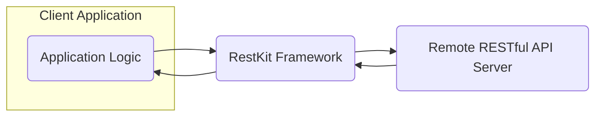
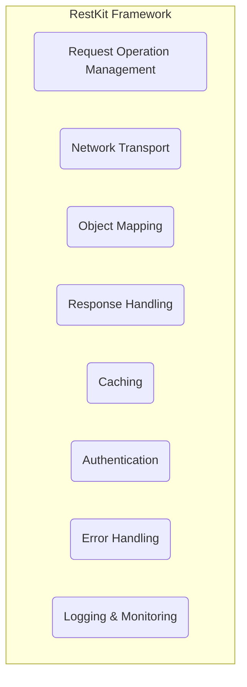
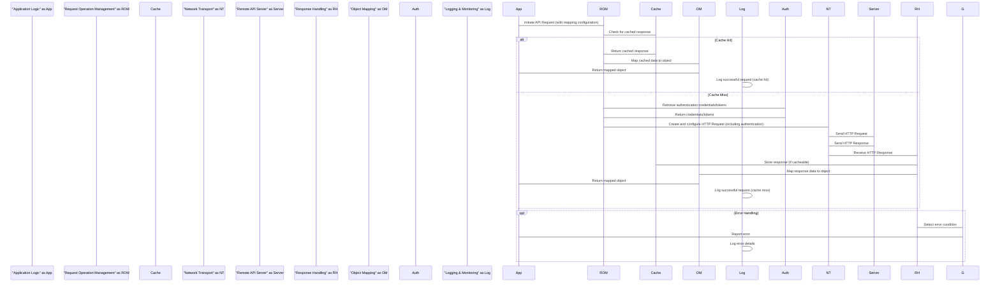

# Project Design Document: RestKit

**Version:** 1.1
**Date:** October 26, 2023
**Author:** AI Software Architect

## 1. Introduction

This document provides an enhanced architectural design of the RestKit project, an Objective-C framework designed to simplify the consumption and interaction with RESTful web services. This revised document offers a more detailed understanding of the framework's structure, components, and data flow, specifically tailored to facilitate comprehensive threat modeling activities.

## 2. Goals and Objectives

The primary goals of RestKit are to:

* Significantly simplify the process of interacting with RESTful APIs within Objective-C-based applications.
* Provide a robust and highly flexible mechanism for mapping data between JSON or XML responses and native Objective-C objects.
* Offer comprehensive features encompassing request construction, response parsing, and robust error handling.
* Support a wide range of authentication schemes commonly employed in modern REST APIs.
* Implement effective caching mechanisms to enhance application performance and minimize unnecessary network load.

## 3. High-Level Architecture

RestKit functions as a client-side framework seamlessly integrated into the architecture of iOS and macOS applications. It serves as a crucial intermediary, streamlining communication between the application's core business logic and external RESTful API services.

**Description:**

* **Application Logic:** Represents the core functionality of the application that requires interaction with a remote API.
* **RestKit Framework:** The central library responsible for orchestrating network requests, managing data mapping processes, and handling API responses.
* **Remote RESTful API Server:** The external server hosting the data and services that the application needs to access.

## 4. Component Architecture

The RestKit framework is modularly designed, comprising several key components, each dedicated to a specific aspect of its overall functionality.

**Description of Components:**

* **Request Operation Management:** This component is responsible for the entire lifecycle management of API requests. This includes the creation of request objects, configuration of request parameters (HTTP methods, headers, request bodies), and the overall orchestration of the request process.
* **Network Transport:** This component handles the actual transmission of HTTP requests to the server and the reception of responses. It typically leverages underlying platform-specific networking APIs such as `NSURLSession` on Apple platforms. This component is crucial for managing network connectivity and security.
* **Object Mapping:** A core component that facilitates the transformation of data between the API's representation (typically JSON or XML) and the application's native Objective-C objects. This involves using predefined mapping configurations to specify how API data fields correspond to object properties, enabling seamless data integration.
* **Response Handling:** This component is responsible for processing the raw HTTP response received from the API server. Its tasks include verifying HTTP status codes, parsing response headers for relevant information, and extracting the response body content for further processing.
* **Caching:** This component provides mechanisms for locally storing API responses to improve application performance and reduce network traffic. It implements strategies for cache storage, retrieval, and invalidation based on configured policies.
* **Authentication:** This component manages the authentication process required to access protected API resources. It supports various authentication schemes, including Basic Authentication, OAuth 1.0/2.0, token-based authentication, and potentially custom authentication mechanisms. It handles the secure inclusion of authentication credentials in outgoing requests.
* **Error Handling:** This component is responsible for managing and processing errors that occur during the API request/response lifecycle. These errors can range from network connectivity issues and server-side errors to data mapping failures. It provides mechanisms for error reporting, logging, and potential recovery.
* **Logging & Monitoring:** This component provides capabilities for logging request and response details, as well as potential errors and performance metrics. This is crucial for debugging, monitoring application behavior, and identifying potential security issues.

## 5. Data Flow

The typical data flow within RestKit for a successful API request follows a structured sequence of interactions between its components:

**Detailed Steps:**

1. **Initiate API Request:** The application logic initiates an API request by interacting with the Request Operation Management component, specifying the target API endpoint, HTTP method, request parameters, and the desired object mapping for the response.
2. **Check for Cached Response:** The Request Operation Management component queries the Caching component to determine if a valid and unexpired cached response exists for the current request.
3. **Cache Hit:** If a valid cached response is found, it is retrieved from the cache.
4. **Map Cached Data to Object:** The Object Mapping component uses the pre-configured mapping rules to transform the cached data into the corresponding Objective-C object(s).
5. **Return Mapped Object:** The mapped object is returned to the initiating application logic.
6. **Log Successful Request (Cache Hit):** The Logging & Monitoring component records details of the successful request retrieval from the cache.
7. **Cache Miss:** If no valid cached response is found, the request proceeds to interact with the remote API.
8. **Retrieve Authentication Credentials/Tokens:** The Request Operation Management component interacts with the Authentication component to retrieve the necessary authentication credentials or tokens required for the API request.
9. **Return Credentials/Tokens:** The Authentication component provides the required credentials or tokens.
10. **Create and Configure HTTP Request:** The Request Operation Management component instructs the Network Transport component to create and configure the HTTP request, including setting headers, adding authentication information, and constructing the request body.
11. **Send HTTP Request:** The Network Transport component transmits the constructed HTTP request to the remote API server over the network.
12. **Send HTTP Response:** The Remote API Server processes the incoming request and sends back an HTTP response containing the requested data or an error indication.
13. **Receive HTTP Response:** The Network Transport component receives the HTTP response from the server.
14. **Store Response (if cacheable):** The Response Handling component, based on configured caching policies, may instruct the Caching component to store the received response for future use.
15. **Map Response Data to Object:** The Response Handling component passes the response data to the Object Mapping component. The Object Mapping component uses the defined mapping rules to transform the API response data (JSON or XML) into the corresponding Objective-C object(s).
16. **Return Mapped Object:** The mapped object is returned to the initiating application logic.
17. **Log Successful Request (Cache Miss):** The Logging & Monitoring component records details of the successful request made to the remote server.
18. **Detect Error Condition (Optional):** If the Response Handling component detects an error condition (e.g., non-2xx status code), it triggers the error handling process.
19. **Report Error:** The Error Handling component reports the error to the application logic, providing details about the failure.
20. **Log Error Details:** The Logging & Monitoring component records the details of the error for debugging and analysis.

## 6. Key Components and Security Considerations

This section details the key components of RestKit from a security perspective, outlining potential threats and necessary security considerations.

* **Network Transport:**
    * **Functionality:** Establishes secure connections (HTTPS) and manages the transmission of data between the client and the API server.
    * **Security Considerations:**
        * **TLS/SSL Configuration:**  Ensure robust configuration of TLS/SSL to prevent man-in-the-middle attacks. This includes enforcing the use of strong cipher suites, disabling insecure protocols (e.g., SSLv3, TLS 1.0), and rigorously validating server certificates.
        * **Protocol Downgrade Attacks:** Implement measures to prevent protocol downgrade attacks that could force the use of older, vulnerable TLS versions. Consider using features like HTTP Strict Transport Security (HSTS) to enforce HTTPS usage.
        * **Certificate Pinning:** Strongly consider implementing certificate pinning to enhance security by only trusting specific, known certificates for the target API server, mitigating the risk of compromised Certificate Authorities.
        * **Proxy Configuration:** Be mindful of proxy configurations, as they can introduce security risks if not managed properly. Ensure that proxy settings are handled securely and that sensitive data is not exposed through insecure proxies.

* **Authentication:**
    * **Functionality:** Manages the process of authenticating requests with the remote API server, ensuring that only authorized users or applications can access protected resources.
    * **Security Considerations:**
        * **Credential Storage:** Securely store authentication credentials (e.g., API keys, OAuth tokens, passwords) using platform-provided secure storage mechanisms like the Keychain on iOS/macOS. Avoid storing credentials in plain text, shared preferences, or other easily accessible locations.
        * **Token Management:** Implement secure token management practices, including secure storage, refresh token mechanisms to avoid repeated password entry, and proper token invalidation upon logout or session expiry.
        * **Transmission Security:** Always transmit authentication credentials and tokens over secure channels (HTTPS) to prevent eavesdropping.
        * **OAuth Implementation:** If using OAuth, ensure proper implementation of the OAuth flow, including secure handling of client secrets and redirection URIs, to prevent authorization code interception or other OAuth-specific vulnerabilities.
        * **Protection Against Brute-Force Attacks:** While RestKit itself doesn't directly prevent brute-force attacks on authentication endpoints, the application using it should implement rate limiting or other protective measures if applicable to the API being accessed.

* **Object Mapping:**
    * **Functionality:** Transforms API data (JSON or XML) into Objective-C objects and vice versa.
    * **Security Considerations:**
        * **Deserialization Vulnerabilities:** Be cautious of potential vulnerabilities arising from deserializing untrusted data, especially if using custom deserialization logic. Maliciously crafted data could potentially lead to code execution or other unintended consequences. Sanitize and validate input data where possible.
        * **Data Validation:** Implement robust validation of data received from the API to prevent unexpected or malicious data from causing issues within the application's logic or data storage. Ensure that data types, formats, and ranges are as expected.

* **Caching:**
    * **Functionality:** Stores API responses locally to improve performance and reduce network load.
    * **Security Considerations:**
        * **Sensitive Data in Cache:** Avoid caching sensitive data that should not be stored locally on the device. If caching sensitive data is absolutely necessary, ensure it is encrypted at rest using appropriate encryption mechanisms provided by the operating system.
        * **Cache Invalidation:** Implement proper cache invalidation mechanisms to ensure that stale or outdated data is not used, especially if it has security implications (e.g., outdated permissions or sensitive information). Consider using time-based expiration or server-driven invalidation.
        * **Cache Poisoning:** Be aware of the possibility of cache poisoning attacks if the caching mechanism relies on untrusted input for cache keys. Ensure that cache keys are constructed securely and are not easily manipulated by attackers.

* **Request Operation Management:**
    * **Functionality:** Handles the creation, configuration, and management of API requests.
    * **Security Considerations:**
        * **Parameter Injection:** Ensure proper encoding and sanitization of any user-provided input that is used to construct API request parameters (e.g., URL parameters, request body data) to prevent injection vulnerabilities such as SQL injection or command injection on the server-side.
        * **Header Injection:** Exercise caution when allowing user-controlled data to be directly inserted into HTTP headers, as this could lead to header injection attacks, potentially allowing attackers to manipulate server behavior or access sensitive information.

* **Response Handling:**
    * **Functionality:** Processes API responses, including status codes, headers, and the response body.
    * **Security Considerations:**
        * **Error Handling Information Disclosure:** Avoid exposing sensitive information in error messages returned to the client application. Detailed error messages intended for debugging should not be exposed in production environments.
        * **Bypass of Security Checks:** Ensure that response handling logic does not inadvertently bypass security checks implemented on the server-side. For example, carefully validate successful response codes and data integrity.

* **Logging & Monitoring:**
    * **Functionality:** Records details of requests, responses, and errors for debugging and monitoring.
    * **Security Considerations:**
        * **Sensitive Data in Logs:** Avoid logging sensitive information such as authentication tokens, passwords, or personally identifiable information (PII). Implement appropriate filtering or redaction of sensitive data before logging.
        * **Log Storage Security:** Ensure that log files are stored securely and access is restricted to authorized personnel. Protect log files from unauthorized access or modification.

## 7. Future Considerations

* **Enhanced Security Defaults:** Explore opportunities to further enhance default security configurations, such as enforcing HTTPS by default and providing stricter default caching policies for sensitive data.
* **Integration with Security Libraries:** Consider providing tighter integration with or clear guidance on using established security-focused libraries for tasks such as secure storage, cryptography, and input validation.
* **Regular Security Audits and Penetration Testing:**  Emphasize the importance of conducting regular security audits and penetration testing to proactively identify and address potential vulnerabilities within the framework and in applications using it.
* **Security Best Practices Documentation:** Provide comprehensive documentation outlining security best practices for developers using RestKit, covering topics like secure credential management, data validation, and secure communication.

This enhanced design document provides a more detailed and security-focused overview of the RestKit project's architecture. This information is intended to be a valuable resource for conducting thorough threat modeling and building secure applications that leverage this framework.