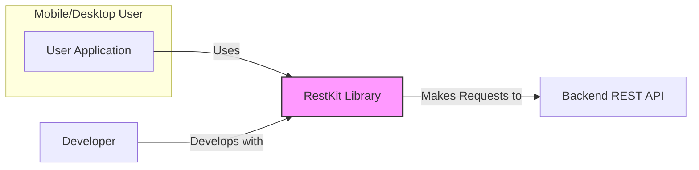
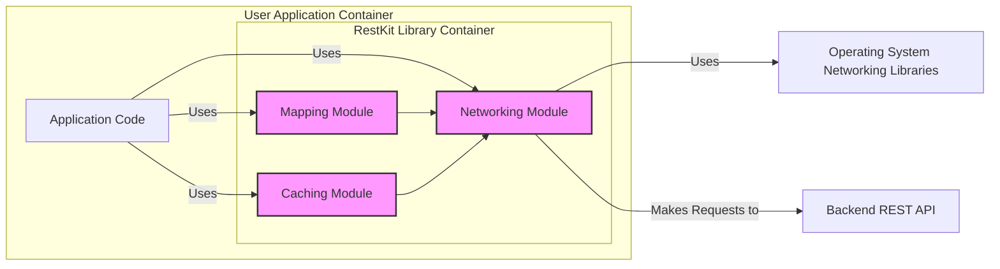

# BUSINESS POSTURE

This project, RestKit, is an Objective-C framework for interacting with RESTful web services. Its primary business goal is to simplify and accelerate the development of iOS and macOS applications that need to communicate with backend APIs. By providing a higher-level abstraction over networking complexities, RestKit aims to increase developer productivity and reduce boilerplate code.

The main business priorities addressed by RestKit are:

*   Rapid Application Development:  RestKit enables developers to quickly integrate REST API interactions into their applications, reducing development time and time-to-market.
*   Code Maintainability: By abstracting away low-level networking details, RestKit promotes cleaner, more maintainable, and less error-prone codebases.
*   Developer Experience: RestKit aims to improve the developer experience by providing a well-structured and easy-to-use framework for common networking tasks.

The most important business risks associated with RestKit are:

*   Security Vulnerabilities:  As a networking library, vulnerabilities in RestKit could expose applications using it to security risks, such as data breaches or unauthorized access.
*   Data Integrity:  Errors in data mapping or handling within RestKit could lead to data corruption or inconsistencies, impacting application reliability and data accuracy.
*   Backward Compatibility:  Changes in RestKit's API or behavior could break existing applications, requiring costly and time-consuming updates.
*   Dependency Risk:  Reliance on an external library introduces a dependency risk. If RestKit is no longer maintained or has critical issues, applications using it could be affected.

# SECURITY POSTURE

## Existing Security Controls

Based on a review of the RestKit repository and common practices for open-source projects, the following security controls are likely in place:

*   security control: HTTPS/TLS for network communication. Implemented by underlying iOS/macOS networking libraries used by RestKit.
*   security control: Input validation within application code using RestKit. Implemented by developers using the framework, not directly by RestKit itself.
*   security control: Code review process. Implemented by project maintainers through pull request reviews on GitHub.
*   security control: Dependency management using CocoaPods or similar. Implemented by developers integrating RestKit into their projects.

## Accepted Risks

*   accepted risk: Vulnerabilities in underlying dependencies. Risk accepted as part of using open-source libraries.
*   accepted risk: Security misconfigurations by developers using RestKit. Risk accepted as responsibility of application developers.
*   accepted risk: Lack of dedicated security testing and vulnerability scanning for RestKit itself. Risk accepted due to community-driven nature of the project.

## Recommended Security Controls

*   security control: Automated Static Application Security Testing (SAST) integrated into the CI/CD pipeline for RestKit development. This would help identify potential code-level vulnerabilities early in the development process.
*   security control: Dependency vulnerability scanning to monitor and address known vulnerabilities in RestKit's dependencies.
*   security control: Regular security audits or penetration testing of applications built using RestKit to identify and mitigate potential security weaknesses in real-world usage scenarios.
*   security control: Security focused code review guidelines for pull requests, emphasizing common web service security vulnerabilities (e.g., injection flaws, insecure deserialization).
*   security control: Documentation and examples highlighting secure coding practices when using RestKit, such as input validation and secure data handling.

## Security Requirements

*   Authentication: RestKit should facilitate the implementation of various authentication mechanisms (e.g., OAuth 2.0, API Keys, Basic Auth) used by REST APIs. It should not enforce specific authentication methods but provide flexibility for developers to integrate their chosen approach securely.
*   Authorization: RestKit should not handle authorization directly, as it is typically managed by the backend API. However, it should correctly transmit authorization tokens or credentials provided by the application to the API server.
*   Input Validation: RestKit should encourage and facilitate input validation on both the client and server sides. While RestKit itself might not perform validation on API responses, it should provide mechanisms for developers to easily validate data received from APIs before using it within their applications. For requests, RestKit should allow developers to validate data before sending it to the API.
*   Cryptography: RestKit should rely on secure cryptographic protocols provided by the underlying operating system (e.g., TLS/SSL for HTTPS). It should not implement custom cryptography but ensure that secure communication channels are used for all network interactions. If RestKit handles sensitive data locally (e.g., caching), it should provide options for secure storage and encryption of this data.

# DESIGN

## C4 CONTEXT



### Context Diagram Elements

*   Name: User Application
    *   Type: Software System
    *   Description: Mobile or desktop application developed by a developer to provide functionality to end-users. This application utilizes the RestKit library to interact with backend services.
    *   Responsibilities:
        *   Provide user interface and user experience.
        *   Implement application-specific business logic.
        *   Utilize RestKit to communicate with backend REST APIs.
        *   Handle user authentication and authorization.
        *   Validate user inputs.
    *   Security controls:
        *   security control: Application-level authentication and authorization.
        *   security control: Input validation on user inputs.
        *   security control: Secure storage of sensitive data within the application (if applicable).
        *   security control: Regular application updates and patching.

*   Name: RestKit Library
    *   Type: Software System / Library
    *   Description: Objective-C framework that simplifies interaction with RESTful web services for iOS and macOS applications. It handles networking, data mapping, and caching.
    *   Responsibilities:
        *   Abstract networking complexities.
        *   Handle HTTP request and response processing.
        *   Map JSON or XML data to Objective-C objects.
        *   Provide caching mechanisms for API responses.
        *   Simplify API interaction for developers.
    *   Security controls:
        *   security control: Relies on underlying OS networking libraries for secure communication (HTTPS).
        *   security control: Code review process for contributions.
        *   security control: (Recommended) Static Application Security Testing (SAST).
        *   security control: (Recommended) Dependency vulnerability scanning.

*   Name: Backend REST API
    *   Type: Software System
    *   Description: Backend server providing RESTful API endpoints that the User Application interacts with to retrieve and manipulate data.
    *   Responsibilities:
        *   Implement business logic and data management.
        *   Provide REST API endpoints for data access and manipulation.
        *   Authenticate and authorize API requests.
        *   Validate API requests and inputs.
        *   Securely store and manage data.
    *   Security controls:
        *   security control: API authentication and authorization mechanisms.
        *   security control: Input validation on API requests.
        *   security control: Secure data storage and encryption.
        *   security control: Regular security updates and patching of backend systems.
        *   security control: API rate limiting and throttling.

*   Name: Developer
    *   Type: Person
    *   Description: Software developer who uses the RestKit library to build mobile or desktop applications.
    *   Responsibilities:
        *   Develop User Applications using RestKit.
        *   Integrate RestKit into application projects.
        *   Implement application-specific security controls.
        *   Follow secure coding practices when using RestKit.
    *   Security controls:
        *   security control: Secure development environment.
        *   security control: Code review practices within development teams.
        *   security control: Security awareness training.

## C4 CONTAINER



### Container Diagram Elements

*   Name: Application Code
    *   Type: Software Container / Application Component
    *   Description: Represents the application-specific code written by the developer, which utilizes the RestKit library. This includes UI logic, business logic, and integration with other application components.
    *   Responsibilities:
        *   Implement application-specific features and functionality.
        *   Orchestrate the use of RestKit modules for API interactions.
        *   Handle application-level data processing and presentation.
        *   Manage user interface and user experience.
    *   Security controls:
        *   security control: Application-level input validation.
        *   security control: Secure data handling within the application logic.
        *   security control: Application-specific authentication and authorization logic.

*   Name: Networking Module (RestKit)
    *   Type: Software Container / Library Module
    *   Description: Responsible for handling all network communication aspects within RestKit. This includes making HTTP requests, handling responses, managing network sessions, and interacting with the underlying operating system's networking libraries.
    *   Responsibilities:
        *   Construct and send HTTP requests to REST APIs.
        *   Receive and process HTTP responses from REST APIs.
        *   Manage network connections and sessions.
        *   Handle HTTP headers, methods, and status codes.
        *   Implement request retries and error handling.
    *   Security controls:
        *   security control: Utilizes HTTPS/TLS for secure communication via OS networking libraries.
        *   security control: (Recommended) Input validation on request parameters and headers before sending.
        *   security control: (Recommended) Protection against common networking vulnerabilities (e.g., request smuggling, SSRF - indirectly by not implementing URL handling itself).

*   Name: Mapping Module (RestKit)
    *   Type: Software Container / Library Module
    *   Description: Handles the mapping of data between JSON or XML responses from REST APIs and Objective-C objects within the application. This simplifies data handling and reduces boilerplate code for data parsing and serialization.
    *   Responsibilities:
        *   Deserialize JSON or XML responses into Objective-C objects.
        *   Serialize Objective-C objects into JSON or XML for API requests.
        *   Define mappings between API data structures and application data models.
        *   Handle data transformations and type conversions.
    *   Security controls:
        *   security control: (Recommended) Input validation during data mapping to prevent injection attacks or data corruption.
        *   security control: (Recommended) Protection against insecure deserialization vulnerabilities if handling complex data structures.

*   Name: Caching Module (RestKit)
    *   Type: Software Container / Library Module
    *   Description: Provides caching mechanisms for API responses to improve application performance and reduce network traffic. This module can store API responses locally and serve them from the cache when appropriate, reducing latency and bandwidth usage.
    *   Responsibilities:
        *   Store API responses in a local cache.
        *   Retrieve cached responses when available.
        *   Manage cache invalidation and expiration.
        *   Provide configuration options for caching behavior.
    *   Security controls:
        *   security control: (Recommended) Secure storage of cached data, especially if it contains sensitive information. Consider encryption for sensitive cached data.
        *   security control: (Recommended) Implement appropriate cache eviction policies to prevent excessive storage of sensitive data.

*   Name: Operating System Networking Libraries
    *   Type: Infrastructure Container / System Library
    *   Description: The underlying networking libraries provided by the iOS or macOS operating system. These libraries handle low-level network communication, including TCP/IP, TLS/SSL, and DNS resolution.
    *   Responsibilities:
        *   Provide low-level networking functionalities.
        *   Implement secure communication protocols (HTTPS/TLS).
        *   Handle network socket management.
        *   Manage network routing and DNS resolution.
    *   Security controls:
        *   security control: Regularly updated and patched by the operating system vendor.
        *   security control: Implement industry-standard secure networking protocols.

*   Name: Backend REST API
    *   Type: External System Container
    *   Description: The same Backend REST API as described in the Context Diagram. It is an external system that the User Application interacts with via RestKit.
    *   Responsibilities: (Same as in Context Diagram)
        *   Implement business logic and data management.
        *   Provide REST API endpoints for data access and manipulation.
        *   Authenticate and authorize API requests.
        *   Validate API requests and inputs.
        *   Securely store and manage data.
    *   Security controls: (Same as in Context Diagram)
        *   security control: API authentication and authorization mechanisms.
        *   security control: Input validation on API requests.
        *   security control: Secure data storage and encryption.
        *   security control: Regular security updates and patching of backend systems.
        *   security control: API rate limiting and throttling.

## DEPLOYMENT

For applications using RestKit, a typical deployment scenario is for mobile applications distributed through app stores.

```mermaid
flowchart LR
    subgraph "Deployment Environment"
        A[Mobile Device]
        B[App Store (e.g., Apple App Store, Google Play Store)]
        C[Backend Infrastructure]
    end

    D[Developer]

    D -- Uploads Application to --> B
    B -- Distributes Application to --> A
    A -- Communicates with --> C
    style C fill:#ccf,stroke:#333,stroke-width:2px
```

### Deployment Diagram Elements

*   Name: Mobile Device
    *   Type: Infrastructure Node / Device
    *   Description: End-user's mobile device (e.g., iPhone, iPad, Android phone) where the User Application is installed and running.
    *   Responsibilities:
        *   Run the User Application.
        *   Execute application code including RestKit library.
        *   Store application data and cached API responses.
        *   Establish network connections to Backend Infrastructure.
    *   Security controls:
        *   security control: Device-level security features (e.g., screen lock, encryption).
        *   security control: Application sandboxing provided by the operating system.
        *   security control: User-managed application permissions.

*   Name: App Store (e.g., Apple App Store, Google Play Store)
    *   Type: Infrastructure Node / Distribution Platform
    *   Description: Digital distribution platform used to distribute the User Application to end-users. Examples include Apple App Store and Google Play Store.
    *   Responsibilities:
        *   Host and distribute application packages.
        *   Verify application integrity and security before distribution.
        *   Manage application updates and releases.
        *   Provide a channel for users to download and install applications.
    *   Security controls:
        *   security control: Application review process to detect malware and policy violations.
        *   security control: Code signing to ensure application integrity and authenticity.
        *   security control: Secure distribution infrastructure.

*   Name: Backend Infrastructure
    *   Type: Infrastructure Node / Cloud or On-Premise Infrastructure
    *   Description: The infrastructure hosting the Backend REST API. This could be cloud-based (e.g., AWS, Azure, GCP) or on-premise data centers.
    *   Responsibilities:
        *   Host and run the Backend REST API.
        *   Manage databases and data storage.
        *   Handle API requests from User Applications.
        *   Provide network connectivity and security.
    *   Security controls:
        *   security control: Infrastructure-level security controls (firewalls, intrusion detection, etc.).
        *   security control: Secure configuration and hardening of servers and systems.
        *   security control: Regular security patching and updates.
        *   security control: Network segmentation and access control.

*   Name: Developer
    *   Type: Person
    *   Description: Software developer responsible for building and deploying the User Application.
    *   Responsibilities:
        *   Develop and test the User Application.
        *   Build application packages for distribution.
        *   Upload application packages to App Stores.
        *   Manage application releases and updates.
    *   Security controls:
        *   security control: Secure development environment.
        *   security control: Secure access to App Store developer accounts.
        *   security control: Code signing certificates management.

## BUILD

A typical build process for a project using RestKit, and potentially for RestKit itself, involves the following steps, focusing on security aspects:

```mermaid
flowchart LR
    A[Developer] --> B{Code Repository (e.g., GitHub)}
    B --> C[CI/CD Pipeline (e.g., GitHub Actions, Jenkins)]
    C --> D{Build Environment (Secure)}
    D --> E{Dependency Management & Security Scan}
    E --> F{Static Analysis Security Testing (SAST)}
    F --> G{Unit & Integration Tests}
    G --> H[Build Artifacts (Framework/Library, Application Package)]
    H --> I{Artifact Repository (e.g., GitHub Releases, Artifactory)}

    style D fill:#efe,stroke:#333,stroke-width:2px
```

### Build Diagram Elements

*   Name: Code Repository (e.g., GitHub)
    *   Type: Software System / Version Control
    *   Description: Central repository for storing and managing the source code of RestKit or applications using it. Examples include GitHub, GitLab, Bitbucket.
    *   Responsibilities:
        *   Version control of source code.
        *   Collaboration and code sharing among developers.
        *   Triggering CI/CD pipelines on code changes.
        *   Storing code history and branches.
    *   Security controls:
        *   security control: Access control and authentication for repository access.
        *   security control: Branch protection and code review requirements.
        *   security control: Audit logging of repository activities.

*   Name: CI/CD Pipeline (e.g., GitHub Actions, Jenkins)
    *   Type: Software System / Automation
    *   Description: Automated pipeline for building, testing, and deploying software. Examples include GitHub Actions, Jenkins, GitLab CI.
    *   Responsibilities:
        *   Automate the build process.
        *   Run automated tests (unit, integration, security).
        *   Perform static analysis and security scans.
        *   Package build artifacts.
        *   Publish build artifacts to artifact repositories.
    *   Security controls:
        *   security control: Secure configuration of CI/CD pipeline.
        *   security control: Access control to pipeline configuration and execution.
        *   security control: Secrets management for credentials used in the pipeline.

*   Name: Build Environment (Secure)
    *   Type: Infrastructure Node / Isolated Environment
    *   Description: Secure and isolated environment where the build process is executed. This environment should be hardened and controlled to prevent supply chain attacks.
    *   Responsibilities:
        *   Provide a clean and consistent build environment.
        *   Isolate build processes from external networks (where possible).
        *   Control access to build tools and dependencies.
        *   Ensure integrity of build tools and dependencies.
    *   Security controls:
        *   security control: Hardened operating system and build tools.
        *   security control: Network isolation or restricted network access.
        *   security control: Access control and audit logging.
        *   security control: Regular security patching and updates.

*   Name: Dependency Management & Security Scan
    *   Type: Software Tool / Security Tool
    *   Description: Tools and processes for managing project dependencies and scanning them for known vulnerabilities. Examples include dependency management tools like CocoaPods, and vulnerability scanners like OWASP Dependency-Check.
    *   Responsibilities:
        *   Manage project dependencies (libraries, frameworks).
        *   Download and verify dependencies.
        *   Scan dependencies for known vulnerabilities.
        *   Generate reports of dependency vulnerabilities.
    *   Security controls:
        *   security control: Use of trusted dependency repositories.
        *   security control: Verification of dependency integrity (e.g., checksums).
        *   security control: Regular updates of dependency vulnerability databases.

*   Name: Static Analysis Security Testing (SAST)
    *   Type: Software Tool / Security Tool
    *   Description: Static analysis tools that analyze source code to identify potential security vulnerabilities without executing the code. Examples include SonarQube, Fortify, Checkmarx.
    *   Responsibilities:
        *   Analyze source code for security weaknesses.
        *   Identify potential vulnerabilities like injection flaws, buffer overflows, etc.
        *   Generate reports of identified vulnerabilities.
        *   Integrate with CI/CD pipeline for automated security checks.
    *   Security controls:
        *   security control: Regularly updated vulnerability rules and patterns.
        *   security control: Configuration to match project's technology stack and security requirements.

*   Name: Unit & Integration Tests
    *   Type: Software Process / Testing
    *   Description: Automated unit and integration tests to ensure code quality and functionality. While not directly security focused, they contribute to overall software robustness and can indirectly help prevent security issues caused by bugs.
    *   Responsibilities:
        *   Verify the functionality of individual code units.
        *   Test the integration between different components.
        *   Ensure code quality and reliability.
        *   Detect functional regressions.
    *   Security controls:
        *   security control: Tests can include security-relevant test cases (e.g., input validation tests).

*   Name: Build Artifacts (Framework/Library, Application Package)
    *   Type: Software Artifact / Output
    *   Description: The output of the build process, which can be a framework/library (for RestKit itself) or an application package (for applications using RestKit).
    *   Responsibilities:
        *   Package compiled code and resources.
        *   Prepare artifacts for distribution or deployment.
        *   Sign artifacts (e.g., code signing for iOS apps).
    *   Security controls:
        *   security control: Code signing to ensure artifact integrity and authenticity.
        *   security control: Secure storage of build artifacts.

*   Name: Artifact Repository (e.g., GitHub Releases, Artifactory)
    *   Type: Software System / Storage
    *   Description: Repository for storing and managing build artifacts. Examples include GitHub Releases, Artifactory, Nexus.
    *   Responsibilities:
        *   Store build artifacts securely.
        *   Manage versions and releases of artifacts.
        *   Provide access to artifacts for distribution or deployment.
    *   Security controls:
        *   security control: Access control and authentication for artifact repository.
        *   security control: Secure storage of artifacts.
        *   security control: Audit logging of artifact access and modifications.

# RISK ASSESSMENT

## Critical Business Processes

The critical business processes indirectly protected by RestKit are the functionalities of the applications that rely on it for network communication. These processes are highly varied depending on the specific application, but generally include:

*   Data Retrieval and Display: Applications use RestKit to fetch data from backend APIs and display it to users. This is fundamental to most applications and critical for user experience and information delivery.
*   User Authentication and Authorization: Applications often use APIs (and thus RestKit) to authenticate users and authorize access to resources. Secure authentication and authorization are critical for protecting user accounts and sensitive data.
*   Data Submission and Processing: Applications use APIs to send user-generated data or application data to backend systems for processing and storage. Data integrity and secure transmission are critical for these processes.
*   Business Transactions: Some applications might use APIs for critical business transactions (e.g., e-commerce, financial transactions). Security and reliability are paramount for these processes.

## Data Sensitivity

The data being protected by applications using RestKit is highly variable and depends entirely on the application's purpose. It can range from publicly available information to highly sensitive personal data, financial data, or confidential business information.

Examples of data sensitivity levels:

*   Public Data: Low sensitivity. Data that is publicly accessible and does not require protection against disclosure.
*   Internal Data: Medium sensitivity. Data intended for internal use within an organization, requiring protection against unauthorized external access.
*   Confidential Data: High sensitivity. Data that is highly sensitive and requires strict protection against unauthorized access and disclosure. This could include personal identifiable information (PII), financial data, health records, trade secrets, etc.

The sensitivity of data handled by applications using RestKit should be assessed on a per-application basis during threat modeling. However, given that RestKit is a networking library used in a wide range of applications, it is prudent to assume that it may handle sensitive data and design security controls accordingly.

# QUESTIONS & ASSUMPTIONS

## Questions

*   What are the primary use cases and target audience for applications using RestKit? (e.g., enterprise apps, consumer apps, specific industries?)
*   Are there any specific regulatory compliance requirements that applications using RestKit need to adhere to (e.g., GDPR, HIPAA, PCI DSS)?
*   What is the expected lifespan and maintenance plan for RestKit?
*   Are there any known security vulnerabilities or past security incidents related to RestKit?
*   What are the performance and scalability requirements for applications using RestKit?
*   Are there any specific security features or functionalities that are planned for future development in RestKit?
*   What is the process for reporting and addressing security vulnerabilities in RestKit?

## Assumptions

*   BUSINESS POSTURE:
    *   The primary business goal is to simplify REST API integration for developers and accelerate application development.
    *   Security is a significant concern, especially given the nature of networking libraries and potential for handling sensitive data.
    *   The target audience includes developers building a variety of applications, potentially ranging from startups to larger organizations.
    *   There is a moderate risk appetite, balancing development speed with security considerations.

*   SECURITY POSTURE:
    *   Existing security controls are primarily based on standard open-source development practices and reliance on underlying OS security features (HTTPS).
    *   There is no dedicated security team or formal security program specifically for RestKit.
    *   Security testing and vulnerability scanning are likely limited or ad-hoc.
    *   Developers using RestKit are responsible for implementing application-level security controls.

*   DESIGN:
    *   RestKit is designed as a library to be integrated into mobile and desktop applications.
    *   It focuses on simplifying networking, data mapping, and caching for REST APIs.
    *   Deployment is typically through app stores for mobile applications.
    *   The build process involves standard software development practices, potentially with some level of automation.
    *   HTTPS/TLS is assumed to be the primary mechanism for secure communication.