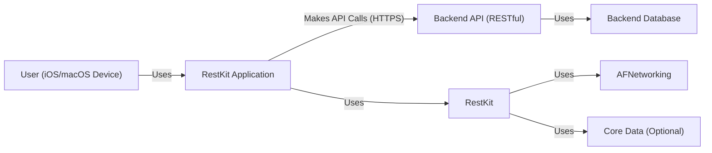
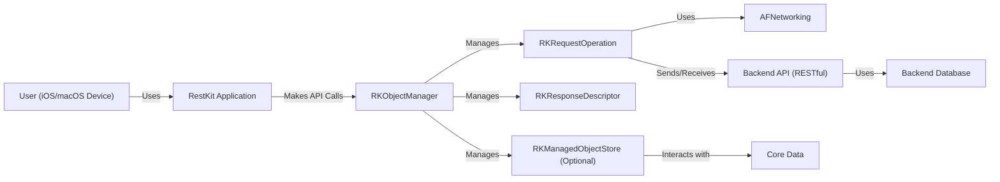
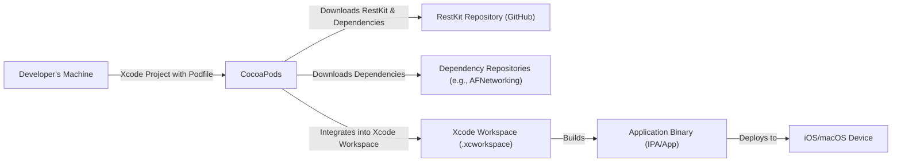
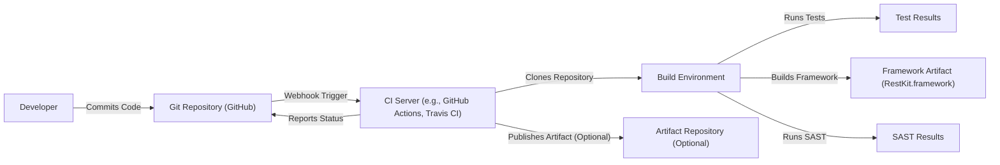

Okay, let's create a design document for the RestKit project.

# BUSINESS POSTURE

RestKit is a framework designed to simplify the development of RESTful web services in Objective-C, primarily targeting iOS and macOS applications. It aims to reduce the complexity of interacting with web APIs by providing tools for object mapping, request/response handling, and Core Data integration.

Business Priorities:

*   Enable developers to quickly and efficiently integrate their applications with RESTful APIs.
*   Reduce development time and cost associated with building network communication layers.
*   Improve the maintainability and testability of code that interacts with web services.
*   Provide a robust and reliable solution for handling network requests and responses.
*   Minimize the boilerplate code required for common API interaction tasks.

Business Goals:

*   Become a widely adopted framework for building RESTful client applications in the Apple ecosystem.
*   Maintain a high level of developer satisfaction and community engagement.
*   Provide a stable and well-documented API that evolves gracefully over time.

Most Important Business Risks:

*   Data breaches due to vulnerabilities in the framework or its dependencies.
*   Exposure of sensitive information (API keys, user credentials, etc.) due to improper handling.
*   Application instability or crashes caused by bugs in the framework.
*   Inability to adapt to changes in backend APIs or evolving RESTful standards.
*   Loss of developer trust due to security incidents or poor maintenance.
*   Compatibility issues with new versions of iOS, macOS, or related Apple technologies.

# SECURITY POSTURE

Existing Security Controls:

*   security control: The project uses `NSURLSession` (and previously `NSURLConnection`), Apple's built-in networking APIs, which inherently provide some level of security (e.g., TLS for HTTPS connections). Where it's implemented: `RKObjectManager`, `RKRequestOperation`.
*   security control: The project likely includes error handling for network requests and responses, which can help prevent unexpected behavior or crashes due to network issues. Where it's implemented: `RKObjectRequestOperation`, `RKManagedObjectRequestOperation`.
*   security control: If Core Data integration is used, data persistence is handled by Apple's Core Data framework, which offers features like data validation and encryption (if configured). Where it's implemented: `RKManagedObjectStore`.
*   security control: The project is open-source, allowing for community review and contributions, which can help identify and address security vulnerabilities. Where it's implemented: GitHub repository.

Accepted Risks:

*   accepted risk: The framework relies on third-party dependencies (e.g., AFNetworking, historically), which may introduce their own security vulnerabilities.
*   accepted risk: The framework's primary focus is on simplifying API interaction, not on providing advanced security features beyond what's offered by Apple's underlying APIs.
*   accepted risk: Developers are responsible for securely storing and handling sensitive information like API keys and user credentials. The framework itself does not provide specific mechanisms for this.
*   accepted risk: The framework may not fully protect against all types of attacks, such as man-in-the-middle attacks, if developers do not properly configure TLS or implement certificate pinning.

Recommended Security Controls:

*   Implement certificate pinning to mitigate man-in-the-middle attacks.
*   Provide clear guidance and examples on securely storing API keys and other secrets (e.g., using Keychain Services).
*   Integrate with security analysis tools (static and dynamic) to identify potential vulnerabilities.
*   Regularly audit and update dependencies to address known security issues.
*   Offer options for data encryption at rest and in transit, beyond the default HTTPS.
*   Consider adding support for OAuth 2.0 or other modern authentication protocols.

Security Requirements:

*   Authentication:
    *   The framework should support common authentication methods like Basic Auth, API keys (in headers or query parameters), and Token-based authentication.
    *   It should provide mechanisms for securely storing and managing authentication credentials.
    *   Consider supporting OAuth 2.0 for more secure and standardized authentication flows.

*   Authorization:
    *   The framework itself may not directly handle authorization (which is typically managed on the server-side), but it should facilitate sending authorization tokens (e.g., JWT) in request headers.

*   Input Validation:
    *   The framework should encourage developers to validate data received from the server to prevent issues like injection attacks or processing malformed data.
    *   Object mapping features should include validation rules to ensure data conforms to expected types and formats.

*   Cryptography:
    *   The framework should rely on Apple's built-in cryptographic APIs (e.g., CommonCrypto, Security framework) for any cryptographic operations.
    *   HTTPS should be enforced for all network communication, with options for certificate pinning.
    *   If data encryption at rest is required, developers should use Core Data's encryption features or other secure storage mechanisms.

# DESIGN

## C4 CONTEXT

Element Descriptions:

*   Element:
    *   Name: User
    *   Type: Person
    *   Description: A user interacting with an iOS or macOS application that uses RestKit.
    *   Responsibilities: Initiates actions within the application that trigger API requests.
    *   Security controls: None directly implemented by the user, relies on device and application security.

*   Element:
    *   Name: RestKit Application
    *   Type: Software System
    *   Description: An iOS or macOS application that utilizes the RestKit framework.
    *   Responsibilities: Handles user interactions, manages application logic, and uses RestKit to communicate with the backend API.
    *   Security controls: Application-specific security controls, secure storage of credentials (e.g., Keychain), proper handling of user data.

*   Element:
    *   Name: RestKit
    *   Type: Framework/Library
    *   Description: The RestKit framework itself.
    *   Responsibilities: Provides an abstraction layer for making RESTful API requests, handling responses, object mapping, and Core Data integration.
    *   Security controls: Relies on `NSURLSession` for secure communication (HTTPS), error handling, and potentially certificate pinning (if implemented).

*   Element:
    *   Name: AFNetworking
    *   Type: Framework/Library
    *   Description: Networking framework used by RestKit.
    *   Responsibilities: Provides an abstraction layer for making RESTful API requests, handling responses.
    *   Security controls: Relies on `NSURLSession` for secure communication (HTTPS).

*   Element:
    *   Name: Core Data
    *   Type: Framework/Library
    *   Description: Apple framework for data persistent.
    *   Responsibilities: Provides an abstraction layer for data persistent.
    *   Security controls: Data validation and encryption (if configured).

*   Element:
    *   Name: Backend API
    *   Type: Software System
    *   Description: The RESTful API that the RestKit application interacts with.
    *   Responsibilities: Provides data and services to the client application, handles authentication and authorization, enforces business logic.
    *   Security controls: API authentication (e.g., OAuth 2.0, API keys), authorization checks, input validation, rate limiting, protection against common web vulnerabilities (e.g., OWASP Top 10).

*   Element:
    *   Name: Backend Database
    *   Type: Database
    *   Description: The database used by the Backend API.
    *   Responsibilities: Stores and manages the data used by the API.
    *   Security controls: Database access controls, encryption at rest, regular security audits, protection against SQL injection.

## C4 CONTAINER

Element Descriptions:

*   Element:
    *   Name: User
    *   Type: Person
    *   Description: A user interacting with the iOS or macOS application.
    *   Responsibilities: Initiates actions that trigger API requests.
    *   Security controls: None directly implemented by the user.

*   Element:
    *   Name: App
    *   Type: Mobile App
    *   Description: The iOS or macOS application using RestKit.
    *   Responsibilities: Handles UI, user input, and overall application logic.
    *   Security controls: Secure storage of credentials, proper handling of user data, adherence to platform security guidelines.

*   Element:
    *   Name: RKObjectManager
    *   Type: Container (RestKit Component)
    *   Description: The central component of RestKit, responsible for managing API requests and responses.
    *   Responsibilities: Configures request operations, handles response descriptors, and interacts with the managed object store (if used).
    *   Security controls: Uses `NSURLSession` for secure communication, manages request headers (including authentication tokens).

*   Element:
    *   Name: RKRequestOperation
    *   Type: Container (RestKit Component)
    *   Description: Represents a single API request and its corresponding response.
    *   Responsibilities: Executes the network request, handles response parsing, and maps data to objects.
    *   Security controls: Relies on `NSURLSession` for secure communication, performs error handling.

*   Element:
    *   Name: RKResponseDescriptor
    *   Type: Container (RestKit Component)
    *   Description: Defines how to map a response from the API to objects.
    *   Responsibilities: Specifies the mapping rules for converting JSON (or other formats) to Objective-C objects.
    *   Security controls: Can include validation rules to ensure data integrity.

*   Element:
    *   Name: RKManagedObjectStore
    *   Type: Container (RestKit Component) - Optional
    *   Description: Integrates RestKit with Core Data for persistent storage.
    *   Responsibilities: Manages Core Data entities, performs object mapping between API responses and Core Data objects.
    *   Security controls: Relies on Core Data's security features (data validation, encryption if configured).

*   Element:
    *   Name: AFNetworking
    *   Type: Framework/Library
    *   Description: Networking framework used by RestKit.
    *   Responsibilities: Provides an abstraction layer for making RESTful API requests, handling responses.
    *   Security controls: Relies on `NSURLSession` for secure communication (HTTPS).

*   Element:
    *   Name: Core Data
    *   Type: Framework
    *   Description: Apple's framework for data persistence.
    *   Responsibilities: Manages the application's data model, provides object persistence and retrieval.
    *   Security controls: Data validation, encryption (if configured).

*   Element:
    *   Name: Backend API
    *   Type: Web API
    *   Description: The RESTful API that the application interacts with.
    *   Responsibilities: Provides data and services, handles authentication and authorization.
    *   Security controls: API authentication, authorization checks, input validation, rate limiting, protection against web vulnerabilities.

*   Element:
    *   Name: Backend Database
    *   Type: Database
    *   Description: The database used by the Backend API.
    *   Responsibilities: Stores and manages data.
    *   Security controls: Database access controls, encryption at rest, regular security audits.

## DEPLOYMENT

Deployment Solutions:

1.  Manual Integration: Developers manually download the RestKit source code or compiled frameworks and add them to their Xcode project.
2.  CocoaPods: A dependency manager for Cocoa projects. Developers specify RestKit in their Podfile, and CocoaPods handles downloading and integrating the framework.
3.  Carthage: A decentralized dependency manager for Cocoa projects. Developers specify RestKit in their Cartfile, and Carthage builds the framework and its dependencies.
4.  Swift Package Manager: Starting from RestKit 0.27.0, Swift Package Manager is supported.

Chosen Solution (CocoaPods):

Element Descriptions:

*   Element:
    *   Name: Developer's Machine
    *   Type: Workstation
    *   Description: The developer's computer where the Xcode project is located.
    *   Responsibilities: Hosts the development environment, source code, and build tools.
    *   Security controls: Developer machine security (e.g., disk encryption, strong passwords, firewall).

*   Element:
    *   Name: CocoaPods
    *   Type: Tool
    *   Description: The CocoaPods dependency manager.
    *   Responsibilities: Downloads, builds, and integrates RestKit and its dependencies into the Xcode project.
    *   Security controls: Relies on HTTPS for downloading packages, verifies package integrity (checksums).

*   Element:
    *   Name: RestKit Repository
    *   Type: Source Code Repository
    *   Description: The GitHub repository hosting the RestKit source code.
    *   Responsibilities: Provides access to the RestKit source code and releases.
    *   Security controls: GitHub's security features (access controls, vulnerability scanning).

*   Element:
    *   Name: Dependency Repositories
    *   Type: Source Code Repository
    *   Description: Repositories hosting RestKit's dependencies (e.g., AFNetworking).
    *   Responsibilities: Provide access to the source code and releases of dependencies.
    *   Security controls: Repository-specific security features (e.g., access controls, vulnerability scanning).

*   Element:
    *   Name: Xcode Workspace
    *   Type: Development Environment
    *   Description: The Xcode workspace created by CocoaPods, which includes the application project and the Pods project.
    *   Responsibilities: Manages the project structure, build settings, and dependencies.
    *   Security controls: Xcode's security features (code signing, sandboxing).

*   Element:
    *   Name: App Binary
    *   Type: Application Package
    *   Description: The compiled application binary (IPA for iOS, .app for macOS).
    *   Responsibilities: The executable application that runs on the device.
    *   Security controls: Code signing, application sandboxing (if applicable), platform-specific security features.

*   Element:
    *   Name: Device
    *   Type: Mobile Device/Computer
    *   Description: The iOS or macOS device where the application is deployed.
    *   Responsibilities: Runs the application.
    *   Security controls: Device security (passcode, biometric authentication, OS updates), application sandboxing.

## BUILD

Build Process Description:

1.  Developer commits code changes to the Git repository (GitHub).
2.  A webhook triggers the CI server (e.g., GitHub Actions, Travis CI, Jenkins).
3.  The CI server clones the repository into a clean build environment.
4.  The build environment executes build scripts, which typically involve:
    *   Running unit and integration tests.
    *   Building the RestKit framework (creating `RestKit.framework`).
    *   Optionally, running static analysis tools (SAST) to identify potential security vulnerabilities.
5.  Test results and SAST reports are generated.
6.  The CI server may publish the built framework artifact to an artifact repository (optional).
7.  The CI server reports the build status (success or failure) back to the Git repository.

Security Controls in Build Process:

*   Source Code Management (GitHub): Access controls, branch protection rules, code review requirements.
*   CI/CD Pipeline: Automated builds and tests, consistent build environment, limited access to build secrets.
*   SAST Tools: Integration of static analysis tools to identify potential vulnerabilities in the code.
*   Dependency Management (CocoaPods/Carthage/SPM): Using dependency managers to ensure consistent and verifiable dependencies. Checksums/hashes are used to verify integrity.
*   Artifact Repository (Optional): Secure storage of build artifacts, access controls.

# RISK ASSESSMENT

Critical Business Processes:

*   User authentication and authorization with backend services.
*   Retrieval and display of user data from backend services.
*   Submission of user data to backend services.
*   Data synchronization between the client application and the backend.
*   Offline data access (if applicable, using Core Data).

Data Sensitivity:

*   User Credentials (usernames, passwords, tokens): Highly sensitive.
*   API Keys: Highly sensitive.
*   Personal User Data (names, email addresses, profile information): Sensitive, subject to privacy regulations (e.g., GDPR, CCPA).
*   Application-Specific Data: Sensitivity depends on the nature of the application. Could range from non-sensitive to highly sensitive (e.g., financial data, health data).

# QUESTIONS & ASSUMPTIONS

Questions:

*   What specific versions of iOS and macOS are targeted by applications using RestKit? This impacts the available security features and APIs.
*   What are the most common backend APIs that RestKit is used with? This helps understand the typical authentication and authorization requirements.
*   Are there any specific regulatory compliance requirements (e.g., HIPAA, PCI DSS) that need to be considered?
*   What is the current state of security testing (static and dynamic) for RestKit?
*   Is there a formal process for handling security vulnerabilities reported by the community?
*   What level of backward compatibility is maintained for older versions of RestKit?

Assumptions:

*   BUSINESS POSTURE: Assumes that developers using RestKit are aware of basic security best practices for iOS/macOS development.
*   SECURITY POSTURE: Assumes that HTTPS is used for all API communication. Assumes that developers are responsible for securely storing API keys and user credentials.
*   DESIGN: Assumes that the backend API implements appropriate security controls (authentication, authorization, input validation, etc.). Assumes that RestKit is primarily used for interacting with RESTful APIs that return JSON data.