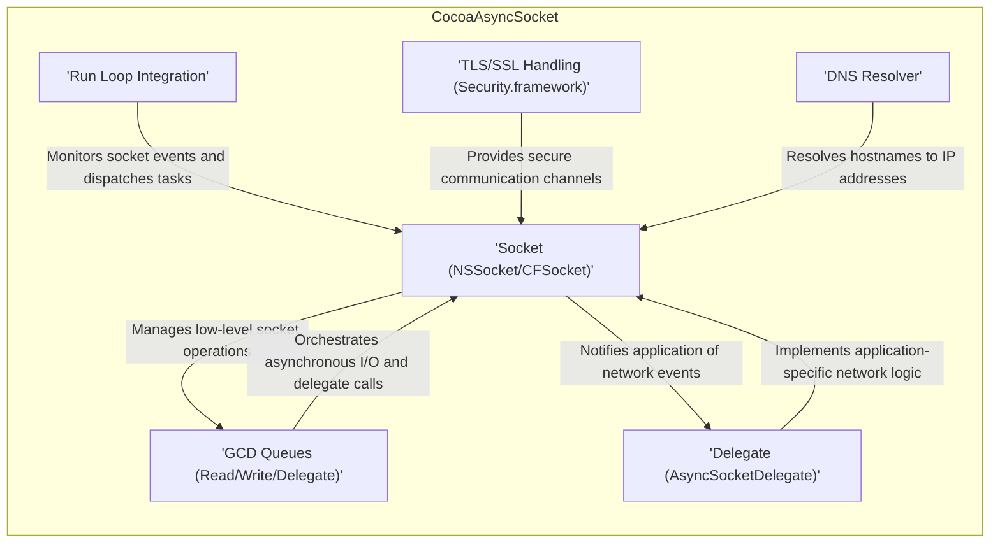
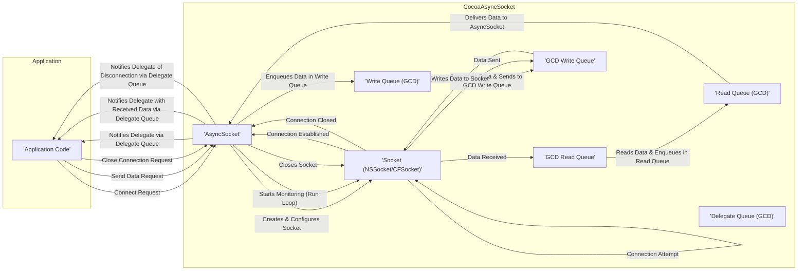
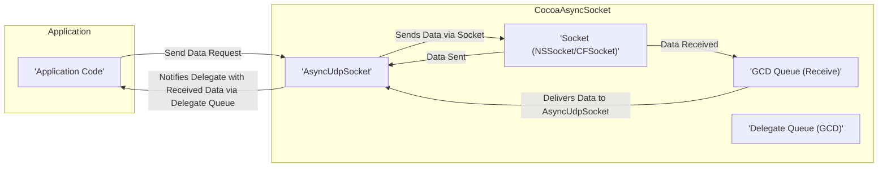

# Project Design Document: CocoaAsyncSocket

**Version:** 1.1
**Date:** October 26, 2023
**Author:** AI Software Architect

## 1. Project Overview

CocoaAsyncSocket is a widely adopted open-source networking library for macOS and iOS. It offers asynchronous socket networking capabilities, simplifying the development of applications requiring TCP and UDP communication. This document details the architectural design of CocoaAsyncSocket to facilitate a thorough threat modeling process.

## 2. Goals

* Provide a clear and comprehensive overview of the CocoaAsyncSocket architecture and its internal workings.
* Identify key components, their specific responsibilities, and their interactions within the library.
* Illustrate the data flow within the library for both TCP connection establishment and data transfer, as well as UDP communication.
* Highlight potential areas of security concern with specific examples to guide future threat modeling activities.

## 3. Non-Goals

* In-depth, line-by-line code analysis of every function and method within CocoaAsyncSocket.
* Performance benchmarking, optimization strategies, or comparative analysis with other networking libraries.
* Detailed explanation of the underlying operating system's networking stack implementation.
* Providing solutions or mitigations for the identified security concerns (that's the role of threat modeling).

## 4. Target Audience

* Security engineers responsible for performing threat modeling and security assessments.
* Software developers integrating CocoaAsyncSocket into their macOS or iOS applications.
* Software architects seeking a deeper understanding of the library's structure, behavior, and potential security implications.

## 5. Architectural Overview

CocoaAsyncSocket is built upon the foundation of BSD sockets, a standard interface for network programming. It leverages Grand Central Dispatch (GCD) extensively to manage asynchronous operations, ensuring that network I/O does not block the main application thread. The library provides an Objective-C interface for managing socket connections and data transfer.

**Key Architectural Components:**

* **Socket ('NSSocket/CFSocket'):** The fundamental building block representing a network communication endpoint. CocoaAsyncSocket abstracts the underlying socket implementation using either `NSSocket` (preferred on macOS 10.5+ and iOS) or `CFSocket` (for backward compatibility). This component handles the raw interaction with the operating system's networking stack.
* **GCD Queues ('Read/Write/Delegate'):** CocoaAsyncSocket relies heavily on GCD to manage concurrency. Separate queues are typically used for read operations, write operations, and for dispatching delegate method calls back to the application. This ensures that network operations are performed asynchronously and do not block the main thread.
* **Delegate ('AsyncSocketDelegate'):** A crucial interface (protocol) that allows the application to receive notifications about significant socket events. These events include connection establishment, incoming data, disconnections, and errors. The delegate pattern enables a clear separation of concerns, allowing the application to handle network events in a customized manner.
* **Run Loop Integration:** CocoaAsyncSocket integrates seamlessly with the application's run loop. This allows the library to monitor socket events (e.g., readability, writability) and dispatch the corresponding operations or delegate calls efficiently.
* **TLS/SSL Handling ('Security.framework'):**  Provides robust support for secure communication using TLS/SSL encryption. This involves utilizing Apple's Security framework to manage certificate handling, cryptographic operations, and the SSL/TLS handshake process.
* **DNS Resolver:** Responsible for translating human-readable hostnames into IP addresses that can be used for network communication. CocoaAsyncSocket leverages the system's built-in DNS resolution mechanisms.

## 6. Component Details

### 6.1. AsyncSocket Class

* **Responsibilities:**
    * Encapsulates and manages the underlying network socket (`NSSocket` or `CFSocket`).
    * Provides the primary API for establishing connections, sending and receiving data, and disconnecting.
    * Configures various socket options (e.g., `TCP_NODELAY`, socket timeouts).
    * Manages internal read and write queues to handle asynchronous operations.
    * Orchestrates the TLS/SSL handshake and encryption/decryption processes.
    * Integrates with the application's run loop to monitor socket events.
    * Dispatches delegate method calls on the appropriate GCD queue.
    * Implements timeout mechanisms for connection attempts, read operations, and write operations.

### 6.2. AsyncUdpSocket Class

* **Responsibilities:**
    * Manages UDP sockets for connectionless communication.
    * Provides methods for sending and receiving UDP datagrams.
    * Supports UDP-specific features like broadcasting and multicasting.
    * Handles the asynchronous reception of UDP packets.
    * Invokes delegate methods to notify the application about received data and errors.

### 6.3. Read, Write, and Delegate Queues (GCD)

* **Responsibilities:**
    * **Read Queue:** Stores incoming data received from the socket until it can be processed by the application. Ensures data is processed in the order it was received.
    * **Write Queue:** Holds data that the application wants to send until the socket is ready for writing. Prevents blocking the application thread during write operations.
    * **Delegate Queue:**  Manages the execution of delegate methods. This allows the application to specify the thread or queue on which delegate methods are called, providing flexibility in how network events are handled.

### 6.4. Delegate Methods (AsyncSocketDelegate Protocol)

* **Responsibilities:**
    * **Connection Management:** Informs the application about successful connections (`socket:didConnectToHost:port:`) and disconnections (`socketDidDisconnect:withError:`).
    * **Data Handling:** Delivers received data to the application (`socket:didReadData:withTag:`). Provides mechanisms for the application to initiate read operations (`socket:didWriteDataWithTag:`).
    * **Error Reporting:** Notifies the application about any errors that occur during socket operations (`socket:willDisconnectWithError:`).
    * **TLS/SSL Trust Evaluation:** Allows the application to perform custom trust evaluation for SSL certificates (`socket:didReceiveTrust:completionHandler:`).
    * **Data Sending Control:** Provides opportunities for the application to send data when the socket is ready (`onSocketReadyToSend:` - though less common now).

### 6.5. TLS/SSL Implementation (Leveraging Security.framework)

* **Responsibilities:**
    * Utilizes Apple's Security framework to establish secure connections.
    * Handles the complexities of the SSL/TLS handshake process, including negotiation of protocols and cipher suites.
    * Manages the encryption and decryption of data transmitted over the secure connection.
    * Supports various SSL/TLS protocols (e.g., TLS 1.2, TLS 1.3) and cipher suites.
    * Provides options for implementing certificate pinning and custom trust validation to enhance security.

### 6.6. DNS Resolution (System Provided)

* **Responsibilities:**
    * Relies on the operating system's built-in DNS resolver to translate hostnames into IP addresses.
    * May perform asynchronous DNS lookups to avoid blocking the main thread.

## 7. Data Flow Diagrams

### 7.1. TCP Connection Establishment and Data Transfer

**Data Flow Description (TCP):**

1. The application initiates a connection by calling a connect method on the `AsyncSocket` instance.
2. `AsyncSocket` creates and configures the underlying socket and begins monitoring it for connection events using the run loop.
3. The operating system attempts to establish the connection.
4. Upon successful connection, the socket signals the event, and `AsyncSocket` is notified.
5. `AsyncSocket` then notifies its delegate on the designated delegate queue.
6. When the application wants to send data, it calls a send method on `AsyncSocket`.
7. The data is enqueued in the internal `Write Queue`.
8. The `GCD Write Queue` dequeues data and performs the asynchronous write operation on the socket.
9. When data is received by the socket, the `GCD Read Queue` reads the data.
10. The received data is enqueued in the internal `Read Queue`.
11. `AsyncSocket` retrieves the data from the `Read Queue`.
12. `AsyncSocket` then notifies its delegate with the received data on the delegate queue.
13. When the application wants to close the connection, it calls a disconnect method.
14. `AsyncSocket` closes the underlying socket.
15. `AsyncSocket` notifies its delegate of the disconnection on the delegate queue.

### 7.2. UDP Data Transfer

**Data Flow Description (UDP):**

1. The application sends a UDP datagram by calling a send method on the `AsyncUdpSocket` instance.
2. `AsyncUdpSocket` uses the underlying socket to send the data.
3. When a UDP packet is received by the socket, the `GCD Queue (Receive)` handles the asynchronous reception.
4. The received data is delivered to the `AsyncUdpSocket` instance.
5. `AsyncUdpSocket` notifies its delegate with the received data on the delegate queue.

## 8. Security Considerations (For Threat Modeling)

This section outlines potential security concerns and attack vectors that should be thoroughly investigated during threat modeling:

* **Input Validation Vulnerabilities:**
    * **Malformed Packets:** How robust is the library against malformed TCP segments or UDP datagrams that could trigger parsing errors or unexpected behavior?
    * **Oversized Data:** Are there checks in place to prevent buffer overflows when handling excessively large incoming data?
    * **Protocol Violations:** Does the library strictly adhere to protocol specifications, or are there edge cases where deviations could be exploited?

* **Buffer Overflow Potential:**
    * **Read/Write Queues:** Could an attacker manipulate the flow of data to cause the internal read or write queues to overflow, leading to memory corruption?
    * **Data Processing:** Are there any areas in the data processing logic where insufficient bounds checking could lead to buffer overflows?

* **Denial of Service (DoS) Attacks:**
    * **SYN Floods (TCP):** How does the library or the underlying OS handle a large influx of connection requests without completing the handshake?
    * **UDP Floods:** Can an attacker overwhelm the application by sending a high volume of UDP packets?
    * **Resource Exhaustion:** Could an attacker cause the library to consume excessive resources (memory, CPU) by exploiting certain functionalities?

* **TLS/SSL Related Vulnerabilities:**
    * **Protocol Downgrade Attacks:** Is the library susceptible to attacks that force the use of older, less secure TLS/SSL protocols?
    * **Weak Cipher Suites:** Does the library allow the use of known weak or vulnerable cipher suites?
    * **Insufficient Certificate Validation:** Are there scenarios where the library might accept invalid or malicious certificates, leading to man-in-the-middle attacks?
    * **Improper Trust Management:** How does the application handle certificate trust? Are there opportunities for bypassing certificate validation?

* **Delegate Security Implications:**
    * **Malicious Delegate:** If an attacker can influence the object set as the delegate, they could potentially intercept sensitive data, inject malicious data, or disrupt the application's network communication.
    * **Delegate Method Exploitation:** Could vulnerabilities in the application's delegate method implementations be exploited through carefully crafted network events?

* **Resource Management Issues:**
    * **Socket Leaks:** Are there scenarios where sockets might not be properly closed, leading to resource exhaustion?
    * **Memory Leaks:** Could improper memory management within the library lead to memory leaks over time?

* **DNS Spoofing Risks:**
    * If the application relies on hostname resolution, it could be vulnerable to DNS spoofing attacks, potentially leading to connections with malicious servers.

* **Error Handling and Information Disclosure:**
    * Are error messages sufficiently informative for debugging but not overly verbose, revealing sensitive information to potential attackers?

* **Concurrency Vulnerabilities:**
    * **Race Conditions:** Are there potential race conditions in the asynchronous operations that could lead to unexpected behavior or security vulnerabilities?

* **Third-Party Dependency Risks:**
    * While CocoaAsyncSocket has limited direct dependencies, vulnerabilities in the underlying system frameworks (e.g., Security.framework) could indirectly impact the library's security.

## 9. Dependencies

* **Foundation Framework (macOS/iOS):** Provides fundamental object-oriented base classes and services.
* **CoreFoundation Framework (macOS/iOS):** Offers fundamental data types, collections, and operating system services.
* **Grand Central Dispatch (GCD):** Apple's technology for managing concurrent operations.
* **Security Framework (macOS/iOS):** Provides APIs for security-related tasks, including cryptography and secure communication (TLS/SSL).

## 10. Deployment Considerations

The security of applications using CocoaAsyncSocket depends not only on the library itself but also on how it's integrated and used within the application:

* **Secure Credential Storage:** If the application uses CocoaAsyncSocket for authenticated connections, the secure storage and management of credentials are paramount.
* **Robust Delegate Implementation:** Ensuring that the delegate methods are implemented securely and do not introduce vulnerabilities is crucial. This includes careful handling of received data and preventing unintended side effects.
* **Network Environment Security:** The security of the network environment in which the application operates (e.g., use of HTTPS, network segmentation) plays a significant role.
* **Regular Updates:** Keeping CocoaAsyncSocket updated to the latest version is important to benefit from bug fixes and security patches.

This enhanced design document provides a more detailed and nuanced understanding of CocoaAsyncSocket's architecture, highlighting specific areas of concern for a comprehensive threat modeling exercise. By focusing on these potential vulnerabilities, security engineers can effectively identify and mitigate risks associated with using this library.
