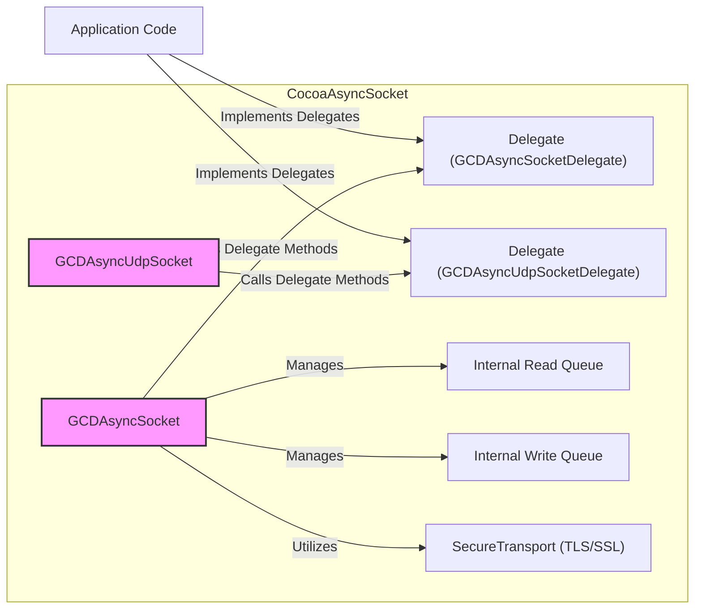
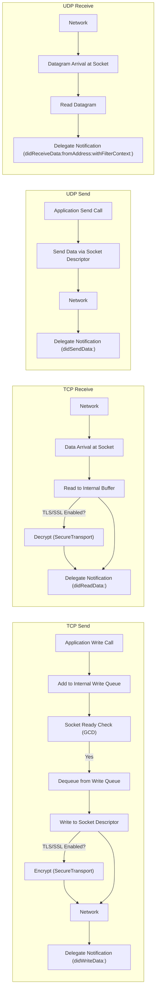

# Project Design Document: CocoaAsyncSocket

**Version:** 1.1
**Date:** October 26, 2023
**Author:** AI Software Architect

## 1. Introduction

This document provides an enhanced and detailed design overview of the CocoaAsyncSocket library, an asynchronous socket networking library for Mac and iOS. This document is specifically tailored to serve as a robust foundation for subsequent threat modeling activities. It comprehensively outlines the key components, data flow, and architectural considerations, emphasizing aspects crucial for security analysis.

## 2. Project Overview

CocoaAsyncSocket is a well-established and widely adopted library that simplifies the complexities of implementing TCP and UDP networking in Objective-C applications. It leverages the power of Grand Central Dispatch (GCD) to provide asynchronous, non-blocking socket operations, significantly enhancing application responsiveness and overall performance. The library employs a delegate-based event handling mechanism for managing socket events and data interactions.

**Key Features:**

*   Asynchronous handling of both TCP and UDP socket operations.
*   Comprehensive support for both IPv4 and IPv6 network protocols.
*   Integrated support for TLS/SSL encryption through Apple's SecureTransport framework.
*   Event-driven architecture via delegate protocols for handling connection establishment, data transfer initiation and completion, and connection disconnections.
*   Extensive options for configuring socket behavior and parameters.
*   Seamless integration with macOS and iOS Run Loops.
*   Thread-safe design, crucial for concurrent operations.

## 3. Architecture and Components

The library's architecture is centered around the `GCDAsyncSocket` class, responsible for TCP communication, and the `GCDAsyncUdpSocket` class, handling UDP communication. These core classes manage the underlying operating system socket descriptors and orchestrate the dispatch of socket-related events to designated delegate objects.

**Core Components:**

*   **`GCDAsyncSocket`:**
    *   Specifically designed for managing TCP connections, providing a structured way to interact with connection-oriented sockets.
    *   Handles the entire lifecycle of a TCP connection, from initiating or accepting connections to gracefully closing them.
    *   Manages the complexities of sending and receiving byte streams over a reliable TCP connection.
    *   Offers built-in support for securing communication channels using TLS/SSL encryption via the SecureTransport framework.
    *   Exposes asynchronous methods for both reading data from and writing data to the socket, preventing blocking operations.
    *   Internally utilizes separate, managed queues for pending read and write operations, ensuring efficient processing.
    *   Communicates significant connection events, data arrival, and disconnection scenarios to registered delegate objects.
*   **`GCDAsyncUdpSocket`:**
    *   Specialized for managing UDP communication, focusing on connectionless datagram exchange.
    *   Facilitates the sending and receiving of individual UDP datagrams, suitable for scenarios where reliability is less critical than speed.
    *   Provides the capability to bind to specific network ports, allowing the application to listen for incoming UDP traffic on a designated port.
    *   Offers asynchronous methods for sending and receiving UDP data, maintaining application responsiveness.
    *   Informs delegates about the reception of new UDP datagrams, providing the data and the sender's network address.
*   **Delegate Protocols (`GCDAsyncSocketDelegate`, `GCDAsyncUdpSocketDelegate`):**
    *   Define a clear contract for receiving notifications about various socket events, allowing the application to react to network changes.
    *   Enable the application to handle critical connection state transitions, such as successful connections, connection failures, and disconnections.
    *   Provide the primary mechanism for the library to deliver received data to the application for processing.
    *   Crucially, the implementation of these delegate methods is the responsibility of the application developer, highlighting an area where security vulnerabilities can be introduced if not handled carefully.
*   **Dispatch Queues (GCD):**
    *   CocoaAsyncSocket's asynchronous nature is deeply intertwined with GCD, leveraging its capabilities for efficient and concurrent operation.
    *   Dedicated internal dispatch queues are responsible for managing socket read and write operations, ensuring they don't block the main application thread.
    *   Delegate method invocations are also typically dispatched onto specific queues, requiring careful consideration of thread safety when implementing delegate logic.
*   **Socket Descriptors:**
    *   Represent the fundamental operating system resource for network communication, acting as handles to network connections.
    *   Their creation, management, and eventual release are handled internally by `GCDAsyncSocket` and `GCDAsyncUdpSocket`, abstracting away low-level socket management.
*   **Read and Write Buffers:**
    *   Internal memory regions used to temporarily store incoming data before it's processed and outgoing data before it's sent over the network.
    *   These buffers play a critical role in managing the asynchronous flow of data, allowing the library to handle data поступление and отправка efficiently. Potential vulnerabilities related to buffer overflows or underflows could exist if not handled correctly within the library (though unlikely in a mature library).
*   **SecureTransport (for TLS/SSL):**
    *   Apple's robust framework for implementing secure communication protocols, providing the necessary tools for encryption and decryption.
    *   `GCDAsyncSocket` utilizes SecureTransport to establish and manage secure TLS/SSL connections, protecting data in transit from eavesdropping and tampering. The security of this component is paramount for secure communication.

## 4. Data Flow

A thorough understanding of data flow pathways is essential for identifying potential interception points and manipulation opportunities.

**TCP Data Flow (Send):**

1. The application code initiates a data transmission by calling a `write` method on an instance of `GCDAsyncSocket`, providing the data to be sent.
2. The provided data is then enqueued into the internal write queue, acting as a buffer for outgoing data.
3. A GCD dispatch source is actively monitoring the underlying socket's readiness for writing data without blocking.
4. Once the socket signals that it's ready for writing, data is dequeued from the front of the write queue.
5. The dequeued data is then written to the underlying operating system socket descriptor, initiating the network transmission.
6. If TLS/SSL encryption is enabled for this socket, the data undergoes encryption using the SecureTransport framework *before* being written to the socket descriptor, ensuring confidentiality.
7. Upon successful completion of the write operation, the associated delegate object is notified through the `socket:didWriteDataWithTag:` delegate method, informing the application of the successful transmission.

**TCP Data Flow (Receive):**

1. A GCD dispatch source is continuously monitoring the socket for the arrival of incoming data from the network.
2. When data arrives at the socket, it is read from the underlying socket descriptor and placed into an internal read buffer.
3. If TLS/SSL encryption is active for this connection, the received data is decrypted using the SecureTransport framework *after* being read from the socket descriptor, making it usable by the application.
4. The delegate object is then notified of the received data via the `socket:didReadData:withTag:` delegate method, providing the application with the incoming information.
5. The application code, within the implementation of the delegate method, is responsible for processing the received data according to the application's logic.

**UDP Data Flow (Send):**

1. The application code initiates the sending of a UDP datagram by calling the `sendData:toHost:port:withTimeout:tag:` method on a `GCDAsyncUdpSocket` instance.
2. The provided data, along with the destination host and port information, is then sent directly to the specified destination via the underlying socket descriptor. Due to UDP's connectionless nature, no prior connection establishment is required.
3. Upon successful transmission of the datagram, the delegate object is notified through the `udpSocket:didSendDataWithTag:` delegate method. Note that UDP provides no guarantee of delivery.

**UDP Data Flow (Receive):**

1. A GCD dispatch source is actively monitoring the UDP socket for the arrival of incoming datagrams.
2. When a UDP datagram arrives at the socket, it is read from the underlying socket descriptor.
3. The delegate object is then notified of the received datagram via the `udpSocket:didReceiveData:fromAddress:withFilterContext:` delegate method, providing the received data and the network address of the sender.

## 5. Security Considerations

This section expands on potential security vulnerabilities and considerations relevant for threat modeling.

*   **Insufficient Input Validation in Delegate Methods:** CocoaAsyncSocket itself performs minimal high-level data validation. The responsibility lies heavily on the application developer to rigorously validate data received within the delegate methods (`socket:didReadData:withTag:`, `udpSocket:didReceiveData:fromAddress:withFilterContext:`). Failure to do so can expose the application to various injection attacks (e.g., command injection, SQL injection if the data is used in database queries), cross-site scripting (XSS) if the data is used in web views, or other data-related vulnerabilities depending on how the data is processed.
*   **Vulnerabilities in TLS/SSL Configuration and Usage:** While CocoaAsyncSocket supports TLS/SSL, the security of the encrypted communication channel is entirely dependent on the correct configuration and secure usage of Apple's SecureTransport framework. Common pitfalls include:
    *   Disabling certificate validation, making the application susceptible to Man-in-the-Middle (MitM) attacks.
    *   Using weak or outdated TLS protocols or cipher suites.
    *   Improper handling of certificate pinning, potentially leading to bypasses.
    *   Not enforcing TLS for sensitive communications.
*   **Denial of Service (DoS) Attacks:** Malicious actors can attempt to overwhelm the application by flooding it with excessive connection requests (for TCP) or data packets (for UDP). While CocoaAsyncSocket's asynchronous nature helps prevent the main thread from blocking, it doesn't inherently protect against resource exhaustion. Applications need to implement their own DoS mitigation strategies, such as:
    *   Rate limiting connection attempts and incoming data.
    *   Implementing connection timeouts.
    *   Properly managing resources (e.g., limiting the number of concurrent connections).
*   **Information Disclosure through Error Handling:**  Careless error handling within delegate methods can inadvertently leak sensitive information. For example, including details about internal errors or data structures in error messages sent back to the client can provide attackers with valuable insights. Applications should log errors appropriately and provide generic error messages to external entities.
*   **Security of Delegate Objects and Method Implementations:** The delegate pattern relies on the application providing objects that conform to the delegate protocols. If these delegate objects or the methods implemented within them are not properly secured, they can become attack vectors. For instance, if a delegate method performs actions based on unvalidated data received from the network, it could be exploited. Ensuring the integrity and security of the delegate objects and their implementations is crucial.
*   **Potential for Buffer Overflow/Underflow (Internal Library):** Although less likely in a mature and widely used library like CocoaAsyncSocket, the possibility of buffer overflow or underflow vulnerabilities within the library's internal read and write buffers cannot be entirely dismissed. Thorough security audits and code reviews of the library itself are necessary to mitigate this risk.
*   **Man-in-the-Middle (MitM) Attacks (TCP):** For TCP connections, if TLS/SSL is not implemented correctly or is absent, the communication is vulnerable to eavesdropping and manipulation by attackers positioned between the client and the server. This highlights the critical importance of enforcing TLS for sensitive data transmission.
*   **UDP Source Address Spoofing:**  Due to the connectionless nature of UDP, it is inherently susceptible to source address spoofing. Attackers can send UDP packets with a forged source IP address, potentially impersonating legitimate senders. Applications using UDP should implement authentication and integrity checks at the application layer if they need to verify the sender's identity.
*   **Resource Exhaustion through Socket Leaks:** Improper management of socket lifecycles can lead to resource exhaustion. Failing to properly close sockets after use can result in a buildup of open sockets, eventually consuming available system resources and potentially leading to a denial of service. Applications must ensure that sockets are closed correctly in all scenarios, including error conditions.

## 6. Deployment Model

CocoaAsyncSocket is typically integrated directly into the application's codebase as a library.

*   **Client Applications (iOS, macOS):** Primarily used in client-side applications to establish connections with remote servers and exchange data for various purposes, such as fetching data, sending user actions, or real-time communication.
*   **Server Applications (macOS):** Can also be employed in server-side applications running on macOS to build network servers capable of listening for incoming client connections and handling their requests. This enables the development of custom network services.

The library is included within the application's bundle and linked during the application's build process. Developers interact with the library by instantiating `GCDAsyncSocket` or `GCDAsyncUdpSocket` objects as needed and by implementing the corresponding delegate protocols to handle network events and data.

## 7. Dependencies

*   **Grand Central Dispatch (GCD):**  A fundamental system-level framework that provides low-level primitives for managing concurrent operations, essential for CocoaAsyncSocket's asynchronous behavior.
*   **Foundation Framework (Objective-C):** Provides a set of fundamental classes and protocols that are used throughout Cocoa and Cocoa Touch development, including basic data types and collections.
*   **CFNetwork Framework (Core Foundation):** Offers lower-level networking APIs in C, upon which higher-level frameworks like Foundation's networking classes and CocoaAsyncSocket are built.
*   **Security Framework (specifically SecureTransport for TLS/SSL):** Apple's framework for implementing security features, including cryptographic operations and secure communication protocols like TLS/SSL.

## 8. Assumptions

*   The underlying macOS or iOS operating system provides a secure and reliable networking stack. Any vulnerabilities within the OS networking stack are outside the scope of this document.
*   Developers utilizing the library possess a solid understanding of fundamental networking concepts, security best practices related to network programming, and the implications of asynchronous operations.
*   The application integrating CocoaAsyncSocket is ultimately responsible for implementing application-level security measures that go beyond the scope of the networking library itself.
*   The CocoaAsyncSocket library itself is assumed to be free of known major vulnerabilities at the time of its release. However, continuous security monitoring and updates are always recommended.

## 9. Out of Scope

This design document specifically focuses on the internal architecture, data flow mechanisms, and inherent security considerations of the CocoaAsyncSocket library. The following aspects are explicitly considered outside the scope of this document:

*   The specific business logic or functionality implemented within applications that utilize CocoaAsyncSocket.
*   A detailed security analysis of the underlying operating system's networking implementation or the security of the GCD framework.
*   Performance evaluations, benchmarking data, or optimization strategies related to CocoaAsyncSocket.
*   Fine-grained code-level implementation details beyond the high-level architectural overview presented here.
*   The security implications of third-party libraries or frameworks that might be used in conjunction with CocoaAsyncSocket, unless they are direct dependencies of the library itself.
*   Specific network protocols (e.g., HTTP, SMTP, custom protocols) implemented on top of TCP or UDP using CocoaAsyncSocket. The focus is on the socket library itself, not the higher-level protocols it facilitates.

This enhanced document provides a more comprehensive and security-focused foundation for conducting thorough threat modeling of applications leveraging the CocoaAsyncSocket library. By understanding the intricacies of its components, data flow, and potential security pitfalls, security professionals can more effectively identify, assess, and mitigate potential risks.