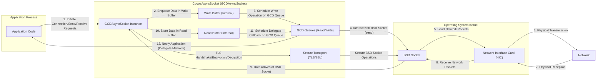
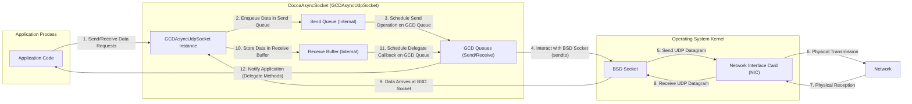

# Project Design Document: CocoaAsyncSocket Integration Analysis

**Project Name:** CocoaAsyncSocket Integration Analysis

**Version:** 1.1

**Date:** October 26, 2023

**Author:** AI Software Architect

## 1. Introduction

This document provides an enhanced and more detailed design overview of the CocoaAsyncSocket library, with a specific focus on aspects relevant to threat modeling. It delves into the library's architecture, key components, and data flow patterns for both TCP and UDP communication. This document serves as a crucial foundation for subsequent threat modeling activities, enabling a comprehensive understanding of potential security vulnerabilities, attack surfaces, and threat vectors. The target project is the well-established open-source library available at [https://github.com/robbiehanson/cocoaasyncsocket](https://github.com/robbiehanson/cocoaasyncsocket).

## 2. Goals and Objectives

The primary goal of this document is to provide a clear, comprehensive, and security-focused architectural description of CocoaAsyncSocket. The objectives are to:

*   Thoroughly identify the key components within the library and meticulously describe their individual responsibilities and interactions.
*   Clearly illustrate the data flow for both TCP (connection-oriented) and UDP (connectionless) communication paradigms.
*   Explicitly highlight critical design decisions and implementation details that have direct relevance to security considerations and potential vulnerabilities.
*   Provide intuitive visual representations of the architecture and data flow using Mermaid diagrams to aid understanding.
*   Serve as a definitive reference for security analysts and developers involved in threat modeling and secure integration of CocoaAsyncSocket.

## 3. Architectural Overview

CocoaAsyncSocket is a robust and widely-used asynchronous socket networking library specifically designed for Apple's operating systems, macOS and iOS. It offers a significant level of abstraction over the lower-level BSD sockets, simplifying the complexities involved in developing network-aware applications. The library is fundamentally built upon Apple's Grand Central Dispatch (GCD) framework, enabling highly efficient and performant asynchronous operations, crucial for maintaining responsive user interfaces and handling concurrent network events.

The core functionality of CocoaAsyncSocket is encapsulated within two primary classes, each catering to a specific network protocol:

*   **`GCDAsyncSocket`**: This class is the cornerstone for managing asynchronous TCP connections, providing a rich set of features for reliable, connection-oriented communication.
*   **`GCDAsyncUdpSocket`**: This class is designed for handling asynchronous UDP communication, facilitating connectionless data exchange.

These core classes abstract away the intricacies of direct socket manipulation, providing developers with a more manageable interface through delegate methods. These delegates are the primary mechanism for applications to receive notifications about important socket events, such as successful connection establishment, incoming data, and connection closures.

## 4. Component Description

Here's a more detailed breakdown of the key components within the CocoaAsyncSocket library, emphasizing their roles and potential security implications:

*   **`GCDAsyncSocket`**: The central and most feature-rich class responsible for managing asynchronous TCP connections. Its responsibilities include:
    *   **Connection Management:** Initiating outgoing TCP connections to remote hosts and accepting incoming connection requests when acting as a server (listening socket).
    *   **Data Transmission and Reception:**  Asynchronously sending and receiving streams of data over established TCP connections, handling buffering and fragmentation.
    *   **Socket Lifecycle Management:**  Managing the complete lifecycle of a TCP socket, from initial connection establishment to graceful disconnection and closure.
    *   **TLS/SSL Integration:**  Providing built-in support for Transport Layer Security (TLS) and its predecessor, Secure Sockets Layer (SSL), enabling secure, encrypted communication channels. This involves managing the TLS/SSL handshake process and the encryption/decryption of data.
    *   **Delegate Dispatch:**  Dispatching events and notifications to its assigned delegate object, informing the application about connection status, data availability, and errors.
*   **`GCDAsyncUdpSocket`**: The primary class for managing asynchronous UDP communication, focusing on connectionless datagram exchange. Its responsibilities include:
    *   **Datagram Transmission and Reception:** Asynchronously sending and receiving individual UDP datagrams.
    *   **Port Binding:**  Binding the socket to a specific local port to listen for incoming UDP traffic.
    *   **Multicast Group Management:**  Supporting the joining and leaving of multicast groups, enabling participation in multicast communication.
    *   **Delegate Dispatch:** Dispatching events and notifications to its assigned delegate object, primarily for informing the application about received UDP datagrams.
*   **Delegates (e.g., `<GCDAsyncSocketDelegate>`, `<GCDAsyncUdpSocketDelegate>`)**: Protocols that define a contract for receiving notifications and handling events related to socket operations. These protocols are implemented by the application code that utilizes CocoaAsyncSocket. Key delegate methods include:
    *   **TCP Delegate Methods (`<GCDAsyncSocketDelegate>`):**
        *   `socket:didConnectToHost:port:`:  Informs the delegate when a TCP connection has been successfully established.
        *   `socket:didAcceptNewSocket:`:  (For listening sockets) Notifies the delegate when a new incoming TCP connection has been accepted.
        *   `socket:didReadData:withTag:`:  Indicates that data has been successfully read from the socket. The `tag` parameter allows for identifying specific read operations.
        *   `socket:didWriteDataWithTag:`:  Indicates that data has been successfully written to the socket. The `tag` parameter allows for identifying specific write operations.
        *   `socketDidDisconnect:withError:`:  Informs the delegate that the TCP connection has been closed, potentially providing an `NSError` object detailing the reason for disconnection.
        *   `socket:didReceiveTrust:completionHandler:`: Allows the delegate to evaluate the server's trust object during TLS handshake. Improper handling can lead to man-in-the-middle attacks.
    *   **UDP Delegate Methods (`<GCDAsyncUdpSocketDelegate>`):**
        *   `udpSocket:didReceiveData:fromAddress:withFilterContext:`:  Notifies the delegate when a UDP datagram has been received, providing the data, the sender's address, and an optional filter context.
        *   `udpSocket:didSendDataWithTag:`: Indicates that a UDP datagram has been successfully sent.
        *   `udpSocket:didNotSendDataWithTag:dueToError:`: Indicates that a UDP datagram could not be sent due to an error.
*   **Run Loops**: CocoaAsyncSocket leverages the concept of run loops, a fundamental part of the Foundation framework, to manage asynchronous operations. The library can be configured to operate on the current thread's run loop or a dedicated, private run loop. This mechanism allows the library to efficiently handle network events without blocking the main application thread.
*   **Grand Central Dispatch (GCD)**: The underlying concurrency framework provided by Apple, which CocoaAsyncSocket heavily relies upon for managing asynchronous tasks and dispatching events. GCD queues are used internally for scheduling socket operations and ensuring that delegate method calls are executed on the appropriate threads. This is crucial for maintaining thread safety and responsiveness.
*   **BSD Sockets**: The foundational, low-level networking interface provided by the operating system kernel. CocoaAsyncSocket acts as an abstraction layer on top of these raw sockets, simplifying their usage and providing a more object-oriented approach to network programming.
*   **TLS/SSL (via Secure Transport)**: For secure TCP communication, CocoaAsyncSocket integrates with Apple's Secure Transport framework (now superseded by Network.framework's TLS implementation in newer OS versions, but still relevant for compatibility). This framework handles the complexities of establishing secure connections, including certificate validation, encryption algorithm negotiation, and data encryption/decryption.

## 5. Data Flow

The data flow within CocoaAsyncSocket is crucial to understand for identifying potential points of interception or manipulation.

### 5.1. TCP Data Flow (Detailed)

**Detailed Data Flow Description (TCP):**

1. The application initiates a connection, sends data, or requests to receive data by interacting with a `GCDAsyncSocket` instance.
2. For sending data, the data is first placed into an internal write buffer managed by `GCDAsyncSocket`.
3. The `GCDAsyncSocket` then schedules the write operation on one of its internal GCD queues, ensuring asynchronous execution.
4. The GCD queue worker thread interacts with the underlying BSD socket to send the data.
5. The operating system's network stack sends the data as network packets through the network interface card.
6. The packets travel across the network to the destination.
7. Upon arrival at the destination, the network interface card receives the packets.
8. The operating system's network stack processes the incoming packets.
9. The received data is made available to the BSD socket associated with the `GCDAsyncSocket` instance.
10. `GCDAsyncSocket` reads the data from the BSD socket and stores it in an internal read buffer.
11. `GCDAsyncSocket` schedules a delegate callback on a GCD queue to notify the application about the received data.
12. The application's delegate method (e.g., `socket:didReadData:withTag:`) is invoked, providing the received data.
13. If TLS/SSL is enabled, the `Secure Transport` framework within `GCDAsyncSocket` handles the encryption of outgoing data before it reaches the BSD socket and the decryption of incoming data after it's read from the BSD socket.

### 5.2. UDP Data Flow (Detailed)

**Detailed Data Flow Description (UDP):**

1. The application sends or receives UDP datagrams by interacting with a `GCDAsyncUdpSocket` instance.
2. For sending, the data is placed into an internal send queue.
3. The `GCDAsyncUdpSocket` schedules the send operation on a GCD queue.
4. The GCD queue worker thread interacts with the BSD socket using the `sendto` system call.
5. The operating system sends the UDP datagram through the network interface card.
6. The datagram travels across the network.
7. Upon arrival, the network interface card receives the datagram.
8. The operating system makes the received datagram available to the BSD socket.
9. `GCDAsyncUdpSocket` reads the data from the BSD socket.
10. The received data is stored in an internal receive buffer.
11. `GCDAsyncUdpSocket` schedules a delegate callback.
12. The application's delegate method (`udpSocket:didReceiveData:fromAddress:withFilterContext:`) is invoked, providing the received data and sender information.

## 6. Security Considerations (Enhanced)

Understanding the architecture and data flow allows for a more targeted analysis of potential security vulnerabilities:

*   **Transport Layer Security (TLS/SSL) Vulnerabilities:**
    *   **Insecure Configuration:**  Using weak cipher suites or failing to enforce certificate validation can leave connections vulnerable to man-in-the-middle attacks.
    *   **Downgrade Attacks:**  Attackers might attempt to force the use of older, less secure TLS/SSL versions.
    *   **Implementation Flaws:**  Bugs or vulnerabilities within the underlying Secure Transport framework (or its successor) could compromise the security of encrypted connections.
    *   **Certificate Pinning Issues:**  Incorrect or absent certificate pinning can lead to acceptance of fraudulent certificates.
*   **Data Validation and Sanitization Weaknesses:**
    *   **Injection Attacks:** Failure to properly validate and sanitize data received from the network can lead to various injection attacks (e.g., SQL injection if the data is used in database queries, command injection if executed as system commands).
    *   **Cross-Site Scripting (XSS):** If network data is used in a web context without proper encoding, it can lead to XSS vulnerabilities.
    *   **Buffer Overflow:**  Insufficient bounds checking on incoming data could lead to buffer overflows, potentially allowing attackers to execute arbitrary code.
*   **Denial of Service (DoS) Attack Vectors:**
    *   **SYN Floods (TCP):**  Attackers can flood the server with connection requests without completing the handshake, exhausting server resources.
    *   **UDP Floods:**  Sending a large volume of UDP packets to overwhelm the target.
    *   **Resource Exhaustion:**  Exploiting the application's handling of network events to consume excessive memory, CPU, or network bandwidth.
    *   **Amplification Attacks (UDP):**  Sending small requests to servers that respond with much larger payloads, amplifying the attack traffic.
*   **Error Handling and Information Disclosure:**
    *   **Verbose Error Messages:**  Revealing sensitive information in error messages (e.g., internal paths, database details) can aid attackers.
    *   **Lack of Rate Limiting:**  Failing to limit the rate of connection attempts or requests can make the application susceptible to brute-force attacks.
*   **UDP-Specific Security Risks:**
    *   **IP Address Spoofing:**  Attackers can forge the source IP address of UDP packets, making it difficult to trace the origin of malicious traffic.
    *   **Lack of Guaranteed Delivery:**  UDP does not guarantee delivery, order, or prevention of duplication, which can be exploited in certain attack scenarios.
*   **Delegate Implementation Vulnerabilities:**
    *   **Unsecured Data Handling:**  Vulnerabilities in the application's delegate methods that process received data can be exploited.
    *   **Race Conditions:**  Improper synchronization in delegate methods could lead to race conditions and unexpected behavior.
*   **Memory Management Issues:**
    *   **Memory Leaks:**  Failure to properly release allocated memory for buffers or socket objects can lead to resource exhaustion over time.
    *   **Use-After-Free:**  Accessing memory that has already been freed can lead to crashes or exploitable vulnerabilities.

## 7. Deployment Considerations

CocoaAsyncSocket is typically deployed as a linked library within macOS or iOS applications. The security of the deployed application is heavily influenced by:

*   **Secure Coding Practices:**  The application's implementation of delegate methods and its handling of network data are critical.
*   **Operating System Security:**  The underlying security features of macOS or iOS play a role in protecting the application and its network connections.
*   **Network Configuration:**  Firewall rules and network security policies can impact the application's exposure to threats.

## 8. Future Considerations

*   **Migration to Network.framework:**  Considering the eventual transition to Apple's more modern Network.framework, which offers enhanced features and security capabilities.
*   **Improved TLS Configuration Options:**  Providing more fine-grained control over TLS settings and potentially integrating with certificate management APIs.
*   **Security Audits and Best Practices:**  Regularly reviewing the library's code and promoting secure coding practices for its users.

This enhanced design document provides a more in-depth understanding of CocoaAsyncSocket, highlighting critical aspects for effective threat modeling. The detailed component descriptions, data flow diagrams, and expanded security considerations offer a solid foundation for identifying and mitigating potential vulnerabilities.