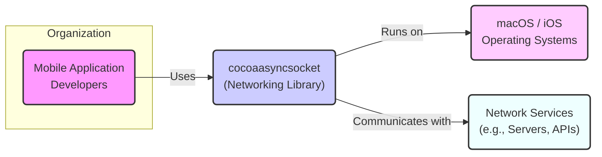
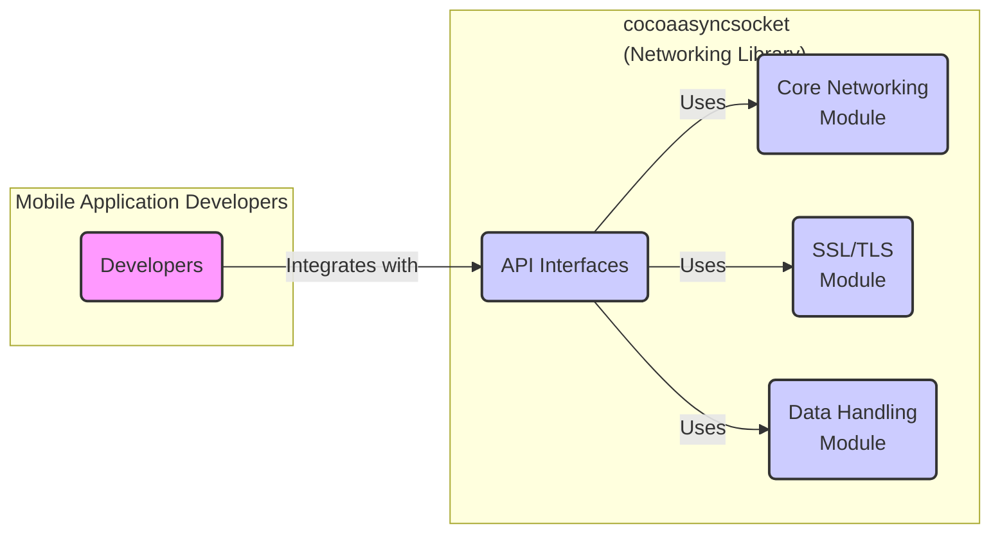
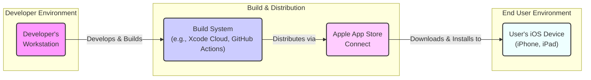

# BUSINESS POSTURE

This project, cocoaasyncsocket, is an open-source asynchronous socket networking library for macOS, iOS, watchOS, and tvOS. It provides developers with a robust and efficient way to handle network communications in their applications.

- Business Priorities and Goals:
  - Provide a reliable and performant networking library for Apple platforms.
  - Simplify asynchronous socket programming for developers.
  - Offer a feature-rich alternative to Apple's native networking APIs.
  - Maintain an active and supportive open-source community around the library.

- Most Important Business Risks:
  - Risk of security vulnerabilities within the library that could be exploited by malicious actors in applications using it.
  - Risk of bugs or instability in the library leading to application crashes or unexpected behavior.
  - Risk of lack of maintenance or updates, causing the library to become outdated or incompatible with newer platform versions.
  - Risk of supply chain attacks if dependencies are compromised or malicious code is introduced into the library's codebase or distribution channels.

# SECURITY POSTURE

- Existing Security Controls:
  - security control: Code is publicly available on GitHub for review. Implemented: GitHub repository.
  - security control: Issue tracking system on GitHub for reporting bugs and potential vulnerabilities. Implemented: GitHub Issues.
  - accepted risk: Reliance on community contributions for security reviews and vulnerability identification.
  - accepted risk: Limited formal security audits or penetration testing.

- Recommended Security Controls:
  - security control: Implement automated static analysis security testing (SAST) in the CI/CD pipeline to identify potential vulnerabilities in code changes.
  - security control: Introduce dependency scanning to identify and manage known vulnerabilities in third-party dependencies.
  - security control: Establish a clear vulnerability disclosure and response policy to handle reported security issues effectively.
  - security control: Encourage and facilitate community security audits and code reviews.

- Security Requirements:
  - Authentication:
    - Requirement: The library itself does not handle authentication directly, as it is a lower-level networking library. Applications using cocoaasyncsocket are responsible for implementing authentication mechanisms appropriate for their use cases on top of the socket connections.
  - Authorization:
    - Requirement: Similar to authentication, authorization is the responsibility of the applications using cocoaasyncsocket. The library should provide mechanisms to facilitate secure communication channels that can be used for authorization processes implemented by applications.
  - Input Validation:
    - Requirement: The library must perform robust input validation on all data received from network sockets to prevent vulnerabilities such as buffer overflows, format string bugs, and other injection attacks. This includes validating data formats, lengths, and types.
  - Cryptography:
    - Requirement: While cocoaasyncsocket itself might not implement high-level cryptographic protocols, it should provide support for secure socket layer/transport layer security (SSL/TLS) to enable applications to establish encrypted communication channels. The library should correctly handle SSL/TLS handshakes and certificate validation if it provides SSL/TLS functionality.

# DESIGN

## C4 CONTEXT



- Context Diagram Elements:
  - Element:
    - Name: Mobile Application Developers
    - Type: Person
    - Description: Developers who build macOS, iOS, watchOS, and tvOS applications that require network communication capabilities.
    - Responsibilities: Utilize cocoaasyncsocket library to implement network features in their applications.
    - Security controls: Responsible for securely integrating and using the library in their applications, including implementing application-level security measures.
  - Element:
    - Name: cocoaasyncsocket (Networking Library)
    - Type: Software System
    - Description: An asynchronous socket networking library providing APIs for handling TCP and UDP network connections on Apple platforms.
    - Responsibilities: Provide robust, efficient, and secure networking functionalities to applications. Handle socket operations, data transfer, and connection management.
    - Security controls: Input validation on network data, support for secure communication protocols (SSL/TLS), and adherence to secure coding practices.
  - Element:
    - Name: macOS / iOS Operating Systems
    - Type: Software System
    - Description: Apple's operating systems that provide the runtime environment for applications using cocoaasyncsocket.
    - Responsibilities: Provide system-level networking functionalities, resource management, and security features for applications.
    - Security controls: Operating system level security controls, including sandboxing, memory protection, and network security policies.
  - Element:
    - Name: Network Services (e.g., Servers, APIs)
    - Type: Software System
    - Description: External systems that applications using cocoaasyncsocket communicate with over the network. These can be backend servers, APIs, or other network-based services.
    - Responsibilities: Provide data and services to applications over the network. Implement their own security measures to protect their services and data.
    - Security controls: Server-side security controls, including authentication, authorization, input validation, and network security measures.

## C4 CONTAINER



- Container Diagram Elements:
  - Element:
    - Name: Developers
    - Type: Person
    - Description: Mobile application developers who integrate cocoaasyncsocket into their projects.
    - Responsibilities: Integrate the library into their applications, utilize its APIs, and ensure secure usage within their application context.
    - Security controls: Secure coding practices, proper configuration of the library, and application-level security measures.
  - Element:
    - Name: Core Networking Module
    - Type: Container/Module
    - Description: The core component of cocoaasyncsocket responsible for handling low-level socket operations, connection management (TCP, UDP), and asynchronous event handling.
    - Responsibilities: Provide fundamental networking functionalities, manage socket connections, handle data transfer, and ensure efficient network communication.
    - Security controls: Input validation on network data, memory safety, and prevention of common socket-related vulnerabilities (e.g., denial of service).
  - Element:
    - Name: SSL/TLS Module
    - Type: Container/Module
    - Description: Module responsible for providing SSL/TLS encryption capabilities, enabling secure communication channels.
    - Responsibilities: Handle SSL/TLS handshake, certificate validation, encryption and decryption of data transmitted over sockets.
    - Security controls: Proper implementation of SSL/TLS protocols, secure key management (if applicable within the library), and protection against known SSL/TLS vulnerabilities.
  - Element:
    - Name: Data Handling Module
    - Type: Container/Module
    - Description: Module responsible for processing and managing data received and sent over network connections. This includes buffering, parsing, and potentially data format conversions.
    - Responsibilities: Efficiently handle data streams, ensure data integrity, and provide APIs for data manipulation.
    - Security controls: Input validation on received data, prevention of buffer overflows, and protection against data injection attacks.
  - Element:
    - Name: API Interfaces
    - Type: Container/Module
    - Description: Publicly exposed APIs that developers use to interact with cocoaasyncsocket library. These APIs provide access to networking functionalities.
    - Responsibilities: Provide a clear, well-documented, and secure interface for developers to utilize the library's features.
    - Security controls: API design that encourages secure usage, input validation at API boundaries, and clear documentation on security considerations for developers.

## DEPLOYMENT

For an open-source library like cocoaasyncsocket, deployment primarily refers to its distribution and integration into applications. Applications using this library are then deployed through various methods depending on the target platform (macOS, iOS, etc.).

Deployment Architecture for Applications Using cocoaasyncsocket (Example - iOS App Store Deployment):



- Deployment Diagram Elements:
  - Element:
    - Name: Developer's Workstation
    - Type: Environment
    - Description: The local machine used by developers to write code, integrate cocoaasyncsocket, and build applications.
    - Responsibilities: Development, local testing, and preparation of application builds for distribution.
    - Security controls: Developer workstation security practices, code review processes, and secure development environment setup.
  - Element:
    - Name: Build System (e.g., Xcode Cloud, GitHub Actions)
    - Type: Environment
    - Description: Automated build and CI/CD environment used to compile, test, and package the application.
    - Responsibilities: Automated building, testing, and packaging of the application. Potentially includes steps like static analysis and security checks.
    - Security controls: Secure build pipelines, access control to build systems, and integration of security scanning tools in the build process.
  - Element:
    - Name: Apple App Store Connect
    - Type: Environment
    - Description: Apple's platform for distributing iOS applications to the App Store.
    - Responsibilities: Application distribution, app review process, and delivery to end-user devices.
    - Security controls: Apple's App Store review process, code signing, and platform security features.
  - Element:
    - Name: User's iOS Device (iPhone, iPad)
    - Type: Environment
    - Description: End-user devices where applications using cocoaasyncsocket are installed and run.
    - Responsibilities: Running applications, executing network communication using cocoaasyncsocket, and user data protection.
    - Security controls: iOS operating system security features, application sandboxing, and user privacy controls.

## BUILD

```mermaid
flowchart LR
    A("Developer") --> B{{"Code Changes\n(GitHub)}}
    B --> C("GitHub Actions\n(CI/CD)")
    C --> D{{"Build & Test\n(Xcodebuild, Tests)"}}
    D --> E{{"Security Checks\n(SAST, Dependency Scan)"}}
    E --> F{{"Build Artifacts\n(Library Binaries, Headers)"}}
    F --> G{{"Distribution\n(CocoaPods, Swift Package Manager, GitHub Releases)"}}

    style A fill:#f9f,stroke:#333,stroke-width:2px
    style B fill:#ccf,stroke:#333,stroke-width:2px
    style C fill:#ccf,stroke:#333,stroke-width:2px
    style D fill:#ccf,stroke:#333,stroke-width:2px
    style E fill:#ccf,stroke:#333,stroke-width:2px
    style F fill:#ccf,stroke:#333,stroke-width:2px
    style G fill:#ccf,stroke:#333,stroke-width:2px
```

- Build Process Elements:
  - Element:
    - Name: Developer
    - Type: Person
    - Description: Software developer contributing to the cocoaasyncsocket project.
    - Responsibilities: Writing code, fixing bugs, adding features, and submitting code changes via pull requests.
    - Security controls: Secure coding practices, code review participation, and adherence to project contribution guidelines.
  - Element:
    - Name: Code Changes (GitHub)
    - Type: Data Store/Version Control
    - Description: GitHub repository hosting the source code of cocoaasyncsocket and managing code changes through version control.
    - Responsibilities: Version control, code collaboration, and tracking code history.
    - Security controls: Access control to the repository, branch protection rules, and audit logging of code changes.
  - Element:
    - Name: GitHub Actions (CI/CD)
    - Type: Build System/Automation
    - Description: GitHub's CI/CD platform used to automate the build, test, and potentially release processes for cocoaasyncsocket.
    - Responsibilities: Automated build execution, running tests, performing security checks, and creating build artifacts.
    - Security controls: Secure CI/CD pipeline configuration, access control to workflows and secrets, and audit logging of build activities.
  - Element:
    - Name: Build & Test (Xcodebuild, Tests)
    - Type: Build Process Step
    - Description: Compilation of the source code using Xcodebuild and execution of automated unit and integration tests to ensure code quality and functionality.
    - Responsibilities: Compiling code, running tests, and verifying the correctness of the library.
    - Security controls: Secure build environment, dependency management, and test coverage to identify potential issues.
  - Element:
    - Name: Security Checks (SAST, Dependency Scan)
    - Type: Build Process Step
    - Description: Integration of security scanning tools like Static Application Security Testing (SAST) and dependency vulnerability scanners to identify potential security flaws in the code and dependencies.
    - Responsibilities: Automated security vulnerability detection and reporting during the build process.
    - Security controls: Configuration and integration of security scanning tools, vulnerability reporting, and remediation processes.
  - Element:
    - Name: Build Artifacts (Library Binaries, Headers)
    - Type: Data Store/Output
    - Description: Compiled library binaries (e.g., .framework, .xcframework) and header files that are the output of the build process.
    - Responsibilities: Packaging the compiled library for distribution and integration into applications.
    - Security controls: Integrity checks on build artifacts, secure storage of artifacts, and code signing (if applicable).
  - Element:
    - Name: Distribution (CocoaPods, Swift Package Manager, GitHub Releases)
    - Type: Distribution Channel
    - Description: Mechanisms used to distribute the cocoaasyncsocket library to developers, such as package managers (CocoaPods, Swift Package Manager) and GitHub Releases.
    - Responsibilities: Making the library easily accessible to developers for integration into their projects.
    - Security controls: Secure distribution channels, integrity verification of distributed packages, and clear documentation on how to securely consume the library.

# RISK ASSESSMENT

- Critical Business Processes:
  - For cocoaasyncsocket as a library, the critical business process is providing reliable and secure networking functionality to applications that depend on it. The success of applications built using this library indirectly depends on the library's quality and security. If the library is compromised, applications using it and their users could be affected.

- Data to Protect and Sensitivity:
  - Data handled by cocoaasyncsocket is network traffic data. The sensitivity of this data depends entirely on the applications using the library. It could range from publicly accessible data to highly sensitive personal or financial information. Cocoaasyncsocket itself should be designed to handle all network data securely, regardless of its sensitivity, as it is a foundational component for network communication. The primary concern is ensuring the library does not introduce vulnerabilities that could expose data handled by applications using it.

# QUESTIONS & ASSUMPTIONS

- Questions:
  - What is the intended scope of security responsibility for the cocoaasyncsocket project maintainers versus the developers using the library?
  - Are there any specific compliance requirements (e.g., HIPAA, GDPR) that applications using cocoaasyncsocket might need to adhere to, and how does the library assist or impact these requirements?
  - Are there plans for formal security audits or penetration testing of cocoaasyncsocket in the future?
  - What is the process for reporting and addressing security vulnerabilities in cocoaasyncsocket?

- Assumptions:
  - BUSINESS POSTURE: The primary business goal is to provide a useful and reliable open-source networking library for the Apple ecosystem. Security is a high priority to maintain trust and prevent harm to users of applications built with the library.
  - SECURITY POSTURE: Current security controls are primarily based on open-source community review and issue reporting. There is an opportunity to enhance security posture through automated security testing and a more formalized vulnerability management process.
  - DESIGN: The library is designed to be a modular and efficient networking component. Security considerations are incorporated into the design, particularly around input validation and support for secure communication protocols. The deployment model assumes distribution through common package managers and direct integration into application build processes. The build process is assumed to be automated using CI/CD, offering opportunities to integrate security checks.