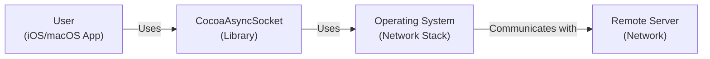
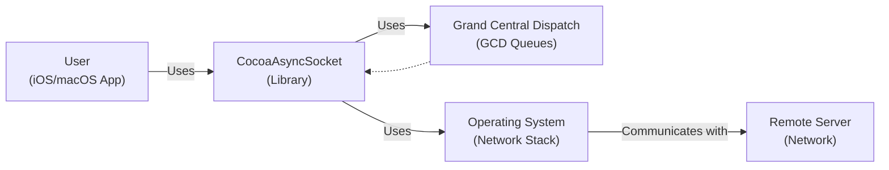
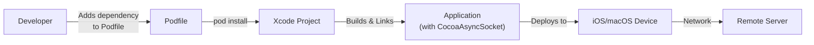
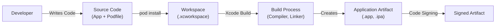

Okay, let's create a design document for the CocoaAsyncSocket project.

# BUSINESS POSTURE

Business Priorities and Goals:

*   Provide a robust, reliable, and easy-to-use asynchronous socket networking library for iOS and macOS developers.
*   Minimize the complexity of implementing network communication in applications.
*   Support a wide range of networking protocols (TCP, UDP) and use cases.
*   Maintain high performance and efficiency to minimize battery drain and network overhead.
*   Ensure compatibility with the latest Apple operating systems and devices.
*   Foster a strong open-source community around the library.

Most Important Business Risks:

*   Security vulnerabilities in the library could expose applications using it to attacks, leading to data breaches, compromised devices, or denial-of-service.
*   Bugs or performance issues could negatively impact the user experience of applications relying on the library.
*   Lack of compatibility with future OS versions or devices could limit the library's usefulness and adoption.
*   Failure to keep up with evolving networking standards and best practices could make the library obsolete.
*   Insufficient community engagement could hinder the library's development and maintenance.

# SECURITY POSTURE

Existing Security Controls:

*   security control: The library itself is a low-level networking component and does not directly handle application-level security concerns like authentication or encryption. It relies on the application developer to implement these features using appropriate APIs (e.g., TLS/SSL for secure communication). Described in project documentation.
*   security control: The library provides APIs for configuring socket options, including some security-related options (e.g., enabling TLS). Described in project documentation.
*   security control: The project uses GitHub for source code management, which provides some built-in security features like access control and audit logs. Described in GitHub documentation.
*   security control: The project has some level of community involvement, which can help with identifying and reporting security vulnerabilities. Described in GitHub Issues and Pull Requests.

Accepted Risks:

*   accepted risk: The library, by its nature, handles raw network data. It is the responsibility of the application developer to ensure that this data is handled securely and that appropriate input validation and sanitization are performed.
*   accepted risk: The library relies on the underlying operating system's networking stack for security. Any vulnerabilities in the OS could potentially impact applications using the library.
*   accepted risk: The library does not implement any specific anti-DoS measures. It is the responsibility of the application developer to implement such measures if needed.

Recommended Security Controls:

*   security control: Integrate with code analysis tools (static and dynamic) to identify potential vulnerabilities during development.
*   security control: Conduct regular security reviews and penetration testing of the library.
*   security control: Provide clear documentation and guidance on secure usage of the library, including best practices for implementing TLS/SSL, input validation, and other security measures.
*   security control: Establish a vulnerability disclosure program to encourage responsible reporting of security issues.
*   security control: Consider adding support for network security features like certificate pinning.

Security Requirements:

*   Authentication: The library itself does not handle authentication. Application developers must implement authentication mechanisms using appropriate frameworks and protocols.
*   Authorization: The library itself does not handle authorization. Application developers must implement authorization mechanisms based on their application's requirements.
*   Input Validation: The library does not perform application-level input validation. Application developers must validate and sanitize all data received from the network to prevent injection attacks and other vulnerabilities.
*   Cryptography: The library supports TLS/SSL for secure communication, but it is the responsibility of the application developer to configure and use it correctly. The library should provide clear APIs for enabling and configuring TLS/SSL.

# DESIGN

## C4 CONTEXT

Element Descriptions:

*   Element:
    *   Name: User
    *   Type: iOS/macOS Application
    *   Description: An application built for iOS or macOS that utilizes CocoaAsyncSocket for network communication.
    *   Responsibilities: Initiates network connections, sends and receives data, handles application logic, implements security measures (authentication, authorization, encryption).
    *   Security controls: Implements application-level security (authentication, authorization, input validation, encryption), uses secure coding practices.

*   Element:
    *   Name: CocoaAsyncSocket
    *   Type: Library
    *   Description: An asynchronous socket networking library for iOS and macOS.
    *   Responsibilities: Provides an API for creating and managing network sockets, handles asynchronous I/O operations, manages connection state.
    *   Security controls: Provides APIs for configuring security-related socket options (e.g., TLS), relies on the OS for underlying security.

*   Element:
    *   Name: Operating System
    *   Type: Network Stack
    *   Description: The underlying operating system's networking stack (e.g., Darwin/BSD sockets).
    *   Responsibilities: Handles low-level network communication, manages network interfaces, enforces system-level security policies.
    *   Security controls: Implements system-level security features (firewall, network isolation), provides secure networking APIs.

*   Element:
    *   Name: Remote Server
    *   Type: Network
    *   Description: A remote server or service that the application communicates with.
    *   Responsibilities: Responds to network requests, processes data, provides services to the application.
    *   Security controls: Implements server-side security measures (authentication, authorization, input validation, encryption, DoS protection).

## C4 CONTAINER

Since CocoaAsyncSocket is a single library, the Container diagram is essentially the same as the Context diagram, with a bit more detail within the library itself.

Element Descriptions:

*   Element:
    *   Name: User
    *   Type: iOS/macOS Application
    *   Description: An application built for iOS or macOS that utilizes CocoaAsyncSocket for network communication.
    *   Responsibilities: Initiates network connections, sends and receives data, handles application logic, implements security measures (authentication, authorization, encryption).
    *   Security controls: Implements application-level security (authentication, authorization, input validation, encryption), uses secure coding practices.

*   Element:
    *   Name: CocoaAsyncSocket
    *   Type: Library
    *   Description: An asynchronous socket networking library for iOS and macOS.
    *   Responsibilities: Provides an API for creating and managing network sockets, handles asynchronous I/O operations, manages connection state.
    *   Security controls: Provides APIs for configuring security-related socket options (e.g., TLS), relies on the OS for underlying security.

*  Element:
    *   Name: Grand Central Dispatch
    *   Type: GCD Queues
    *   Description: System library that manage execution of tasks.
    *   Responsibilities: Provides asynchronous execution of tasks.
    *   Security controls: N/A

*   Element:
    *   Name: Operating System
    *   Type: Network Stack
    *   Description: The underlying operating system's networking stack (e.g., Darwin/BSD sockets).
    *   Responsibilities: Handles low-level network communication, manages network interfaces, enforces system-level security policies.
    *   Security controls: Implements system-level security features (firewall, network isolation), provides secure networking APIs.

*   Element:
    *   Name: Remote Server
    *   Type: Network
    *   Description: A remote server or service that the application communicates with.
    *   Responsibilities: Responds to network requests, processes data, provides services to the application.
    *   Security controls: Implements server-side security measures (authentication, authorization, input validation, encryption, DoS protection).

## DEPLOYMENT

CocoaAsyncSocket is a library, not a standalone application. Therefore, "deployment" refers to how it's integrated into an application and how that application is deployed. There are several common methods:

1.  **CocoaPods:** A dependency manager for Swift and Objective-C Cocoa projects.
2.  **Carthage:** A decentralized dependency manager for Cocoa.
3.  **Swift Package Manager:**  Apple's built-in package manager.
4.  **Manual Integration:**  Copying the source files directly into the project.

We'll describe deployment using CocoaPods, as it's a very common method.

Element Descriptions:

*   Element:
    *   Name: Developer
    *   Type: Human
    *   Description: The developer integrating CocoaAsyncSocket into their application.
    *   Responsibilities: Adds the library as a dependency, configures the project, writes code using the library.
    *   Security controls: Follows secure coding practices, uses strong passwords, keeps development tools up to date.

*   Element:
    *   Name: Podfile
    *   Type: Configuration File
    *   Description: A file that specifies the dependencies for a CocoaPods project.
    *   Responsibilities: Lists the required libraries, including CocoaAsyncSocket and its version.
    *   Security controls: Uses version pinning to avoid unintended updates, potentially uses checksums to verify integrity.

*   Element:
    *   Name: Xcode Project
    *   Type: Development Environment
    *   Description: The Apple Xcode project for the application.
    *   Responsibilities: Manages source code, build settings, and dependencies.
    *   Security controls: Uses code signing, sandboxing, and other security features provided by Xcode.

*   Element:
    *   Name: Application
    *   Type: Executable
    *   Description: The built application, including the linked CocoaAsyncSocket library.
    *   Responsibilities: Performs the application's functionality, including network communication using CocoaAsyncSocket.
    *   Security controls: Implements application-level security measures, uses secure coding practices.

*   Element:
    *   Name: iOS/macOS Device
    *   Type: Hardware
    *   Description: The device (iPhone, iPad, Mac) on which the application is running.
    *   Responsibilities: Executes the application, provides the operating environment.
    *   Security controls: Enforces OS-level security features (sandboxing, code signing verification).

*   Element:
    *   Name: Remote Server
    *   Type: Network
    *   Description: A remote server or service that the application communicates with.
    *   Responsibilities: Responds to network requests.
    *   Security controls: Implements server-side security.

## BUILD

The build process for CocoaAsyncSocket itself (as a library) and for applications using it are distinct. We'll focus on the build process for an *application* using CocoaAsyncSocket, assuming CocoaPods for dependency management.

Element Descriptions and Security Controls:

*   Developer: Writes the application code and the Podfile.
    *   security control: Secure coding practices.
    *   security control: Secure development environment.

*   Source Code: Includes the application's source code and the Podfile specifying CocoaAsyncSocket as a dependency.

*   `pod install`: This command (part of CocoaPods) downloads CocoaAsyncSocket (and other dependencies) and creates an Xcode workspace (.xcworkspace) that integrates the application code with the libraries.
    *   security control: CocoaPods can verify the integrity of downloaded packages using checksums (if configured).
    *   security control: Dependency version pinning in the Podfile prevents unexpected updates to potentially vulnerable versions.

*   Workspace (.xcworkspace): The Xcode workspace combines the application project and the CocoaPods-managed dependencies.

*   Xcode Build: The developer uses Xcode to build the application. This involves compiling the application code and linking it with CocoaAsyncSocket (and other libraries).
    *   security control: Xcode's compiler can perform static analysis to detect some security vulnerabilities.
    *   security control: Linking with a known, trusted version of CocoaAsyncSocket (managed by CocoaPods).

*   Build Process: Compiler and Linker.

*   Application Artifact (.app, .ipa): The output of the build process is an application bundle (.app for macOS, .ipa for iOS).

*   Code Signing: The application artifact is code-signed using a developer certificate.
    *   security control: Code signing ensures the integrity and authenticity of the application. It helps prevent tampering and verifies the developer's identity.

*   Signed Artifact.

# RISK ASSESSMENT

Critical Business Processes:

*   Network communication between the application and remote servers. This is the core functionality enabled by CocoaAsyncSocket.
*   Data exchange between the application and the user.
*   Application functionality that relies on network connectivity.

Data to Protect and Sensitivity:

*   The library itself does not handle *specific* data. The sensitivity of the data depends entirely on the *application* using CocoaAsyncSocket.
*   Potentially sensitive data transmitted over the network (e.g., user credentials, personal information, financial data). Sensitivity: HIGH (if the application handles such data). The application developer is responsible for protecting this data using encryption (TLS/SSL) and other security measures.
*   Network connection metadata (e.g., IP addresses, ports, connection times). Sensitivity: LOW to MEDIUM. This data could potentially be used for tracking or profiling, but it's generally less sensitive than the content of the communication.
*   Application configuration data. Sensitivity: MEDIUM to HIGH.

# QUESTIONS & ASSUMPTIONS

Questions:

*   Are there any specific compliance requirements (e.g., HIPAA, PCI DSS) that applications using CocoaAsyncSocket must adhere to? This would influence the recommendations for application-level security.
*   What is the expected threat model for applications using this library? (e.g., Are they likely to be targeted by sophisticated attackers?)
*   What level of security expertise is expected from developers using CocoaAsyncSocket? This will affect the level of detail and guidance provided in the documentation.
*   What are the plans for long-term maintenance and support of the library, including security updates?
*   Are there any specific performance requirements or constraints for applications using the library?

Assumptions:

*   BUSINESS POSTURE: The primary goal is to provide a reliable and easy-to-use networking library. Security is a high priority, but usability and performance are also important.
*   SECURITY POSTURE: Developers using CocoaAsyncSocket have a basic understanding of network security concepts and are responsible for implementing application-level security measures. The library provides the necessary tools (e.g., TLS support) but does not enforce specific security policies.
*   DESIGN: The library is well-designed and follows best practices for asynchronous programming. The use of GCD is efficient and appropriate. The deployment and build processes are standard for iOS/macOS development.