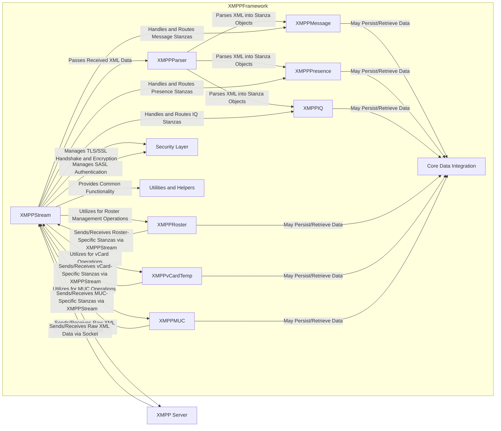
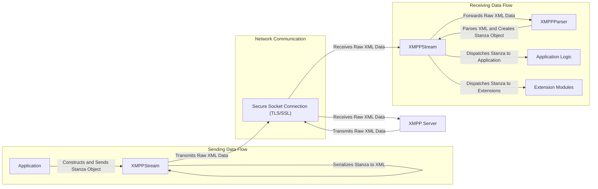

# Project Design Document: XMPPFramework

**Version:** 1.1
**Date:** October 26, 2023
**Prepared By:** [Your Name/AI Assistant]

## 1. Introduction

This document provides an enhanced and more detailed design overview of the XMPPFramework, an Objective-C library meticulously designed for implementing clients adhering to the Extensible Messaging and Presence Protocol (XMPP). This refined document is specifically crafted to serve as a robust foundation for subsequent threat modeling activities, ensuring a comprehensive and nuanced understanding of the framework's architecture, intricate data flow mechanisms, and the interplay of its core components.

## 2. Goals

* Furnish an exceptionally clear, detailed, and comprehensive description of the XMPPFramework's architectural blueprint and its inherent functionalities.
* Precisely identify the key constituent components and meticulously delineate their interactions and dependencies.
* Thoroughly outline the complete data flow lifecycle within the framework, encompassing both ingress and egress pathways.
* Proactively highlight potential security considerations and vulnerabilities arising from the framework's design and operational characteristics.
* Serve as the definitive and authoritative basis for all subsequent threat modeling exercises and security assessments.

## 3. Scope

This document's scope is tightly focused on the internal design intricacies and architectural nuances of the XMPPFramework library itself. It explicitly excludes:

* Specific applications or software solutions built utilizing the XMPPFramework.
* Deployment environments, infrastructure configurations, or operational procedures.
* End-user behavior patterns, interaction modalities, or usage scenarios.
* The exhaustive details of the XMPP protocol specification (a foundational understanding of XMPP is assumed).

## 4. Architectural Overview

The XMPPFramework adopts a modular architectural paradigm, providing a rich set of independent yet interoperable building blocks for constructing sophisticated XMPP clients. The core components orchestrate seamlessly to manage network connections, efficiently parse XML data, adeptly handle various XMPP stanzas (including messages, presence updates, and IQ queries), and effectively manage XMPP extensions.

### 4.1. Key Components

* **`XMPPStream`:**
    * The pivotal class responsible for the entire lifecycle management of the connection to the XMPP server.
    * Encompasses socket creation and management, secure TLS negotiation, and robust authentication procedures.
    * Serves as the primary programmatic interface for both transmitting and receiving XMPP stanzas.
    * Manages the underlying `CFStream` or `NIO` based socket implementation.
* **`XMPPParser`:**
    * The dedicated component responsible for the meticulous parsing of incoming XML data streams originating from the XMPP server, transforming them into structured, readily usable objects.
    * Internally leverages `NSXMLParser` or alternative high-performance XML parsing mechanisms.
    * Implements robust error handling and security measures to mitigate XML-based vulnerabilities.
* **Stanza Modules (e.g., `XMPPMessage`, `XMPPPresence`, `XMPPIQ`):**
    * Concrete classes representing the distinct types of XMPP stanzas as defined by the XMPP protocol.
    * Provide strongly-typed properties and methods for accessing and manipulating the attributes and child elements of each stanza type.
    * Facilitate the programmatic construction and modification of outgoing stanzas.
* **Extension Modules (e.g., `XMPPRoster`, `XMPPvCardTemp`, `XMPPMUC`):**
    * Discrete modules that encapsulate the logic and functionality for specific XMPP Extensions Protocols (XEPs).
    * Handle the intricate protocol exchanges and data transformations required for features such as roster (contact list) management, vCard (profile) handling, Multi-User Chat (MUC), and more.
    * Interact directly with the `XMPPStream` to transmit and receive extension-specific XMPP stanzas.
* **Core Data Integration (Optional):**
    * Offers optional integration with Apple's Core Data framework for the persistent storage and retrieval of XMPP-related data.
    * Includes managed object subclasses representing XMPP entities (e.g., messages, contacts) and utility methods for data management.
    * Provides mechanisms for efficient data querying and synchronization.
* **Security Layer:**
    * Implements critical security protocols, including Transport Layer Security (TLS/SSL) for establishing encrypted communication channels.
    * Integrates various Simple Authentication and Security Layer (SASL) mechanisms for secure user authentication.
    * May incorporate advanced security features such as certificate pinning to enhance trust and prevent man-in-the-middle attacks.
* **Utilities and Helpers:**
    * A collection of utility classes and helper functions designed to streamline common tasks within the framework.
    * Includes functionalities for string manipulation, efficient XML element creation and manipulation, date and time formatting, and network reachability checks.

### 4.2. Component Interactions

## 5. Data Flow

The fundamental data flow within the XMPPFramework revolves around the exchange of structured XMPP stanzas between the client application and the XMPP server.

### 5.1. Sending an XMPP Stanza

1. The application, leveraging the framework, instantiates an `XMPPMessage`, `XMPPPresence`, or `XMPPIQ` object, populating it with the necessary information.
2. The application invokes a sending method provided by the `XMPPStream` instance, passing the constructed stanza object as a parameter.
3. The `XMPPStream` component undertakes the serialization of the stanza object into its corresponding XML representation, adhering to XMPP standards.
4. The `XMPPStream` then transmits the raw XML data over the established, secure socket connection, which is protected by TLS/SSL encryption.

### 5.2. Receiving an XMPP Stanza

1. The `XMPPStream` diligently listens on the socket connection and receives incoming raw XML data transmitted by the XMPP server.
2. Upon receiving data, the `XMPPStream` delegates the raw XML data to the `XMPPParser` component for processing.
3. The `XMPPParser` meticulously parses the XML data stream, constructing corresponding stanza objects (e.g., an `XMPPMessage` instance).
4. The `XMPPStream` then undertakes the crucial task of dispatching the newly created stanza object to the appropriate registered handlers or delegate methods within the application or extension modules.
5. Extension modules, such as `XMPPRoster` or `XMPPMUC`, proactively register themselves as handlers for specific types of stanzas or particular XML namespaces, enabling them to process relevant information.
6. Finally, the application receives notifications or delegate method invocations, carrying the received and parsed stanza object, allowing it to react to incoming XMPP events.

## 6. Security Considerations

Based on the detailed architecture and data flow analysis, the following security considerations are paramount for thorough threat modeling:

* **Network Security (TLS/SSL):**
    * **Threat:** Vulnerabilities in the underlying TLS/SSL implementation or misconfigurations could expose communication to eavesdropping or man-in-the-middle attacks.
    * **Concern:** Usage of weak cipher suites or outdated TLS protocol versions.
    * **Concern:** Insufficient or absent certificate validation, potentially allowing connections to rogue servers impersonating legitimate ones.
* **Authentication (SASL):**
    * **Threat:** Weak or improperly implemented SASL mechanisms could grant unauthorized access to malicious actors.
    * **Concern:** Exploitable vulnerabilities within specific SASL authentication methods.
    * **Concern:** Insecure storage of authentication credentials (passwords, tokens) on the client-side.
* **XML Parsing:**
    * **Threat:** Vulnerabilities in the XML parser, such as susceptibility to XML External Entity (XXE) attacks, could enable attackers to access local file system resources or potentially execute arbitrary code.
    * **Concern:** The risk of denial-of-service attacks through the transmission of maliciously crafted, resource-intensive XML payloads.
* **Data Handling and Storage:**
    * **Threat:** Sensitive data, including message content and roster information, may be stored locally. Inadequate storage security could lead to data breaches if the device is compromised.
    * **Concern:** Lack of encryption for locally stored data at rest.
    * **Concern:** Insufficiently protected temporary storage of sensitive data during processing.
* **Input Validation and Sanitization:**
    * **Threat:** Insufficient validation and sanitization of incoming XMPP stanzas could pave the way for various attacks, including XML injection attacks or denial-of-service attempts.
    * **Concern:** Inadequate handling of malformed or unexpected data structures, potentially leading to crashes or unexpected behavior.
* **Extension Module Security:**
    * **Threat:** Security vulnerabilities residing within specific extension modules could be exploited to compromise the client or user data.
    * **Concern:** The framework's robustness in handling potentially malicious or unexpected data originating from extensions.
    * **Concern:** The security posture of third-party or custom-developed extension modules.
* **Denial of Service (DoS) Resilience:**
    * **Threat:** The framework's susceptibility to denial-of-service attacks targeting the connection establishment process or resource consumption within the client application.
    * **Concern:** The framework's ability to gracefully handle large volumes of incoming data or rapid, repeated connection attempts.
* **Third-Party Dependencies:**
    * **Threat:** Security vulnerabilities present in any third-party libraries or frameworks utilized by the XMPPFramework could introduce indirect security risks.
    * **Concern:** The importance of maintaining up-to-date versions of dependencies and conducting regular vulnerability scanning.

## 7. Future Considerations (Contextual Information, Not Directly for Current Threat Modeling)

* **End-to-End Encryption (E2EE) Integration:** Potential future integration of end-to-end encryption protocols like OMEMO or OpenPGP to enhance message confidentiality.
* **Enhanced Error Handling and Logging:** Implementation of more comprehensive and secure error reporting and logging mechanisms for debugging and security auditing.
* **Improved Modularization and Extensibility:** Further refinements to the modular design to facilitate easier extension development and customization by third-party developers.
* **Performance Optimization Strategies:** Ongoing efforts to optimize the framework's performance characteristics and minimize resource utilization on client devices.

This meticulously detailed design document provides a robust and comprehensive understanding of the XMPPFramework's architecture and operational characteristics, specifically tailored to facilitate effective and thorough threat modeling activities. Subsequent analysis and focused examination of individual components and their interactions will be crucial for identifying and mitigating potential security vulnerabilities.