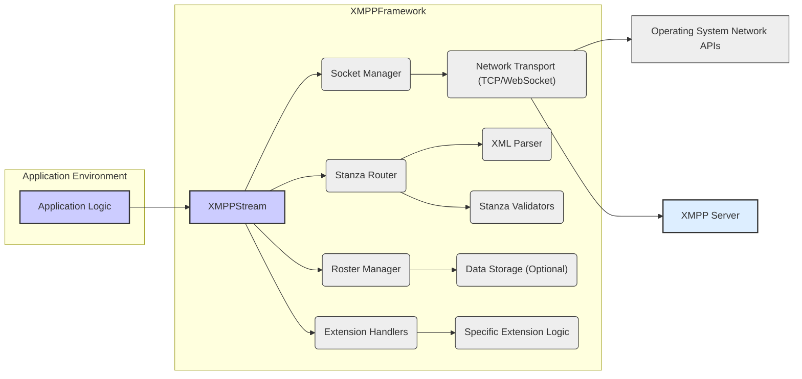

## Project Design Document: XMPPFramework (Improved)

**1. Introduction**

This document provides an enhanced and detailed design overview of the XMPPFramework, an Objective-C framework facilitating the implementation of the Extensible Messaging and Presence Protocol (XMPP). This document is specifically crafted to serve as a robust foundation for subsequent threat modeling activities. It meticulously outlines the framework's architecture, key components with their responsibilities, detailed data flow pathways, and comprehensive security considerations.

**2. Project Overview**

The XMPPFramework is a sophisticated library designed to streamline the development of XMPP-based applications on Apple's ecosystem (macOS, iOS, watchOS, tvOS). It abstracts the intricate details of the XMPP protocol, empowering developers to concentrate on the unique logic of their applications. The framework offers a rich set of features, including:

*   Robust management of XMPP connections, encompassing establishment, maintenance, and termination.
*   Comprehensive authentication and authorization mechanisms, adhering to XMPP standards.
*   Seamless sending and receiving of all core XMPP stanzas: messages, presence updates, and Information/Query (IQ) requests/responses.
*   Extensive support for a wide array of XMPP extensions, such as Multi-User Chat (MUC), Publish-Subscribe (PubSub), and more.
*   Efficient management of the XMPP roster, including contact addition, removal, and presence tracking.
*   Adaptable support for diverse network transports, primarily TCP sockets and WebSockets, catering to various deployment scenarios.
*   A well-defined modular architecture promoting extensibility and customization through the addition of custom modules.

**3. System Architecture**

The XMPPFramework is built upon a modular architecture, where distinct components are dedicated to specific functionalities within the XMPP protocol. This separation of concerns enhances maintainability and testability. The following diagram illustrates the high-level architecture, emphasizing the interactions between key modules:

**4. Detailed Component Design**

This section provides a more granular description of the core components within the XMPPFramework, highlighting their specific responsibilities:

*   **`XMPPStream`:** This class serves as the central orchestrator for the XMPP connection lifecycle. Its responsibilities include:
    *   Managing the underlying socket connection.
    *   Handling connection establishment, including TLS negotiation and SASL authentication.
    *   Routing incoming and outgoing stanzas to the appropriate handlers.
    *   Maintaining the connection state and handling disconnections.
    *   Providing the primary API for interacting with the XMPP server.
*   **Socket Manager:** This component encapsulates the logic for managing the network socket. Its key responsibilities are:
    *   Creating and configuring TCP or WebSocket connections.
    *   Handling socket events such as connection establishment, data reception, and disconnections.
    *   Managing socket timeouts and error conditions.
    *   Providing an abstraction layer over the underlying network APIs.
*   **Stanza Router:** This component is responsible for directing XMPP stanzas to their intended recipients within the framework. Its functions include:
    *   Inspecting incoming stanzas to determine their type (message, presence, IQ) and target.
    *   Dispatching stanzas to registered delegates, blocks, or extension handlers based on predefined rules.
    *   Managing the registration of stanza handlers.
*   **Roster Manager:** This component handles all aspects of the user's contact list (roster) management, including:
    *   Fetching and updating the roster from the XMPP server.
    *   Tracking the online status (presence) of roster contacts.
    *   Managing subscription requests and approvals.
    *   Optionally persisting roster data locally for offline access.
*   **Extension Handlers:** This represents a collection of modules that implement specific XMPP extensions. Each handler is responsible for:
    *   Processing stanzas related to its specific extension (e.g., MUC invitations, PubSub events).
    *   Providing APIs for interacting with the extension's functionality.
    *   Maintaining the state associated with the extension.
*   **Network Transport (TCP/WebSocket):** This component implements the low-level details of sending and receiving data over the chosen network transport. It handles:
    *   Serializing outgoing data into network packets.
    *   Deserializing incoming network packets into data.
    *   Managing the specifics of the TCP or WebSocket protocol.
*   **XML Parser:** This component is responsible for parsing incoming XML stanzas and serializing outgoing stanzas. It typically utilizes libraries like `NSXMLParser` or `libxml2`. Its key functions are:
    *   Converting XML data into structured objects representing XMPP stanzas.
    *   Converting stanza objects back into XML strings for transmission.
    *   Handling XML parsing errors and potential vulnerabilities.
*   **Stanza Validators:** This component performs validation of incoming XML stanzas to ensure they conform to the XMPP specification and any applicable extensions. This helps to prevent malformed data from being processed and can mitigate certain types of attacks.
*   **Data Storage (Optional):** Some components, such as the Roster Manager or extension handlers, may utilize local storage mechanisms (e.g., Core Data, SQLite, UserDefaults) to persist data. This is an optional feature and its implementation depends on the application's requirements.

**5. Data Flow (Detailed)**

This section provides a more detailed breakdown of the data flow within the XMPPFramework for sending and receiving messages, highlighting specific steps and data transformations:

**5.1. Sending a Message (Detailed):**

```mermaid
graph LR
    A["Application Logic"] -- "sendMessage:body:to:..." --> B("XMPPStream");
    B -- "Create <message> stanza object" --> C("Stanza Processing");
    C -- "Populate stanza with attributes and child elements" --> D("Stanza Object");
    D -- "Serialize to XML" --> E("XML Parser");
    E -- "XML String" --> F("Socket Manager");
    F -- "Send data over socket" --> G("Network Transport");
    G -- "Network Packets" --> H("XMPP Server");
    style A fill:#ccf,stroke:#333,stroke-width:2px
    style B fill:#eee,stroke:#333,stroke-width:1px
    style C fill:#eee,stroke:#333,stroke-width:1px
    style D fill:#eee,stroke:#333,stroke-width:1px
    style E fill:#eee,stroke:#333,stroke-width:1px
    style F fill:#eee,stroke:#333,stroke-width:1px
    style G fill:#eee,stroke:#333,stroke-width:1px
    style H fill:#def,stroke:#333,stroke-width:2px
```

1. The application logic initiates sending a message by calling a method on the `XMPPStream` instance, providing the message body, recipient, and other relevant information.
2. `XMPPStream` instructs the Stanza Processing component to create a `<message>` stanza object.
3. The Stanza Processing component populates the stanza object with the necessary attributes (e.g., `to`, `from`, `type`) and child elements (e.g., `<body/>`).
4. The fully formed stanza object is passed to the XML Parser.
5. The XML Parser serializes the stanza object into an XML string representation.
6. The XML string is passed to the Socket Manager.
7. The Socket Manager sends the XML data over the established network connection using the Network Transport component.
8. The Network Transport component transmits the data as network packets to the XMPP server.

**5.2. Receiving a Message (Detailed):**

```mermaid
graph LR
    A["XMPP Server"] -- "Network Packets" --> B("Network Transport");
    B -- "Receive data from socket" --> C("Socket Manager");
    C -- "XML Data" --> D("XML Parser");
    D -- "Parse XML to Stanza Object" --> E("Stanza Object");
    E -- "Inspect stanza type and target" --> F("Stanza Router");
    F -- "Route to appropriate handler" --> G("Application Logic Delegate/Block");
    style A fill:#def,stroke:#333,stroke-width:2px
    style B fill:#eee,stroke:#333,stroke-width:1px
    style C fill:#eee,stroke:#333,stroke-width:1px
    style D fill:#eee,stroke:#333,stroke-width:1px
    style E fill:#eee,stroke:#333,stroke-width:1px
    style F fill:#eee,stroke:#333,stroke-width:1px
    style G fill:#ccf,stroke:#333,stroke-width:2px
```

1. The XMPP server sends network packets containing an XML stanza.
2. The Network Transport component receives the raw data from the network.
3. The Socket Manager receives the data from the Network Transport component.
4. The XML Parser parses the XML data and creates a corresponding stanza object.
5. The Stanza Router inspects the stanza object to determine its type (message, presence, IQ) and intended recipient.
6. The Stanza Router routes the stanza to the appropriate handler, which could be a delegate method in the application logic or a specific extension handler.
7. The application logic receives the processed message.

**6. Security Considerations (Enhanced)**

The XMPPFramework incorporates several security measures and requires careful consideration of potential threats:

*   **Transport Layer Security (TLS/SSL):**
    *   **Protection:** Encrypts communication between the client and the XMPP server, preventing eavesdropping and man-in-the-middle attacks.
    *   **Considerations:** Ensure proper TLS negotiation and certificate validation are implemented. Consider using certificate pinning to prevent attacks using compromised or rogue certificates.
*   **Simple Authentication and Security Layer (SASL):**
    *   **Protection:** Provides secure authentication mechanisms to verify the identity of the client connecting to the XMPP server.
    *   **Considerations:** Choose strong SASL mechanisms (e.g., SCRAM-SHA-1) and avoid weaker mechanisms like PLAIN where possible. Securely store and handle user credentials.
*   **XML Parsing Vulnerabilities:**
    *   **Threat:** Maliciously crafted XML stanzas could exploit vulnerabilities in the XML parser, leading to denial-of-service or even remote code execution.
    *   **Mitigation:** Use up-to-date and well-vetted XML parsing libraries. Implement input validation and sanitization to prevent processing of potentially harmful XML structures.
*   **Stanza Injection Attacks:**
    *   **Threat:** Attackers might attempt to inject malicious stanzas into the communication stream to impersonate other users or manipulate the application's state.
    *   **Mitigation:** Implement robust stanza validation on both the client and server sides. Ensure proper authorization checks are in place for sensitive operations.
*   **Data Storage Security:**
    *   **Threat:** If the framework persists sensitive data locally (e.g., roster information, message history), this data could be vulnerable to unauthorized access if not properly protected.
    *   **Mitigation:** Encrypt sensitive data at rest using appropriate encryption techniques provided by the operating system or third-party libraries. Implement secure access controls for local data storage.
*   **Denial of Service (DoS) Attacks:**
    *   **Threat:** An attacker could flood the client with a large number of requests or malformed stanzas, potentially overwhelming the application and causing it to become unresponsive.
    *   **Mitigation:** Implement rate limiting and resource management techniques to prevent excessive resource consumption. Validate incoming data to discard malformed or excessively large stanzas.
*   **Dependency Management:**
    *   **Threat:** The framework may rely on third-party libraries that could contain security vulnerabilities.
    *   **Mitigation:** Regularly update dependencies to their latest versions to patch known vulnerabilities. Conduct security audits of dependencies.
*   **Logging and Error Handling:**
    *   **Threat:** Improper logging or error handling could expose sensitive information to attackers.
    *   **Mitigation:** Avoid logging sensitive data. Implement robust error handling that does not reveal internal system details.

**7. Deployment Considerations (Expanded)**

The XMPPFramework is typically integrated into applications deployed on various Apple platforms. Key deployment considerations include:

*   **Mobile Applications (iOS, iPadOS):**
    *   **Resource Constraints:** Mobile devices have limited resources (memory, CPU, battery). Optimize the framework's usage to minimize resource consumption.
    *   **Background Operations:** Implement background processing carefully to maintain connectivity and receive messages without excessive battery drain.
    *   **Network Conditions:** Handle varying network conditions (e.g., intermittent connectivity, network switching).
*   **Desktop Applications (macOS):**
    *   **Security Context:** Consider the security context in which the application runs and implement appropriate security measures.
    *   **User Permissions:** Request necessary user permissions for network access and data storage.
*   **WatchOS and TVOS Applications:**
    *   **Limited Functionality:** These platforms may have limitations on background processing and network access. Adapt the framework's usage accordingly.
    *   **User Interface Considerations:** Design user interfaces that are appropriate for the device's form factor.
*   **Security Policies:** Adhere to platform-specific security policies and guidelines.
*   **Distribution:** Consider the distribution method (e.g., App Store, enterprise distribution) and its implications for security and updates.

**8. Assumptions and Constraints**

The following assumptions and constraints are relevant to this design document:

*   This document primarily focuses on the design of the XMPPFramework library itself.
*   It assumes the use of compliant and secure XMPP server implementations.
*   Specific implementation details and available features may vary across different versions of the XMPPFramework.
*   The security of the application utilizing the framework depends on proper integration and adherence to security best practices by the application developer.

**9. Future Considerations**

Potential future enhancements and considerations for the XMPPFramework include:

*   **End-to-End Encryption (E2EE):** Integrating support for modern E2EE protocols like OMEMO or implementing a pluggable architecture for E2EE.
*   **Performance Optimizations:** Continuously profiling and optimizing the framework for improved performance and reduced resource consumption.
*   **Swift Interoperability:** Enhancing interoperability with Swift codebases.
*   **Improved Testing and Security Audits:** Implementing more comprehensive unit and integration tests, and conducting regular security audits.
*   **Standardization Updates:** Keeping up-to-date with the latest XMPP specifications and best practices.

This improved document provides a more detailed and comprehensive design overview of the XMPPFramework, specifically tailored for threat modeling purposes. The enhanced component descriptions, detailed data flow diagrams, and expanded security considerations offer a more robust foundation for identifying and mitigating potential security risks.