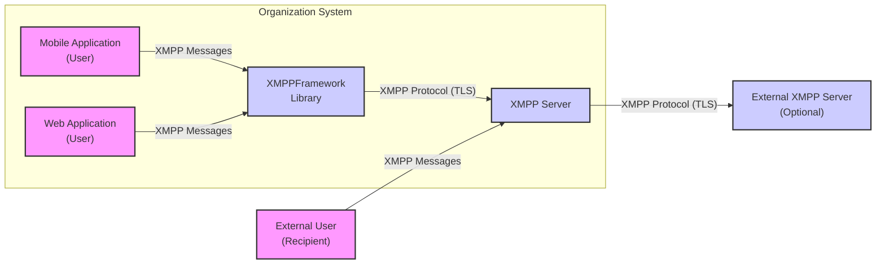
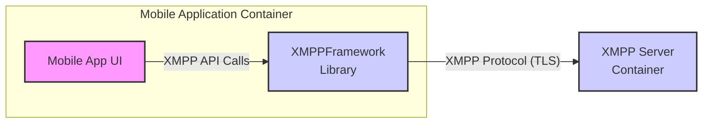
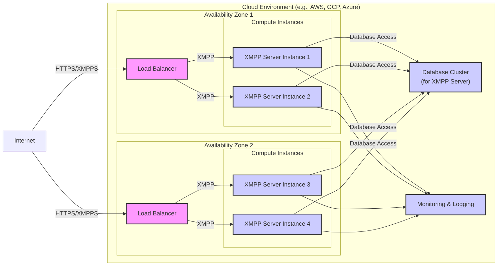

# BUSINESS POSTURE

The XMPPFramework is an Objective-C library for implementing the Extensible Messaging and Presence Protocol (XMPP). The primary business goal for projects utilizing XMPPFramework is to enable real-time communication and presence features within their applications. This can range from instant messaging and chat applications to real-time collaboration tools and Internet of Things (IoT) communication.

Business Priorities:
- Reliable and efficient real-time communication: Ensuring messages are delivered promptly and reliably is crucial for user experience and application functionality.
- Secure communication: Protecting the confidentiality and integrity of communication is paramount, especially when dealing with sensitive information.
- Scalability: The solution should be able to handle a growing number of users and messages without performance degradation.
- Interoperability: Adherence to the XMPP standard ensures compatibility with other XMPP-compliant systems and services.
- Ease of integration: The library should be easy to integrate into existing and new projects, reducing development time and effort.

Business Risks:
- Data breaches: Compromise of communication data due to vulnerabilities in the application or the library.
- Service disruption: Denial of service attacks or system failures that prevent real-time communication.
- Privacy violations: Improper handling of user data and communication metadata, leading to privacy breaches.
- Compliance issues: Failure to meet regulatory requirements related to data security and privacy, depending on the application's domain (e.g., GDPR, HIPAA).
- Reputation damage: Security incidents or privacy breaches can severely damage the reputation of the organization using the library.

# SECURITY POSTURE

Existing Security Controls:
- security control: Use of TLS/SSL for transport layer security in XMPP connections. Described in XMPP specifications and implemented within the library.
- security control: Support for SASL (Simple Authentication and Security Layer) for authentication. Described in XMPP specifications and implemented within the library.
- security control: Code hosted on GitHub, allowing for community review and potential identification of vulnerabilities. Location: github.com.
- accepted risk: Reliance on developers to correctly implement security best practices when using the library in their applications.
- accepted risk: Vulnerabilities in underlying dependencies of the library, if any.

Recommended Security Controls:
- security control: Implement automated security scanning (SAST/DAST) of applications using XMPPFramework during development.
- security control: Conduct regular security code reviews of applications using XMPPFramework, focusing on proper library usage and integration.
- security control: Implement input validation and sanitization on all data received and sent via XMPP to prevent injection attacks.
- security control: Utilize secure storage mechanisms for sensitive data, such as user credentials or message archives, within applications using the library.
- security control: Implement robust logging and monitoring of XMPP communication for security incident detection and response.

Security Requirements:
- Authentication:
    - requirement: Support for strong authentication mechanisms like SASL PLAIN, SASL SCRAM-SHA-1, SASL SCRAM-SHA-256, or certificate-based authentication.
    - requirement: Secure storage and handling of authentication credentials within applications using the library.
    - requirement: Protection against brute-force attacks on authentication mechanisms.
- Authorization:
    - requirement: Implement access control mechanisms to ensure users can only access authorized resources and functionalities within the application.
    - requirement: Enforce proper authorization checks before granting access to sensitive data or actions.
    - requirement: Principle of least privilege should be applied to user roles and permissions.
- Input Validation:
    - requirement: Validate all input data received via XMPP to prevent injection attacks (e.g., XSS, command injection).
    - requirement: Sanitize input data before processing or storing it to mitigate potential risks.
    - requirement: Implement proper error handling for invalid input to avoid exposing sensitive information or causing unexpected behavior.
- Cryptography:
    - requirement: Utilize strong encryption algorithms and protocols (TLS/SSL) for all communication channels.
    - requirement: Ensure proper key management practices for any cryptographic keys used within the application or library (if applicable).
    - requirement: Consider end-to-end encryption for message content to provide confidentiality beyond transport layer security, if required by business needs.

# DESIGN

## C4 CONTEXT

Context Diagram Elements:
- Name: Mobile Application
  - Type: User
  - Description: Represents users interacting with the system through a mobile application that utilizes XMPPFramework.
  - Responsibilities: Sends and receives XMPP messages, interacts with the application's user interface.
  - Security controls: Application-level authentication and authorization, input validation within the application, secure storage of user data on the mobile device.
- Name: Web Application
  - Type: User
  - Description: Represents users interacting with the system through a web application that might indirectly use services built with XMPPFramework or interact with the XMPP Server.
  - Responsibilities: Sends and receives XMPP messages (potentially via a backend service), interacts with the web application's user interface.
  - Security controls: Web application security controls (authentication, authorization, input validation, session management), secure communication between web application and backend services.
- Name: XMPPFramework Library
  - Type: Software System
  - Description: The XMPPFramework Objective-C library, integrated into mobile and potentially other applications, providing XMPP protocol implementation.
  - Responsibilities: Handles XMPP protocol logic, manages connections to XMPP servers, sends and receives XMPP messages, provides API for applications to use XMPP functionality.
  - Security controls: TLS/SSL for transport security, SASL for authentication, adherence to XMPP security best practices within the library code.
- Name: XMPP Server
  - Type: Software System
  - Description: The XMPP server that manages XMPP communication, routing messages between clients and servers, and handling user accounts and presence.
  - Responsibilities: Message routing, user authentication and authorization, presence management, message storage (optional), server-side security policy enforcement.
  - Security controls: Server-side authentication and authorization mechanisms, access control lists, TLS/SSL termination, security updates and patching, protection against denial-of-service attacks.
- Name: External User
  - Type: User
  - Description: Users on other XMPP systems or using different XMPP clients who communicate with users within the organization's system.
  - Responsibilities: Sends and receives XMPP messages to and from users within the organization's system.
  - Security controls: Relies on the security controls of their own XMPP systems and clients, and the interoperability security of XMPP protocol.
- Name: External XMPP Server
  - Type: Software System
  - Description: Optional external XMPP servers that the organization's XMPP server might federate with to enable communication with users on other XMPP domains.
  - Responsibilities: Inter-domain message routing, federation security policy enforcement.
  - Security controls: Server-to-server (S2S) TLS/SSL, domain name system security extensions (DNSSEC), federation access control policies.

## C4 CONTAINER

Container Diagram Elements:
- Name: Mobile App UI
  - Type: Application
  - Description: The user interface component of the mobile application, responsible for user interaction and displaying information.
  - Responsibilities: Presenting the user interface, handling user input, displaying messages and presence information, making API calls to the XMPPFramework library.
  - Security controls: Input validation on user input, secure handling of user sessions, protection against UI-based vulnerabilities (e.g., UI redressing).
- Name: XMPPFramework Library
  - Type: Library
  - Description: The XMPPFramework Objective-C library, providing XMPP protocol implementation for the mobile application.
  - Responsibilities: Managing XMPP connections, handling XMPP protocol logic, providing API for sending and receiving messages, managing presence, handling authentication and encryption.
  - Security controls: TLS/SSL for transport security, SASL for authentication, secure coding practices within the library, memory safety, input validation of received XMPP data.
- Name: XMPP Server Container
  - Type: Software System
  - Description: Represents the XMPP server infrastructure, which could be a single server or a cluster of servers, responsible for managing XMPP communication.
  - Responsibilities: Routing XMPP messages, managing user accounts and presence, enforcing security policies, providing message storage (optional), handling server-side authentication and authorization.
  - Security controls: Server-side authentication and authorization mechanisms, access control lists, TLS/SSL termination, security updates and patching, intrusion detection and prevention systems, firewall configurations, regular security audits.

## DEPLOYMENT

Deployment Architecture: Cloud-based Deployment

Deployment Diagram Elements:
- Name: Load Balancer
  - Type: Infrastructure Component
  - Description: Distributes incoming XMPP and HTTPS traffic across multiple XMPP server instances for high availability and scalability.
  - Responsibilities: Traffic distribution, health checks of server instances, SSL termination (for HTTPS management interfaces).
  - Security controls: DDoS protection, rate limiting, access control lists, security hardening of load balancer configuration.
- Name: XMPP Server Instance (1-4)
  - Type: Compute Instance (VM/Container)
  - Description: Virtual machines or containers running the XMPP server software. Deployed across multiple availability zones for redundancy.
  - Responsibilities: Handling XMPP protocol logic, message routing, user authentication and authorization, presence management, connecting to the database.
  - Security controls: Operating system hardening, security patching, firewall configurations, intrusion detection agents, regular security audits, secure configuration of XMPP server software.
- Name: Database Cluster
  - Type: Data Store
  - Description: Clustered database system used by the XMPP servers to store user accounts, messages (optional), and other persistent data.
  - Responsibilities: Persistent data storage, data replication for high availability, data backups and recovery.
  - Security controls: Database access control lists, encryption at rest and in transit, regular database security audits, vulnerability scanning, database hardening.
- Name: Monitoring & Logging
  - Type: Infrastructure Component
  - Description: System for monitoring the health and performance of the XMPP infrastructure and collecting logs for security monitoring and incident response.
  - Responsibilities: System monitoring, performance metrics collection, log aggregation and analysis, alerting for security events and system failures.
  - Security controls: Secure log storage, access control to monitoring and logging systems, security information and event management (SIEM) integration.
- Name: Internet
  - Type: Network
  - Description: Public internet network through which users connect to the XMPP service.
  - Responsibilities: Provides connectivity for users to access the XMPP service.
  - Security controls: N/A - external network, focus on securing the service endpoints exposed to the internet.

## BUILD

Build Process Diagram:

```mermaid
flowchart LR
    A["Developer\n(Code Changes)"] --> B["Version Control\n(GitHub)"]
    B --> C["CI/CD System\n(GitHub Actions)"]
    subgraph "CI/CD System"
        C --> D["Build\n(Compile, Link)"]
        D --> E["Static Analysis\n(SAST, Linters)"]
        E --> F["Unit Tests"]
        F --> G["Artifact Creation\n(Library Binary)"]
        G --> H["Artifact Storage\n(GitHub Releases)"]
    end
    H --> I["Application Developer\n(Library Consumer)"]
    style A fill:#f9f,stroke:#333,stroke-width:2px
    style I fill:#f9f,stroke:#333,stroke-width:2px
    style B fill:#ccf,stroke:#333,stroke-width:2px
    style C fill:#ccf,stroke:#333,stroke-width:2px
    style D fill:#ccf,stroke:#333,stroke-width:2px
    style E fill:#ccf,stroke:#333,stroke-width:2px
    style F fill:#ccf,stroke:#333,stroke-width:2px
    style G fill:#ccf,stroke:#333,stroke-width:2px
    style H fill:#ccf,stroke:#333,stroke-width:2px
```

Build Process Description:
1. Developer makes code changes and commits them to the Version Control System (GitHub).
2. The CI/CD System (e.g., GitHub Actions, Jenkins) is triggered by code changes.
3. Build stage: The code is compiled and linked to create the library binary.
4. Static Analysis: SAST tools and linters are used to automatically scan the code for potential security vulnerabilities and code quality issues.
5. Unit Tests: Automated unit tests are executed to ensure the code functions as expected and to catch regressions.
6. Artifact Creation: If all checks pass, the library binary artifact is created.
7. Artifact Storage: The build artifact (library binary) is stored in Artifact Storage (e.g., GitHub Releases, package registry).
8. Application Developer (Library Consumer) can then download and integrate the library into their applications.

Build Security Controls:
- security control: Version Control (GitHub): Code changes are tracked and auditable, enabling traceability and rollback.
- security control: CI/CD System (GitHub Actions): Automates the build process, ensuring consistency and repeatability.
- security control: Static Analysis (SAST, Linters): Automatically detects potential security vulnerabilities and code quality issues early in the development lifecycle.
- security control: Unit Tests: Ensures code functionality and helps prevent regressions, improving overall code reliability and security.
- security control: Artifact Storage (GitHub Releases): Provides a secure and versioned repository for build artifacts.
- security control: Code Review: While not explicitly in the diagram, code review should be a part of the development process before code is merged and built, adding a manual security check.
- security control: Dependency Scanning: Scan for vulnerabilities in third-party dependencies used by the library.

# RISK ASSESSMENT

Critical Business Processes:
- Real-time communication between users of applications using XMPPFramework.
- Presence information sharing among users.
- User authentication and authorization for accessing communication services.

Data Sensitivity:
- Communication content: Potentially highly sensitive, depending on the application's use case (e.g., personal messages, confidential business information). Sensitivity level: High to Critical.
- User credentials: Highly sensitive, must be protected to prevent unauthorized access. Sensitivity level: Critical.
- Presence information: Can be sensitive depending on context, revealing user availability and potentially location. Sensitivity level: Medium to High.
- Communication metadata (sender, receiver, timestamps): Can be sensitive, revealing communication patterns and relationships. Sensitivity level: Medium.

# QUESTIONS & ASSUMPTIONS

Questions:
- What is the intended deployment environment for applications using XMPPFramework (mobile, server-side, both)?
- What are the specific security compliance requirements for applications using XMPPFramework (e.g., GDPR, HIPAA)?
- Is end-to-end encryption of message content required for applications using XMPPFramework?
- What type of XMPP server is expected to be used with XMPPFramework (e.g., self-hosted, cloud-based service)?
- Are there specific performance or scalability requirements for applications using XMPPFramework?

Assumptions:
- Applications using XMPPFramework will handle sensitive user communication data.
- Security and privacy of communication are high priorities for applications using XMPPFramework.
- Applications will be deployed in cloud environments or similar infrastructure.
- A standard XMPP server will be used, supporting TLS/SSL and SASL authentication.
- The build process for XMPPFramework itself follows standard open-source development practices, including version control and some level of automated testing.