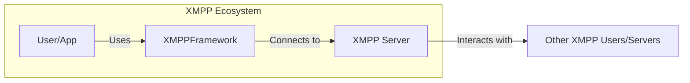
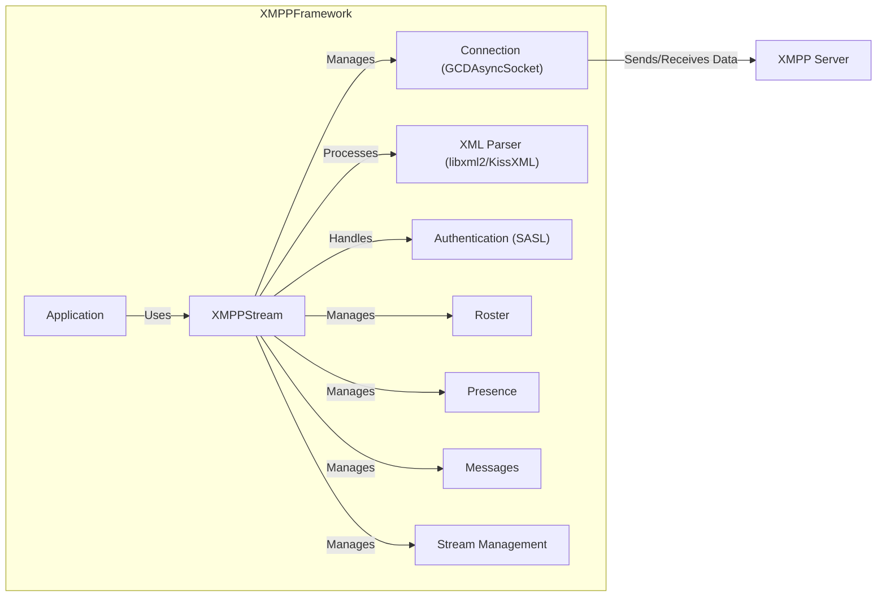
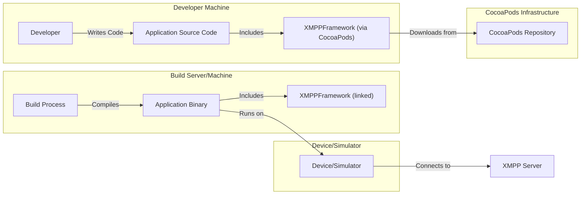
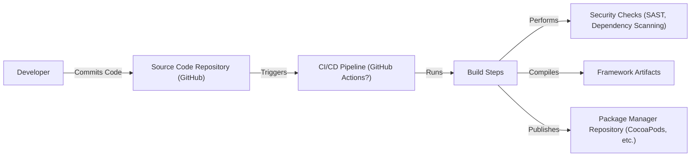

Okay, let's create a design document for the XMPPFramework project.

# BUSINESS POSTURE

Business Priorities and Goals:

*   Provide a robust and reliable XMPP implementation for Objective-C developers.
*   Enable developers to easily integrate XMPP functionality into their macOS and iOS applications.
*   Maintain a well-documented and easy-to-use framework.
*   Foster a community around the project to encourage contributions and support.
*   Ensure the framework remains up-to-date with the latest XMPP standards and security best practices.

Most Important Business Risks:

*   Security vulnerabilities in the framework could expose user data and compromise applications.
*   Lack of compatibility with newer XMPP extensions could limit the framework's usefulness.
*   Poor performance or stability could lead to negative user experiences.
*   Insufficient documentation or community support could hinder adoption.
*   Failure to address reported bugs or security issues in a timely manner could damage the project's reputation.

# SECURITY POSTURE

Existing Security Controls:

*   security control: TLS/SSL for secure communication (mentioned throughout the repository and documentation). Implemented using Apple's security frameworks.
*   security control: SASL authentication mechanisms (mentioned in documentation and code). Implemented within the framework.
*   security control: Stream management for reliable message delivery (XEP-0198, implemented in the framework).
*   security control: Use of XML parsing libraries to handle XMPP stanzas (libxml2, mentioned in documentation).
*   security control: Support for various XMPP extensions related to security (e.g., STARTTLS, SASL). Implemented within the framework.

Accepted Risks:

*   accepted risk: Reliance on third-party dependencies (e.g., libxml2, KissXML) introduces potential supply chain risks.
*   accepted risk: The framework's age and the evolution of XMPP standards may mean some older security practices are still present.
*   accepted risk: The framework supports older operating systems, which may have inherent security vulnerabilities.

Recommended Security Controls:

*   security control: Implement automated security scanning (SAST, DAST) in the build process.
*   security control: Conduct regular security audits and penetration testing.
*   security control: Provide clear guidelines for secure configuration and usage of the framework.
*   security control: Implement a vulnerability disclosure program.
*   security control: Consider adding support for modern authentication mechanisms like SCRAM-SHA-256 and OAUTHBEARER.

Security Requirements:

*   Authentication:
    *   The framework MUST support secure authentication mechanisms, including SASL (at least PLAIN, DIGEST-MD5, SCRAM-SHA-1).
    *   The framework SHOULD support modern authentication mechanisms like SCRAM-SHA-256 and OAUTHBEARER.
    *   The framework MUST protect against common authentication attacks (e.g., brute-force, credential stuffing).
*   Authorization:
    *   The framework MUST enforce access controls based on XMPP JIDs and roles.
    *   The framework SHOULD support fine-grained authorization using XMPP extensions.
*   Input Validation:
    *   The framework MUST validate all input received from the network and other sources.
    *   The framework MUST use a secure XML parser to prevent XML injection attacks.
    *   The framework MUST properly handle malformed or unexpected input.
*   Cryptography:
    *   The framework MUST use strong, industry-standard cryptographic algorithms and protocols (e.g., TLS 1.2 or higher).
    *   The framework MUST securely manage cryptographic keys.
    *   The framework SHOULD support end-to-end encryption using extensions like OMEMO or OpenPGP.

# DESIGN

## C4 CONTEXT

Element Descriptions:

*   Element:
    *   Name: User/App
    *   Type: External Entity (Person or System)
    *   Description: A macOS or iOS application that utilizes the XMPPFramework to provide XMPP functionality to its users.
    *   Responsibilities: Initiates XMPP connections, sends and receives messages, manages user presence, interacts with other XMPP features.
    *   Security controls: Secure storage of user credentials, secure communication with the XMPPFramework.
*   Element:
    *   Name: XMPPFramework
    *   Type: Software System
    *   Description: The Objective-C framework providing XMPP client functionality.
    *   Responsibilities: Handles XMPP protocol implementation, manages connections, provides API for application interaction.
    *   Security controls: TLS/SSL, SASL authentication, stream management, secure XML parsing.
*   Element:
    *   Name: XMPP Server
    *   Type: External System
    *   Description: A server implementing the XMPP protocol (e.g., ejabberd, Prosody).
    *   Responsibilities: Routes messages, manages user accounts, handles presence information.
    *   Security controls: Server-side security measures (firewalls, intrusion detection, etc.).
*   Element:
    *   Name: Other XMPP Users/Servers
    *   Type: External System
    *   Description: Other users and servers within the XMPP network.
    *   Responsibilities: Sending and receiving messages, participating in XMPP communication.
    *   Security controls: Dependent on the specific user/server implementation.

## C4 CONTAINER

Element Descriptions:

*   Element:
    *   Name: Application
    *   Type: External Entity
    *   Description: The macOS or iOS application using the XMPPFramework.
    *   Responsibilities: Interacts with the XMPPFramework's API to utilize XMPP features.
    *   Security controls: Secure storage of user credentials, secure communication with the XMPPFramework.
*   Element:
    *   Name: XMPPStream
    *   Type: Container
    *   Description: The core class of the framework, managing the XMPP connection and functionality.
    *   Responsibilities: Handles connection establishment, authentication, message processing, roster management, presence updates.
    *   Security controls: Orchestrates the use of other security-related components (TLS, SASL).
*   Element:
    *   Name: Connection (GCDAsyncSocket)
    *   Type: Container
    *   Description: A wrapper around a network socket, providing asynchronous communication.
    *   Responsibilities: Manages the underlying TCP connection to the XMPP server.
    *   Security controls: TLS/SSL encryption.
*   Element:
    *   Name: XML Parser (libxml2/KissXML)
    *   Type: Container
    *   Description: Parses incoming XML stanzas and constructs outgoing XML stanzas.
    *   Responsibilities: Handles the serialization and deserialization of XMPP data.
    *   Security controls: Secure XML parsing to prevent injection attacks.
*   Element:
    *   Name: Authentication (SASL)
    *   Type: Container
    *   Description: Handles the authentication process with the XMPP server.
    *   Responsibilities: Implements various SASL mechanisms.
    *   Security controls: Secure implementation of SASL mechanisms.
*   Element:
    *   Name: Roster
    *   Type: Container
    *   Description: Manages the user's contact list.
    *   Responsibilities: Handles roster updates and presence information.
    *   Security controls: Access control based on JID.
*   Element:
    *   Name: Presence
    *   Type: Container
    *   Description: Manages the user's online status.
    *   Responsibilities: Sends and receives presence updates.
    *   Security controls: None specific, relies on XMPP server for presence authorization.
*   Element:
    *   Name: Messages
    *   Type: Container
    *   Description: Handles sending and receiving messages.
    *   Responsibilities: Processes message stanzas.
    *   Security controls: Relies on TLS for confidentiality and integrity.
*   Element:
    *   Name: Stream Management
    *   Type: Container
    *   Description: Implements XEP-0198 for reliable message delivery.
    *   Responsibilities: Handles message acknowledgements and retransmissions.
    *   Security controls: Ensures message delivery integrity.
*   Element:
    *   Name: XMPP Server
    *   Type: External System
    *   Description: The XMPP server to which the framework connects.
    *   Responsibilities: Handles message routing, user accounts, and presence.
    *   Security controls: Server-side security measures.

## DEPLOYMENT

Possible Deployment Solutions:

1.  Direct Integration: The framework is directly integrated into the application's source code.
2.  CocoaPods: The framework is included as a dependency using CocoaPods.
3.  Carthage: The framework is included as a dependency using Carthage.
4.  Swift Package Manager: The framework is included as a dependency using Swift Package Manager.

Chosen Solution (CocoaPods):

Element Descriptions:

*   Element:
    *   Name: Developer
    *   Type: Person
    *   Description: The developer writing the application code.
    *   Responsibilities: Integrates the XMPPFramework into the application.
    *   Security controls: Secure coding practices.
*   Element:
    *   Name: Application Source Code
    *   Type: Code
    *   Description: The source code of the application.
    *   Responsibilities: Contains the application logic and utilizes the XMPPFramework.
    *   Security controls: Secure coding practices, input validation.
*   Element:
    *   Name: XMPPFramework (via CocoaPods)
    *   Type: Dependency
    *   Description: The XMPPFramework included as a CocoaPods dependency.
    *   Responsibilities: Provides XMPP functionality to the application.
    *   Security controls: Framework-level security controls (TLS, SASL, etc.).
*   Element:
    *   Name: CocoaPods Repository
    *   Type: External System
    *   Description: The central repository for CocoaPods dependencies.
    *   Responsibilities: Hosts the XMPPFramework package.
    *   Security controls: Repository security measures.
*   Element:
    *   Name: Build Process
    *   Type: Process
    *   Description: The process of compiling the application code and linking dependencies.
    *   Responsibilities: Creates the executable application binary.
    *   Security controls: Secure build environment, code signing.
*   Element:
    *   Name: Application Binary
    *   Type: Executable
    *   Description: The compiled application ready to be run.
    *   Responsibilities: Runs the application logic and utilizes the linked XMPPFramework.
    *   Security controls: Code signing, runtime protections.
*   Element:
    *   Name: XMPPFramework (linked)
    *   Type: Library
    *   Description: The XMPPFramework linked into the application binary.
    *   Responsibilities: Provides XMPP functionality at runtime.
    *   Security controls: Framework-level security controls.
*   Element:
    *   Name: Device/Simulator
    *   Type: Runtime Environment
    *   Description: The iOS or macOS device or simulator where the application runs.
    *   Responsibilities: Executes the application binary.
    *   Security controls: Operating system security features.
*   Element:
    *   Name: XMPP Server
    *   Type: External System
    *   Description: The XMPP server the application connects to.
    *   Responsibilities: Handles XMPP communication.
    *   Security controls: Server-side security measures.

## BUILD

Build Process Description:

1.  Developer commits code changes to the GitHub repository.
2.  This triggers a CI/CD pipeline (likely GitHub Actions, though not explicitly stated in the repository).
3.  The pipeline executes a series of build steps.
4.  Security checks are performed as part of the build process. This SHOULD include:
    *   Static Application Security Testing (SAST): Analyzing the source code for vulnerabilities. Tools like SonarQube, or similar could be integrated.
    *   Dependency Scanning: Checking for known vulnerabilities in third-party dependencies (e.g., using tools like OWASP Dependency-Check).
    *   Linting: Enforcing code style and identifying potential issues.
5.  The code is compiled, producing the framework artifacts.
6.  The artifacts are published to a package manager repository (e.g., CocoaPods, Carthage, Swift Package Manager).

Security Controls in Build Process:

*   security control: Automated build process ensures consistency and repeatability.
*   security control: Integration of security checks (SAST, dependency scanning) helps identify vulnerabilities early.
*   security control: Use of a package manager simplifies dependency management and updates.
*   security control: Code signing of the framework artifacts (if implemented) ensures authenticity and integrity.

# RISK ASSESSMENT

Critical Business Processes:

*   Secure and reliable communication between users.
*   Maintaining user privacy and data confidentiality.
*   Ensuring the availability and stability of the XMPP service.

Data Sensitivity:

*   User Credentials (JIDs, passwords): Highly sensitive.
*   Message Content: Potentially highly sensitive, depending on the nature of the communication.
*   Presence Information: Moderately sensitive, revealing user online status.
*   Roster Information (Contact Lists): Moderately sensitive, revealing user connections.
*   Metadata (timestamps, message IDs): Less sensitive, but could be used for traffic analysis.

# QUESTIONS & ASSUMPTIONS

Questions:

*   What specific CI/CD system is used (if any)?  The repository doesn't explicitly state this.
*   Are there any existing security audits or penetration testing reports?
*   What is the process for reporting and handling security vulnerabilities?
*   What are the specific target versions of iOS and macOS?
*   Are there any plans to support more modern XMPP extensions (e.g., OMEMO, MIX)?
*   What level of code signing is used, if any?

Assumptions:

*   BUSINESS POSTURE: The primary goal is to provide a functional and reliable XMPP client library for developers. Security is a high priority, but backward compatibility and ease of use are also important considerations.
*   SECURITY POSTURE: The framework relies heavily on Apple's underlying security frameworks (e.g., for TLS). It is assumed that these frameworks are properly configured and used.
*   DESIGN: The framework's architecture is relatively straightforward, with a central XMPPStream class managing most of the functionality. The use of GCDAsyncSocket is assumed to be secure and efficient. The choice of CocoaPods as the primary distribution method is based on its popularity and ease of use.