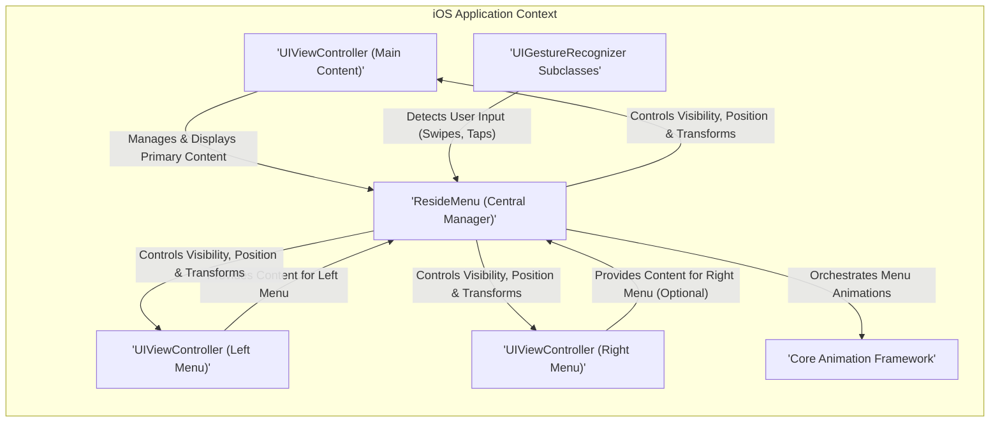
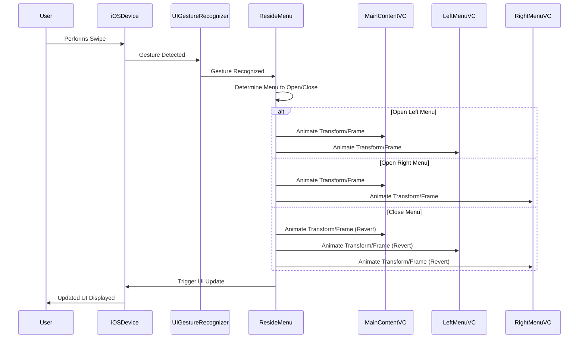

# Project Design Document: ResideMenu iOS Library - Enhanced for Threat Modeling

**Version:** 1.1
**Date:** October 26, 2023
**Author:** Gemini (AI Language Model)
**Project:** ResideMenu iOS Library (https://github.com/romaonthego/residemenu)

## 1. Introduction and Goals

This document provides an enhanced design overview of the ResideMenu iOS library, specifically tailored to facilitate comprehensive threat modeling. The primary goal is to clearly articulate the library's architecture, components, and interactions to enable the identification of potential security vulnerabilities.

## 2. System Architecture

The ResideMenu library enables the implementation of interactive side menus within iOS applications. It manages the presentation and user interaction of a main content view alongside one or two side menu views (left and/or right).

## 3. Detailed Component Description

This section provides a more in-depth look at each component and its responsibilities.

*   **`ResideMenu` (Central Manager):**
    *   **Core Responsibility:**  The central orchestrator of the side menu functionality.
    *   **Key Functions:**
        *   Holds strong references to the main content view controller and the optional left and right menu view controllers.
        *   Manages the current state of the menu (e.g., left menu open, right menu open, closed).
        *   Implements the logic for opening and closing menus based on user gestures and programmatic calls.
        *   Manages and coordinates the `UIGestureRecognizer` instances for user interaction.
        *   Utilizes the Core Animation framework to provide smooth transitions and animations for menu presentation.
        *   Offers configuration options to customize the appearance and behavior of the menu (e.g., shadow effects, scaling, animation durations).
        *   May implement delegate methods to notify the application of menu state changes.

*   **`UIViewController` (Main Content):**
    *   **Core Responsibility:** Displays the primary application content.
    *   **Integration:**  The application developer integrates this view controller with the `ResideMenu` instance.
    *   **Interaction:** Its view's `transform` and `frame` are manipulated by `ResideMenu` to achieve the sliding or pushing effect when the menu is revealed.

*   **`UIViewController` (Left Menu):**
    *   **Core Responsibility:** Provides the content for the left-side menu.
    *   **Content:** Typically contains a `UITableView` or `UICollectionView` to display menu items and their associated actions.
    *   **Developer Responsibility:** The application developer creates and manages this view controller.

*   **`UIViewController` (Right Menu):**
    *   **Core Responsibility:** Provides the content for the optional right-side menu.
    *   **Content:** Similar to the left menu, it usually contains interactive elements.
    *   **Developer Responsibility:** The application developer creates and manages this view controller if a right menu is required.

*   **`UIGestureRecognizer` Subclasses:**
    *   **Core Responsibility:** Detect user input that triggers menu actions.
    *   **Types:**
        *   `UISwipeGestureRecognizer`:  Primarily used to detect horizontal swipes to open or close the left and right menus.
        *   `UITapGestureRecognizer`: May be used to dismiss an open menu when the user taps outside of it.
        *   Potentially other custom gesture recognizers.
    *   **Management:**  `ResideMenu` typically creates and manages these gesture recognizers, attaching them to the main content view.

*   **Core Animation Framework:**
    *   **Core Responsibility:** Provides the underlying mechanism for animating the menu transitions.
    *   **Usage:** `ResideMenu` utilizes classes like `UIView.animate(withDuration:animations:)` to create smooth visual effects when the menus are opened and closed, including sliding, scaling, and potentially fading.

## 4. Detailed Data Flow Analysis

The data flow within ResideMenu primarily involves user interactions and the resulting changes in the view hierarchy and states.

*   **User Initiated Menu Open (Swipe Gesture):**
    *   A user performs a horizontal swipe gesture on the main content view.
    *   The associated `UISwipeGestureRecognizer` detects the gesture.
    *   The gesture recognizer informs the `ResideMenu` instance about the swipe.
    *   `ResideMenu` determines the direction of the swipe (left or right) and the intended menu to open.
    *   `ResideMenu` initiates an animation using the Core Animation framework to adjust the `transform` and `frame` of the main content view and the corresponding menu view, making the menu visible.
    *   Delegate methods (if implemented) on the `ResideMenu` instance may be called to notify the application of the menu opening.

*   **User Initiated Menu Close (Swipe or Tap):**
    *   A user performs a swipe in the opposite direction or taps outside the open menu (if a tap gesture recognizer is configured).
    *   The relevant gesture recognizer detects the interaction.
    *   `ResideMenu` receives the notification.
    *   `ResideMenu` initiates an animation to revert the `transform` and `frame` changes, hiding the menu and bringing the main content view back to its original position.
    *   Delegate methods may be called to signal the menu closing.

*   **Programmatic Menu Control:**
    *   The application developer can programmatically open or close the menus by calling methods on the `ResideMenu` instance (e.g., `presentLeftMenuViewController()`, `hideMenuViewController()`).
    *   These methods internally trigger the same animation mechanisms described above.

## 5. Security Considerations for Threat Modeling

This section highlights potential areas of security concern that should be explored during threat modeling.

*   **Exposure of Sensitive Data in Menu Content:**
    *   **Question:** Could sensitive user data or application secrets be inadvertently displayed within the left or right menu view controllers?
    *   **Consideration:**  The application developer is responsible for securing the data presented in these menus.

*   **Vulnerabilities in Menu Item Actions:**
    *   **Question:** If menu items trigger actions that involve external calls or data processing, are these actions properly secured against injection attacks or other vulnerabilities?
    *   **Consideration:**  Focus on the code executed when a menu item is selected.

*   **Authorization Bypass through Menu Structure:**
    *   **Question:** Could a malicious user potentially bypass intended authorization controls by manipulating the menu structure or triggering unintended actions through the menu?
    *   **Consideration:**  Ensure menu items only provide access to authorized functionality.

*   **Information Disclosure via Animation Timing:**
    *   **Question:** Could subtle variations in animation timing or behavior reveal information about the application's internal state or user activity? (Low risk, but worth considering).

*   **Gesture Recognition Hijacking (Application Level):**
    *   **Question:** While not directly a ResideMenu vulnerability, could a vulnerability in the application's broader gesture handling allow for malicious interference with the menu's gesture recognition?

*   **Delegate Method Security:**
    *   **Question:** If `ResideMenu` provides delegate methods, are there any security implications related to the data passed through these methods or the actions taken by the delegate?

*   **Resource Exhaustion through Rapid Menu Toggling:**
    *   **Question:** Could a malicious user repeatedly open and close the menu to potentially cause performance issues or resource exhaustion on the device?

*   **Deep Linking and Menu State:**
    *   **Question:** If the application uses deep linking, how does the menu state interact with deep links? Could this lead to unexpected behavior or security issues?

## 6. Assumptions and Constraints

*   The ResideMenu library is assumed to be used within a standard iOS application development environment using Swift or Objective-C.
*   The security of the content displayed within the menu view controllers is primarily the responsibility of the application developer.
*   This design focuses on the core functionality of the ResideMenu library and does not cover potential modifications or extensions made by integrating applications.
*   The threat model will consider the library as a component within a larger application context.

## 7. Future Analysis Areas

*   Detailed analysis of the specific animation implementations and their potential security implications.
*   Examination of any public APIs or methods provided by `ResideMenu` and their potential misuse.
*   Review of any third-party dependencies used by the library and their security posture.
*   Analysis of the library's behavior under different device orientations and screen sizes.

This enhanced design document provides a more detailed and structured foundation for conducting a thorough threat modeling exercise on the ResideMenu iOS library. The identified security considerations serve as starting points for exploring potential vulnerabilities and developing appropriate mitigation strategies.
