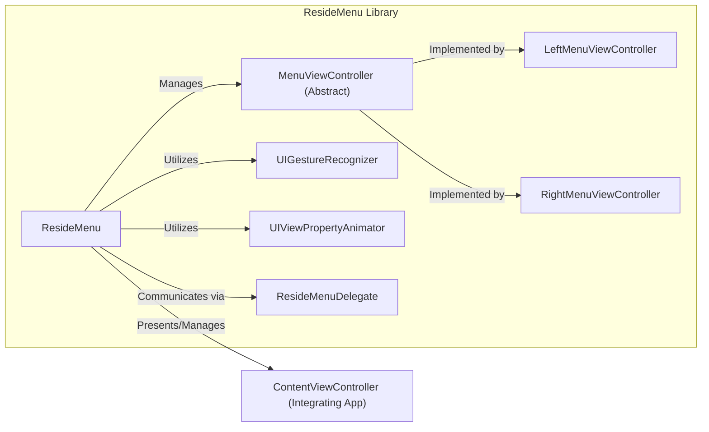
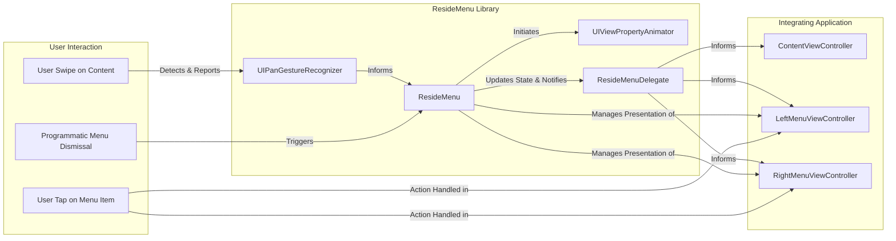

# Project Design Document: ResideMenu (Improved)

**Version:** 1.1
**Date:** October 26, 2023
**Author:** AI Software Architect

## 1. Introduction

This document provides an enhanced design overview of the ResideMenu iOS library (available at [https://github.com/romaonthego/residemenu](https://github.com/romaonthego/residemenu)). This iteration aims to provide an even more detailed and precise understanding of the library's architecture, components, and data flow, specifically tailored for effective threat modeling. The focus is on identifying potential attack surfaces and vulnerabilities within the library's design and implementation.

## 2. Goals

*   Provide a highly detailed and accurate representation of the ResideMenu library's architecture and components.
*   Clearly articulate the interactions and dependencies between different components.
*   Precisely map the data flow within the library, highlighting potential data handling concerns.
*   Sharpen the focus on security considerations, making them directly applicable to threat modeling exercises.
*   Ensure the document is easily understandable and serves as a valuable resource for security analysts.

## 3. Overview

ResideMenu is a widely used iOS UI library designed to implement interactive side menus (often referred to as "hamburger menus"). It offers a flexible and customizable way to present navigation and secondary options within an iOS application. The library's core responsibility is managing the visual presentation and user interaction aspects of the side menu, while the content and actions associated with menu items are managed by the integrating application. This separation of concerns is important for understanding the library's security boundaries.

## 4. System Architecture

The ResideMenu library's architecture can be broken down into the following key components and their relationships:

*   **`ResideMenu` (Central Mediator):** This class acts as the central orchestrator for the side menu functionality.
    *   Manages the presentation and dismissal of the left and right menu view controllers.
    *   Handles the core logic for gesture recognition that triggers the menu.
    *   Orchestrates the animations for showing and hiding the menus.
    *   Maintains references to the `ContentViewController`, `LeftMenuViewController`, and `RightMenuViewController`.
*   **`MenuViewController` (Abstract Base):**  An abstract class intended to be subclassed for creating the specific left and right menu implementations.
    *   Provides a foundational structure and potential helper methods for menu view controllers.
    *   Enforces a common interface for menu controllers.
*   **`LeftMenuViewController` (Concrete Menu):**  The concrete implementation for the left-side menu.
    *   Responsible for displaying the specific content of the left menu.
    *   Handles user interactions within the left menu (e.g., tapping on menu items).
*   **`RightMenuViewController` (Concrete Menu):** The concrete implementation for the right-side menu.
    *   Responsible for displaying the specific content of the right menu.
    *   Handles user interactions within the right menu.
*   **`ContentView` (Main Application View):** Represents the primary view controller of the application that the side menu overlays or pushes aside.
*   **`UIGestureRecognizer` Instances:** The library utilizes specific gesture recognizers for user interaction:
    *   `UIPanGestureRecognizer`: Primarily used to detect swipe gestures for revealing and dismissing the menu.
    *   Potentially other gesture recognizers for specific interactions within the menu views themselves (handled within the `LeftMenuViewController` and `RightMenuViewController`).
*   **`UIViewPropertyAnimator` (or similar):**  Likely used for smooth and configurable animations when transitioning the menu in and out of view. This provides more control than basic `UIView.animate`.
*   **`ResideMenuDelegate` (Communication Interface):** A protocol defining methods for the integrating application to receive notifications about the menu's state.
    *   `resideMenu(_:willShowMenuViewController:)`: Called before a menu is shown.
    *   `resideMenu(_:didShowMenuViewController:)`: Called after a menu is shown.
    *   `resideMenu(_:willHideMenuViewController:)`: Called before a menu is hidden.
    *   `resideMenu(_:didHideMenuViewController:)`: Called after a menu is hidden.

## 5. Data Flow (Detailed)

The data flow within ResideMenu involves user interactions, state changes, and communication with the integrating application:

*   **Initialization Phase:**
    *   The integrating application instantiates `ResideMenu`, providing instances of the `ContentViewController`, `LeftMenuViewController`, and `RightMenuViewController`. These references are crucial for the library to function.
    *   The `ResideMenu` likely adds the left and right menu view controllers' views to the application's window or a relevant container, initially hidden.
    *   Gesture recognizers are attached to the `ContentViewController`'s view to detect user swipe gestures.
*   **Menu Triggering (Gesture-Based):**
    *   A user performs a swipe gesture on the `ContentViewController`.
    *   The `UIPanGestureRecognizer` detects the gesture and reports it to the `ResideMenu`.
    *   `ResideMenu` analyzes the gesture (direction, velocity) to determine if the menu should be shown (left or right).
*   **Menu Presentation Animation:**
    *   Based on the gesture, `ResideMenu` initiates an animation using `UIViewPropertyAnimator` (or similar).
    *   This animation typically involves translating the frames of the `ContentViewController` and the relevant menu view controller to reveal the side menu.
    *   The animation's duration and easing are likely configurable.
*   **Menu State Updates:**
    *   As the menu is being shown or hidden, `ResideMenu` updates its internal state to reflect the current menu visibility.
*   **Delegate Notifications (Lifecycle Events):**
    *   At various points during the menu's lifecycle (will show, did show, will hide, did hide), `ResideMenu` calls the corresponding methods on its `ResideMenuDelegate`.
    *   This allows the integrating application to perform actions in response to menu state changes (e.g., disabling user interaction on the content view while the menu is open).
*   **Menu Item Interaction (Application-Specific):**
    *   When the menu is visible, the user can interact with the items within the `LeftMenuViewController` or `RightMenuViewController`.
    *   The handling of these interactions (e.g., navigation, performing actions) is entirely the responsibility of the integrating application's code within those menu view controllers. ResideMenu itself is not involved in the logic of menu item actions.
*   **Menu Dismissal:**
    *   The menu can be dismissed through various means:
        *   Swiping the menu back off-screen.
        *   Tapping on the content view while the menu is open (if configured).
        *   Programmatically calling a method on `ResideMenu` to hide the menu.
    *   Dismissal triggers a reverse animation, and delegate methods are called accordingly.

## 6. Security Considerations (Focused for Threat Modeling)

Considering ResideMenu's role and functionality, the following areas are relevant for threat modeling:

*   **Gesture Recognition Manipulation:**
    *   Can malicious or unexpected gesture inputs (e.g., extremely rapid swipes, multi-touch gestures) cause unexpected behavior, crashes, or bypass intended menu presentation logic?
    *   Could a carefully crafted sequence of gestures lead to a denial-of-service by overwhelming the animation or state management?
*   **Data Exposure via Menu Content (Application Responsibility):** While not a direct vulnerability of ResideMenu, it's crucial to consider:
    *   If the integrating application displays sensitive data in the `LeftMenuViewController` or `RightMenuViewController`, is there a risk of unintended exposure if the menu is inadvertently triggered or remains visible?
    *   Are appropriate measures in place within the application to protect sensitive data displayed in the menus (e.g., data masking, encryption)?
*   **Delegate Method Injection/Spoofing (Likely Low Risk):**
    *   Could a malicious actor somehow intercept or manipulate calls to the `ResideMenuDelegate` methods? This is generally unlikely within the sandboxed iOS environment but worth considering in high-security contexts.
    *   What security implications arise if the integrating application doesn't handle delegate calls securely?
*   **Animation Abuse/Resource Exhaustion (Low Risk):**
    *   While unlikely with the typical use of this library, could a vulnerability be introduced through excessively complex or resource-intensive animations if customization is allowed?
*   **UI Redressing/Overlay Attacks (Indirect):**
    *   Could a malicious application overlay elements on top of the presented side menu to trick users into performing unintended actions? This is more of an application-level concern but is influenced by how predictably and securely the menu is presented.
*   **State Management Vulnerabilities:**
    *   Are there any race conditions or inconsistencies in the library's internal state management that could be exploited to cause unexpected behavior or security issues? For example, rapidly toggling the menu.
*   **Dependency Chain Vulnerabilities:** While ResideMenu has few direct dependencies, vulnerabilities in the underlying UIKit framework could indirectly impact applications using this library. This highlights the importance of keeping the underlying iOS system updated.

## 7. Dependencies

ResideMenu primarily relies on the following standard iOS SDK frameworks:

*   **UIKit:** Provides the fundamental building blocks for the user interface, including view controllers, views, and animation capabilities.
*   **Foundation:** Offers essential data types, collections, and system services.
*   **CoreGraphics:** Used for low-level drawing and potentially for custom animation implementations.

## 8. Deployment

ResideMenu is typically integrated into iOS applications through:

*   **Source Code Inclusion:** Directly adding the library's source files to the project.
*   **Dependency Managers:** Using tools like CocoaPods or Carthage to manage the library's integration and updates.

The library's code runs within the application's process on the user's iOS device.

## 9. Future Considerations (Security Impact)

Potential future enhancements to ResideMenu that could introduce new security considerations include:

*   **Advanced Theming and Customization:** Allowing more extensive customization (e.g., loading external resources, custom drawing) could introduce vulnerabilities if not properly sanitized and sandboxed.
*   **Enhanced Gesture Recognition:** More complex gesture handling might introduce new attack vectors related to input manipulation.
*   **Accessibility Improvements:** While beneficial, ensuring accessibility features don't inadvertently expose information or create new interaction vulnerabilities is important.
*   **Network Integration (Unlikely but Hypothetical):** If future versions were to incorporate network functionality (e.g., fetching menu content remotely), this would significantly expand the attack surface.

## 10. Conclusion

This improved design document provides a more granular and security-focused overview of the ResideMenu iOS library. By detailing the architecture, data flow, and potential security considerations, this document serves as a valuable resource for threat modeling activities. It emphasizes the importance of understanding the library's boundaries and the responsibilities of the integrating application in maintaining overall security. The identified areas of concern should be further investigated during the threat modeling process to ensure the secure and reliable use of the ResideMenu library.