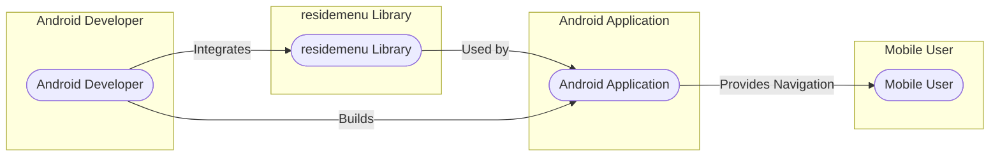
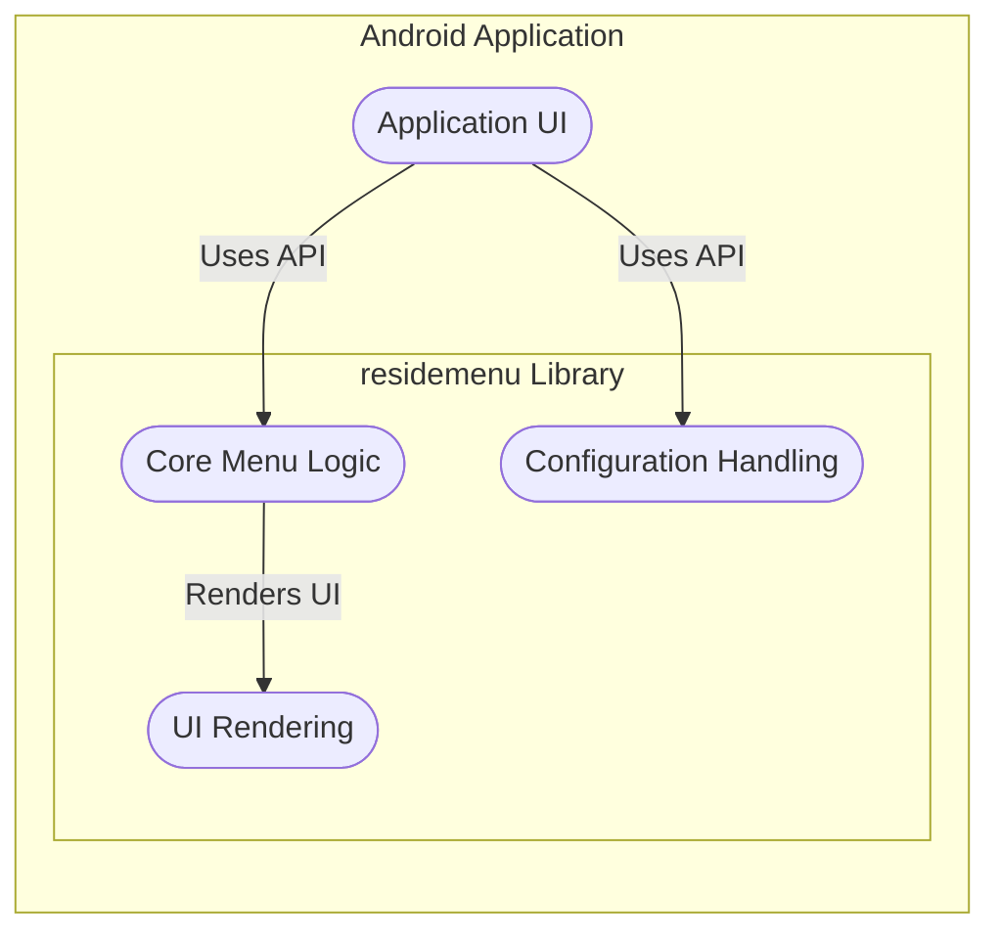
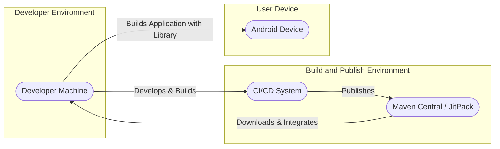
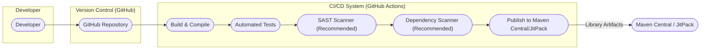

# BUSINESS POSTURE

This project is a software library called `residemenu` which provides a side menu (also known as a drawer menu or hamburger menu) for Android applications. The primary business goal of such a library is to enhance the user interface and user experience of Android applications by providing a common and intuitive navigation pattern.

Business priorities for this project are:
- Ease of integration: The library should be easy for Android developers to incorporate into their existing projects.
- Customization: The library should offer sufficient customization options to allow developers to tailor the menu's appearance and behavior to match their application's design.
- Performance: The library should be performant and not introduce noticeable overhead or lag into the host application.
- Stability and Reliability: The library should be stable and reliable, minimizing crashes or unexpected behavior in applications that use it.
- Open Source Community Support: As an open-source project, community support, contributions, and maintenance are important for its long-term viability and adoption.

Most important business risks that need to be addressed:
- Security vulnerabilities in the library code could be exploited by malicious actors in applications using the library, potentially leading to application compromise or data breaches.
- Compatibility issues with different Android versions or devices could lead to application instability or poor user experience.
- Poor performance of the library could negatively impact the overall performance of applications using it, leading to user dissatisfaction.
- Lack of maintenance or community support could lead to the library becoming outdated or insecure over time.
- Improper usage of the library by developers could introduce security vulnerabilities into the host applications.

# SECURITY POSTURE

Existing security controls:
- security control: Open Source Code Review - The code is publicly available on GitHub, allowing for community review and scrutiny.
- security control: GitHub Repository - Utilizing GitHub provides basic version control and issue tracking.

Accepted risks:
- accepted risk: Reliance on community for security vulnerability identification and patching.
- accepted risk: Potential for undiscovered vulnerabilities in the code.
- accepted risk: Risk of insecure integration by developers using the library.

Recommended security controls:
- recommended security control: Dependency Scanning - Implement automated dependency scanning to identify and address known vulnerabilities in third-party libraries used by `residemenu`.
- recommended security control: Static Application Security Testing (SAST) - Integrate SAST tools into the development process to automatically scan the codebase for potential security vulnerabilities.
- recommended security control: Secure Code Review Process - Establish a formal secure code review process, involving security-minded developers, for all code changes before they are merged.
- recommended security control: Vulnerability Disclosure Policy - Create a clear vulnerability disclosure policy to allow security researchers and users to report potential security issues responsibly.
- recommended security control: Security Testing - Conduct regular security testing, including penetration testing and fuzzing, to identify and address vulnerabilities.
- recommended security control: Secure Development Guidelines - Document and follow secure development guidelines for the project, educating contributors on secure coding practices.

Security requirements:
- Authentication: Not directly applicable to a UI library itself. Authentication is the responsibility of the applications using the library.
- Authorization: Not directly applicable to a UI library itself. Authorization is the responsibility of the applications using the library.
- Input Validation:
    - security requirement: Validate any input parameters or configurations provided to the library by developers to prevent unexpected behavior or vulnerabilities. This includes validating menu item properties, animation parameters, and styling attributes.
    - security requirement: If the library handles any user-provided content (e.g., custom view for menu items), ensure proper sanitization and validation to prevent injection attacks.
- Cryptography: Not directly applicable to the core functionality of a UI library like `residemenu`. If future features require cryptography, ensure proper implementation using well-vetted libraries and best practices.

# DESIGN

## C4 CONTEXT

Context Diagram Elements:

- Name: Android Developer
  - Type: Person
  - Description: Software developers who use the `residemenu` library to add side menus to their Android applications.
  - Responsibilities: Integrate the `residemenu` library into their Android projects, configure and customize the menu, and ensure proper usage within their applications.
  - Security controls: security control: Secure development practices in their own applications, security control: Proper usage of the library according to documentation and best practices.

- Name: residemenu Library
  - Type: Software System
  - Description: An open-source Android library that provides a customizable side menu component for Android applications.
  - Responsibilities: Provide reusable and customizable side menu functionality, handle menu display and user interactions, and offer an API for developers to integrate and configure the menu.
  - Security controls: security control: Code review, security control: Static analysis (recommended), security control: Dependency scanning (recommended), security control: Security testing (recommended).

- Name: Android Application
  - Type: Software System
  - Description: Mobile applications developed for the Android platform that integrate and utilize the `residemenu` library to provide side menu navigation.
  - Responsibilities: Utilize the `residemenu` library to enhance user navigation, handle user interactions with the menu, and provide application-specific functionality.
  - Security controls: security control: Application-level security controls (authentication, authorization, data protection), security control: Secure integration of third-party libraries, security control: Input validation and output encoding.

- Name: Mobile User
  - Type: Person
  - Description: End-users who interact with Android applications that incorporate the `residemenu` library.
  - Responsibilities: Use the side menu for navigation within Android applications.
  - Security controls: security control: Device security, security control: Application permissions.

## C4 CONTAINER

Container Diagram Elements:

- Name: Core Menu Logic
  - Type: Container - Code Module/Component
  - Description:  The core Java/Kotlin code within the `residemenu` library that implements the fundamental logic for menu behavior, state management, and event handling.
  - Responsibilities: Manage menu state (open/closed), handle user interactions (swipes, clicks), provide API for menu manipulation, and implement core menu functionality.
  - Security controls: security control: Input validation within the component, security control: Secure coding practices, security control: Static analysis (recommended).

- Name: UI Rendering
  - Type: Container - Code Module/Component
  - Description:  The Android View components and related code responsible for rendering the visual elements of the side menu, including menu items, animations, and styling.
  - Responsibilities: Render the menu UI based on configuration and data, handle animations and transitions, and manage visual aspects of the menu.
  - Security controls: security control: Output encoding (if displaying dynamic content), security control: UI framework security best practices.

- Name: Configuration Handling
  - Type: Container - Code Module/Component
  - Description:  The code responsible for managing the configuration and customization options of the `residemenu` library, allowing developers to customize the menu's appearance and behavior.
  - Responsibilities: Parse and validate configuration parameters provided by developers, provide API for setting configuration options, and manage default configurations.
  - Security controls: security control: Input validation of configuration parameters, security control: Secure default configurations.

- Name: Application UI
  - Type: Container - Application Component
  - Description:  The user interface components of the Android application that integrate and utilize the `residemenu` library.
  - Responsibilities: Integrate the `residemenu` library into the application's UI structure, provide configuration to the library, and handle events from the menu.
  - Security controls: security control: Secure usage of the library API, security control: Application-level security controls.

## DEPLOYMENT

Deployment for a library is different from a standalone application. Libraries are not deployed as independent services but are integrated into applications which are then deployed. For `residemenu`, the "deployment" context is its distribution to developers and its inclusion in Android application packages (APKs) that are deployed to user devices.

Deployment Solution: Library Distribution via Maven Central/JitPack

Deployment Diagram Elements:

- Name: Developer Machine
  - Type: Environment
  - Description: The local development environment of an Android developer where they write code, build applications, and integrate libraries like `residemenu`.
  - Responsibilities: Development of Android applications, integration of libraries, local testing.
  - Security controls: security control: Developer workstation security, security control: Code version control.

- Name: CI/CD System
  - Type: Environment
  - Description: Automated Continuous Integration and Continuous Delivery system (e.g., GitHub Actions, Jenkins) used to build, test, and publish the `residemenu` library.
  - Responsibilities: Automated building of the library, running tests, publishing library artifacts to package repositories.
  - Security controls: security control: Secure CI/CD pipeline configuration, security control: Access control to CI/CD system, security control: Build process security (see BUILD section).

- Name: Maven Central / JitPack
  - Type: Environment - Package Repository
  - Description: Public package repositories for Java and Android libraries where `residemenu` library artifacts are published and made available for developers to download and integrate into their projects.
  - Responsibilities: Hosting and distributing library artifacts, managing library versions.
  - Security controls: security control: Repository security controls, security control: Package integrity checks (checksums).

- Name: Android Device
  - Type: Environment - User Runtime Environment
  - Description: End-user's Android mobile device where applications that include the `residemenu` library are installed and run.
  - Responsibilities: Running Android applications, providing the runtime environment for the library.
  - Security controls: security control: Device operating system security, security control: Application sandboxing.

## BUILD

Build Process for `residemenu` Library:

Build Diagram Elements:

- Name: Developer
  - Type: Actor
  - Description: Software developer who writes and commits code changes to the `residemenu` library.
  - Responsibilities: Writing code, running local builds and tests, committing code changes.
  - Security controls: security control: Secure coding practices, security control: Code review before commit.

- Name: Version Control (GitHub)
  - Type: System - Code Repository
  - Description: GitHub repository hosting the source code of the `residemenu` library.
  - Responsibilities: Version control, code storage, collaboration, triggering CI/CD pipelines.
  - Security controls: security control: Access control to repository, security control: Branch protection, security control: Audit logging.

- Name: Build & Compile
  - Type: Process - Build Stage
  - Description: Stage in the CI/CD pipeline where the library's source code is compiled into bytecode (e.g., using Gradle for Android).
  - Responsibilities: Compiling code, packaging library artifacts (JAR/AAR).
  - Security controls: security control: Secure build environment, security control: Dependency management, security control: Build process integrity.

- Name: Automated Tests
  - Type: Process - Build Stage
  - Description: Stage in the CI/CD pipeline where automated unit tests and integration tests are executed to verify the functionality of the library.
  - Responsibilities: Running tests, reporting test results, ensuring code quality.
  - Security controls: security control: Test case coverage, security control: Secure test data management.

- Name: SAST Scanner (Recommended)
  - Type: Process - Build Stage - Security Check
  - Description: Recommended stage to integrate a Static Application Security Testing (SAST) tool to automatically scan the codebase for potential security vulnerabilities during the build process.
  - Responsibilities: Static code analysis, vulnerability detection, reporting potential security issues.
  - Security controls: security control: SAST tool configuration and updates, security control: Vulnerability reporting and tracking.

- Name: Dependency Scanner (Recommended)
  - Type: Process - Build Stage - Security Check
  - Description: Recommended stage to integrate a dependency scanning tool to check for known vulnerabilities in third-party libraries used by `residemenu`.
  - Responsibilities: Dependency vulnerability scanning, reporting vulnerable dependencies, suggesting updates.
  - Security controls: security control: Dependency scanner configuration and updates, security control: Vulnerability database updates.

- Name: Publish to Maven Central/JitPack
  - Type: Process - Build Stage - Release
  - Description: Stage in the CI/CD pipeline where the built library artifacts are published to package repositories like Maven Central or JitPack, making them available for developers.
  - Responsibilities: Publishing library artifacts, versioning, signing artifacts.
  - Security controls: security control: Secure publishing credentials management, security control: Artifact signing, security control: Repository access control.

- Name: Maven Central / JitPack
  - Type: System - Package Repository
  - Description: Public package repositories where the built and published `residemenu` library artifacts are stored and distributed.
  - Responsibilities: Hosting and distributing library artifacts, managing library versions, providing download access to developers.
  - Security controls: security control: Repository security controls, security control: Package integrity verification.

# RISK ASSESSMENT

Critical business process we are trying to protect:
- Reliable and user-friendly navigation in Android applications using the `residemenu` library.
- Maintaining the reputation and trustworthiness of the `residemenu` open-source project.
- Ensuring the security and stability of applications that integrate the `residemenu` library.

Data we are trying to protect and their sensitivity:
- Source code of the `residemenu` library: Sensitivity is medium. Confidentiality is less critical as it's open source, but integrity and availability are crucial to prevent malicious modifications and ensure project continuity.
- Library artifacts (JAR/AAR files) in package repositories: Sensitivity is medium. Integrity and availability are critical to ensure developers download legitimate and unmodified library versions.
- Project infrastructure (CI/CD configurations, build environments): Sensitivity is medium to high. Integrity and confidentiality are important to prevent unauthorized access and modifications that could compromise the build process or introduce vulnerabilities.
- User data is not directly handled by the `residemenu` library itself. However, vulnerabilities in the library could indirectly impact the security of user data in applications that use it. The sensitivity of user data depends on the specific application.

# QUESTIONS & ASSUMPTIONS

Questions:
- What is the intended scope and scale of usage for the `residemenu` library? Is it intended for use in hobby projects, small applications, or large enterprise-level applications?
- Are there any specific security compliance requirements or industry standards that the library or applications using it need to adhere to?
- What is the expected level of security expertise among developers who will be contributing to or using the library?
- Are there any specific concerns or priorities regarding security for this project beyond general best practices?
- What is the process for reporting and addressing security vulnerabilities in the library once it is in use?

Assumptions:
- BUSINESS POSTURE: The primary business goal is to provide a useful and reliable UI component for Android developers to enhance user experience. The project is community-driven and open-source.
- SECURITY POSTURE: Current security controls are basic, relying on open-source community review. There is an accepted risk of potential undiscovered vulnerabilities. Recommended security controls are considered high priority to improve the security posture. Security requirements focus on input validation and secure coding practices within the library.
- DESIGN: The design is relatively simple, focusing on modular components within the library. Deployment is through standard package repositories for Android libraries. The build process is assumed to be automated using CI/CD practices.