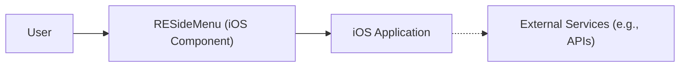
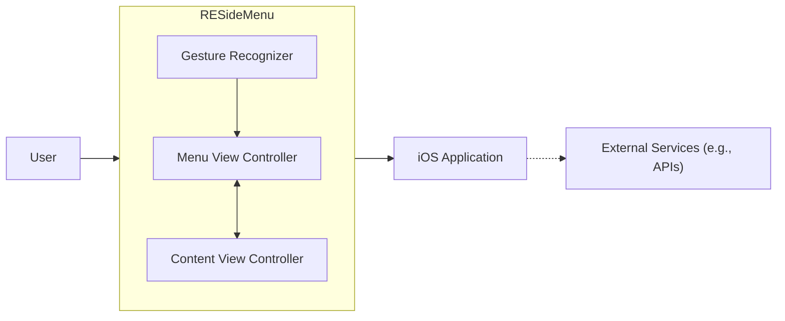
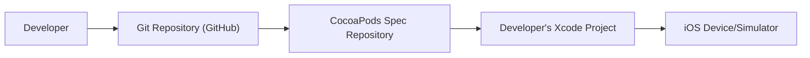
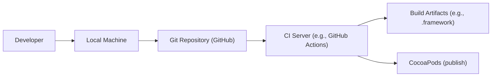

Okay, let's create a design document for the `RESideMenu` project.

# BUSINESS POSTURE

Business Priorities and Goals:

*   Provide a simple and visually appealing iOS-style side menu implementation for iOS applications.
*   Offer an alternative to standard iOS navigation patterns, enhancing user experience.
*   Provide a library that is easy to integrate and customize for developers.
*   Maintain a lightweight and performant component to avoid negatively impacting application performance.
*   Ensure compatibility with a wide range of iOS versions and devices.

Most Important Business Risks:

*   Poor user experience due to bugs, performance issues, or unintuitive design.
*   Compatibility issues with different iOS versions or device configurations, leading to application crashes or malfunctions.
*   Security vulnerabilities that could be exploited, although the risk is relatively low given the nature of the component.
*   Lack of adoption due to poor documentation, difficult integration, or better alternatives.
*   Maintenance overhead and inability to keep up with iOS updates and evolving best practices.

# SECURITY POSTURE

Existing Security Controls:

*   security control: The project is open-source, allowing for community review and contributions, which can help identify and address security issues. (GitHub repository)
*   security control: The project likely uses standard iOS development practices and frameworks, which have built-in security features. (Implicit in the codebase)

Accepted Risks:

*   accepted risk: The library itself does not handle sensitive data or perform critical operations, reducing the impact of potential vulnerabilities.
*   accepted risk: The library is primarily UI-focused, and security is largely delegated to the integrating application.

Recommended Security Controls:

*   security control: Implement regular code reviews and static analysis to identify potential vulnerabilities.
*   security control: Establish a process for handling security reports and releasing timely updates.
*   security control: Consider adding unit and UI tests to ensure functionality and prevent regressions.

Security Requirements:

*   Authentication: Not directly applicable, as the menu itself does not handle authentication. The integrating application is responsible for authentication.
*   Authorization: Not directly applicable. The menu displays content based on the application's logic, which should handle authorization.
*   Input Validation: The library should handle user input (e.g., taps, swipes) safely, preventing crashes or unexpected behavior due to invalid input. This is likely handled by standard iOS controls, but should be verified.
*   Cryptography: Not directly applicable, as the menu does not handle encryption or cryptographic operations.

# DESIGN

## C4 CONTEXT

Element Descriptions:

*   Element:
    *   Name: User
    *   Type: Person
    *   Description: The end-user interacting with the iOS application.
    *   Responsibilities: Interacts with the application's UI, including the RESideMenu.
    *   Security controls: None directly applicable to this element in the context of RESideMenu.

*   Element:
    *   Name: RESideMenu (iOS Component)
    *   Type: Software System
    *   Description: The iOS-style side menu component.
    *   Responsibilities: Provides a sliding side menu for navigation and content display.
    *   Security controls: Input validation, standard iOS security practices.

*   Element:
    *   Name: iOS Application
    *   Type: Software System
    *   Description: The application integrating the RESideMenu component.
    *   Responsibilities: Handles application logic, data, and integration with external services.
    *   Security controls: Authentication, authorization, data protection, secure communication with external services.

*   Element:
    *   Name: External Services (e.g., APIs)
    *   Type: Software System
    *   Description: External services that the iOS application interacts with.
    *   Responsibilities: Provide data and functionality to the iOS application.
    *   Security controls: Authentication, authorization, data protection, secure communication.

## C4 CONTAINER

Since RESideMenu is a single component, the Container diagram is essentially the same as the Context diagram, with a bit more detail on the internal structure of the RESideMenu component itself.

Element Descriptions:

*   Elements from C4 CONTEXT diagram are the same.

*   Element:
    *   Name: Menu View Controller
    *   Type: iOS UIViewController
    *   Description: The view controller managing the menu's content and presentation.
    *   Responsibilities: Displays the menu items, handles user interaction within the menu.
    *   Security controls: Standard iOS UIViewController security.

*   Element:
    *   Name: Content View Controller
    *   Type: iOS UIViewController
    *   Description: The view controller managing the main content displayed alongside the menu.
    *   Responsibilities: Displays the primary application content.
    *   Security controls: Standard iOS UIViewController security.

*   Element:
    *   Name: Gesture Recognizer
    *   Type: iOS UIGestureRecognizer
    *   Description: Handles gestures (e.g., swipes) to open and close the menu.
    *   Responsibilities: Detects user gestures and triggers menu animations.
    *   Security controls: Standard iOS UIGestureRecognizer security.

## DEPLOYMENT

Possible Deployment Solutions:

1.  CocoaPods: The library can be distributed as a CocoaPod, allowing developers to easily integrate it into their projects using the CocoaPods dependency manager.
2.  Carthage: Another dependency manager for Cocoa projects.
3.  Swift Package Manager:  Apple's built-in package manager.
4.  Manual Integration: Developers can manually add the source files to their Xcode project.

Chosen Solution (CocoaPods):

Element Descriptions:

*   Element:
    *   Name: Developer
    *   Type: Person
    *   Description: The developer integrating RESideMenu into their iOS application.
    *   Responsibilities: Writes code, integrates libraries, builds and deploys the application.
    *   Security controls: Secure coding practices, access control to development tools.

*   Element:
    *   Name: Git Repository (GitHub)
    *   Type: Version Control System
    *   Description: The source code repository for RESideMenu.
    *   Responsibilities: Stores the source code, tracks changes, and facilitates collaboration.
    *   Security controls: Access control, code review, branch protection.

*   Element:
    *   Name: CocoaPods Spec Repository
    *   Type: Package Repository
    *   Description: The repository containing the podspec file for RESideMenu.
    *   Responsibilities: Provides metadata about the library, allowing CocoaPods to find and download it.
    *   Security controls: Access control, integrity checks.

*   Element:
    *   Name: Developer's Xcode Project
    *   Type: IDE Project
    *   Description: The developer's Xcode project, which includes the RESideMenu library.
    *   Responsibilities: Contains the application's code, resources, and build settings.
    *   Security controls: Standard Xcode security features.

*   Element:
    *   Name: iOS Device/Simulator
    *   Type: Device/Emulator
    *   Description: The device or simulator where the application is deployed and run.
    *   Responsibilities: Executes the application code.
    *   Security controls: iOS operating system security features.

## BUILD

Element Descriptions:

* Developer, Git Repository are the same as in previous diagrams.

*   Element:
    *   Name: Local Machine
    *   Type: Workstation
    *   Description: The developer's local machine where code is written and built.
    *   Responsibilities: Provides the development environment.
    *   Security controls: Local machine security (e.g., disk encryption, firewall).

*   Element:
    *   Name: CI Server (e.g., GitHub Actions)
    *   Type: Continuous Integration Server
    *   Description: A server that automates the build and testing process.
    *   Responsibilities: Builds the library, runs tests, and potentially publishes it.
    *   Security controls: Access control, secure configuration, build environment isolation.

*   Element:
    *   Name: Build Artifacts (e.g., .framework)
    *   Type: File
    *   Description: The compiled output of the build process.
    *   Responsibilities: Contains the executable code and resources for the library.
    *   Security controls: Code signing, integrity checks.

*   Element:
    *   Name: CocoaPods
    *   Type: Package Manager
    *   Description:  Used here for publishing the built library.
    *   Responsibilities:  Makes the library available for others to install.
    *   Security controls:  Access control to publish.

Security Controls in Build Process:

*   Code Review: All changes to the codebase should be reviewed before merging.
*   Static Analysis: Use static analysis tools (e.g., linters, security analyzers) to identify potential vulnerabilities during the build process.  This could be integrated into the CI pipeline.
*   Dependency Management: Regularly review and update dependencies to address known vulnerabilities. Tools like Dependabot (for GitHub) can help automate this.
*   Code Signing:  The built framework should be code-signed to ensure its authenticity and integrity.
*   Automated Testing:  Include unit and UI tests in the CI pipeline to catch bugs and regressions.

# RISK ASSESSMENT

Critical Business Processes:

*   Providing a functional and user-friendly side menu component.
*   Maintaining compatibility with iOS versions and devices.

Data Protection:

*   The RESideMenu library itself does not handle sensitive data directly.  Data sensitivity is primarily the concern of the integrating application.  However, any data passed to the menu for display (e.g., menu item titles, user profile information) should be treated according to the application's overall data sensitivity policy.  The library should not store or transmit this data unnecessarily.

# QUESTIONS & ASSUMPTIONS

Questions:

*   What specific iOS versions and devices are targeted for support?
*   Are there any specific accessibility requirements for the menu?
*   Are there any plans to add features that might handle sensitive data (e.g., user authentication, in-app purchases)?
*   What is the expected release cadence for updates and new features?
*   What is the process for handling bug reports and security vulnerabilities?

Assumptions:

*   BUSINESS POSTURE: The primary goal is to provide a UI component, not to handle sensitive data or perform critical operations.
*   SECURITY POSTURE: The integrating application is responsible for the majority of security concerns, including authentication, authorization, and data protection.
*   DESIGN: The library is designed to be lightweight and performant, minimizing its impact on the integrating application. The library will be distributed via CocoaPods. The build process will include automated testing and static analysis.