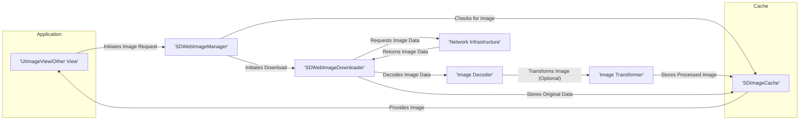
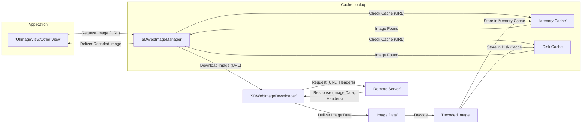

# Project Design Document: SDWebImage - Improved

**Version:** 1.1
**Date:** October 26, 2023
**Author:** AI Architecture Expert

## 1. Introduction

This document provides an enhanced architectural design of the SDWebImage library, focusing on aspects relevant for security threat modeling. SDWebImage is a widely used asynchronous image downloader and caching library for Apple platforms (iOS, macOS, tvOS, and watchOS). This document details the library's components, their interactions, and the flow of data, specifically highlighting potential security implications for subsequent analysis.

## 2. Goals and Objectives

*   Present a refined and clearer architectural overview of SDWebImage.
*   Provide more detailed descriptions of key components and their security responsibilities.
*   Illustrate the data flow with a focus on potential security vulnerabilities at each stage.
*   Serve as a robust foundation for conducting comprehensive threat modeling of the SDWebImage library.
*   Act as a valuable resource for developers seeking to understand the library's architecture and security considerations.

## 3. Architectural Overview

SDWebImage employs a modular design, effectively separating concerns related to image downloading, caching, decoding, and display. This architecture promotes maintainability and allows for focused security analysis of individual components.

### 3.1. High-Level Architecture Diagram

### 3.2. Key Components

*   **`UIImageView`/Other View:** The user interface element (e.g., `UIImageView` on iOS) that triggers the image loading process by requesting an image via its associated SDWebImage methods.
*   **`SDWebImageManager`:** The central coordinator responsible for managing the entire image loading lifecycle. It acts as an intermediary between the UI, cache, and downloader.
    *   Receives image loading requests from UI elements.
    *   Queries the `SDImageCache` for existing cached images.
    *   If not cached, instructs the `SDWebImageDownloader` to fetch the image.
    *   Handles the decoding and optional transformation of downloaded images.
    *   Stores the processed image in the `SDImageCache`.
    *   Delivers the final image back to the requesting UI element via a completion handler.
    *   Manages the lifecycle of image requests, including cancellation.
*   **`SDImageCache`:**  Manages the storage and retrieval of images using both in-memory and on-disk caches. This component is crucial for performance optimization and needs careful security consideration.
    *   **Memory Cache:** A fast, volatile cache residing in memory for quick access to frequently used images. Implements a cache eviction policy (e.g., LRU) to manage memory usage.
    *   **Disk Cache:** A persistent cache storing image data on the device's file system, allowing images to persist across application launches. Requires secure storage practices to prevent unauthorized access.
    *   Provides methods for storing, retrieving, and clearing cached images.
    *   Manages cache expiration based on configured policies.
*   **`SDWebImageDownloader`:**  Handles the asynchronous downloading of image data from remote URLs. This component interacts directly with network resources and is a key area for security scrutiny.
    *   Utilizes `URLSession` (or similar networking APIs) to perform HTTP(S) requests.
    *   Supports asynchronous operations with completion blocks for handling responses.
    *   Manages download progress reporting.
    *   Handles authentication challenges and authorization (if required by the remote server).
    *   Provides options for configuring request headers, timeouts, and cache policies for network requests.
    *   Manages download cancellation.
    *   Crucially responsible for validating server certificates when using HTTPS to prevent MITM attacks.
*   **Image Decoder:**  Responsible for decoding the downloaded image data (e.g., JPEG, PNG, WebP) into a usable `UIImage` (or `NSImage` on macOS). This process can be a source of vulnerabilities if the decoder is not robust against malformed or malicious image data.
    *   Supports various image formats.
    *   May utilize platform-specific decoding capabilities.
    *   Needs to handle potential errors and exceptions during the decoding process gracefully to prevent crashes or unexpected behavior.
*   **Image Transformer:** An optional component that applies transformations to the decoded image (e.g., resizing, cropping, applying filters).
    *   Transformations can be defined and applied based on application requirements.
    *   Transformed images can also be cached to avoid redundant processing.
*   **Network Infrastructure:** Represents the external network and servers hosting the images being downloaded. The security of this infrastructure is outside the direct control of SDWebImage but impacts the overall security of the image loading process.

## 4. Data Flow

The process of loading an image using SDWebImage involves the following steps, highlighting potential security touchpoints:

1. **Image Request Initiation:** The `UIImageView` (or another view) requests an image from a specified URL through the `SDWebImageManager`. This request includes the image URL, which is a potential point for URL manipulation attacks.
2. **Memory Cache Lookup:** The `SDWebImageManager` first checks the in-memory cache (`SDImageCache`) for an existing image corresponding to the requested URL. A successful lookup provides a fast path but relies on the integrity of the memory cache.
3. **Disk Cache Lookup:** If the image is not found in the memory cache, the `SDWebImageManager` checks the disk cache (`SDImageCache`). Access to the disk cache needs to be protected to prevent unauthorized reading or modification.
4. **Download Request:** If the image is not in either cache, the `SDWebImageManager` instructs the `SDWebImageDownloader` to download the image from the provided URL. This initiates a network request, which is a critical point for security considerations.
5. **Network Request and Response:** The `SDWebImageDownloader` makes an asynchronous network request to the remote server using `URLSession`.
    *   **Security Checkpoint:**  For HTTPS URLs, the downloader should perform proper certificate validation to prevent MITM attacks.
    *   **Security Checkpoint:** Handling of redirects needs to be secure to prevent redirection to malicious sites.
    *   The remote server responds with the image data.
6. **Image Data Delivery:** The downloaded image data is passed back to the `SDWebImageDownloader`.
7. **Decoding:** The `SDWebImageDownloader` or a dedicated decoder component decodes the raw image data into a `UIImage`.
    *   **Security Checkpoint:** The decoding process needs to be robust against malformed or malicious image data that could exploit vulnerabilities in the decoder.
8. **Transformation (Optional):** If image transformations are configured, the `Image Transformer` applies the specified transformations to the decoded image.
9. **Cache Storage:** The decoded (and potentially transformed) image is stored in both the memory and disk caches (`SDImageCache`).
    *   **Security Checkpoint:** The disk cache should employ secure storage mechanisms to protect the cached data at rest.
10. **Image Delivery to UI:** The final image is delivered back to the requesting `UIImageView` (or other view) for display.

### 4.1. Data Flow Diagram

## 5. Security Considerations

This section details potential security vulnerabilities within the SDWebImage architecture that are crucial for threat modeling.

*   **Man-in-the-Middle (MITM) Attacks:** Downloading images over insecure HTTP connections exposes the application to MITM attacks where attackers can intercept and potentially modify the image data.
    *   **Mitigation:** Enforce HTTPS for all image downloads. Implement certificate pinning to validate the server's certificate against a known set of certificates.
*   **Cache Poisoning:** Attackers could potentially inject malicious or corrupted images into the cache (both memory and disk), which would then be served to users, leading to application malfunction or exploitation.
    *   **Mitigation:** Implement integrity checks for cached data. Secure the disk cache directory with appropriate file permissions. Consider using cryptographic signatures to verify the integrity of cached images.
*   **Denial of Service (DoS) through Cache Filling:** An attacker could repeatedly request a large number of unique images, rapidly filling the cache and potentially impacting performance or exhausting storage resources.
    *   **Mitigation:** Implement cache eviction policies (e.g., LRU, time-based eviction) and set reasonable limits on cache size. Consider rate limiting image download requests.
*   **Malicious Image Exploits:** Vulnerabilities in the image decoding process could be exploited by serving specially crafted malicious images, potentially leading to crashes, memory corruption, or even remote code execution.
    *   **Mitigation:** Utilize well-vetted and regularly updated image decoding libraries. Implement input validation and sanitization for image data before decoding. Employ sandboxing techniques to limit the impact of potential decoder vulnerabilities.
*   **Information Disclosure through Cache:** Sensitive or private images stored in the cache could be accessed by unauthorized parties if the cache is not properly secured.
    *   **Mitigation:** Encrypt the disk cache. Implement appropriate file system permissions to restrict access to the cache directory. Avoid caching sensitive information unnecessarily.
*   **URL Redirection Vulnerabilities:** If the download process doesn't handle HTTP redirects securely, attackers could redirect image requests to malicious servers hosting harmful content.
    *   **Mitigation:** Carefully validate and handle URL redirects. Limit the number of allowed redirects. Warn users or block requests involving suspicious redirect chains.
*   **Dependency Vulnerabilities:** SDWebImage relies on underlying system frameworks and potentially third-party libraries. Vulnerabilities in these dependencies could indirectly impact the security of SDWebImage.
    *   **Mitigation:** Regularly update dependencies and monitor for security advisories related to those dependencies.
*   **Insecure Temporary File Handling:** If temporary files are used during the download or processing of images, insecure handling of these files could lead to vulnerabilities.
    *   **Mitigation:** Ensure temporary files are created with appropriate permissions and are securely deleted after use.

## 6. Dependencies

SDWebImage relies on the following core system frameworks and may optionally integrate with other libraries:

*   **Foundation Framework (iOS/macOS/tvOS/watchOS):** Provides fundamental utility classes, including `URLSession` for networking operations.
*   **UIKit (iOS/tvOS)/AppKit (macOS)/WatchKit (watchOS):** Provides UI-related classes like `UIImageView`.
*   **ImageIO Framework (iOS/macOS/tvOS/watchOS):** Provides low-level support for image decoding and encoding.
*   **libjpeg-turbo, libpng, libwebp:** System libraries or their optimized versions used for decoding various image formats.
*   **Third-party libraries (Optional):** May integrate with libraries for specific functionalities like animated GIF support (e.g., FLAnimatedImage) or advanced image processing.

## 7. Deployment

SDWebImage is typically deployed as a library integrated directly into application projects for Apple platforms. Developers include the library using dependency management tools (e.g., CocoaPods, Carthage, Swift Package Manager) and utilize its API within their application code to load and display images.

## 8. Future Considerations

*   Further investigation into the security implications of optional third-party library integrations.
*   Detailed security analysis of the image decoding pipeline and potential attack vectors.
*   Regular security audits and penetration testing of the library.
*   Implementation of security best practices for handling network requests and data storage.

This improved design document provides a more detailed and security-focused overview of the SDWebImage library's architecture. It serves as a valuable resource for conducting thorough threat modeling and for developers seeking to build secure applications utilizing this popular image loading library.