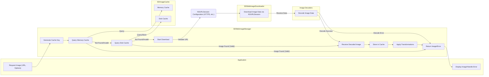

# Project Design Document: SDWebImage

**Version:** 1.1
**Date:** October 26, 2023
**Author:** AI Software Architecture Expert

## 1. Introduction

This document provides an enhanced and more detailed design overview of the SDWebImage library, an asynchronous image downloader with cache support for Apple platforms (iOS, macOS, tvOS, watchOS). This revised document aims to provide a more granular understanding of the library's architecture, components, and data flow, with a stronger emphasis on aspects relevant to security threat modeling.

### 1.1. Purpose

The primary purpose of this document is to clearly and comprehensively articulate the design of SDWebImage, focusing on details pertinent to security. This will enable stakeholders, particularly security analysts, to thoroughly understand the system's inner workings and identify a wider range of potential security vulnerabilities.

### 1.2. Scope

This document covers the core functionalities of SDWebImage in greater detail, including:

*   Asynchronous image downloading from URLs with specific attention to network security.
*   In-memory and on-disk caching of images, including cache management and security implications.
*   Image decoding and processing, highlighting potential vulnerabilities in decoding processes.
*   Integration with `UIImageView` and other relevant UI components, considering potential UI-related security issues.
*   Basic image transformations and their potential security impact.
*   Error handling and logging within the library.

This document does not delve into:

*   Extremely granular implementation details of individual methods beyond their security relevance.
*   Micro-level performance optimization strategies unless they have security implications.
*   Specific details of every possible third-party integration, focusing on core dependencies and their interactions.

### 1.3. Goals

*   Provide a highly detailed and clear architectural overview of SDWebImage, with a security-focused lens.
*   Identify key components and their specific responsibilities, including security-related functions.
*   Describe the data flow during image loading and caching with explicit mention of security checkpoints and potential vulnerabilities at each stage.
*   Highlight potential areas of security concern with more specific examples and context for future threat modeling.

## 2. Architectural Overview

SDWebImage employs a modular architecture, effectively separating concerns related to downloading, caching, and UI integration. The library offers a user-friendly API for developers to load and display images asynchronously, while internally managing complex operations.

```mermaid
graph LR
    subgraph "Application"
        A("UIImageView/Other View")
    end
    subgraph "SDWebImage Library"
        B("SDWebImageManager")
        C("SDImageCache")
        D("SDWebImageDownloader")
        E("Image Decoders")
        F("Image Transformers")
    end

    A -- "setImageWithURL:options:context:" --> B
    B -- "cacheKeyForURL:" --> B
    B -- "queryImageForKey:options:" --> C
    C -- "Memory Cache"
    C -- "Disk Cache"
    B -- "downloadImageWithURL:options:context:progress:completed:" --> D
    D -- "NSURLSession" --> G("Remote Server")
    D -- "didReceiveData:" --> D
    D -- "didCompleteWithError:" --> B
    D -- "Image Data" --> E
    E -- "decodeImageData:options:context:" --> E
    E -- "Decoded Image" --> B
    B -- "storeImage:forKey:options:completion:" --> C
    B -- "transformedImageWithImage:transformer:forKey:" --> F
    F -- "Transformed Image" --> B
    B -- "Callback with Image or Error" --> A
```

**Key Components:**

*   **`UIImageView`/Other View:** The UI element within the application responsible for displaying the image. This interacts directly with the SDWebImage API.
*   **`SDWebImageManager`:** The central orchestrator of the image loading process. It handles requests, interacts with the cache and downloader, manages options and context, and executes completion callbacks.
*   **`SDImageCache`:** Manages both in-memory and on-disk caches, providing mechanisms for storing, retrieving, and invalidating cached images. It considers factors like cost and expiration.
    *   **Memory Cache:** A fast, volatile cache residing in memory, typically implemented using `NSCache`.
    *   **Disk Cache:** A persistent cache stored on the device's file system, often in the application's caches directory.
*   **`SDWebImageDownloader`:**  Responsible for downloading image data from remote URLs using `NSURLSession`. It handles request configuration, authentication, progress reporting, and error management.
*   **Image Decoders:**  Decodes downloaded image data into a usable `UIImage` or `NSImage` object. This involves parsing various image formats (JPEG, PNG, GIF, WebP, etc.) and can be a source of vulnerabilities.
*   **Image Transformers:**  Applies transformations (e.g., resizing, cropping, applying filters) to images, either before or after caching. Transformations can be defined and applied using specific keys.
*   **`NSURLSession`:** Apple's framework for handling URL requests, providing features for network configuration, authentication, and secure communication (TLS).
*   **Remote Server:** The server hosting the image resources, which is an external entity and a potential source of threats.

## 3. Detailed Component Description

### 3.1. `SDWebImageManager`

*   **Responsibilities:**
    *   Receives image loading requests from UI components, including URLs, options, and context.
    *   Generates a cache key for the requested image URL.
    *   Queries `SDImageCache` for an existing image in both memory and disk caches, considering cache options.
    *   If the image is not cached or needs refreshing, initiates the download process using `SDWebImageDownloader`.
    *   Handles image decoding after download, potentially offloading this to a background thread.
    *   Stores the downloaded and decoded image in the cache, applying cache policies.
    *   Applies any requested image transformations using `Image Transformers`.
    *   Manages the lifecycle of download operations, including cancellation.
    *   Delivers the image (or error) back to the requesting UI component via a completion block, ensuring thread safety.
    *   Provides mechanisms for setting download and cache options, potentially including security-related settings.

### 3.2. `SDImageCache`

*   **Responsibilities:**
    *   Provides methods for querying the memory and disk caches for an image associated with a given key (typically derived from the image URL).
    *   Stores images in the memory cache, potentially with a cost limit and eviction policy.
    *   Stores images in the disk cache, managing file storage and retrieval.
    *   Manages the size and expiration of both caches, potentially based on time-to-live (TTL) or least-recently-used (LRU) algorithms.
    *   Provides methods for clearing the cache (both memory and disk) either entirely or selectively.
    *   Uses a key-value system for storage and retrieval, where the image URL or a derived key serves as the primary identifier.
    *   May implement mechanisms to protect the disk cache from unauthorized access or modification (e.g., file permissions).

### 3.3. `SDWebImageDownloader`

*   **Responsibilities:**
    *   Initiates asynchronous download requests using `NSURLSession`, configuring request parameters like timeouts and headers.
    *   Handles HTTP headers, including caching directives and authentication credentials if provided.
    *   Provides progress updates for ongoing downloads, allowing for monitoring download progress.
    *   Manages concurrent download operations, typically using a queue with configurable concurrency limits.
    *   Handles download errors and potential retries based on configured policies.
    *   May implement custom logic for handling redirects or specific HTTP status codes.
    *   Provides options for configuring `NSURLSession`, including settings related to TLS/SSL and certificate validation.
    *   Temporarily stores downloaded data before passing it to the decoder.

### 3.4. Image Decoders

*   **Responsibilities:**
    *   Takes raw image data (e.g., `Data`) as input.
    *   Decodes the data into a `UIImage` or `NSImage` object, interpreting the image format.
    *   Supports various image formats (JPEG, PNG, GIF, WebP, HEIF, etc.), potentially relying on system frameworks or third-party libraries.
    *   May perform optimizations during decoding, such as downsampling for smaller image views.
    *   Handles potential errors during the decoding process, which could indicate corrupted or malicious image data.

### 3.5. Image Transformers

*   **Responsibilities:**
    *   Applies transformations to `UIImage` or `NSImage` objects based on specified transformers.
    *   Supports a range of transformations, including resizing, cropping, applying filters, and image format conversions.
    *   May cache transformed images to avoid redundant processing, using a combination of the original image key and the transformation parameters as a new cache key.
    *   Provides a mechanism for defining custom transformations.

## 4. Data Flow

The detailed data flow for loading an image using SDWebImage involves several steps, with potential security implications at each stage:

1. The application requests an image for a specific URL, along with optional parameters (options, context), typically through a method like `imageView.sd_setImage(with:URL, options: .continueInBackground, context: nil)`.
2. `SDWebImageManager` receives the request and generates a cache key based on the URL and potentially other parameters.
3. `SDWebImageManager` queries `SDImageCache` for the image in the memory cache using the generated key.
4. If the image is found in the memory cache and is valid (not expired), it is returned immediately to the UI component.
5. If not found in the memory cache or invalid, `SDWebImageManager` queries `SDImageCache` for the image in the disk cache.
6. If the image is found in the disk cache and is valid, it is loaded, decoded, stored in the memory cache (optionally), and then returned to the UI component. **Security Checkpoint:** Verify disk cache integrity and permissions.
7. If the image is not found in either cache, `SDWebImageManager` instructs `SDWebImageDownloader` to download the image from the specified URL, passing along any relevant options and context. **Security Checkpoint:** Validate the URL to prevent SSRF or other URL-based attacks.
8. `SDWebImageDownloader` uses `NSURLSession` to initiate the download, configuring the request with appropriate headers and settings. **Security Checkpoint:** Ensure HTTPS is used and certificate validation is enabled to prevent MITM attacks.
9. The remote server responds with the image data. **Security Checkpoint:** The server's security posture is critical here.
10. `SDWebImageDownloader` receives the image data in chunks. **Security Checkpoint:** Verify data integrity during transfer if possible.
11. Once the download is complete, the downloaded data is passed to an appropriate Image Decoder for decoding. **Security Checkpoint:** Vulnerabilities in the decoding process could lead to crashes or even remote code execution.
12. The Image Decoder attempts to decode the data into a `UIImage` or `NSImage`. If decoding fails, an error is reported.
13. The decoded image is passed back to `SDWebImageManager`.
14. `SDWebImageManager` stores the decoded image in both the memory and disk caches, following cache policies. **Security Checkpoint:** Ensure proper permissions for the disk cache to prevent unauthorized access or modification.
15. If any image transformations are requested, `SDWebImageManager` applies them using the Image Transformers.
16. Finally, `SDWebImageManager` delivers the (potentially transformed) image to the requesting UI component via a completion block, along with any potential errors.



## 5. Security Considerations (For Threat Modeling)

The following are potential areas of security concern that should be thoroughly evaluated during threat modeling:

*   **Network Security:**
    *   **Man-in-the-Middle (MITM) Attacks:** Images downloaded over insecure HTTP connections are vulnerable to interception and modification. **Mitigation:** Enforce HTTPS and consider certificate pinning to validate the server's identity.
    *   **Data Integrity during Transit:** Ensure that downloaded image data has not been tampered with during transmission. **Mitigation:** HTTPS provides encryption and integrity checks. Consider using Subresource Integrity (SRI) if applicable.
*   **Data Security:**
    *   **Cache Poisoning:** Attackers might attempt to inject malicious or inappropriate images into the cache, which could then be served to users. **Mitigation:** Implement robust cache validation mechanisms, consider HTTP caching headers (`Cache-Control`), and secure the disk cache location with appropriate file permissions.
    *   **Local Storage Security:** Images stored in the disk cache could be accessed if the device is compromised. **Mitigation:** Consider encrypting the disk cache or storing sensitive images with additional protection.
*   **Application Security:**
    *   **Denial of Service (DoS):** Maliciously crafted URLs or requests for extremely large images could exhaust device resources (CPU, memory, disk space). **Mitigation:** Implement rate limiting, request validation, and mechanisms to limit resource usage per request.
    *   **Remote Code Execution (RCE) via Image Processing:** Vulnerabilities in image decoding libraries could be exploited by serving specially crafted images. **Mitigation:** Keep image decoding libraries up-to-date with the latest security patches. Implement input validation and sanitization where possible. Consider using sandboxed decoding processes.
    *   **Information Disclosure:** Sensitive information might be inadvertently exposed through error messages, logging, or metadata associated with cached images. **Mitigation:** Implement secure logging practices and carefully handle error conditions. Sanitize or remove sensitive metadata.
    *   **URL Handling Vulnerabilities:** Improper validation of image URLs could lead to unexpected behavior or security vulnerabilities, such as Server-Side Request Forgery (SSRF), although less likely in a client-side library, or local file access vulnerabilities. **Mitigation:** Implement strict URL validation and sanitization.
    *   **Image Transformation Vulnerabilities:**  Flaws in image transformation logic could potentially be exploited, though this is less common. **Mitigation:** Use well-vetted transformation libraries and carefully review any custom transformation logic.
*   **Dependency Management:**
    *   Vulnerabilities in underlying libraries (e.g., the system's image decoding frameworks or any third-party libraries used) could impact SDWebImage. **Mitigation:** Regularly update dependencies and monitor for security advisories.

## 6. Deployment Considerations

SDWebImage is typically deployed as a library integrated directly into iOS, macOS, tvOS, and watchOS applications. Its security is heavily influenced by the security context of the host application. Key considerations include:

*   **Secure Coding Practices:** Developers using SDWebImage should follow secure coding practices to avoid introducing vulnerabilities when integrating the library.
*   **Application Permissions:** The application's permissions will dictate the level of access SDWebImage has to the network and file system.
*   **Device Security:** The overall security posture of the user's device impacts the security of the cached images.

## 7. Future Considerations

*   Enhanced security features, such as built-in support for certificate pinning with more flexible configuration options.
*   More granular control over cache security, including options for encrypting specific cached images.
*   Improved error handling and security logging, providing more detailed information for debugging and security analysis.
*   Integration with security frameworks for vulnerability scanning and reporting.
*   Consideration of using secure enclaves or other hardware-backed security features for sensitive image handling.

This document provides a more detailed and security-focused understanding of SDWebImage's architecture. It serves as a more comprehensive foundation for subsequent threat modeling activities, enabling a deeper analysis of potential vulnerabilities and their mitigations. This document will be updated as the library evolves and new security considerations emerge.