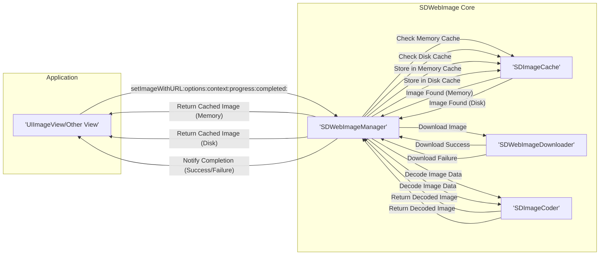
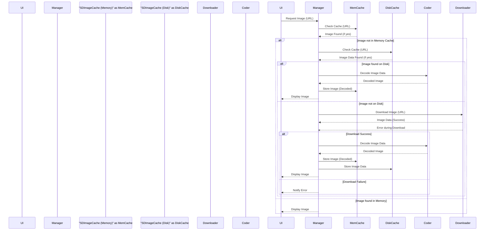

# Project Design Document: SDWebImage

**Version:** 1.1
**Date:** October 26, 2023
**Author:** AI Software Architect

## 1. Introduction

This document provides a detailed design overview of the SDWebImage library, intended for use in threat modeling. It clearly articulates the architecture, components, and data flow within the library, emphasizing aspects relevant to security analysis.

## 2. Project Overview

SDWebImage is a powerful asynchronous image downloader and caching library for Apple platforms (iOS, macOS, tvOS, and watchOS). It simplifies the process of fetching and displaying remote images by handling network requests, managing a multi-layered cache (memory and disk), decoding image data, and integrating seamlessly with UI elements. The library aims to improve application performance and user experience by minimizing redundant downloads and optimizing image handling.

## 3. Goals

* Provide a highly efficient and reliable mechanism for asynchronous image downloading.
* Offer a comprehensive caching solution to reduce network traffic and improve loading times.
* Abstract away the complexities of network requests, caching, and image decoding.
* Provide a flexible and configurable API for various caching strategies and download options.
* Support a wide range of common image formats.
* Integrate smoothly with standard Apple UI components.
* Maintain a balance between performance, memory usage, and disk space utilization.

## 4. Non-Goals

* Implementing advanced image manipulation or editing functionalities beyond basic decoding and format support.
* Providing a custom, low-level networking stack; the library relies on Apple's `URLSession` framework.
* Offering specialized image processing features like real-time filters or complex transformations.
* Directly supporting non-Apple platforms, although community ports may exist.
* Acting as a general-purpose data caching solution; its focus is specifically on images.

## 5. Architecture Overview

SDWebImage employs a modular architecture where different components handle specific aspects of the image loading process. The `SDWebImageManager` acts as the central coordinator, orchestrating interactions between the cache, downloader, and decoder.

**Components:**

* **`UIImageView/Other View`:** The UI element within the application that initiates the image loading request. This is the client of the SDWebImage library.
* **`SDWebImageManager`:** The core component responsible for managing the entire image loading lifecycle. It acts as an intermediary between the UI, cache, downloader, and decoder.
* **`SDImageCache`:** Manages both in-memory and on-disk image caches, providing mechanisms for storing, retrieving, and invalidating cached images.
    * **Memory Cache:** A fast, volatile cache (typically using `NSCache`) for storing recently accessed, decoded images.
    * **Disk Cache:** A persistent cache on the file system for storing downloaded image data across application launches.
* **`SDWebImageDownloader`:** Handles the asynchronous downloading of image data from remote URLs using `URLSession`. It provides features for request customization, progress reporting, and cancellation.
* **`SDImageCoder`:** Responsible for encoding and decoding image data to and from `UIImage` (iOS/tvOS) or `NSImage` (macOS) objects. It supports various image formats and can be extended with custom coders.

## 6. Component Details

### 6.1. `UIImageView/Other View`

* **Responsibility:** Initiates image loading requests and displays the loaded images.
* **Key Functions:**
    * Calls methods like `sd_setImage(with:placeholderImage:options:context:progress:completed:)` to trigger the image loading process.
    * Displays placeholder images while the image is loading.
    * Handles potential errors during the loading process.
    * May provide completion blocks to receive notifications about the loading status.

### 6.2. `SDWebImageManager`

* **Responsibility:** Orchestrates the image loading process, coordinating between cache, downloader, and decoder.
* **Key Functions:**
    * Receives image requests from UI elements, identified by a URL.
    * First checks the **memory cache** for a decoded image corresponding to the URL.
    * If not found in memory, checks the **disk cache** for the image data.
    * If not found in either cache, initiates a download using `SDWebImageDownloader`.
    * Upon successful download, decodes the image data using `SDImageCoder`.
    * Stores the decoded image in the memory cache and the raw data in the disk cache (depending on configuration).
    * Notifies the requesting UI element (via completion block or delegate) about the success or failure of the operation.
    * Manages the lifecycle of download operations, allowing for cancellation.
    * Provides options for controlling cache behavior and download settings.

### 6.3. `SDImageCache`

* **Responsibility:** Manages the storage and retrieval of cached images in both memory and on disk.
* **Key Functions:**
    * **Memory Cache:**
        * Stores decoded `UIImage`/`NSImage` objects.
        * Uses `NSCache` with configurable limits (count and memory usage).
        * Employs an LRU (Least Recently Used) eviction policy to manage memory usage.
        * Provides methods for adding, retrieving, and removing images from the cache.
    * **Disk Cache:**
        * Stores raw image data on the file system.
        * Uses a configurable directory for storage.
        * Implements mechanisms for managing disk space usage (e.g., size limits, expiration dates).
        * May use background tasks for disk I/O operations.
        * Provides methods for storing, retrieving, and clearing cached data.
        * Supports asynchronous operations to avoid blocking the main thread.

### 6.4. `SDWebImageDownloader`

* **Responsibility:** Handles the network request to download image data from a given URL.
* **Key Functions:**
    * Uses `URLSession` for performing HTTP(S) requests.
    * Supports various `URLSessionConfiguration` options (e.g., timeouts, caching policies at the network level).
    * Provides mechanisms for setting request headers.
    * Supports authentication challenges.
    * Offers progress reporting for download operations.
    * Allows for cancellation of ongoing downloads.
    * Handles HTTP response codes and errors.
    * May implement connection pooling and other network optimization techniques.

### 6.5. `SDImageCoder`

* **Responsibility:** Encodes and decodes image data to and from `UIImage`/`NSImage` objects.
* **Key Functions:**
    * Decodes raw image data (e.g., JPEG, PNG, GIF, WebP, HEIF) into a usable image object.
    * May perform format conversions during decoding.
    * Supports encoding `UIImage`/`NSImage` back into data (less common in typical usage but available).
    * Can be extended with custom `SDImageCoder` implementations to support additional image formats.
    * Handles different image orientations and metadata.
    * May involve interaction with system image decoding libraries.

## 7. Data Flow

The following sequence diagram illustrates the typical data flow for an image request within SDWebImage:

**Detailed Steps:**

1. The `UIImageView` initiates an image loading request by calling a method on `SDWebImageManager`, providing the image URL.
2. `SDWebImageManager` first checks the **memory cache** for a previously decoded image associated with the given URL.
3. If the image is found in the memory cache, it is immediately returned to the `UIImageView` for display.
4. If the image is not in the memory cache, `SDWebImageManager` checks the **disk cache** for the raw image data.
5. If the image data is found in the disk cache, it is retrieved, and `SDWebImageManager` uses `SDImageCoder` to decode the data into a `UIImage`/`NSImage`. The decoded image is then stored in the memory cache and returned to the `UIImageView`.
6. If the image is not found in either cache, `SDWebImageManager` instructs `SDWebImageDownloader` to download the image data from the provided URL.
7. `SDWebImageDownloader` performs an asynchronous network request.
8. Upon successful download, the raw image data is passed back to `SDWebImageManager`. If an error occurs during download, `SDWebImageManager` is notified of the failure.
9. If the download is successful, `SDWebImageManager` uses `SDImageCoder` to decode the downloaded image data.
10. The decoded image is then stored in the memory cache, and the raw data is stored in the disk cache (depending on configuration settings).
11. Finally, the decoded image is delivered back to the `UIImageView` for display, and a completion block (if provided) is executed, indicating success or failure.

## 8. Security Considerations

This section outlines potential security considerations relevant to SDWebImage.

* **Man-in-the-Middle (MITM) Attacks:**
    * **Threat:** If image URLs use `http://` instead of `https://`, attackers can intercept network traffic and potentially replace downloaded images with malicious content.
    * **Mitigation:** Enforce the use of HTTPS for all image URLs. Consider implementing certificate pinning for enhanced security.
* **Cache Poisoning:**
    * **Threat:** An attacker could potentially inject malicious images into the cache (both memory and disk) if HTTP caching headers are not correctly handled or if the cache storage mechanisms are vulnerable.
    * **Mitigation:** Ensure proper handling of HTTP caching directives (e.g., `Cache-Control`, `Expires`). Implement integrity checks for cached data. Secure the disk cache directory with appropriate file system permissions.
* **Denial of Service (DoS):**
    * **Threat:** An attacker could repeatedly request very large images, consuming excessive bandwidth, memory, and disk space, potentially leading to application slowdown or crashes.
    * **Mitigation:** Implement rate limiting for image requests. Configure appropriate cache size limits and eviction policies. Consider using a Content Delivery Network (CDN) to distribute the load.
* **Local File Access Vulnerabilities:**
    * **Threat:** If the disk cache directory has insecure permissions, other applications or malicious actors on the device could potentially access or modify cached image data.
    * **Mitigation:** Ensure the disk cache directory has appropriate file system permissions, restricting access to the application's sandbox.
* **Image Decoding Vulnerabilities:**
    * **Threat:** Vulnerabilities in the underlying image decoding libraries used by `SDImageCoder` could be exploited by serving specially crafted malicious images, potentially leading to crashes, memory corruption, or even remote code execution.
    * **Mitigation:** Keep the operating system and its image processing libraries up to date. Consider using secure and well-maintained image decoding libraries. Implement error handling and input validation during the decoding process.
* **Data Exfiltration:**
    * **Threat:** If sensitive information is inadvertently cached (e.g., due to incorrect URL handling or server-side misconfiguration), and the disk cache is not properly secured, this data could be exposed.
    * **Mitigation:** Carefully review the URLs being loaded and ensure they do not contain sensitive information. Secure the disk cache. Consider encrypting the disk cache.
* **URL Handling Issues:**
    * **Threat:** Improper validation or sanitization of image URLs could lead to unexpected behavior, such as accessing unintended resources or triggering server-side vulnerabilities.
    * **Mitigation:** Implement robust URL validation and sanitization. Avoid directly using user-provided input as image URLs without proper validation.
* **Side-Channel Attacks (Timing Attacks):**
    * **Threat:**  Attackers might try to infer information about the cache state by observing the time it takes to load images (faster load implies cached).
    * **Mitigation:** While difficult to completely eliminate, consider adding artificial delays or obfuscation to loading times.

## 9. Dependencies

* **Foundation:** Provides fundamental classes for data management, networking (`URLSession`), and file system operations.
* **UIKit (iOS/tvOS) / AppKit (macOS):** Provides UI elements (`UIImageView`, `NSImageView`) and image handling classes (`UIImage`, `NSImage`).
* **`URLSession`:** Apple's framework for handling network requests.
* **libjpeg, libpng, libwebp, libheif:** System libraries or frameworks used for image decoding (implicitly used by `UIImage`/`NSImage` and potentially directly by custom coders). The specific versions depend on the operating system.

## 10. Deployment

SDWebImage is typically deployed as a library integrated into application projects.

* **Integration Methods:**
    * **CocoaPods:** A dependency manager for Swift and Objective-C projects. Developers add `pod 'SDWebImage'` to their `Podfile`.
    * **Carthage:** A decentralized dependency manager. Developers add `github "SDWebImage/SDWebImage"` to their `Cartfile`.
    * **Swift Package Manager:** Apple's built-in dependency manager. Developers can add the SDWebImage repository as a package dependency in Xcode.
    * **Manual Integration:** Developers can also manually add the source files to their project.
* **Configuration:**
    * **`SDImageCache`:** Configuration options include setting memory and disk cache limits, expiration policies, and custom cache directories.
    * **`SDWebImageDownloader`:** Configuration options include setting timeouts, cache policies at the `URLSession` level, and custom request headers.
    * **`SDWebImageManager`:** Provides options for controlling the overall image loading behavior and integrating custom coders.
* **Customization:** Developers can extend SDWebImage by implementing custom `SDImageCoder` classes to support additional image formats or modify the default caching and downloading behavior through delegation or subclassing.

This improved design document provides a more detailed and nuanced understanding of the SDWebImage library, making it more suitable for comprehensive threat modeling activities.