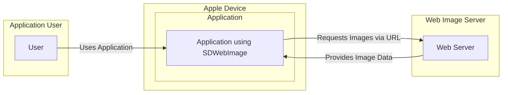
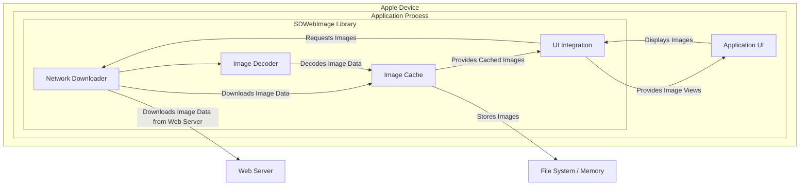

# BUSINESS POSTURE

This project, `sdwebimage`, is a library for asynchronous image downloading, caching, and displaying for iOS, macOS, tvOS, watchOS and visionOS.

- Business Priorities:
  - Provide a robust and efficient way for applications to display images from the web.
  - Improve application performance by handling image loading and caching asynchronously and efficiently.
  - Simplify the process of image management for developers, reducing development time and complexity.
  - Ensure compatibility and stability across different Apple platforms and operating system versions.

- Business Goals:
  - Increase developer adoption of the library within the Apple ecosystem.
  - Maintain a high level of performance and reliability to meet the demands of modern applications.
  - Continuously improve the library with new features and optimizations based on community feedback and platform advancements.
  - Establish `sdwebimage` as the de-facto standard for image handling in Apple development.

- Business Risks:
  - Performance bottlenecks in image loading or caching could negatively impact application user experience.
  - Security vulnerabilities in the library could be exploited by malicious actors to compromise applications using it.
  - Incompatibility issues with new operating system versions or hardware could lead to application crashes or malfunctions.
  - Lack of maintenance or community support could lead to stagnation and eventual obsolescence of the library.
  - Incorrect handling of image data could lead to unexpected application behavior or security issues.

# SECURITY POSTURE

- Security Controls:
  - security control: HTTPS is enforced by default for image downloads, ensuring encrypted communication channel. Implemented within the networking layer of the library.
  - security control: Image data is validated to some extent during decoding to prevent crashes or unexpected behavior. Implemented within the image decoding components.
  - security control: Caching mechanism is implemented to reduce network requests and improve performance. Implemented within the caching components.
  - security control: Memory management is handled to prevent memory leaks and crashes. Implemented throughout the library.

- Accepted Risks:
  - accepted risk: Dependency vulnerabilities in underlying libraries used for networking or image processing. Risk is mitigated by regular updates of dependencies.
  - accepted risk: Potential for denial-of-service attacks if the library is forced to process a large number of malicious or oversized images. Risk is mitigated by OS level resource limits and library's internal resource management.
  - accepted risk: Information disclosure if cached images are not properly protected on the device file system. Risk is mitigated by OS level file system permissions and application's responsibility to protect sensitive data.

- Recommended Security Controls:
  - security control: Implement input validation for image URLs to prevent injection attacks or unexpected behavior.
  - security control: Integrate static analysis security testing (SAST) tools into the build process to automatically detect potential vulnerabilities in the code.
  - security control: Implement dependency scanning to automatically identify and alert on known vulnerabilities in third-party libraries.
  - security control: Consider implementing integrity checks for downloaded images to ensure they haven't been tampered with during transit.
  - security control: Provide clear security guidelines and best practices for developers using the library, especially regarding handling sensitive image data.

- Security Requirements:
  - Authentication:
    - Applications using `sdwebimage` are responsible for handling authentication to image sources if required. `sdwebimage` should support passing authentication headers or tokens provided by the application to the image server.
  - Authorization:
    - Authorization is the responsibility of the applications using `sdwebimage`. The library itself does not handle authorization. Applications should ensure that users are authorized to access the images being displayed.
  - Input Validation:
    - Image URLs provided to `sdwebimage` should be validated to prevent injection attacks and ensure they conform to expected formats.
    - Image data received from the network should be validated to prevent processing of malicious or malformed image files that could lead to crashes or vulnerabilities.
  - Cryptography:
    - All network communication for downloading images should be encrypted using HTTPS.
    - If sensitive images are cached, consider providing options for encrypting the cached data at rest. This is likely the responsibility of the application using the library, but the library could provide extension points or guidance.

# DESIGN

## C4 CONTEXT



- C4 Context Elements:
  - - Name: User
    - Type: Person
    - Description: End-user of the application that utilizes `sdwebimage`.
    - Responsibilities: Interacts with the application, triggering image loading and display.
    - Security controls: User authentication and authorization are handled by the application itself, not directly by `sdwebimage`. User device security is assumed to be managed by the user or organization.

  - - Name: Application using SDWebImage
    - Type: Software System
    - Description: iOS, macOS, tvOS, watchOS or visionOS application that integrates the `sdwebimage` library to display images from the web.
    - Responsibilities:
      - Displaying images to the user.
      - Managing application state and user interactions.
      - Utilizing `sdwebimage` to handle image loading, caching, and display.
      - Implementing application-level security controls such as user authentication and authorization.
    - Security controls:
      - security control: Input validation of user inputs within the application.
      - security control: User authentication and authorization mechanisms.
      - security control: Secure storage of application data.
      - security control: Integration with device security features (e.g., Keychain).

  - - Name: Web Server
    - Type: Software System
    - Description: Web server hosting the images that are displayed by the application.
    - Responsibilities:
      - Storing and serving image files.
      - Handling image requests from applications.
      - Potentially implementing authentication and authorization for image access.
    - Security controls:
      - security control: HTTPS to encrypt image data in transit.
      - security control: Server-side authentication and authorization mechanisms.
      - security control: Web application firewall (WAF) to protect against web attacks.
      - security control: Regular security patching and updates.

## C4 CONTAINER



- C4 Container Elements:
  - - Name: SDWebImage Library
    - Type: Library
    - Description:  The `sdwebimage` library itself, providing image loading, caching, and display functionalities.
    - Responsibilities:
      - Asynchronously downloading images from URLs.
      - Caching images in memory and on disk.
      - Decoding image data into displayable formats.
      - Integrating with UI frameworks to display images.
    - Security controls:
      - security control: HTTPS enforcement in Network Downloader.
      - security control: Input validation in Network Downloader and Image Decoder.
      - security control: Cache management to prevent excessive disk usage.
      - security control: Memory management to prevent leaks and crashes.

  - - Name: Network Downloader
    - Type: Component
    - Description: Responsible for downloading image data from web servers over the network.
    - Responsibilities:
      - Making network requests to fetch image data from URLs.
      - Handling network protocols (HTTPS).
      - Managing network connections and timeouts.
      - Potentially handling authentication headers.
    - Security controls:
      - security control: Enforces HTTPS for secure communication.
      - security control: Implements error handling for network failures.
      - security control: May implement checks for valid response codes and content types.

  - - Name: Image Cache
    - Type: Component
    - Description: Manages the caching of downloaded images in memory and on disk to improve performance and reduce network requests.
    - Responsibilities:
      - Storing downloaded image data in memory and on disk.
      - Retrieving cached images when available.
      - Implementing cache eviction policies.
      - Managing cache size and storage limits.
    - Security controls:
      - security control: File system permissions to protect cached images (OS level).
      - security control: Potential encryption of cached data (application or library responsibility).
      - security control: Cache invalidation mechanisms to ensure data freshness.

  - - Name: Image Decoder
    - Type: Component
    - Description: Decodes downloaded image data from various formats (e.g., JPEG, PNG) into a format suitable for display by the UI framework.
    - Responsibilities:
      - Parsing image data in different formats.
      - Decoding image data into bitmaps or other displayable representations.
      - Handling image format errors and corrupt images.
    - Security controls:
      - security control: Input validation to prevent processing of malicious image files.
      - security control: Error handling for invalid or corrupted image data.
      - security control: Mitigation against image processing vulnerabilities (e.g., buffer overflows).

  - - Name: UI Integration
    - Type: Component
    - Description: Provides APIs and functionalities to integrate `sdwebimage` with UI frameworks (e.g., UIKit, AppKit) for displaying images in application views.
    - Responsibilities:
      - Providing image view categories or extensions for easy integration.
      - Handling image loading and display on the main thread.
      - Managing image placeholders and error handling in the UI.
    - Security controls:
      - security control: Thread safety to prevent race conditions in UI updates.
      - security control: Proper handling of image display lifecycle to avoid resource leaks.

  - - Name: Application UI
    - Type: Container
    - Description: The user interface of the application that utilizes `sdwebimage` to display images.
    - Responsibilities:
      - Displaying image views provided by `sdwebimage`.
      - Handling user interactions related to images.
      - Managing the overall application user experience.
    - Security controls:
      - security control: Input validation of user interactions.
      - security control: Secure handling of user data within the application UI.

  - - Name: Web Server
    - Type: External System
    - Description:  External web server providing image resources. (Same as in Context Diagram)
    - Responsibilities: (Same as in Context Diagram)
    - Security controls: (Same as in Context Diagram)

  - - Name: File System / Memory
    - Type: Data Store
    - Description: Local file system and memory on the device used by the Image Cache to store cached images.
    - Responsibilities:
      - Persistently storing cached images on disk.
      - Providing temporary storage for cached images in memory.
    - Security controls:
      - security control: OS-level file system permissions.
      - security control: Memory protection mechanisms provided by the OS.

## DEPLOYMENT

```mermaid
flowchart LR
    subgraph "Apple Cloud"
        CLOUD_SERVICES[Cloud Services (CDN, etc.)]
    end
    subgraph "Web Server Infrastructure"
        WEB_SERVERS[Web Servers]
    end
    subgraph "Apple Device"
        DEVICE[Apple Device (iPhone, iPad, Mac, etc.)]
        subgraph "Operating System"
            OS[iOS, macOS, tvOS, watchOS, visionOS]
            subgraph "Application Environment"
                APPLICATION[Application using SDWebImage]
                SDWEBIMAGE[SDWebImage Library]
            end
        end
    end

    APPLICATION -- "Uses" --> SDWEBIMAGE
    SDWEBIMAGE -- "Downloads Images from" --> DEVICE -- "Requests Images from" --> WEB_SERVERS
    WEB_SERVERS -- "Serves Images via" --> CLOUD_SERVICES
    CLOUD_SERVICES -- "Delivers Images to" --> DEVICE
```

- Deployment Elements:
  - - Name: Apple Device
    - Type: Infrastructure
    - Description: End-user's Apple device (iPhone, iPad, Mac, Apple TV, Apple Watch, Vision Pro) running the application.
    - Responsibilities:
      - Running the operating system and applications.
      - Providing resources (CPU, memory, storage, network) for applications.
      - Enforcing device-level security controls.
    - Security controls:
      - security control: Device passcode/biometrics.
      - security control: Operating system security features (sandboxing, permissions).
      - security control: Device encryption.

  - - Name: Operating System
    - Type: Software Environment
    - Description: Apple's operating system (iOS, macOS, tvOS, watchOS, visionOS) providing the runtime environment for applications.
    - Responsibilities:
      - Managing system resources.
      - Providing APIs and frameworks for applications.
      - Enforcing security policies and permissions.
    - Security controls:
      - security control: Kernel-level security mechanisms.
      - security control: Application sandboxing.
      - security control: Code signing requirements.
      - security control: System integrity protection.

  - - Name: Application Environment
    - Type: Software Environment
    - Description: The runtime environment within the operating system where the application and `sdwebimage` library execute.
    - Responsibilities:
      - Providing a managed environment for application execution.
      - Isolating application processes.
      - Managing application lifecycle.
    - Security controls:
      - security control: Process isolation.
      - security control: Memory protection.
      - security control: Resource limits.

  - - Name: Application using SDWebImage
    - Type: Software
    - Description: The application itself, deployed on the Apple device. (Same as in Context Diagram)
    - Responsibilities: (Same as in Context Diagram)
    - Security controls: (Same as in Context Diagram)

  - - Name: SDWebImage Library
    - Type: Software
    - Description: The `sdwebimage` library, deployed as part of the application package. (Same as in Container Diagram)
    - Responsibilities: (Same as in Container Diagram)
    - Security controls: (Same as in Container Diagram)

  - - Name: Web Servers
    - Type: Infrastructure
    - Description: Infrastructure hosting the web servers that serve images. (Same as in Context Diagram)
    - Responsibilities: (Same as in Context Diagram)
    - Security controls: (Same as in Context Diagram)

  - - Name: Cloud Services (CDN, etc.)
    - Type: Infrastructure
    - Description: Optional cloud services like Content Delivery Networks (CDNs) that may be used to cache and deliver images closer to users.
    - Responsibilities:
      - Caching and distributing image content globally.
      - Improving image delivery performance and availability.
      - Potentially providing DDoS protection and other security services.
    - Security controls:
      - security control: CDN security features (DDoS protection, WAF).
      - security control: Secure configuration of CDN settings.
      - security control: Access control to CDN management interfaces.

## BUILD

```mermaid
flowchart LR
    subgraph "Developer Workstation"
        DEV[Developer]
        CODE_EDITOR[Code Editor]
    end
    subgraph "Version Control System"
        VCS[GitHub Repository]
    end
    subgraph "CI/CD System"
        CI[GitHub Actions / CI System]
        BUILD_SERVER[Build Server]
        SAST[SAST Scanner]
        DEPENDENCY_SCAN[Dependency Scanner]
    end
    subgraph "Artifact Repository"
        ARTIFACT_REPO[Package Registry (CocoaPods, Swift Package Manager)]
    end

    DEV -- "Writes Code in" --> CODE_EDITOR
    CODE_EDITOR -- "Commits Code to" --> VCS
    VCS -- "Triggers Build" --> CI
    CI -- "Checks out Code" --> BUILD_SERVER
    BUILD_SERVER -- "Builds & Tests" --> BUILD_SERVER
    BUILD_SERVER -- "Runs SAST" --> SAST
    BUILD_SERVER -- "Runs Dependency Scan" --> DEPENDENCY_SCAN
    BUILD_SERVER -- "Publishes Artifacts to" --> ARTIFACT_REPO
    ARTIFACT_REPO -- "Used by Developers" --> DEV
```

- Build Elements:
  - - Name: Developer
    - Type: Person
    - Description: Software developer contributing to the `sdwebimage` project.
    - Responsibilities:
      - Writing and maintaining code for the library.
      - Performing local testing and debugging.
      - Committing code changes to the version control system.
    - Security controls:
      - security control: Secure coding practices.
      - security control: Code reviews.
      - security control: Developer workstation security (OS updates, antivirus).
      - security control: Multi-factor authentication for access to development resources.

  - - Name: Code Editor
    - Type: Tool
    - Description: Integrated Development Environment (IDE) or code editor used by developers.
    - Responsibilities:
      - Providing code editing and debugging features.
      - Integrating with version control systems.
      - Potentially running linters and static analysis tools locally.
    - Security controls:
      - security control: Code editor security updates.
      - security control: Secure plugins and extensions.

  - - Name: GitHub Repository
    - Type: Service
    - Description: GitHub repository hosting the `sdwebimage` source code and version history.
    - Responsibilities:
      - Storing and managing source code.
      - Tracking code changes and versions.
      - Facilitating collaboration among developers.
    - Security controls:
      - security control: Access control and permissions management.
      - security control: Audit logging of repository activities.
      - security control: Branch protection rules.
      - security control: Vulnerability scanning for repository dependencies (GitHub Dependabot).

  - - Name: CI/CD System
    - Type: Service
    - Description: Continuous Integration and Continuous Delivery system (e.g., GitHub Actions) used to automate the build, test, and release process.
    - Responsibilities:
      - Automating the build process.
      - Running automated tests.
      - Performing security scans (SAST, dependency scanning).
      - Publishing build artifacts.
    - Security controls:
      - security control: Secure configuration of CI/CD pipelines.
      - security control: Access control to CI/CD system and secrets management.
      - security control: Audit logging of CI/CD activities.

  - - Name: Build Server
    - Type: Infrastructure
    - Description: Server infrastructure used by the CI/CD system to execute build jobs.
    - Responsibilities:
      - Providing compute resources for building and testing.
      - Running build scripts and tools.
      - Generating build artifacts.
    - Security controls:
      - security control: Hardened build server OS and configurations.
      - security control: Regular security patching and updates.
      - security control: Access control to build servers.

  - - Name: SAST Scanner
    - Type: Tool
    - Description: Static Application Security Testing tool used to automatically analyze source code for potential vulnerabilities.
    - Responsibilities:
      - Scanning source code for security weaknesses.
      - Reporting identified vulnerabilities to developers.
    - Security controls:
      - security control: Regularly updated vulnerability rules and signatures.
      - security control: Secure configuration of SAST scanner.

  - - Name: Dependency Scanner
    - Type: Tool
    - Description: Tool used to scan project dependencies for known vulnerabilities.
    - Responsibilities:
      - Identifying project dependencies.
      - Checking for known vulnerabilities in dependencies against vulnerability databases.
      - Reporting vulnerable dependencies.
    - Security controls:
      - security control: Regularly updated vulnerability databases.
      - security control: Secure configuration of dependency scanner.

  - - Name: Package Registry
    - Type: Service
    - Description: Package registry (e.g., CocoaPods, Swift Package Manager) used to distribute the `sdwebimage` library as a dependency for other projects.
    - Responsibilities:
      - Hosting and distributing library packages.
      - Managing package versions and dependencies.
      - Providing access to library documentation and releases.
    - Security controls:
      - security control: Access control to package registry and publishing process.
      - security control: Integrity checks for published packages.
      - security control: Vulnerability scanning of published packages.

# RISK ASSESSMENT

- Critical Business Processes:
  - Displaying images within applications is a critical process for applications that rely on visual content. Failure or compromise of this process can lead to a degraded user experience, loss of functionality, or reputational damage. The criticality level depends on the specific application and its reliance on images. For some applications, it might be core functionality, while for others, it might be less critical.

- Data to Protect:
  - Cached Images: The primary data to protect are the images cached by the library.
    - Sensitivity: The sensitivity of cached images depends entirely on the application using `sdwebimage`. For applications displaying public images (e.g., stock photos, website logos), the sensitivity is low. However, if an application uses `sdwebimage` to display personal photos, medical images, or other sensitive visual data, the sensitivity is high.
  - Application Data:  While `sdwebimage` itself doesn't directly handle sensitive application data, vulnerabilities in the library could potentially be exploited to compromise the application and access other sensitive data managed by the application.

# QUESTIONS & ASSUMPTIONS

- BUSINESS POSTURE:
  - Assumption: The primary business goal is to provide a widely adopted and reliable image handling library for Apple platforms.
  - Assumption: Performance and ease of use are key drivers for adoption.
  - Question: What are the specific target applications or use cases for `sdwebimage`? Are there any specific industries or application types that are particularly important?
  - Question: What is the acceptable level of risk for security vulnerabilities in the library? Is it acceptable to prioritize rapid feature development over extensive security testing in certain situations?

- SECURITY POSTURE:
  - Assumption: Applications using `sdwebimage` are responsible for handling user authentication and authorization to image sources.
  - Assumption: HTTPS is considered a baseline security control for image downloads.
  - Question: Are there any specific regulatory compliance requirements that need to be considered (e.g., GDPR, HIPAA) related to image data handling?
  - Question: What is the process for reporting and responding to security vulnerabilities in `sdwebimage`? Is there a security contact or a vulnerability disclosure policy?

- DESIGN:
  - Assumption: The current architecture is primarily focused on performance and functionality, with security being considered but not necessarily the primary driver.
  - Assumption: The library is designed to be lightweight and have minimal dependencies.
  - Question: Are there any plans to introduce features that would require handling more sensitive data or introduce new security considerations (e.g., image encryption, watermarking)?
  - Question: What are the performance requirements for image loading and caching? Are there specific performance metrics that need to be met?