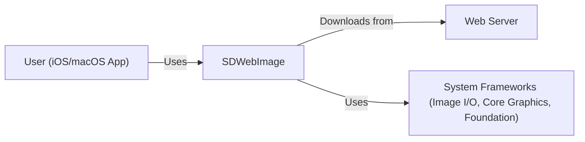
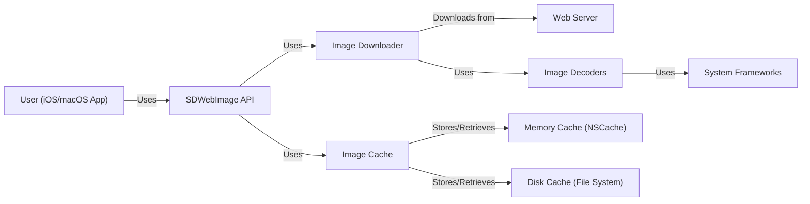
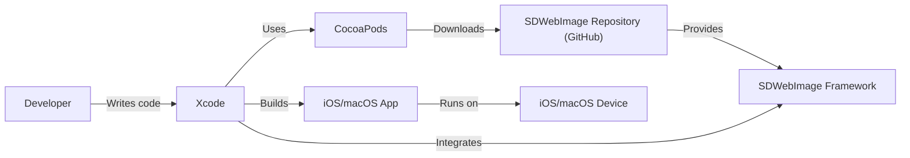
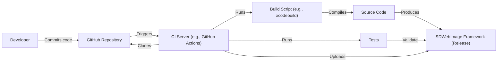

Okay, let's create a design document for the SDWebImage project.

# BUSINESS POSTURE

SDWebImage is a widely-used, open-source library for asynchronous image downloading and caching in iOS/macOS applications.  It's a foundational component for many apps that display images from the web.

Priorities and Goals:

*   Provide a performant and reliable way to download and cache images.
*   Minimize impact on the main thread (UI responsiveness).
*   Offer a simple, easy-to-use API.
*   Support a wide range of image formats and features (e.g., progressive loading, animated images).
*   Maintain backward compatibility where possible.
*   Ensure the security and integrity of downloaded images.

Business Risks:

*   Display of incorrect or malicious images due to vulnerabilities in the library.
*   Performance issues (e.g., slow image loading, UI freezes) impacting user experience.
*   Compatibility issues with different iOS/macOS versions or image formats.
*   Security vulnerabilities that could be exploited by attackers (e.g., remote code execution, denial of service).
*   Lack of maintainability and extensibility, hindering future development.
*   Reputational damage due to security incidents or performance problems.

# SECURITY POSTURE

Existing Security Controls:

*   security control: Asynchronous image downloading: Operations are performed off the main thread, preventing UI freezes. (Implemented in the core logic of the library).
*   security control: Caching: Images are cached to disk and memory to improve performance and reduce network requests. (Implemented using NSCache and file system storage).
*   security control: Progressive image loading: Images are displayed as they are downloaded, improving perceived performance. (Implemented using image I/O and delegate callbacks).
*   security control: Animated image support: Supports various animated image formats (e.g., GIF, APNG, WebP). (Implemented using image I/O and custom decoders).
*   security control: Image transformation: Allows for image manipulation (e.g., resizing, cropping) before display. (Implemented using Core Graphics and other image processing libraries).
*   security control: URL sanitization: Basic URL validation is performed. (Described in documentation and implemented in URL loading methods).
*   security control: Code reviews: Pull requests are reviewed by maintainers before merging. (Described in contribution guidelines).
*   security control: Community scrutiny: Being open-source, the code is subject to public review.

Accepted Risks:

*   accepted risk: The library relies on system frameworks (e.g., Image I/O, Core Graphics) for image decoding, which could have their own vulnerabilities.
*   accepted risk: The library does not perform extensive validation of image data beyond basic format checks. This could potentially lead to vulnerabilities if a malformed image is processed.
*   accepted risk: The library's caching mechanism could be vulnerable to cache poisoning attacks if the server serving the images is compromised.
*   accepted risk: The library does not implement advanced security features like certificate pinning or content security policy.

Recommended Security Controls:

*   security control: Implement more robust input validation to check for malformed image data and potential buffer overflows.
*   security control: Consider adding support for certificate pinning to mitigate man-in-the-middle attacks.
*   security control: Explore options for sandboxing image decoding to isolate potential vulnerabilities.
*   security control: Integrate with static analysis tools to identify potential security issues during development.
*   security control: Provide clear documentation on security best practices for using the library.
*   security control: Implement a mechanism to verify the integrity of downloaded images (e.g., using checksums).

Security Requirements:

*   Authentication: Not directly applicable, as the library handles image downloading, not user authentication. However, it should correctly handle authenticated requests if provided with appropriate credentials (e.g., through URLSession configuration).
*   Authorization: Not directly applicable, as the library does not manage access control.
*   Input Validation:
    *   URLs should be validated to ensure they are well-formed and point to supported image formats.
    *   Image data should be checked for basic integrity and consistency to prevent processing of malformed images.
*   Cryptography:
    *   HTTPS should be used for all image downloads to ensure confidentiality and integrity.
    *   If caching sensitive images, consider encrypting the cache.
*   Data Integrity:
    *   Downloaded images should be checked against a checksum or signature, if available, to ensure they have not been tampered with.

# DESIGN

## C4 CONTEXT

C4 Context Element List:

*   Element:
    *   Name: User (iOS/macOS App)
    *   Type: Person
    *   Description: An iOS or macOS application that uses SDWebImage to download and display images.
    *   Responsibilities: Initiates image requests, displays images to the user, handles user interaction.
    *   Security controls: Relies on SDWebImage for secure image handling.
*   Element:
    *   Name: SDWebImage
    *   Type: Software System
    *   Description: The SDWebImage library itself.
    *   Responsibilities: Asynchronously downloads images, caches images, decodes images, provides an API for image loading and management.
    *   Security controls: Asynchronous operations, caching, progressive loading, URL sanitization, community scrutiny.
*   Element:
    *   Name: Web Server
    *   Type: Software System
    *   Description: A web server that hosts the images.
    *   Responsibilities: Serves image files to SDWebImage.
    *   Security controls: Should implement HTTPS, proper access controls, and other standard web server security measures.
*   Element:
    *   Name: System Frameworks (Image I/O, Core Graphics, Foundation)
    *   Type: Software System
    *   Description: iOS/macOS system frameworks used by SDWebImage.
    *   Responsibilities: Provide low-level image decoding, rendering, and networking capabilities.
    *   Security controls: Relies on Apple's security measures for these frameworks.

## C4 CONTAINER

C4 Container Element List:

*   Element:
    *   Name: User (iOS/macOS App)
    *   Type: Person
    *   Description: An iOS or macOS application that uses SDWebImage to download and display images.
    *   Responsibilities: Initiates image requests, displays images to the user, handles user interaction.
    *   Security controls: Relies on SDWebImage for secure image handling.
*   Element:
    *   Name: SDWebImage API
    *   Type: Container (API)
    *   Description: The public API of the SDWebImage library.
    *   Responsibilities: Provides methods for loading images, managing the cache, and configuring options.
    *   Security controls: URL sanitization.
*   Element:
    *   Name: Image Downloader
    *   Type: Container (Component)
    *   Description: Handles downloading images from the web.
    *   Responsibilities: Creates network requests, manages download progress, handles errors.
    *   Security controls: Asynchronous operations, URL sanitization.
*   Element:
    *   Name: Image Cache
    *   Type: Container (Component)
    *   Description: Manages the image cache.
    *   Responsibilities: Stores and retrieves images from memory and disk caches.
    *   Security controls: Caching mechanisms (NSCache and file system).
*   Element:
    *   Name: Web Server
    *   Type: Software System
    *   Description: A web server that hosts the images.
    *   Responsibilities: Serves image files to SDWebImage.
    *   Security controls: Should implement HTTPS, proper access controls, and other standard web server security measures.
*   Element:
    *   Name: Image Decoders
    *   Type: Container (Component)
    *   Description: Decodes image data into usable formats.
    *   Responsibilities: Parses image data, handles different image formats.
    *   Security controls: Relies on system frameworks, should implement input validation.
*   Element:
    *   Name: Memory Cache (NSCache)
    *   Type: Container (Data Store)
    *   Description: In-memory cache using NSCache.
    *   Responsibilities: Stores recently used images in memory for fast access.
    *   Security controls: Limited by NSCache's security features.
*   Element:
    *   Name: Disk Cache (File System)
    *   Type: Container (Data Store)
    *   Description: Persistent cache on disk.
    *   Responsibilities: Stores images on disk for later use.
    *   Security controls: Relies on file system permissions.
*   Element:
    *   Name: System Frameworks
    *   Type: Software System
    *   Description: iOS/macOS system frameworks used by SDWebImage.
    *   Responsibilities: Provide low-level image decoding, rendering, and networking capabilities.
    *   Security controls: Relies on Apple's security measures for these frameworks.

## DEPLOYMENT

SDWebImage is a library, not a standalone application. Therefore, deployment involves integrating it into an iOS/macOS application. Several deployment options exist:

1.  CocoaPods: A dependency manager for Swift and Objective-C Cocoa projects.
2.  Carthage: A decentralized dependency manager for Cocoa.
3.  Swift Package Manager: Apple's built-in package manager.
4.  Manual Integration: Directly adding the source files to the project.

We'll describe deployment using CocoaPods, as it's a common and recommended approach.

Deployment Element List:

*   Element:
    *   Name: Developer
    *   Type: Person
    *   Description: The developer writing the iOS/macOS application.
    *   Responsibilities: Integrates SDWebImage into the project, writes code using the library.
    *   Security controls: Follows secure coding practices.
*   Element:
    *   Name: Xcode
    *   Type: Tool
    *   Description: Apple's integrated development environment (IDE).
    *   Responsibilities: Manages the project, builds the application, integrates dependencies.
    *   Security controls: Relies on Xcode's security features.
*   Element:
    *   Name: CocoaPods
    *   Type: Tool
    *   Description: A dependency manager for Cocoa projects.
    *   Responsibilities: Downloads and manages dependencies, including SDWebImage.
    *   Security controls: Relies on the security of the CocoaPods infrastructure and the integrity of the SDWebImage repository.
*   Element:
    *   Name: SDWebImage Repository (GitHub)
    *   Type: Repository
    *   Description: The Git repository hosting the SDWebImage source code.
    *   Responsibilities: Provides access to the source code and releases.
    *   Security controls: Relies on GitHub's security measures, code reviews, and community scrutiny.
*   Element:
    *   Name: SDWebImage Framework
    *   Type: Library
    *   Description: The compiled SDWebImage library.
    *   Responsibilities: Provides the functionality for asynchronous image downloading and caching.
    *   Security controls: As described in previous sections.
*   Element:
    *   Name: iOS/macOS App
    *   Type: Application
    *   Description: The final iOS or macOS application.
    *   Responsibilities: Runs on the user's device, uses SDWebImage to display images.
    *   Security controls: Depends on the overall security of the application and the device.
*   Element:
    *   Name: iOS/macOS Device
    *   Type: Device
    *   Description: The user's iPhone, iPad, or Mac.
    *   Responsibilities: Runs the iOS/macOS application.
    *   Security controls: Relies on Apple's device security measures.

## BUILD

The build process for SDWebImage involves compiling the source code into a framework that can be integrated into other projects. This process typically happens when a new release is created, or when a developer builds the library from source.

Build Process Description:

1.  Developers commit code changes to the GitHub repository.
2.  A Continuous Integration (CI) server (e.g., GitHub Actions) is triggered by the commit.
3.  The CI server clones the repository.
4.  A build script (e.g., using `xcodebuild`) is executed.
5.  The build script compiles the SDWebImage source code.
6.  The compiled code produces the SDWebImage framework.
7.  Automated tests are run to validate the framework's functionality.
8.  If the tests pass, the framework is uploaded as a release artifact.

Security Controls in Build Process:

*   security control: CI/CD Pipeline: Automated build and testing process ensures consistency and reduces manual errors. (Implemented using GitHub Actions or similar).
*   security control: Code Signing: The framework can be code-signed to ensure its authenticity and integrity. (Implemented using Apple's code signing tools).
*   security control: Static Analysis: Static analysis tools can be integrated into the build process to identify potential security vulnerabilities. (e.g., using linters, SAST scanners).
*   security control: Dependency Management: Using a dependency manager (CocoaPods, Carthage, SPM) helps manage external dependencies and their security.
*   security control: Automated Tests: Running unit and integration tests helps ensure the code functions as expected and can catch security-related regressions.

# RISK ASSESSMENT

Critical Business Processes:

*   Displaying images to users within iOS/macOS applications.
*   Providing a smooth and responsive user experience.
*   Maintaining the reputation and trust of the library and its users.

Data to Protect:

*   Image data downloaded from the web (Sensitivity: Varies depending on the image content; could range from public to highly sensitive).
*   Cached image data (Sensitivity: Same as above).
*   User credentials (if used for authenticated image requests) (Sensitivity: High).  SDWebImage itself doesn't *store* credentials, but it *passes them through* if the app developer configures it to do so. This is a crucial distinction.

# QUESTIONS & ASSUMPTIONS

Questions:

*   Are there any specific compliance requirements (e.g., HIPAA, GDPR) that need to be considered?
*   What is the expected scale of usage (number of users, frequency of image downloads)?
*   Are there any specific threat models or attack vectors that are of particular concern?
*   What level of logging and auditing is required?
*   What is the process for handling security vulnerabilities reported by external researchers?

Assumptions:

*   BUSINESS POSTURE: The primary goal is to provide a reliable and performant image loading library. Security is a high priority, but not at the expense of usability or performance.
*   SECURITY POSTURE: The library will be used in a variety of applications, some of which may have higher security requirements than others. The library should provide a baseline level of security, with options for developers to enhance security as needed.
*   DESIGN: The library will continue to evolve and adapt to new iOS/macOS features and image formats. The design should be flexible and extensible to accommodate future changes. The library will rely on system frameworks for core functionality, and security of those frameworks is assumed.