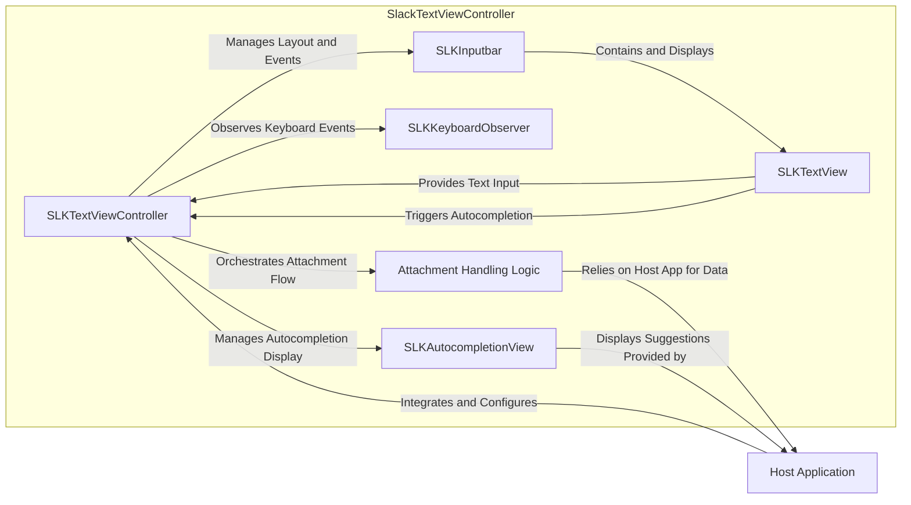
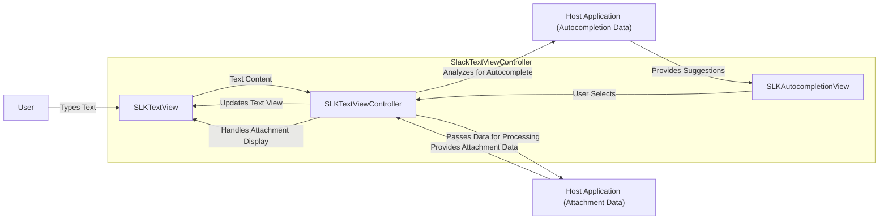

# Project Design Document: SlackTextViewController

**Version:** 1.1
**Date:** October 26, 2023
**Prepared By:** Gemini (AI Language Model)

## 1. Introduction

This document provides an enhanced and more detailed design overview of the `SlackTextViewController` project, an open-source library developed by Slack for creating custom text input views with features like autocompletion and attachments on iOS. This revised document aims to provide a more granular understanding of the component's architecture, data flow, and key functionalities, specifically tailored for subsequent threat modeling activities.

### 1.1. Purpose

The primary purpose of this document is to provide a robust design specification of `SlackTextViewController` to facilitate comprehensive threat modeling. It details the component's internal structure, the types of data it handles, how that data is processed, and its interactions with the host application environment. This level of detail is crucial for identifying potential attack vectors and vulnerabilities.

### 1.2. Scope

This document encompasses the internal architectural components, detailed data flow pathways, and key functional aspects within the `SlackTextViewController` library. The focus remains on the component's internal workings and its direct interactions with the embedding host application. While acknowledging the broader context of a messaging application, this document does not delve into network communication protocols or backend infrastructure.

### 1.3. Audience

This document is primarily intended for security engineers, software developers, and system architects responsible for security analysis, threat modeling, and vulnerability assessment of applications utilizing the `SlackTextViewController` library. It assumes a basic understanding of iOS development concepts.

## 2. Overview

`SlackTextViewController` is a versatile and reusable view controller designed to simplify the development of advanced text input interfaces on iOS. It extends the capabilities of a standard `UITextView` by offering features such as:

*   **Dynamic Input Area Resizing:** Automatically adjusts the height of the input area based on the content.
*   **Autocompletion Support:** Facilitates features like user mentions (`@`) and hashtag suggestions (`#`).
*   **Attachment Management:** Provides mechanisms for handling various types of attachments (e.g., images, files).
*   **Customizable UI:** Offers options to tailor the appearance and behavior of the input view.
*   **Keyboard Event Handling:** Seamlessly integrates with keyboard appearance and disappearance events.

The library is designed to be integrated as a child view controller within a parent view controller, abstracting away the complexities of managing text input and related features.

## 3. Architectural Design

The `SlackTextViewController` architecture is composed of several interconnected components, each responsible for specific aspects of the library's functionality.

### 3.1. Core Components

*   **`SLKTextViewController`:** The central coordinating class, inheriting from `UIViewController`. It manages the lifecycle and interactions of all other components within the text input interface. It acts as the primary interface for the host application.
*   **`SLKTextView`:** A specialized subclass of `UITextView` that forms the core text editing area. It handles text input, text selection, rendering, and provides notifications about text changes.
*   **`SLKInputbar`:** A custom view responsible for housing the `SLKTextView` and any associated accessory views, such as buttons for sending messages or adding attachments. It manages the layout and visual presentation of the input area.
*   **`SLKKeyboardObserver`:** A utility class dedicated to observing and responding to keyboard-related notifications from the operating system. It adjusts the layout of the `SLKInputbar` to ensure it remains visible when the keyboard appears.
*   **`SLKAutocompletionView`:** A view, typically implemented using `UITableView` or `UICollectionView`, that displays a list of autocompletion suggestions based on the text entered in the `SLKTextView`. The data for this view is usually provided by the host application.
*   **Attachment Handling Mechanisms:** This isn't a single class but rather a set of protocols, delegate methods, and potentially custom views that enable the integration of attachment functionality. The host application plays a significant role in managing the actual attachment data.

### 3.2. Component Interaction Flow

### 3.3. Data Flow

The data flow within `SlackTextViewController` involves the movement and processing of text, autocompletion suggestions, and attachment data.

*   **Text Input and Processing:**
    *   User input is received by the `SLKTextView`.
    *   `SLKTextView` stores and renders the text.
    *   `SLKTextViewController` is notified of text changes via delegate methods. This includes the raw text content.
    *   The host application can access the current text content through properties or delegate methods of `SLKTextViewController`.
*   **Autocompletion Data Flow:**
    *   As the user types in `SLKTextView`, `SLKTextViewController` analyzes the input for potential autocompletion triggers (e.g., `@` symbol).
    *   The host application is notified of the trigger and the current text context.
    *   The host application fetches or generates a list of relevant autocompletion suggestions.
    *   These suggestions are passed back to `SLKTextViewController`.
    *   `SLKAutocompletionView` displays the suggestions.
    *   When the user selects a suggestion, `SLKTextViewController` updates the text in `SLKTextView`.
*   **Attachment Data Flow:**
    *   The host application typically initiates the attachment process (e.g., through a button press).
    *   The user selects an attachment (e.g., an image from the photo library).
    *   The raw attachment data (e.g., `UIImage`, file URL, data blob) is provided to `SLKTextViewController` through delegate methods.
    *   `SLKTextViewController` might display a preview or representation of the attachment within the input area.
    *   Crucially, the actual storage, uploading, and transmission of the attachment data are the responsibility of the host application, not `SlackTextViewController` itself.

## 4. Security Considerations (Detailed for Threat Modeling)

Based on the architectural design and data flow, several potential security considerations are relevant for threat modeling:

*   **Cross-Site Scripting (XSS) via Input:** If the host application displays the text entered in `SLKTextView` without proper sanitization, a malicious user could inject JavaScript code. This is particularly relevant if the text is displayed in web views or other contexts where script execution is possible.
*   **Injection Attacks via Autocompletion:** If the source of autocompletion suggestions is compromised or not properly validated, malicious suggestions could be injected. Selecting these suggestions could lead to unexpected actions or data manipulation within the host application. For example, a malicious user could inject a suggestion that, when selected, inserts a command or URL that compromises the application's state.
*   **Insecure Handling of Attachments:**
    *   **Malicious File Uploads:** The host application needs to validate the type and content of uploaded files to prevent the execution of malicious code or the introduction of malware.
    *   **Path Traversal:** If the application relies on user-provided file paths for attachments, vulnerabilities to path traversal attacks could exist, allowing access to unauthorized files.
    *   **Information Disclosure:** Metadata associated with attachments (e.g., EXIF data in images) might contain sensitive information that should be stripped or handled carefully.
*   **Denial of Service (DoS) via Input:**  Extremely long input strings or specific character combinations could potentially cause performance issues or crashes if not handled robustly by `SLKTextView` or the host application.
*   **Data Injection via Keyboard Manipulation:** While less likely, vulnerabilities could theoretically arise if the application doesn't properly handle unexpected keyboard input or events, potentially leading to unintended data being entered or actions being triggered.
*   **Dependency Vulnerabilities:**  As `SlackTextViewController` relies on external libraries, vulnerabilities in those dependencies could indirectly affect the security of applications using this library. Regular updates and security audits of dependencies are crucial.
*   **State Management Issues:** Improper management of the internal state of `SLKTextViewController` could lead to unexpected behavior or vulnerabilities if an attacker can manipulate the state through specific interactions.

## 5. Dependencies

`SlackTextViewController` primarily depends on the standard iOS `UIKit` framework. A thorough security assessment should also consider any transitive dependencies introduced by the project's dependency management system (e.g., CocoaPods, Swift Package Manager). Key dependencies to investigate include:

*   **`UIKit` (Apple Framework):**  The foundation for building graphical user interfaces on iOS. Security vulnerabilities within `UIKit` could impact `SlackTextViewController`.
*   **Any third-party libraries:**  Review the project's dependency manifest (e.g., `Podfile.lock`, `Package.resolved`) to identify all external libraries. For each dependency, assess its known vulnerabilities and security update history. Examples might include libraries for image processing, networking (though less directly used by `SlackTextViewController` itself), or data parsing.

## 6. Deployment

`SlackTextViewController` is typically integrated into an iOS application using dependency management tools:

*   **CocoaPods:**  A popular dependency manager for Swift and Objective-C projects. Integration involves adding `SlackTextViewController` to the `Podfile` and running `pod install`.
*   **Carthage:** Another dependency manager that builds dependencies and provides binary frameworks.
*   **Swift Package Manager (SPM):** Apple's native dependency manager, increasingly used for iOS projects.

The integration process generally involves adding the library as a dependency and then instantiating and embedding the `SLKTextViewController` within the desired part of the application's user interface.

## 7. Future Considerations (Potential Security Impact)

Future development of `SlackTextViewController` could introduce new features or modify existing ones, potentially impacting security:

*   **Enhanced Rich Text Editing:** Introducing more complex text formatting options could create new attack vectors related to parsing and rendering rich text formats.
*   **Advanced Attachment Handling:** Supporting more complex attachment types or offering features like inline previews could introduce new vulnerabilities related to file processing and rendering.
*   **Collaboration Features:** If future versions introduce real-time collaboration or shared editing features, new security considerations related to data synchronization and access control would arise.
*   **Accessibility Improvements:** While beneficial, changes to improve accessibility should be reviewed to ensure they don't inadvertently introduce security weaknesses.

## 8. Conclusion

This enhanced design document provides a more detailed and security-focused overview of the `SlackTextViewController` library. By understanding the architecture, data flow, and potential security considerations outlined here, security engineers and developers can perform more effective threat modeling and implement appropriate security measures to protect applications utilizing this component. Continuous review and updates to this document are recommended as the project evolves.
