# Project Design Document: SlackTextViewViewController

**Version:** 1.1
**Date:** October 26, 2023
**Author:** AI Software Architect

## 1. Introduction

This document provides an enhanced and more detailed design overview of the `SlackTextViewViewController` project, an open-source iOS library developed by Slack. This revised document builds upon the previous version, offering greater clarity and depth, particularly in areas relevant to security and threat modeling.

The `SlackTextViewViewController` library augments the standard `UITextView` in iOS applications with features commonly found in modern messaging interfaces, including:

*   Rich text formatting with visual styling (e.g., bold, italics, strikethrough, code blocks).
*   Intelligent autocompletion for mentions (@users), channels (#channels), and potentially custom entities.
*   Contextual reaction suggestions (emojis) triggered by specific keywords or input patterns.
*   Customizable input accessory views enabling quick access to actions and content insertion.

This document focuses on the intricate architectural elements, their interactions, and the flow of data, specifically highlighting areas of interest for security analysis and threat modeling.

## 2. Goals

The primary goals of this enhanced design document are to:

*   Provide a highly detailed and unambiguous understanding of the `SlackTextViewViewController` library's architecture.
*   Thoroughly identify the responsibilities, functionalities, and potential security implications of each key component.
*   Precisely illustrate the flow of data within the library, emphasizing data transformations and interactions with external entities.
*   Serve as a robust and comprehensive foundation for conducting detailed threat modeling exercises.
*   Clearly document all relevant assumptions, constraints, and dependencies that impact the security posture of the library.

## 3. Architectural Overview

The `SlackTextViewViewController` library is structured around a set of cohesive and interacting components that extend the capabilities of the native `UITextView`. The library introduces specialized controllers, data sources, and engines to manage its enhanced functionalities.

*   **SlackTextView:** The central view component, inheriting from `UITextView`. It is responsible for rendering the text content, managing user interactions (typing, selection, gestures), and delegating events to other components. It also serves as the visual host for styled text and reactions.
*   **Text Styling Engine:** This component is responsible for interpreting and applying rich text formatting to the text view's content. It processes formatting commands, manages the underlying `NSTextStorage`, and ensures consistent visual presentation of styled text.
*   **Input Handling & Autocompletion Manager:** This crucial component intercepts and processes user input events. It detects trigger characters for autocompletion, manages the autocompletion process, and interacts with the `Autocompletion Data Source Interface` to retrieve suggestions.
*   **Autocompletion Data Source Interface:** This defines the interface that the integrating application must implement to provide data for autocompletion. It abstracts away the specifics of how the data is fetched or stored, allowing for flexibility in data source implementation.
*   **Input Accessory View Controller:** This component manages the display and interaction logic of the custom input accessory view. It handles user taps on accessory view elements and triggers corresponding actions within the `SlackTextView` or the integrating application.
*   **Reaction Handling Engine:** This component manages the lifecycle of reactions associated with the text. It handles adding, removing, and displaying reactions, and interacts with the `Reaction Data Model Interface` to persist and retrieve reaction data.
*   **Reaction Data Model Interface:** This defines the interface for accessing and manipulating reaction data. The integrating application is responsible for implementing this interface, defining how reaction data is stored and managed.

## 4. Component Details

This section provides a more in-depth examination of each component, focusing on their functionalities and potential security considerations:

*   **SlackTextView:**
    *   Extends `UITextView`, inheriting its core text editing capabilities and visual presentation.
    *   Renders styled text based on attributes provided by the `Text Styling Engine`. This rendering process needs to be robust against potentially malicious or malformed styling attributes that could lead to unexpected behavior or UI issues.
    *   Delegates user input events (e.g., typing, text selection changes) to the `Input Handling & Autocompletion Manager`. Improper handling of these events could lead to vulnerabilities.
    *   Visually displays reaction indicators managed by the `Reaction Handling Engine`. The rendering of these indicators should not introduce vulnerabilities (e.g., through rendering untrusted data).

*   **Text Styling Engine:**
    *   Parses user input (e.g., Markdown-like syntax) or programmatic commands to identify formatting instructions. The parsing logic needs to be secure to prevent injection of malicious formatting commands.
    *   Applies formatting attributes (e.g., `NSAttributedString` attributes) to the underlying `NSTextStorage`. Incorrectly applied attributes or handling of edge cases could lead to rendering issues or security vulnerabilities.
    *   May handle syntax highlighting for specific content types (e.g., URLs, code blocks). The syntax highlighting logic should not be susceptible to exploits based on crafted input.
    *   Must be resilient against malformed formatting input that could cause crashes, hangs, or unexpected behavior.

*   **Input Handling & Autocompletion Manager:**
    *   Monitors text input for trigger characters (e.g., `@`, `#`) that initiate the autocompletion process. The logic for detecting these triggers should be precise and avoid false positives or bypasses.
    *   Queries the `Autocompletion Data Source Interface` for relevant suggestions based on the entered text. The construction of these queries must be secure to prevent injection attacks if the data source is external or untrusted.
    *   Presents autocompletion suggestions to the user, typically in a dropdown list. The rendering of these suggestions should be secure and not vulnerable to XSS if the suggestions contain potentially untrusted data.
    *   Handles the insertion of the selected suggestion into the `SlackTextView`. This insertion process needs to be carefully managed to avoid introducing vulnerabilities.
    *   Should implement rate limiting or other mechanisms to prevent abuse of the autocompletion functionality, especially if it involves external data sources.

*   **Autocompletion Data Source Interface:**
    *   Defines methods for fetching autocompletion data based on user input. The security of the data retrieval process is entirely dependent on the integrating application's implementation.
    *   The integrating application is responsible for implementing secure authentication, authorization, and data sanitization when interacting with the underlying data source.
    *   Potential threats include unauthorized access to sensitive data, data injection, and denial-of-service attacks against the data source.

*   **Input Accessory View Controller:**
    *   Manages the presentation and lifecycle of the custom input accessory view. The loading and rendering of this view should be secure and not vulnerable to attacks if the view's content is dynamic.
    *   Handles user interactions with elements within the accessory view (e.g., button taps). The actions triggered by these interactions need to be carefully validated and authorized to prevent unauthorized operations.
    *   The communication between the accessory view controller and other components should be secure and prevent tampering with action parameters.

*   **Reaction Handling Engine:**
    *   Allows users to add reactions (emojis or other predefined items) to specific parts of the text. The process of adding reactions should be secure and prevent users from adding arbitrary or malicious content as reactions.
    *   Manages the visual display of reactions associated with the text. The rendering of reaction indicators should be secure and not introduce vulnerabilities.
    *   Interacts with the `Reaction Data Model Interface` to store and retrieve reaction information. The security of this interaction depends on the implementation of the data model interface.
    *   May involve synchronization of reactions if the application supports real-time collaboration. Secure synchronization mechanisms are crucial to prevent data corruption or manipulation.

*   **Reaction Data Model Interface:**
    *   Defines methods for storing, retrieving, and managing reaction data. The integrating application is responsible for implementing this interface securely.
    *   The security of the stored reaction data (e.g., preventing unauthorized modification or deletion) is a key consideration.
    *   Privacy implications of reaction data (e.g., who reacted to what) need to be addressed by the integrating application.

## 5. Data Flow

The following sequence diagram provides a more detailed illustration of the data flow within the `SlackTextViewViewController` library during common user interactions, highlighting potential security touchpoints:

```mermaid
sequenceDiagram
    participant User
    participant SlackTextView
    participant InputHandler as Input Handling Manager
    participant AutocompleteDS as Autocompletion Data Source
    participant TextStyleEngine
    participant ReactionHandler
    participant ReactionData as Reaction Data Model

    User->>SlackTextView: Types text (e.g., "@user")
    SlackTextView->>InputHandler: TextDidChange notification with input
    InputHandler->>AutocompleteDS: Request suggestions for "user"
    activate AutocompleteDS
    AutocompleteDS-->>InputHandler: Autocompletion suggestions (e.g., ["user1", "user2"])
    deactivate AutocompleteDS
    InputHandler->>SlackTextView: Display suggestion list
    User->>SlackTextView: Selects "user1"
    SlackTextView->>TextStyleEngine: Apply formatting for "@user1" (mention)
    TextStyleEngine->>SlackTextView: Update text display with styled mention

    User->>SlackTextView: Adds a 👍 reaction to a message
    SlackTextView->>ReactionHandler: ReactionAdded event (👍, message ID)
    ReactionHandler->>ReactionData: Store reaction (👍, user, message ID)
    activate ReactionData
    ReactionData-->>ReactionHandler: Success/Failure
    deactivate ReactionData
    ReactionHandler->>SlackTextView: Update UI to show reaction
```

Key data flows and associated security considerations:

*   **User Input to Autocompletion Query:** User-typed text is passed to the `Input Handling Manager`, which constructs a query for the `Autocompletion Data Source`. **Threat:** Injection attacks could occur if user input is not properly sanitized before being used in the query. The security of the communication channel between the `Input Handling Manager` and the `Autocompletion Data Source` is also crucial.
*   **Autocompletion Suggestions to Display:** The `Autocompletion Data Source` returns suggestions to the `Input Handling Manager`, which then displays them in the `SlackTextView`. **Threat:** If the suggestions contain untrusted data, displaying them without proper sanitization could lead to XSS vulnerabilities.
*   **Formatting Data Application:** When a user action triggers formatting (e.g., selecting an autocompletion suggestion), the `Text Styling Engine` applies formatting attributes. **Threat:** Malicious or malformed formatting commands could lead to unexpected behavior or even crashes.
*   **Reaction Data Storage:** When a user adds a reaction, the `Reaction Handling Engine` interacts with the `Reaction Data Model` to store the reaction. **Threat:**  Unauthorized access or modification of reaction data could occur if the `Reaction Data Model` is not securely implemented. Data integrity is also a concern.

## 6. Security Considerations (Detailed)

Expanding on the initial considerations, here's a more detailed breakdown of potential security concerns:

*   **Input Validation and Sanitization:**
    *   **Threat:** Injection attacks (e.g., SQL injection if the autocompletion data source involves a database, command injection if actions are triggered based on input).
    *   **Mitigation:** Implement robust input validation and sanitization on all user-provided data before it's used in queries, formatting commands, or action triggers. Use parameterized queries or prepared statements where applicable.
*   **Autocompletion Data Source Security:**
    *   **Threat:** Unauthorized access to sensitive data (user lists, channel information), data breaches if the data source is compromised.
    *   **Mitigation:** Ensure the `Autocompletion Data Source` implementation uses secure authentication and authorization mechanisms. Employ secure communication protocols (e.g., HTTPS) if the data source is remote. Regularly audit the security of the data source.
*   **Malformed Formatting Input Handling:**
    *   **Threat:** Denial-of-service attacks if malformed input causes crashes or excessive resource consumption, unexpected UI behavior.
    *   **Mitigation:** Implement robust error handling and input validation within the `Text Styling Engine`. Use a well-tested and secure rich text parsing library if applicable.
*   **Privacy of Mentions and Reactions:**
    *   **Threat:** Unintended disclosure of user relationships or activities if mention or reaction data is not handled with appropriate privacy controls.
    *   **Mitigation:** The integrating application needs to implement appropriate access controls and privacy settings for mention and reaction data. Consider data minimization principles.
*   **Input Accessory View Action Security:**
    *   **Threat:** Unauthorized actions being triggered if the communication between the `Input Accessory View Controller` and other components is not secure or if action parameters are not validated.
    *   **Mitigation:** Implement secure communication mechanisms and thoroughly validate any parameters passed to action handlers. Follow the principle of least privilege when granting access to actions.
*   **Cross-Site Scripting (XSS) Prevention:**
    *   **Threat:** If the library renders any data from external sources (e.g., autocompletion suggestions), it could be vulnerable to XSS if not properly sanitized.
    *   **Mitigation:** Employ strict output encoding and sanitization techniques when rendering any potentially untrusted data. Utilize context-aware encoding.
*   **Reaction Data Security:**
    *   **Threat:** Unauthorized modification or deletion of reaction data, potential for data integrity issues.
    *   **Mitigation:** The integrating application should implement secure storage mechanisms for reaction data, including appropriate access controls and data validation.

## 7. Assumptions and Constraints

*   **Reliance on Host Application Security:** The security of `SlackTextViewViewController` is intrinsically linked to the security of the iOS application it's embedded within. The library itself doesn't handle user authentication or general application security.
*   **Data Source Implementation Responsibility:** The security and implementation details of the `Autocompletion Data Source` and `Reaction Data Model` are the sole responsibility of the integrating application. This library provides interfaces but does not enforce specific security measures on the underlying data.
*   **Operating within iOS Security Sandbox:** The library operates within the security sandbox provided by the iOS operating system, which provides a baseline level of security.
*   **Limited Scope of Network Communication:** The core library itself is assumed not to initiate network communication directly. Any network requests for autocompletion data or reaction synchronization are managed by the integrating application.

## 8. Future Considerations

*   **Standardized Security Interfaces:**  Consider providing more prescriptive interfaces or guidelines for implementing secure data sources and data models.
*   **Built-in Input Sanitization Options:** Explore the possibility of offering configurable input sanitization options within the library itself to provide a baseline level of protection.
*   **Security Auditing Hooks:**  Introduce hooks or events that allow the integrating application to audit security-relevant actions or potential threats detected by the library.
*   **Content Security Policy (CSP) Integration:** If the library ever renders web content or allows for custom styling that could introduce XSS risks, consider integrating with CSP mechanisms.

This enhanced design document provides a more detailed and security-focused overview of the `SlackTextViewViewController` library's architecture and data flow. This information is intended to be a valuable resource for conducting thorough threat modeling and identifying potential security vulnerabilities.