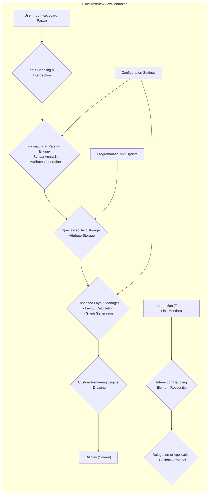
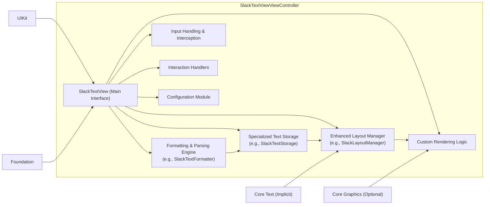

## Project Design Document: SlackTextViewViewController - Improved

**1. Introduction**

This document provides an enhanced design overview of the `slacktextviewcontroller` project, a component designed as a more powerful and customizable drop-in replacement for the standard `UITextView`. This improved document aims to offer a deeper understanding of its internal workings, data pathways, and crucial functionalities, thereby strengthening its utility as a foundation for subsequent threat modeling activities. The focus is on providing sufficient detail to identify potential security vulnerabilities.

**2. Goals**

* Provide a significantly more detailed and precise description of the `slacktextviewcontroller` component's architecture and behavior.
* Elaborate on the responsibilities and interactions of the key internal components.
* Offer a more granular depiction of the data flow within the component, highlighting transformation points.
* Clearly identify and explain the purpose of external dependencies and integrations.
* Proactively highlight specific areas of security concern with more detailed explanations, facilitating a more effective threat modeling process.

**3. Non-Goals**

* This document will still avoid delving into the minutiae of individual method implementations unless absolutely critical for understanding the architecture or data flow from a security perspective.
* A comprehensive code walkthrough remains outside the scope of this document.
* This document will not perform the actual threat modeling; its purpose is to provide the necessary information for that separate activity.
* Detailed UI/UX specifications are not the primary focus, although aspects relevant to input handling and display will be covered.

**4. Architectural Overview**

The `slacktextviewcontroller` employs a more refined layered architecture compared to a basic `UITextView`, introducing distinct modules for enhanced control and customization.

* **Core `UITextView` Foundation:** The fundamental `UITextView` instance providing the basic text editing canvas and interaction model.
* **Specialized Text Storage (`NSTextStorage` Subclass):**  A custom subclass of `NSTextStorage` responsible for managing the underlying text data and associated formatting attributes. This likely includes custom attribute handling for features like mentions and custom styling.
* **Enhanced Layout Management (`NSLayoutManager` Subclass):** A specialized `NSLayoutManager` subclass that works in conjunction with the custom text storage to handle the layout of formatted text, potentially including complex layouts with inline attachments or custom glyph rendering.
* **Formatting and Parsing Engine:** This is a central component responsible for interpreting and applying formatting rules. It likely involves:
    * **Input Parsing:** Analyzing raw text input to identify formatting syntax (e.g., markdown-like syntax, special characters for mentions).
    * **Attribute Application:**  Applying the corresponding `NSAttributedString` attributes based on the parsed formatting.
    * **Custom Attribute Handling:** Managing attributes specific to `slacktextviewcontroller` features (e.g., mention attributes, link attributes).
* **Custom Rendering Engine:** While still leveraging Core Text indirectly through the layout manager, this component might include custom drawing logic for specific elements like mention pills or inline images.
* **Advanced Input Handling and Interception:** This layer intercepts and processes user input events, potentially modifying the input before it reaches the underlying `UITextView`. This could include features like auto-completion or custom keyboard handling.
* **Interaction Handling and Delegation:**  Manages user interactions with formatted text elements (e.g., tapping on links, mentions). It then delegates these interactions to the application through defined protocols or closures.
* **Configuration and Customization Module:** Provides a set of APIs and properties to configure the behavior and appearance of the text view, including supported formatting options, appearance settings, and interaction behaviors.

**5. Data Flow (Granular)**

The data flow within the `slacktextviewcontroller` is more intricate than a standard `UITextView`, involving several transformation stages.

* **User Input:**
    * User interacts with the text view.
    * Input is first captured by the **Input Handling & Interception** module, allowing for pre-processing.
* **Formatting and Parsing:**
    * The **Formatting & Parsing Engine** analyzes the input for formatting cues.
    * It generates the appropriate `NSAttributedString` attributes.
    * Custom attributes specific to the component are also created.
* **Specialized Text Storage:**
    * The formatted text and its attributes are stored in the **Specialized Text Storage**.
    * This component manages the association between text and formatting.
* **Enhanced Layout Management:**
    * The **Enhanced Layout Manager** calculates the layout of the text based on the stored attributes.
    * It generates glyphs for rendering, potentially including custom glyphs.
* **Custom Rendering:**
    * The **Custom Rendering Engine** draws the text and any custom elements onto the screen.
* **Display:**
    * The rendered output is displayed to the user.
* **Programmatic Updates:**
    * Direct updates modify the **Specialized Text Storage**.
* **Interactions:**
    * User taps on a formatted element.
    * **Interaction Handling** identifies the element (e.g., link, mention).
    * The interaction is delegated to the application.

**6. Key Components and Their Responsibilities (Detailed)**

* **`SlackTextView` (or primary interface class):**
    * The main entry point for interacting with the component.
    * Manages the overall lifecycle and coordination of internal components.
    * Provides the public API for configuration and interaction.
* **Specialized Text Storage (`NSTextStorage` Subclass - e.g., `SlackTextStorage`):**
    * Stores the text content and associated formatting attributes.
    * Implements custom logic for managing and querying attributes, especially those specific to the component's features (mentions, custom styles).
    * May handle text manipulation operations with awareness of formatting.
* **Enhanced Layout Manager (`NSLayoutManager` Subclass - e.g., `SlackLayoutManager`):**
    * Responsible for calculating the layout of the text, taking into account custom attributes and rendering requirements.
    * Handles line breaking, glyph generation, and potentially the layout of inline attachments or custom views.
* **Formatting and Parsing Engine (e.g., `SlackTextFormatter`):**
    * Parses raw text input to identify formatting syntax (e.g., markdown, special characters).
    * Converts identified formatting into `NSAttributedString` attributes.
    * Manages custom formatting rules and attribute mappings.
    * May involve regular expression matching and state machine-based parsing.
* **Custom Rendering Logic (Potentially within `SlackLayoutManager` or a separate class):**
    * Handles the drawing of specific formatted elements that require more than standard text rendering (e.g., mention "pills," custom link styles).
    * May involve direct Core Graphics drawing calls.
* **Input Handling and Interception (e.g., methods within `SlackTextView` or a dedicated input delegate):**
    * Intercepts keyboard input, paste events, and other text input methods.
    * May modify the input before it's processed by the formatting engine (e.g., auto-completion of mentions).
    * Handles cursor movement and text selection.
* **Interaction Handlers (e.g., gesture recognizers or methods within `SlackTextView`):**
    * Detects user taps and other interactions within the text view.
    * Determines which formatted element was interacted with (e.g., a link or a mention).
    * Uses delegation or closures to notify the application of the interaction.
* **Configuration Module (e.g., properties on `SlackTextView` or a dedicated configuration object):**
    * Provides options to customize the supported formatting, appearance (fonts, colors), and interaction behavior.
    * Allows developers to tailor the component to their specific needs.

**7. Dependencies**

* **UIKit:** Essential for UI elements and event handling.
* **Foundation:** Provides fundamental data structures, string manipulation, and other core functionalities.
* **Core Text (Implicitly through `NSLayoutManager` and potentially for custom rendering):**  The underlying text rendering engine.
* **Potentially Regular Expression Libraries (`NSRegularExpression`):** Likely used for parsing formatting syntax.
* **Potentially Core Graphics:** May be used for custom drawing within the rendering engine.
* **Potentially Third-Party Libraries:**  Depending on specific features, such as advanced text diffing or specialized parsing.

**8. Security Considerations (Detailed)**

This section expands on potential security concerns, providing more specific examples and categorizations for threat modeling.

* **Input Validation and Sanitization:**
    * **Excessive Input Length:** How does the component handle extremely long text inputs that could lead to memory exhaustion or performance degradation (DoS)?
    * **Format String Vulnerabilities (Less likely but consider indirect impacts):** Could specially crafted input, if not properly handled during formatting, lead to unexpected behavior or information disclosure in logging or other downstream processes?
    * **Malicious Formatting Syntax:** Could carefully crafted formatting tags or sequences exploit vulnerabilities in the parsing engine, leading to unexpected rendering, crashes, or even code execution (highly unlikely in this context but worth considering)?
    * **Pasting Malicious Content:** How does the component handle pasting rich text or HTML content that might contain embedded scripts or malicious links?
* **Data Handling and Storage:**
    * **Memory Management:** Are there potential memory leaks or buffer overflows in the custom text storage or layout management components, especially when handling complex formatting or large amounts of text?
    * **Sensitive Data in Memory:** If the text view is used to display sensitive information, are there mechanisms to prevent unintended data persistence or exposure in memory dumps?
* **Link and URL Handling:**
    * **Malicious URLs:** Is there robust validation of URLs before attempting to open them, preventing users from being redirected to phishing sites or sites hosting malware?
    * **URL Scheme Abuse:** Does the component properly handle different URL schemes, preventing unexpected application behavior or the execution of arbitrary commands through custom schemes?
* **Mention Handling and User Identification:**
    * **Spoofing Mentions:** Could a malicious user craft input that appears to mention another user, potentially leading to social engineering attacks or misattributions?
    * **Information Disclosure through Mentions:** Does the mention resolution process inadvertently expose sensitive information about users?
* **Regular Expression Vulnerabilities (ReDoS):**
    * Are the regular expressions used in the formatting engine carefully designed to avoid catastrophic backtracking, which could lead to denial of service?
* **Accessibility Vulnerabilities:**
    * Could accessibility features be exploited to bypass security controls or extract sensitive information displayed in the text view?
* **Denial of Service:**
    * **Resource Exhaustion:** Could a large amount of complexly formatted text or rapid input cause excessive CPU or memory usage, leading to a denial of service?
    * **Rendering Issues:** Could specific formatting combinations cause the rendering engine to hang or crash?
* **Interaction with the Host Application:**
    * **Insecure Delegation:** Are the delegate methods or closures used for interaction handling designed to prevent malicious applications from injecting code or manipulating the text view's state in unintended ways?
* **Third-Party Dependencies:**
    * Are all third-party libraries used by the component regularly updated to address known security vulnerabilities? Are their licenses and security practices reviewed?

**9. Deployment Considerations**

* The `slacktextviewcontroller` is designed for direct integration into iOS applications.
* Developers will typically instantiate and configure it within their view controllers or custom views, replacing standard `UITextView` instances.
* Updates require application updates and careful testing to ensure compatibility.
* Consider the impact of the component's size on the overall application bundle size.

**10. Diagrams**

* **Enhanced Component Diagram:**

This improved design document provides a more detailed and nuanced understanding of the `slacktextviewcontroller`, offering a stronger foundation for identifying and mitigating potential security vulnerabilities during the threat modeling process. The increased granularity in describing the architecture, data flow, and security considerations will enable a more thorough and effective security analysis.