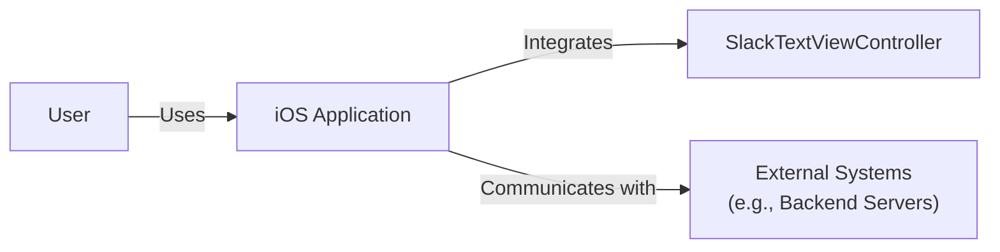
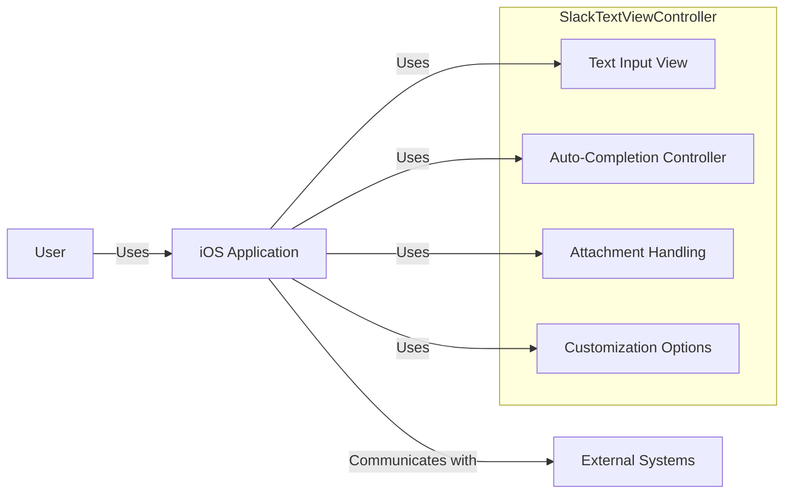
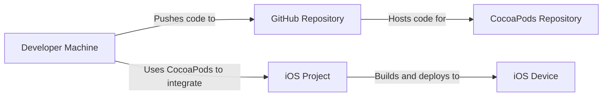
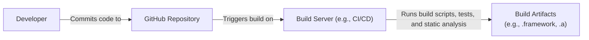

Okay, let's create a design document for the SlackTextViewController project.

# BUSINESS POSTURE

Business Priorities and Goals:

*   Provide a robust and feature-rich text input component for iOS applications, specifically targeting chat and messaging functionalities.
*   Offer a highly customizable and extensible solution to cater to diverse UI/UX requirements.
*   Maintain high performance and efficiency, especially under heavy text input and dynamic content updates.
*   Ensure a user-friendly API that is easy to integrate and use for developers.
*   Facilitate seamless integration with other Slack libraries and services (though this is a potential future goal, not explicitly stated in the repository).
*   Open-source the project to foster community contributions and adoption.

Most Important Business Risks:

*   Security vulnerabilities within the text input component could expose sensitive user data (e.g., messages, credentials) if exploited.
*   Performance bottlenecks or crashes could lead to a poor user experience and negative app reviews.
*   Lack of proper input validation could allow malicious content to be injected, potentially leading to XSS or other attacks within applications using the component.
*   Incompatibility with different iOS versions or device configurations could limit the project's adoption.
*   Insufficient documentation or unclear API could hinder developer adoption and increase integration costs.
*   Lack of maintainability and extensibility could make it difficult to adapt to future requirements or fix bugs.

# SECURITY POSTURE

Existing Security Controls:

*   security control: The project is open-source, allowing for community review and contributions, which can help identify and address security vulnerabilities. (Described in the repository's README and contribution guidelines).
*   security control: The project uses Objective-C, which, while not memory-safe by default, is a mature language with established security best practices. (Implicit in the codebase).
*   security control: Standard iOS security features, such as ASLR (Address Space Layout Randomization) and DEP (Data Execution Prevention), are inherently provided by the operating system. (Implicit in the iOS platform).

Accepted Risks:

*   accepted risk: The project's reliance on Objective-C introduces inherent risks associated with manual memory management, such as potential buffer overflows or use-after-free vulnerabilities. Mitigation strategies include rigorous code reviews, static analysis, and fuzzing.
*   accepted risk: The project does not appear to include specific built-in defenses against cross-site scripting (XSS) or other injection attacks. It's assumed that applications using this component will implement their own input validation and sanitization.
*   accepted risk: The project does not explicitly mention encryption of data at rest or in transit. It is assumed that the application using this component will handle data security appropriately.

Recommended Security Controls:

*   security control: Integrate static analysis tools (e.g., Infer, SonarQube) into the build process to identify potential vulnerabilities early in the development lifecycle.
*   security control: Conduct regular security code reviews, focusing on areas related to input handling, memory management, and data validation.
*   security control: Implement fuzz testing to identify unexpected behavior and potential vulnerabilities when handling malformed or malicious input.
*   security control: Provide clear documentation and guidelines for developers on how to securely use the SlackTextViewController component, including best practices for input validation and data sanitization.
*   security control: Consider adding built-in support for input validation and sanitization, potentially through configurable options or delegate methods.

Security Requirements:

*   Authentication: Not directly applicable to this component, as it handles text input, not user authentication. Authentication is the responsibility of the application using the component.
*   Authorization: Not directly applicable. Authorization is the responsibility of the application using the component.
*   Input Validation:
    *   The component SHOULD provide mechanisms for applications to validate and sanitize user input. This could be through delegate methods, configurable validation rules, or built-in sanitization options.
    *   The component SHOULD NOT assume that input is safe and SHOULD encourage developers to implement robust input validation.
    *   The component SHOULD handle potentially dangerous characters (e.g., `<`, `>`, `&`, `"`, `'`) appropriately to prevent XSS or other injection attacks.
*   Cryptography:
    *   Not directly applicable to this component in its core functionality. However, if the component is used to handle sensitive data (e.g., passwords, API keys), the application using it MUST ensure that this data is encrypted both in transit and at rest.
    *   The component SHOULD NOT store any sensitive data persistently.

# DESIGN

## C4 CONTEXT

Element Descriptions:

*   Element:
    *   Name: User
    *   Type: Person
    *   Description: A person interacting with an iOS application that utilizes the SlackTextViewController.
    *   Responsibilities: Provides text input, interacts with the application's UI.
    *   Security controls: Relies on the security controls implemented by the iOS application and the device's operating system.

*   Element:
    *   Name: SlackTextViewController
    *   Type: Software System
    *   Description: The text input component library.
    *   Responsibilities: Provides a text input view, handles text editing events, manages auto-completion, supports attachments, and provides customization options.
    *   Security controls: Relies on iOS platform security, code reviews, and potential future integration of static analysis and fuzz testing.

*   Element:
    *   Name: iOS Application
    *   Type: Software System
    *   Description: An iOS application that integrates the SlackTextViewController component.
    *   Responsibilities: Implements the application's core logic, handles user authentication and authorization, manages data persistence, and communicates with external systems.
    *   Security controls: Implements application-specific security measures, including input validation, data encryption, and secure communication protocols.

*   Element:
    *   Name: External Systems
    *   Type: Software System
    *   Description: Backend servers or other external services that the iOS application interacts with.
    *   Responsibilities: Provides data storage, processing, and other services to the iOS application.
    *   Security controls: Implements server-side security measures, such as authentication, authorization, input validation, and data encryption.

## C4 CONTAINER

Element Descriptions:

*   Element:
    *   Name: User
    *   Type: Person
    *   Description: A person interacting with an iOS application.
    *   Responsibilities: Provides text input.
    *   Security controls: Relies on iOS application security.

*   Element:
    *   Name: iOS Application
    *   Type: Software System
    *   Description: An iOS application that integrates the SlackTextViewController.
    *   Responsibilities: Implements application logic.
    *   Security controls: Implements application-specific security.

*   Element:
    *   Name: Text Input View
    *   Type: Container (UI Component)
    *   Description: The core UI component for text input.
    *   Responsibilities: Displays the text input field, handles user input events, manages text selection and editing.
    *   Security controls: Relies on iOS platform security and input validation performed by the application.

*   Element:
    *   Name: Auto-Completion Controller
    *   Type: Container (Controller)
    *   Description: Manages auto-completion suggestions.
    *   Responsibilities: Provides suggestions based on user input, handles selection of suggestions.
    *   Security controls: Relies on secure data sources for suggestions and input validation performed by the application.

*   Element:
    *   Name: Attachment Handling
    *   Type: Container (Controller/Utility)
    *   Description: Manages attachments (e.g., images, files).
    *   Responsibilities: Handles attachment selection, display, and potentially uploading/downloading.
    *   Security controls: Relies on secure handling of attachment data and secure communication protocols.

*   Element:
    *   Name: Customization Options
    *   Type: Container (Configuration/API)
    *   Description: Provides options for customizing the appearance and behavior of the text input component.
    *   Responsibilities: Allows developers to configure fonts, colors, layouts, and other settings.
    *   Security controls: Ensures that customization options do not introduce security vulnerabilities.

*   Element:
    *   Name: External Systems
    *   Type: Software System
    *   Description: Backend servers.
    *   Responsibilities: Provides data.
    *   Security controls: Implements server-side security.

## DEPLOYMENT

Possible Deployment Solutions:

1.  CocoaPods: A dependency manager for Swift and Objective-C Cocoa projects.
2.  Carthage: A decentralized dependency manager for Cocoa.
3.  Swift Package Manager: A tool for managing the distribution of Swift code, integrated with the Swift build system.
4.  Manual Integration: Directly adding the source files to the project.

Chosen Solution (CocoaPods):

Element Descriptions:

*   Element:
    *   Name: Developer Machine
    *   Type: Infrastructure Node
    *   Description: The developer's workstation.
    *   Responsibilities: Writing code, running builds, managing dependencies.
    *   Security controls: Relies on developer machine security practices.

*   Element:
    *   Name: CocoaPods Repository
    *   Type: Infrastructure Node
    *   Description: The central repository for CocoaPods packages.
    *   Responsibilities: Hosts the SlackTextViewController podspec and source code.
    *   Security controls: Relies on CocoaPods repository security measures.

*   Element:
    *   Name: iOS Project
    *   Type: Software System
    *   Description: The iOS application project that integrates SlackTextViewController.
    *   Responsibilities: Contains the application's code and dependencies.
    *   Security controls: Implements application-specific security measures.

*   Element:
    *   Name: Device
    *   Type: Infrastructure Node
    *   Description: An iOS device (iPhone, iPad).
    *   Responsibilities: Runs the iOS application.
    *   Security controls: Relies on iOS device security features.

*   Element:
    *   Name: GitHub Repository
    *   Type: Infrastructure Node
    *   Description: The central repository for source code.
    *   Responsibilities: Hosts the SlackTextViewController source code.
    *   Security controls: Relies on GitHub repository security measures.

## BUILD

Build Process Description:

1.  Developer commits code changes to the GitHub repository.
2.  A Continuous Integration (CI) system (e.g., GitHub Actions, Travis CI, CircleCI) is triggered by the commit.
3.  The build server checks out the code from the repository.
4.  Build scripts (e.g., `xcodebuild`) are executed to compile the code.
5.  Unit tests are run to verify the functionality of the component.
6.  Static analysis tools (e.g., Infer, SonarQube) are run to identify potential code quality and security issues.
7.  If all steps are successful, build artifacts (e.g., a framework or static library) are generated.
8.  The artifacts can be published to a package manager (e.g., CocoaPods) or made available for download.

Security Controls in Build Process:

*   security control: Use of a CI/CD system ensures that builds are automated and consistent.
*   security control: Running unit tests helps to identify functional bugs that could lead to security vulnerabilities.
*   security control: Integrating static analysis tools helps to detect potential security vulnerabilities early in the development lifecycle.
*   security control: Code signing ensures the integrity and authenticity of the build artifacts. (Implicit in the iOS build process).
*   security control: Dependency management tools (e.g., CocoaPods, Carthage, Swift Package Manager) help to manage and update third-party libraries, reducing the risk of using vulnerable dependencies.

# RISK ASSESSMENT

Critical Business Processes:

*   User communication and messaging within applications that integrate the SlackTextViewController.
*   Data input and handling within these applications.

Data Sensitivity:

*   User-generated text input: This can range from non-sensitive to highly sensitive, depending on the application's context. It may include personal messages, passwords, financial information, or other confidential data.
*   Metadata associated with text input (e.g., timestamps, user IDs): This data can also be sensitive, especially when combined with other information.
*   Attachment data (if handled by the component): This can include images, files, or other potentially sensitive content.

# QUESTIONS & ASSUMPTIONS

Questions:

*   Are there any specific compliance requirements (e.g., HIPAA, GDPR) that need to be considered for applications using this component?
*   What are the expected performance requirements for the component (e.g., maximum text length, number of concurrent users)?
*   What are the target iOS versions and device configurations?
*   Are there any plans to integrate with specific backend services or APIs?
*   What level of customization is required for the component's appearance and behavior?
*   What is the process for reporting and addressing security vulnerabilities?

Assumptions:

*   BUSINESS POSTURE: The primary goal is to provide a functional and reliable text input component, with security being a high priority but not necessarily the *absolute* highest (e.g., compared to a security-focused library).
*   SECURITY POSTURE: Applications using the component will implement their own robust input validation and data sanitization. The component itself does not provide strong guarantees about the safety of the input it handles.
*   DESIGN: The component is primarily designed for use in chat and messaging applications, but it can be adapted for other use cases. The architecture is relatively simple and focuses on providing core text input functionality. The deployment process relies on standard iOS dependency management tools. The build process includes basic security checks, but there is room for improvement (e.g., adding fuzz testing).