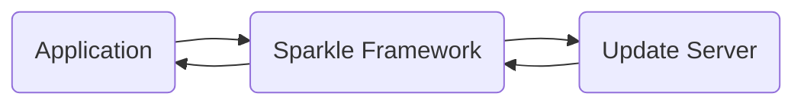
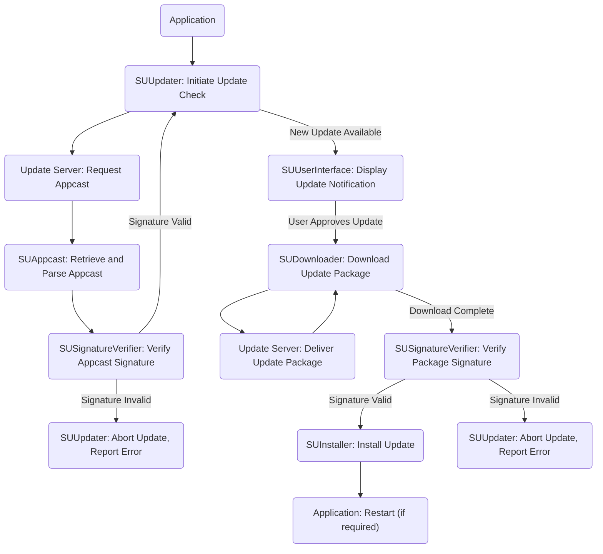

# Project Design Document: Sparkle Software Update Framework

**Version:** 1.1
**Date:** October 26, 2023
**Author:** Gemini (AI Language Model)

## 1. Introduction

This document provides an enhanced design overview of the Sparkle software update framework, as represented by the project hosted at [https://github.com/sparkle-project/Sparkle](https://github.com/sparkle-project/Sparkle). This revised document aims to offer a more detailed and refined understanding of the system's architecture, components, and data flow, serving as a robust foundation for subsequent threat modeling activities.

Sparkle is a widely adopted open-source framework for macOS and Windows applications, facilitating seamless automatic software updates. It manages the entire update lifecycle, from checking for new versions and downloading updates to installing them, thereby enhancing the user experience.

## 2. Goals and Objectives

The core goals driving the design of Sparkle are:

*   To establish a dependable and secure mechanism for distributing software updates to end-users, safeguarding against malicious actors and data corruption.
*   To simplify the integration of update functionality for developers, minimizing the complexity and effort involved in implementing robust update capabilities.
*   To offer a highly customizable and extensible framework, allowing developers to tailor the update process to the specific needs and user interface of their applications.
*   To ensure a user-friendly, unobtrusive, and efficient update experience, minimizing disruptions and maximizing user satisfaction.

## 3. High-Level Architecture

The Sparkle framework operates as an integral part of a host application. The primary interactions involve the application itself, the embedded Sparkle framework, and a remotely hosted update server.

**Key Entities:**

*   **Application:** The software application that incorporates and utilizes the Sparkle framework for its update mechanism.
*   **Sparkle Framework:** The central library responsible for the entire update management process within the application.
*   **Update Server:** An external server infrastructure hosting the application's update metadata (appcast) and the downloadable update packages.

## 4. Detailed Component Design

This section provides a more in-depth look at the key components within the Sparkle framework and their specific responsibilities.

### 4.1. SUUpdater (Central Update Orchestrator)

*   **Responsibility:**  The primary component that manages and coordinates the entire software update process lifecycle.
*   **Functions:**
    *   **Initiation of Update Checks:**  Triggers checks for new updates based on pre-configured intervals, user-initiated actions, or application events.
    *   **Appcast Retrieval:** Communicates with the designated update server to download the application's appcast feed.
    *   **Appcast Parsing:** Delegates the parsing of the appcast feed to the `SUAppcast` component.
    *   **Update Availability Determination:** Analyzes the parsed appcast to determine if a newer version of the application is available.
    *   **User Notification:** Presents update availability notifications to the user through the `SUUserInterface` components.
    *   **Download Management:**  Initiates and manages the download of the update package using the `SUDownloader`.
    *   **Installation Management:**  Orchestrates the installation of the downloaded update package via the `SUInstaller`.
    *   **Error Handling:** Manages and reports errors encountered during the update process.
    *   **Rollback Management (Optional):**  If implemented, manages the process of reverting to a previous application version in case of update failures.

### 4.2. SUAppcast (Update Metadata Processor)

*   **Responsibility:**  Responsible for retrieving, parsing, and validating the appcast feed from the update server.
*   **Functions:**
    *   **Retrieval:** Fetches the appcast feed from the URL specified in the application's configuration.
    *   **Parsing:** Interprets the structure of the appcast, which is typically in XML or JSON format, to extract update information.
    *   **Data Extraction:** Extracts key information about available updates, including version numbers, release notes, publication dates, and download URLs for the update packages.
    *   **Signature Verification:**  Utilizes the `SUSignatureVerifier` to verify the digital signature of the appcast, ensuring its authenticity and integrity.

### 4.3. SUDownloader (Update Package Retrieval)

*   **Responsibility:**  Handles the download of the update package from the URL provided in the appcast.
*   **Functions:**
    *   **Download Initiation:** Initiates HTTP or HTTPS requests to the specified download URL.
    *   **Progress Tracking:** Monitors and reports the download progress to the `SUUserInterface`.
    *   **Download Resumption:**  Implements mechanisms to resume interrupted downloads.
    *   **Integrity Verification:** After downloading, verifies the integrity of the downloaded package using checksums (e.g., SHA-256) or by delegating signature verification to the `SUSignatureVerifier`.

### 4.4. SUInstaller (Update Package Execution)

*   **Responsibility:**  Executes the downloaded update package to install the new version of the application.
*   **Functions:**
    *   **Package Unpacking:** Unpacks the downloaded archive, which could be in formats like ZIP or DMG (on macOS).
    *   **File Replacement:** Replaces the existing application files with the new versions contained in the update package.
    *   **Post-Installation Tasks:** Executes any necessary scripts or commands after the files have been replaced.
    *   **Privilege Handling:** May require elevated user privileges to perform the installation, especially for system-level components.

### 4.5. SUUserInterface (User Interaction Layer)

*   **Responsibility:**  Provides the visual elements and user interactions for the update process.
*   **Functions:**
    *   **Notification Display:** Presents notifications to the user about the availability of new updates.
    *   **Release Notes Presentation:** Displays release notes and changelogs associated with the new update.
    *   **User Prompts:** Provides options for users to install the update, skip it, or postpone it.
    *   **Progress Indication:** Shows progress bars and status messages during the download and installation phases.
    *   **Error Reporting:** Displays error messages to the user if issues occur during the update process.

### 4.6. SUSignatureVerifier (Authenticity and Integrity Validation)

*   **Responsibility:**  Verifies the digital signatures of both the appcast feed and the downloaded update package.
*   **Functions:**
    *   **Appcast Signature Verification:** Uses the application's public key to verify the signature of the appcast, ensuring it originates from a trusted source and hasn't been tampered with.
    *   **Update Package Signature Verification:**  Verifies the signature of the downloaded update package, confirming its authenticity and integrity before installation. This helps prevent the installation of malicious or corrupted updates.

## 5. Data Flow

The typical sequence of actions and data exchange during a software update process using Sparkle is as follows:

**Key Data Elements:**

*   **Appcast Feed:** An XML or JSON file hosted on the update server, containing metadata about available updates, including version information, release notes, and download URLs.
*   **Update Package:** A compressed archive (e.g., ZIP on Windows, DMG on macOS) containing the updated application files.
*   **Digital Signatures:** Cryptographic signatures embedded within the appcast and update package, used for verifying authenticity and integrity.
*   **Public Key:**  A cryptographic key embedded within the application, used to verify the signatures of the appcast and update package.
*   **Configuration Data:** Settings within the application or the Sparkle framework that govern update behavior, such as check intervals and update channels.

## 6. Technology Stack

*   **Primary Programming Languages:** Objective-C and Swift (predominantly for macOS), C++ (primarily for Windows).
*   **Networking Protocols:** HTTP and HTTPS for secure communication with the update server.
*   **Data Serialization Formats:** XML (using frameworks like `NSXMLParser` on macOS) or JSON (using frameworks like `Foundation.JSONSerialization`) for the appcast feed.
*   **Security and Cryptography:**  Leverages operating system-provided cryptographic libraries for signature verification (e.g., Code Signing on macOS, Authenticode on Windows).
*   **Operating System APIs:** Utilizes platform-specific APIs for file system operations, process management, user interface elements (e.g., `AppKit` on macOS, Win32 API on Windows).

## 7. Deployment Model

Sparkle is typically deployed as a dynamic library or framework that is bundled within the host application's package. The application developer integrates the Sparkle library into their project during the development process. The update server infrastructure is a separate component, managed either by the application developer or through a third-party hosting service.

## 8. Security Considerations

This section expands on the initial security considerations, providing more specific examples and potential mitigation strategies.

*   **Man-in-the-Middle (MITM) Attacks:**
    *   **Threat:** Attackers could intercept communication between the application and the update server to serve malicious appcasts or update packages.
    *   **Mitigation:** Enforce HTTPS for all communication with the update server to encrypt data in transit. Implement robust certificate validation to prevent impersonation.
*   **Code Signing and Signature Verification Bypass:**
    *   **Threat:** Attackers might attempt to bypass signature verification checks to install compromised updates.
    *   **Mitigation:** Ensure strict enforcement of signature verification for both the appcast and update packages. Regularly review and update the public keys used for verification. Implement code signing best practices during the build process.
*   **Compromised Update Server:**
    *   **Threat:** If the update server is compromised, attackers could distribute malicious updates to legitimate users.
    *   **Mitigation:** Implement strong security measures for the update server infrastructure, including access controls, intrusion detection systems, and regular security audits.
*   **Appcast Poisoning:**
    *   **Threat:** Attackers could manipulate the appcast feed to point to malicious update packages or provide incorrect information.
    *   **Mitigation:** Digitally sign the appcast feed to ensure its integrity and authenticity. Verify the signature before processing the appcast.
*   **Update Package Tampering:**
    *   **Threat:** Attackers could modify the downloaded update package after it has been retrieved from the server.
    *   **Mitigation:** Verify the digital signature of the update package after download but before installation. Consider using checksums as an additional layer of verification.
*   **Rollback Vulnerabilities:**
    *   **Threat:** If a rollback mechanism is implemented improperly, attackers might exploit it to downgrade users to vulnerable versions of the application.
    *   **Mitigation:** Securely manage the rollback process and ensure that rollback packages are also signed and verified.
*   **Secure Storage of Private Keys:**
    *   **Threat:** If the private keys used for signing updates are compromised, attackers can sign and distribute malicious updates.
    *   **Mitigation:** Implement strict access controls and secure storage mechanisms for private keys, such as hardware security modules (HSMs).
*   **User Trust Exploitation (Social Engineering):**
    *   **Threat:** Attackers might try to mimic legitimate update notifications to trick users into installing malware.
    *   **Mitigation:** Design clear and consistent update notifications that users can easily recognize as legitimate. Educate users about potential phishing attempts.

## 9. Assumptions and Constraints

*   It is assumed that the application developer has administrative control over the update server infrastructure and can implement necessary security measures.
*   The security of the update process is heavily reliant on the correct implementation and consistent enforcement of code signing and HTTPS.
*   The user has the necessary permissions to install software updates on their operating system.
*   A stable and reliable network connection exists between the application and the update server during the update process.

## 10. Future Considerations

*   **Differential Updates:** Implementing differential updates to reduce the size of update downloads by only transferring the changes between versions.
*   **Content Delivery Network (CDN) Integration:** Utilizing CDNs to distribute update packages more efficiently and reliably, improving download speeds and reducing server load.
*   **Enhanced User Interface Feedback:** Providing more detailed and informative feedback to the user during the update process, including estimated download times and progress details.
*   **Advanced Error Handling and Logging:** Implementing more sophisticated error handling and logging mechanisms to facilitate debugging and troubleshooting update issues.
*   **Support for Staged Rollouts:** Adding support for gradually rolling out updates to a subset of users before wider distribution.

This enhanced design document provides a more detailed and comprehensive overview of the Sparkle software update framework. It serves as a valuable resource for understanding the system's architecture and will be instrumental in conducting thorough threat modeling to identify and mitigate potential security vulnerabilities.