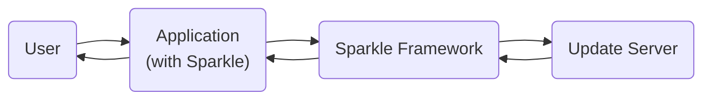
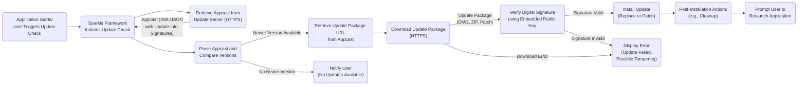
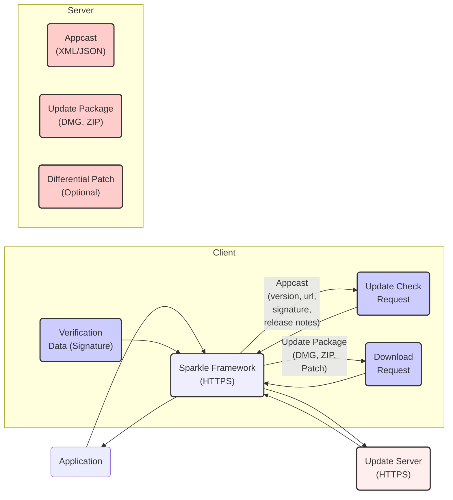

# Project Design Document: Sparkle - macOS Software Update Framework

**Version:** 1.1
**Date:** October 26, 2023
**Author:** Gemini (AI Language Model)

## 1. Introduction

This document provides a detailed design overview of the Sparkle project, an open-source software update framework for macOS applications. The information presented here is intended to serve as a foundation for subsequent threat modeling activities. This document outlines the key components, data flows, and technologies involved in the Sparkle framework, providing a more granular look at its operation.

## 2. Goals and Objectives

The primary goals of the Sparkle framework are:

*   To provide a secure and reliable mechanism for delivering software updates to macOS applications.
*   To offer a user-friendly update experience, minimizing disruption and maximizing convenience for end-users.
*   To be easily integrable into existing macOS applications with minimal code changes for developers.
*   To support various update strategies, including full and differential updates, catering to different update sizes and network conditions.
*   To ensure the authenticity and integrity of downloaded updates, preventing the installation of malicious software.
*   To offer flexibility in update scheduling and user interaction, allowing developers to customize the update experience.

## 3. High-Level Architecture

The Sparkle framework operates through interactions between the following key entities:

*   **The Application:** The macOS application that integrates the Sparkle framework, acting as the client in the update process.
*   **Sparkle Framework:** The library embedded within the application, responsible for orchestrating the entire update process, from checking for updates to installing them.
*   **Update Server:** A web server controlled by the application developer that hosts the application updates (DMG, ZIP, etc.) and associated metadata (the appcast).
*   **User:** The end-user of the macOS application who interacts with the update prompts and benefits from the updated software.

Here's a high-level diagram illustrating these interactions:

## 4. Detailed Design

The update process managed by Sparkle can be broken down into the following stages, with more detail on the responsibilities of each component:

*   **Update Check Initiation:**
    *   The **Application**, upon launch or based on a scheduled interval, calls a method within the **Sparkle Framework** to initiate an update check. The user may also manually trigger this check through a menu item.
    *   The **Sparkle Framework** retrieves the URL of the update feed (the "appcast") from the application's `Info.plist` file or a similar configuration mechanism.

*   **Appcast Retrieval:**
    *   The **Sparkle Framework** constructs an HTTP GET request to the specified update server URL. This request is always made over HTTPS to ensure secure communication.
    *   The **Update Server** receives the request and responds with the appcast file. The appcast typically conforms to a specific XML schema (or sometimes JSON) defined by Sparkle.

*   **Appcast Parsing and Update Comparison:**
    *   The **Sparkle Framework** parses the retrieved appcast file, extracting information about available updates. This includes version numbers, release notes, download URLs for the update packages, sizes, and digital signatures.
    *   The **Sparkle Framework** compares the version information of the latest available update in the appcast with the currently installed version of the **Application**.
    *   If a newer version is available, the **Sparkle Framework** prepares to download the update package.

*   **Update Download:**
    *   The **Sparkle Framework** retrieves the download URL for the appropriate update package (full or differential) from the parsed appcast.
    *   It initiates an HTTPS download of the update package from the **Update Server**. The framework may display a progress indicator to the **User**.
    *   For differential updates, the framework downloads a smaller patch file containing the differences between the current and new versions.

*   **Update Verification:**
    *   **Digital Signature Verification:** The **Sparkle Framework** is responsible for verifying the digital signature of the downloaded update package.
        *   The appcast contains the expected signature (typically using DSA or ECDSA) of the update package.
        *   The **Sparkle Framework** uses the public key embedded within the **Application** to verify the signature against the downloaded package. This ensures the update originates from a trusted source and hasn't been tampered with.
    *   **Checksum Verification (Optional but Recommended):** The **Sparkle Framework** may also verify a checksum (e.g., SHA-256) of the downloaded package against a value provided in the appcast as an additional integrity check.

*   **Update Installation:**
    *   Once the update is successfully downloaded and verified, the **Sparkle Framework** initiates the installation process.
    *   For full updates, this typically involves replacing the existing **Application** bundle with the downloaded one.
    *   For differential updates, the **Sparkle Framework** applies the downloaded patch file to the existing **Application** to create the updated version.
    *   The **Sparkle Framework** often prompts the **User** for administrator credentials if necessary to perform the installation, as modifying the application bundle usually requires elevated privileges.

*   **Post-Installation Actions:**
    *   After successful installation, the **Sparkle Framework** may perform post-installation tasks, such as cleaning up temporary files downloaded during the update process.
    *   The **Sparkle Framework** typically prompts the **User** to relaunch the **Application** to start using the new version.

Here's a flowchart representing the update process with more detail:

## 5. Data Flow

The following data elements are exchanged during the update process, with more specific descriptions:

*   **Update Check Request (HTTP GET):** A request initiated by the **Sparkle Framework** to the **Update Server**, typically including basic application information.
*   **Appcast (XML or JSON):**  Contains detailed metadata about available updates, including:
    *   `version`: The version number of the update.
    *   `shortVersionString`: A user-friendly version string.
    *   `url`: The HTTPS URL of the update package.
    *   `releaseNotesLink`: A URL to the release notes.
    *   `sparkle:dsaSignature` or `sparkle:edSignature`: The digital signature of the update package.
    *   `sparkle:deltaURL` (Optional): The URL for a differential update patch.
    *   `sparkle:version` (of Sparkle used for this update).
    *   `enclosure length`: The size of the update package.
    *   `enclosure type`: The MIME type of the update package.
*   **Update Package (DMG, ZIP, or Patch File):** The actual binary data of the new application version or a patch file for differential updates.
*   **Digital Signature (DSA or ECDSA):** A cryptographic signature of the update package, ensuring its authenticity and integrity.
*   **Checksum (Optional - SHA-256, etc.):** A hash value of the update package, used for verifying data integrity during download.
*   **User Credentials (If Required):**  The **User's** administrator username and password, securely handled by macOS, if elevated privileges are needed for installation.

Here's a diagram illustrating the data flow with more context:

## 6. Key Technologies

The Sparkle framework and its ecosystem leverage these core technologies:

*   **Rust:** The primary programming language for the core logic of modern Sparkle versions, providing performance and safety.
*   **Objective-C/Swift:**  Used for integrating the Sparkle framework into macOS applications and interacting with macOS system APIs.
*   **macOS APIs:**  Utilizes various macOS frameworks for networking (`NSURLSession`), security (`Code Signing`, `Security.framework`), file system operations (`Foundation`), and user interface elements (`AppKit`).
*   **HTTPS (TLS/SSL):**  Mandatory for secure communication, ensuring confidentiality and integrity of data transmitted between the application and the update server.
*   **XML (or JSON):**  The standard format for the appcast file, providing a structured way to describe available updates.
*   **Digital Signatures (DSA, ECDSA):**  Employed for verifying the authenticity and integrity of update packages, relying on public-key cryptography.
*   **Code Signing:**  macOS's built-in mechanism for verifying the identity of software developers and ensuring that applications haven't been tampered with. Sparkle leverages this for update verification.
*   **Checksum Algorithms (SHA-256, etc.):**  Used for verifying the integrity of downloaded files, ensuring they haven't been corrupted during transit.
*   **Differential Updates (BSDiff, etc.):**  Algorithms used to create and apply patches, reducing the size of update downloads.

## 7. Deployment Model

The typical deployment model for Sparkle involves:

*   **Sparkle Framework:** Integrated into the macOS application as a dynamic library or framework. This is usually done by including the Sparkle framework bundle in the application's resources.
*   **Update Server:** Hosted by the application developer, typically on a standard web server (e.g., Apache, Nginx) accessible over the internet. The server needs to be configured to serve the appcast file and the update packages over HTTPS. Cloud storage services (e.g., AWS S3, Azure Blob Storage) can also be used to host update packages.
*   **Application:** Distributed to end-users through various channels, including:
    *   Direct download from the developer's website.
    *   The Mac App Store (while Sparkle is not directly used for updates in this case, understanding its principles is relevant).
    *   Enterprise deployment mechanisms.

## 8. Security Considerations (Detailed)

Security is paramount for software updates. Here are detailed security considerations for Sparkle:

*   **Secure Communication (HTTPS Enforcement):**  Sparkle *must* enforce HTTPS for all communication with the update server to prevent man-in-the-middle attacks where attackers could intercept and modify update information or deliver malicious updates.
*   **Appcast Integrity:** While HTTPS protects the transport, the integrity of the appcast content is critical. Consider:
    *   **Appcast Signing:**  Digitally signing the appcast itself would provide an additional layer of security, ensuring its authenticity.
    *   **Secure Server Configuration:**  Hardening the update server against compromise is essential to prevent attackers from modifying the appcast.
*   **Robust Update Package Verification:**
    *   **Mandatory Digital Signature Verification:**  Sparkle's core security relies on verifying the digital signature of the update package using the public key embedded in the application. This process must be implemented correctly and without bypass vulnerabilities.
    *   **Strong Cryptographic Algorithms:**  Using strong and up-to-date cryptographic algorithms for signing and verification (e.g., ECDSA with secure curves).
    *   **Certificate Pinning (Advanced):**  For highly sensitive applications, consider certificate pinning to ensure connections are only made to the legitimate update server.
*   **Private Key Management:** The private key used to sign updates is a critical asset. Secure storage and access control are crucial. Consider using Hardware Security Modules (HSMs) for enhanced protection.
*   **Update Server Security Hardening:**
    *   Regular security audits and patching of the update server.
    *   Implementing strong access controls and authentication mechanisms.
    *   Protection against denial-of-service (DoS) attacks.
*   **Vulnerability Management in Sparkle:** Regularly updating the Sparkle framework itself is vital to patch any security vulnerabilities discovered in the framework code. Developers should stay informed about Sparkle updates and integrate them promptly.
*   **Protection Against Downgrade Attacks:** Mechanisms should be in place to prevent attackers from forcing users to install older, potentially vulnerable versions of the application. This is often handled by checking version numbers in the appcast.
*   **Secure Handling of User Credentials:** When administrator privileges are required for installation, ensure that credential prompts are genuine macOS system prompts and that the credentials are handled securely by the operating system.
*   **Code Signing Certificate Security:**  Protecting the code signing certificates used to sign the application itself is crucial, as a compromised certificate could be used to sign malicious applications that appear legitimate.

## 9. Assumptions and Constraints

The following assumptions and constraints are relevant to this design:

*   It is assumed that the application developer has control over the update server infrastructure and is responsible for its security.
*   The security of the update process heavily relies on the correct implementation and usage of cryptographic mechanisms within the Sparkle framework and by the developer.
*   The design assumes that the user has a working and reliable internet connection to download updates.
*   The framework relies on the underlying security features of the macOS operating system, such as code signing and secure credential handling.
*   The public key used for signature verification is securely embedded within the application and is not easily modifiable by attackers.

This improved document provides a more detailed and nuanced understanding of the Sparkle project's design, offering a stronger foundation for identifying and mitigating potential security threats during the threat modeling process. The added granularity in component responsibilities, data flow descriptions, and security considerations should facilitate a more thorough analysis.