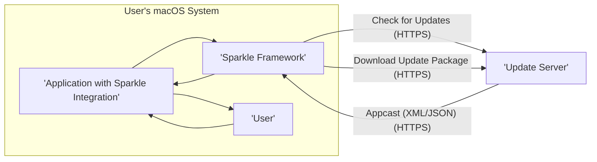

# Project Design Document: Sparkle Auto-Update Framework

**Version:** 1.1
**Date:** October 26, 2023
**Author:** AI Software Architect

## 1. Introduction

This document provides a detailed design overview of the Sparkle auto-update framework for macOS applications. It aims to describe the system's architecture, components, data flow, and key considerations relevant for threat modeling. This document will serve as a foundation for identifying potential security vulnerabilities and designing appropriate mitigations.

## 2. Goals and Objectives

The primary goal of Sparkle is to provide a seamless and secure mechanism for macOS applications to update themselves. Key objectives include:

*   **Automated Update Checks:** Periodically check a designated server for new application versions without explicit user intervention.
*   **Secure Download and Verification:** Ensure downloaded update packages originate from a trusted source and have not been tampered with during transit.
*   **User Notification and Control:**  Inform users about the availability of updates and provide options for installation, deferral, or skipping.
*   **Background Updates:** Facilitate updating the application with minimal disruption to the user's workflow.
*   **Delta Updates (Optional):**  Minimize download size and bandwidth consumption by downloading only the differences between the current and new versions.
*   **Rollback Capabilities (Optional):**  Enable users to revert to a previously installed version in case of issues with the new update.

## 3. High-Level Architecture

The Sparkle framework operates as an integral part of a macOS application. It communicates with an external update server to retrieve information about new releases and download the necessary update files.



**Components:**

*   **Application with Sparkle Integration:** The main macOS application that has incorporated the Sparkle framework as a dependency or embedded component. This application initiates update checks and manages the user interface for updates.
*   **Sparkle Framework:** The core set of libraries and resources responsible for the entire update process, including checking for updates, downloading, verifying, and installing new versions.
*   **Update Server:** A web server (or cloud storage service configured as a web server) that hosts the application's update metadata (appcast) and the actual update packages. This server needs to be securely configured and maintained.
*   **User:** The individual using the macOS application who may interact with the update process through notifications and prompts.

## 4. Detailed Design

This section provides a more in-depth look at the key processes and components within the Sparkle framework.

### 4.1. Update Check Process

1. **Initiation:** The update check can be triggered in several ways:
    *   **Automatic:** Upon application launch or at predefined intervals configured within the application or Sparkle settings.
    *   **Manual:** Via a user-initiated action within the application's menu or preferences.
    *   **Programmatic:**  Through specific API calls within the application's code.
2. **Appcast URL Retrieval:** The Sparkle framework retrieves the URL of the appcast file from the application's configuration.
3. **Secure Appcast Request:** Sparkle sends an HTTPS GET request to the configured appcast URL on the update server.
    *   This request may include information about the current application version to allow the server to provide version-specific updates.
4. **Appcast Retrieval and Parsing:** The update server responds with the appcast file (typically XML or JSON). Sparkle parses this file to extract information about available updates.
5. **Version Comparison Logic:** Sparkle compares the current application's version number with the versions listed in the appcast. This comparison determines if a newer version is available and eligible for installation based on criteria like minimum system version.
6. **Update Available Determination:** If a newer, compatible version is found in the appcast, Sparkle proceeds to notify the user.

### 4.2. Update Download Process

1. **User Confirmation (Typically):**  After being notified of an available update, the user typically needs to confirm their intent to download and install the update.
2. **Download URL Extraction:** Sparkle extracts the download URL for the update package from the selected item in the appcast.
3. **Secure Download Initiation:** Sparkle initiates an HTTPS download request to the specified download URL on the update server.
    *   This ensures the update package is transferred securely and protects against tampering during transit.
4. **Download Management:** Sparkle manages the download process, potentially displaying progress to the user. It may also handle interrupted downloads and resume capabilities.
5. **Temporary Storage:** The downloaded update package is typically stored in a temporary directory on the user's system.

### 4.3. Update Verification Process

This is a crucial security step to guarantee the authenticity and integrity of the downloaded update.

1. **Signature Verification:**
    *   The appcast contains a digital signature of the update package (e.g., using DSA or EdDSA).
    *   Sparkle retrieves the public key embedded within the application bundle.
    *   Sparkle uses this public key to cryptographically verify the signature against the downloaded update package.
    *   Successful verification confirms that the update was signed by the legitimate application developer and hasn't been tampered with.
2. **Checksum Verification (Recommended):**
    *   The appcast may also include a cryptographic hash (checksum) of the update package (e.g., SHA-256).
    *   Sparkle calculates the checksum of the downloaded package.
    *   It compares the calculated checksum with the value provided in the appcast.
    *   A match confirms the integrity of the downloaded file.

### 4.4. Update Installation Process

1. **Application Quitting:** Sparkle typically prompts the user to quit the running application before proceeding with the installation. This ensures that files are not in use during the update process.
2. **Backup (Optional):** Some implementations might create a backup of the existing application bundle before installing the new version. This allows for potential rollback if issues arise.
3. **Package Extraction:** Sparkle extracts the contents of the downloaded update package (e.g., a `.zip` or `.dmg` file).
4. **Application Replacement:** The existing application bundle in the `Applications` directory (or other installation location) is replaced with the new version extracted from the update package.
5. **Code Signature Validation (macOS):** macOS will typically validate the code signature of the newly installed application bundle to ensure it's signed by a trusted developer.
6. **Cleanup:** Temporary files, including the downloaded update package, are typically deleted after successful installation.
7. **Application Launch (Optional):** Sparkle may offer to relaunch the updated application.

### 4.5. Appcast Structure (Example)

The appcast is a structured data file that provides essential information about available updates.

```
- Appcast
  - Channel
    - Item
      - Title: "My Application 2.0 Release"
      - Description: "New features and bug fixes."
      - PubDate: "Tue, 24 Oct 2023 10:00:00 +0000"
      - Enclosure
        - URL: "https://example.com/updates/MyApp_2.0.zip"
        - Length: "12345678"
        - Type: "application/zip"
        - DSA Signature: "..."
        - EdDSA Signature: "..."
        - Security
          - MinimumSystemVersion: "10.15"
          - Checksum: "..."
          - Checksum Type: "sha256"
      - Version: "2.0"
      - ShortVersionString: "2.0.0"
      - ReleaseNotesURL: "https://example.com/releasenotes/2.0"
```

**Key Appcast Fields:**

*   **Channel:**  A container for update information.
*   **Item:** Represents a specific application update.
    *   **Title:** A human-readable title for the update.
    *   **Description:**  Details about the update.
    *   **PubDate:** The publication date of the update.
    *   **Enclosure:** Contains information about the update package.
        *   **URL:** The download URL of the update package.
        *   **Length:** The size of the update package.
        *   **Type:** The MIME type of the update package.
        *   **DSA/EdDSA Signature:** The digital signature of the update package.
        *   **Security:**  Contains security-related information.
            *   **MinimumSystemVersion:** The minimum macOS version required for this update.
            *   **Checksum:** The cryptographic hash of the update package.
            *   **Checksum Type:** The algorithm used for the checksum (e.g., "sha256").
    *   **Version:** The internal build version number of the update.
    *   **ShortVersionString:** The user-facing version string of the update.
    *   **ReleaseNotesURL:** A link to the release notes for this update.

## 5. Data Flow Diagram

This diagram illustrates the detailed flow of data during a typical update process.

```mermaid
graph LR
    A["'Application'"] --> B["'Sparkle Framework'"]
    B -- "Check for Updates (HTTPS)" --> C["'Update Server'"]
    C -- "Appcast (XML/JSON) (HTTPS)" --> B
    B -- "Parse Appcast & Compare Versions" --> B
    subgraph "Update Available"
        B -- "Display Update Notification" --> A
        A -- "Confirm Update" --> B
        B -- "Extract Download URL" --> B
        B -- "Request Update Package (HTTPS)" --> C
        C -- "Update Package (.zip/.dmg) (HTTPS)" --> B
        B -- "Store in Temporary Location" --> B
        B -- "Verify Digital Signature" --> B
        B -- "Verify Checksum" --> B
        subgraph "Verification Successful"
            B -- "Prompt to Quit Application" --> A
            A -- "Quit Application" --> B
            B -- "Extract Update Package" --> B
            B -- "Replace Application Bundle" --> "macOS System"
            "macOS System" -- "Validate Code Signature" --> "macOS System"
            B -- "Cleanup Temporary Files" --> B
            B -- "Offer to Relaunch Application" --> A
        end
        subgraph "Verification Failed"
            B -- "Display Error to User" --> A
        end
    end
```

## 6. Security Considerations

This section expands on potential security risks and considerations for the Sparkle framework, crucial for threat modeling.

*   **Man-in-the-Middle (MITM) Attacks:**
    *   If HTTPS is not strictly enforced for all communication with the update server (appcast and package downloads), an attacker on the network could intercept traffic.
    *   This allows the attacker to inject malicious appcast data, redirect download URLs to malicious packages, or tamper with the update package during transit.
    *   **Mitigation:** Enforce HTTPS for all communication. Implement certificate pinning for added security.
*   **Compromised Update Server:**
    *   If the update server's security is compromised, an attacker could replace legitimate update packages with malware or modify the appcast to point to malicious resources.
    *   This is a high-impact vulnerability as it can lead to widespread compromise of applications using Sparkle.
    *   **Mitigation:** Implement robust security measures for the update server, including access controls, regular security audits, and intrusion detection systems. Use strong authentication for administrative access.
*   **Signature Verification Bypass:**
    *   Vulnerabilities in the signature verification logic within the Sparkle framework could allow attackers to distribute unsigned or maliciously signed updates that pass verification.
    *   This could arise from flaws in the cryptographic implementation or incorrect handling of keys.
    *   **Mitigation:** Use well-vetted and up-to-date cryptographic libraries. Implement rigorous testing of the signature verification process. Regularly review and update the framework.
*   **Checksum Verification Failure:**
    *   If checksum verification is not implemented, is optional, or has vulnerabilities, corrupted or tampered update packages might be installed without detection.
    *   **Mitigation:** Make checksum verification mandatory. Use strong and collision-resistant hashing algorithms (e.g., SHA-256 or higher).
*   **Downgrade Attacks:**
    *   An attacker might attempt to trick users into installing an older, potentially vulnerable version of the application by manipulating the appcast or intercepting update checks.
    *   **Mitigation:** Implement logic to prevent downgrades unless explicitly intended and authorized. The appcast should clearly indicate the version being offered.
*   **Unsecured Temporary Files:**
    *   If temporary files created during the download and installation process are not properly secured (e.g., world-readable permissions), they could be exploited by local attackers to inject malicious code or gain access to sensitive information.
    *   **Mitigation:** Ensure temporary files are created with restrictive permissions. Delete temporary files securely after use.
*   **Code Injection Vulnerabilities:**
    *   Vulnerabilities in how Sparkle handles the update package (e.g., during extraction or replacement) could potentially lead to code injection if the package contains malicious executables or scripts.
    *   **Mitigation:** Implement secure file handling practices. Validate the contents of the update package before execution. Leverage macOS security features like code signing and sandboxing.
*   **Denial of Service (DoS) Attacks:**
    *   An attacker could flood the update server with requests, potentially making it unavailable for legitimate update checks and downloads.
    *   **Mitigation:** Implement rate limiting and other DoS protection mechanisms on the update server.
*   **Privacy Concerns:**
    *   While primarily focused on updates, the framework might inadvertently collect or transmit usage data related to update checks or installations.
    *   **Mitigation:** Minimize data collection. Be transparent with users about any data collected. Ensure compliance with privacy regulations.

## 7. Deployment Model

Sparkle is typically integrated into a macOS application during the development process.

*   **Framework Embedding:** Developers integrate the Sparkle framework into their Xcode project, either as a dependency managed by a tool like CocoaPods or Swift Package Manager, or by manually embedding the framework.
*   **Configuration:** Developers configure the update server URL, appcast file name, and other settings within the application's `Info.plist` file or through code.
*   **Code Signing:** The application and the embedded Sparkle framework must be properly code-signed by the developer using their Apple Developer ID. This is crucial for macOS to trust the application and its updates.
*   **Update Server Infrastructure:** Developers are responsible for setting up and maintaining a secure update server infrastructure. This includes:
    *   **Secure Hosting:** Choosing a reliable and secure hosting provider.
    *   **HTTPS Configuration:** Properly configuring HTTPS with valid SSL/TLS certificates.
    *   **Appcast Generation:** Implementing a system to automatically generate and update the appcast file whenever a new version is released.
    *   **Package Signing:** Signing the update packages with a private key corresponding to the public key embedded in the application.
    *   **Access Control:** Implementing access controls to prevent unauthorized modification of the appcast and update packages.

## 8. Future Considerations

*   **Enhanced Security Features:**
    *   Explore integration with Apple's Notarization service for an additional layer of security validation.
    *   Investigate more advanced signature verification methods and cryptographic algorithms.
    *   Consider implementing Content Security Policy (CSP) for the appcast if served over HTTP(S).
*   **Delta Updates Implementation:** Implement support for delta updates to significantly reduce download sizes, especially for minor updates.
*   **Improved Rollback Mechanism:** Develop a more robust and user-friendly rollback mechanism to handle failed updates gracefully.
*   **Granular Update Scheduling:** Allow users more control over when updates are checked and installed.
*   **Telemetry and Analytics (Optional):**  Consider adding opt-in telemetry to gather anonymized data on update success rates, error occurrences, and platform information to help improve the update process.
*   **Modularization:** Explore further modularization of the Sparkle framework to allow for more flexibility and easier integration.

This document provides a detailed design overview of the Sparkle auto-update framework, emphasizing aspects relevant for threat modeling. Understanding these components, data flows, and security considerations is essential for identifying potential vulnerabilities and implementing appropriate security measures to ensure the integrity and security of the application update process.