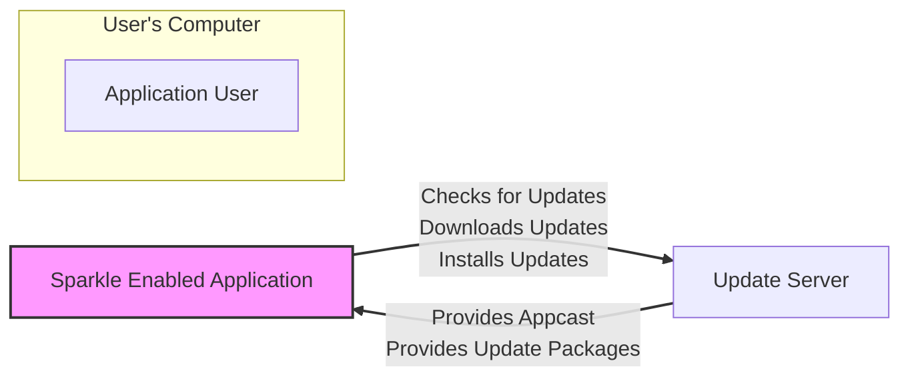
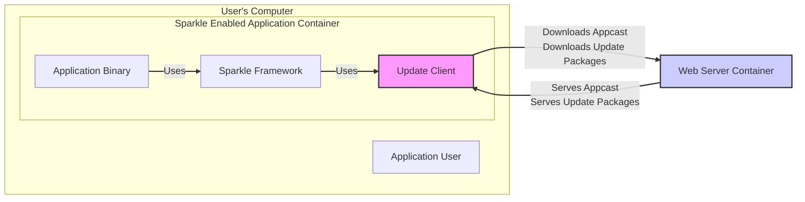

# BUSINESS POSTURE

Sparkle is a software update framework designed to simplify and automate the process of updating applications on macOS and Windows.

- Business Priorities and Goals:
  - Ensure users are running the latest version of the application to benefit from new features, bug fixes, and security patches.
  - Improve user experience by providing a seamless and automatic update mechanism.
  - Reduce support costs associated with users running outdated versions of the application.
  - Increase user adoption and satisfaction by providing a reliable and up-to-date application.

- Business Risks:
  - Risk of distributing malicious updates if the update process is compromised. This could lead to widespread security breaches and damage to user trust and the company's reputation.
  - Risk of service disruption if the update server or infrastructure becomes unavailable, preventing users from receiving critical updates.
  - Risk of compatibility issues or bugs introduced during updates, potentially causing application instability or data loss.
  - Risk of users disabling automatic updates, leading to fragmented user base with varying application versions and potential security vulnerabilities.

# SECURITY POSTURE

- Existing Security Controls:
  - security control Code signing of application updates to ensure authenticity and integrity. Implemented in the Sparkle framework itself and relies on operating system's code signing mechanisms. Described in Sparkle documentation and code.
  - security control HTTPS for communication between the application and the update server to protect against man-in-the-middle attacks. Implemented by using HTTPS URLs for appcast and update downloads. Described in Sparkle documentation and best practices.

- Accepted Risks:
  - accepted risk Reliance on code signing infrastructure. Compromise of code signing keys would allow for distribution of malicious updates.
  - accepted risk Vulnerabilities in the Sparkle framework itself. Exploits could bypass security controls or be used to deliver malicious updates.
  - accepted risk Server-side vulnerabilities. Compromise of the update server could lead to distribution of malicious updates.

- Recommended Security Controls:
  - security control Implement Content Security Policy (CSP) for web-based update interfaces (if any) to mitigate cross-site scripting (XSS) attacks.
  - security control Regularly perform security audits and penetration testing of the update infrastructure and Sparkle integration to identify and address vulnerabilities.
  - security control Implement input validation and sanitization on the update server to prevent injection attacks.
  - security control Use Subresource Integrity (SRI) for any external JavaScript libraries used in update interfaces to ensure their integrity.
  - security control Implement rate limiting and DDoS protection for the update server to ensure availability.
  - security control Establish a vulnerability disclosure program to allow security researchers to report vulnerabilities in Sparkle and the update infrastructure.
  - security control Implement robust logging and monitoring of update processes to detect and respond to security incidents.

- Security Requirements:
  - Authentication:
    - Requirement: The update process should authenticate the update server to prevent communication with rogue servers.
    - Requirement: While user authentication for updates might not be directly applicable, ensure that any administrative interfaces for managing updates are properly authenticated and authorized.

  - Authorization:
    - Requirement: Access to update management systems and code signing keys should be strictly authorized and limited to authorized personnel.
    - Requirement: The update client should only be authorized to download and install updates that are intended for the specific application.

  - Input Validation:
    - Requirement: The update client must validate the appcast and update packages to ensure they are well-formed and conform to the expected schema.
    - Requirement: The update server must validate inputs from administrators managing updates to prevent injection attacks.

  - Cryptography:
    - Requirement: Use strong cryptography for code signing to ensure the integrity and authenticity of updates.
    - Requirement: All communication related to updates should be encrypted using HTTPS to protect confidentiality and integrity.
    - Requirement: Consider using cryptographic checksums or hashes to verify the integrity of downloaded update packages.

# DESIGN

## C4 CONTEXT



- Context Diagram Elements:
  - Element:
    - Name: Application User
    - Type: Person
    - Description: End-user who uses the Sparkle-enabled application on their computer.
    - Responsibilities: Uses the application, benefits from automatic updates.
    - Security controls: Operating system level security controls on user's computer.

  - Element:
    - Name: Sparkle Enabled Application
    - Type: Software System
    - Description: The application that integrates the Sparkle framework to provide automatic updates.
    - Responsibilities: Checks for updates, downloads updates, installs updates, applies updates.
    - Security controls: Code signing, HTTPS for update communication, input validation of appcast and update packages, application-level security controls.

  - Element:
    - Name: Update Server
    - Type: Software System
    - Description: Server that hosts the appcast file and update packages.
    - Responsibilities: Provides appcast information, serves update packages, manages update versions.
    - Security controls: HTTPS, server-side input validation, access control, rate limiting, DDoS protection, security monitoring.

## C4 CONTAINER



- Container Diagram Elements:
  - Element:
    - Name: Application User
    - Type: Person
    - Description: End-user who uses the Sparkle-enabled application on their computer.
    - Responsibilities: Uses the application, benefits from automatic updates.
    - Security controls: Operating system level security controls on user's computer.

  - Element:
    - Name: Application Binary
    - Type: Software Container
    - Description: The main executable of the application that is being updated.
    - Responsibilities: Provides application functionality, integrates with Sparkle for updates.
    - Security controls: Application-level security controls, code signing.

  - Element:
    - Name: Sparkle Framework
    - Type: Software Container
    - Description: The Sparkle library integrated into the application, providing update functionality.
    - Responsibilities: Manages update checks, downloads, and installation process.
    - Security controls: Code signing, secure coding practices, input validation.

  - Element:
    - Name: Update Client
    - Type: Software Container
    - Description: Component within the Sparkle Framework responsible for network communication with the update server.
    - Responsibilities: Fetches appcast, downloads update packages over HTTPS.
    - Security controls: HTTPS, input validation, secure network communication.

  - Element:
    - Name: Web Server Container
    - Type: Infrastructure Container
    - Description: Web server hosting the appcast file and update packages. Could be Nginx, Apache, or cloud storage like AWS S3, Azure Blob Storage, etc.
    - Responsibilities: Serves appcast and update packages over HTTPS.
    - Security controls: HTTPS, access control, server hardening, rate limiting, DDoS protection, security monitoring, input validation on server-side scripts (if any).

## DEPLOYMENT

Deployment Architecture Option: Cloud Storage and CDN

```mermaid
graph LR
    subgraph "User's Computer"
        A["Application User"]
        B["Sparkle Enabled Application"]
    end
    C["Content Delivery Network (CDN)"] -- "Delivers Appcast\nDelivers Update Packages" --> B["Sparkle Enabled Application"]
    D["Cloud Storage (e.g., AWS S3, Azure Blob Storage)"] -- "Origin for CDN\nStores Appcast\nStores Update Packages" --> C["Content Delivery Network (CDN)"]
    E["Code Signing Server"] -- "Signs Update Packages" --> D["Cloud Storage (e.g., AWS S3, Azure Blob Storage)"]
    F["Developer Workstation"] -- "Uploads Appcast\nUploads Update Packages" --> D["Cloud Storage (e.g., AWS S3, Azure Blob Storage)"]
    style B fill:#f9f,stroke:#333,stroke-width:2px
    style C fill:#ccf,stroke:#333,stroke-width:2px
    style D fill:#ccf,stroke:#333,stroke-width:2px
    style E fill:#eee,stroke:#333,stroke-width:2px
    style F fill:#eee,stroke:#333,stroke-width:2px
    linkStyle 0,1,2,3,4 stroke:#333,stroke-width:2px
```

- Deployment Diagram Elements:
  - Element:
    - Name: Application User
    - Type: Person
    - Description: End-user who uses the Sparkle-enabled application on their computer.
    - Responsibilities: Uses the application, benefits from automatic updates.
    - Security controls: Operating system level security controls on user's computer.

  - Element:
    - Name: Sparkle Enabled Application
    - Type: Software
    - Description: The application with integrated Sparkle framework running on user's computer.
    - Responsibilities: Checks for updates, downloads updates, installs updates.
    - Security controls: Code signing, HTTPS for update communication, input validation.

  - Element:
    - Name: Content Delivery Network (CDN)
    - Type: Infrastructure
    - Description: Globally distributed network of servers that caches and delivers appcast and update packages.
    - Responsibilities: Provides fast and reliable delivery of updates, reduces load on origin server, provides DDoS protection.
    - Security controls: HTTPS, DDoS protection, access control, CDN provider's security measures.

  - Element:
    - Name: Cloud Storage (e.g., AWS S3, Azure Blob Storage)
    - Type: Infrastructure
    - Description: Cloud storage service used as the origin for the CDN and to store appcast and update packages.
    - Responsibilities: Stores appcast and update packages, serves as origin for CDN.
    - Security controls: Access control (IAM policies), encryption at rest, versioning, logging, cloud provider's security measures.

  - Element:
    - Name: Code Signing Server
    - Type: Infrastructure
    - Description: Secure server used to sign update packages before they are uploaded to cloud storage.
    - Responsibilities: Signs update packages to ensure authenticity and integrity.
    - Security controls: Access control, key management, secure environment, auditing.

  - Element:
    - Name: Developer Workstation
    - Type: Infrastructure
    - Description: Developer's computer used to build, sign, and upload updates.
    - Responsibilities: Develops updates, builds updates, uploads updates.
    - Security controls: Access control, endpoint security, secure development practices.

## BUILD

```mermaid
graph LR
    A["Developer Workstation"] -- "Code Changes\nCommit\nPush" --> B["Version Control System (e.g., GitHub)"]
    B["Version Control System (e.g., GitHub)"] -- "Webhook\nTrigger" --> C["CI/CD System (e.g., GitHub Actions)"]
    C["CI/CD System (e.g., GitHub Actions)"] -- "Checkout Code\nBuild Application\nRun SAST\nRun Linters\nSign Update Package" --> D["Build Artifacts"]
    D["Build Artifacts"] -- "Upload\nPublish" --> E["Cloud Storage (e.g., AWS S3)"]
    E["Cloud Storage (e.g., AWS S3)"] -- "Serve via CDN" --> F["Update Server (CDN)"]
    style C fill:#ccf,stroke:#333,stroke-width:2px
    style D fill:#eee,stroke:#333,stroke-width:2px
    style E fill:#ccf,stroke:#333,stroke-width:2px
    style F fill:#ccf,stroke:#333,stroke-width:2px
    linkStyle 0,1,2,3,4 stroke:#333,stroke-width:2px
```



- Build Process Elements:
  - Element:
    - Name: Developer Workstation
    - Type: Infrastructure
    - Description: Developer's computer where code changes are made.
    - Responsibilities: Code development, local testing, committing and pushing code changes.
    - Security controls: Access control, endpoint security, secure development practices, code review.

  - Element:
    - Name: Version Control System (e.g., GitHub)
    - Type: Software Service
    - Description: Repository for source code, tracking changes and collaboration.
    - Responsibilities: Source code management, version control, collaboration, trigger CI/CD pipelines.
    - Security controls: Access control, authentication, authorization, audit logs, branch protection.

  - Element:
    - Name: CI/CD System (e.g., GitHub Actions)
    - Type: Software Service
    - Description: Automated system for building, testing, and deploying software.
    - Responsibilities: Automated build process, running security checks (SAST, linters), signing update packages, publishing artifacts.
    - Security controls: Secure pipeline configuration, secret management, access control, build isolation, security scanning tools integration.

  - Element:
    - Name: Build Artifacts
    - Type: Data Storage
    - Description: Intermediate storage for build outputs, including application binaries and update packages.
    - Responsibilities: Temporary storage of build artifacts before publishing.
    - Security controls: Access control, temporary storage, secure deletion.

  - Element:
    - Name: Cloud Storage (e.g., AWS S3)
    - Type: Infrastructure
    - Description: Cloud storage for final build artifacts, appcast and update packages, serving as origin for CDN.
    - Responsibilities: Storage of release artifacts, serving as update repository.
    - Security controls: Access control (IAM policies), encryption at rest, versioning, logging, cloud provider's security measures.

  - Element:
    - Name: Update Server (CDN)
    - Type: Infrastructure
    - Description: Content Delivery Network serving update packages to end-users.
    - Responsibilities: Distributing updates globally, providing fast and reliable downloads.
    - Security controls: HTTPS, DDoS protection, CDN provider's security measures.

# RISK ASSESSMENT

- Critical Business Processes:
  - Software Updates Distribution: Ensuring timely and secure delivery of software updates to end-users. This is critical for maintaining application security, stability, and feature parity across the user base. Compromise of this process could lead to widespread malware distribution.

- Data to Protect and Sensitivity:
  - Update Packages: These are the application binaries and related files. Integrity and authenticity are critical. If compromised, malicious code can be injected, leading to severe security breaches on user machines. High sensitivity - Integrity and Authenticity are paramount.
  - Appcast File: Contains information about available updates, including URLs and versions. Integrity is important to prevent redirection to malicious updates. Medium sensitivity - Integrity is important.
  - Code Signing Keys: Private keys used to sign update packages. Confidentiality is paramount. If compromised, attackers can sign malicious updates as legitimate. Critical sensitivity - Confidentiality is paramount.

# QUESTIONS & ASSUMPTIONS

- Questions:
  - What type of applications will be using Sparkle? (Desktop, mobile, web?) - Assumption: Primarily desktop applications for macOS and Windows, as indicated by the repository description.
  - What is the expected scale of updates? (Number of users, frequency of updates, size of updates?) - Assumption: Moderate scale, typical for desktop applications.
  - Are there any specific compliance requirements (e.g., SOC 2, HIPAA, GDPR) that the update process needs to adhere to? - Assumption: No specific compliance requirements mentioned, but general security best practices are expected.
  - What is the process for managing and rotating code signing keys? - Assumption: Standard secure key management practices are followed.
  - Is there a dedicated security team responsible for overseeing the update process and infrastructure? - Assumption: Security is a shared responsibility, potentially with a dedicated security team or individual depending on the organization size.

- Assumptions:
  - BUSINESS POSTURE: The primary business goal is to provide secure and reliable software updates to users to improve user experience and maintain application security. Security is a high priority.
  - SECURITY POSTURE: Existing security controls include code signing and HTTPS. There is an awareness of security risks, but further security controls are recommended to enhance the security posture.
  - DESIGN: The design will leverage cloud infrastructure (CDN and cloud storage) for scalability and reliability. The build process will be automated using CI/CD and include basic security checks.