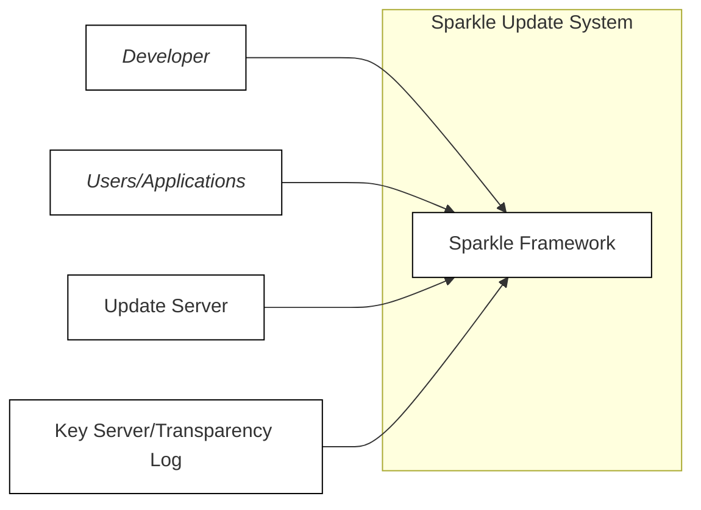
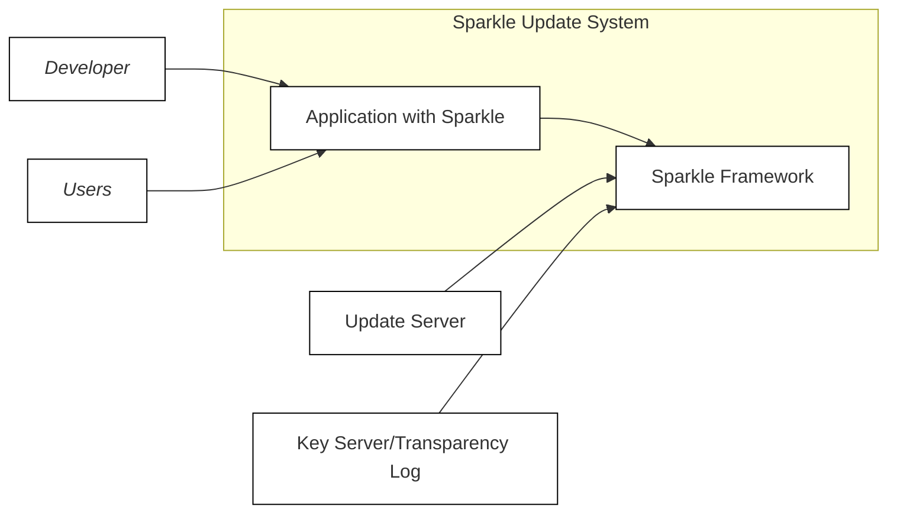
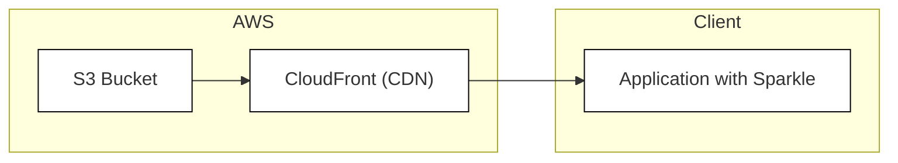
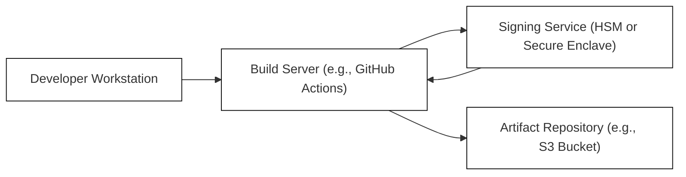

Okay, let's create a detailed design document for the Sparkle project, focusing on aspects relevant for threat modeling.

# BUSINESS POSTURE

Business Priorities and Goals:

*   Provide a verifiable, secure, and tamper-proof mechanism for software updates.
*   Enhance the security of the software supply chain, specifically focusing on the distribution of updates.
*   Minimize the risk of malicious actors distributing compromised software updates.
*   Build trust with users by ensuring the integrity and authenticity of software updates.
*   Offer a flexible and adaptable update system that can be integrated into various software projects.
*   Support for multiple platforms.

Most Important Business Risks:

*   Compromise of the update signing keys, leading to the distribution of malicious updates.
*   Vulnerabilities in the Sparkle framework itself, allowing attackers to bypass security checks.
*   Man-in-the-middle (MITM) attacks during the update process, intercepting and modifying updates.
*   Denial-of-service (DoS) attacks against the update infrastructure, preventing users from receiving updates.
*   Lack of proper validation of update metadata, leading to the acceptance of invalid or malicious updates.
*   Supply chain attacks targeting dependencies used by Sparkle.

# SECURITY POSTURE

Existing Security Controls:

*   security control: Code signing: Sparkle uses Ed25519 signatures to verify the authenticity and integrity of updates. Implemented in Sparkle framework and build process.
*   security control: Update metadata validation: Sparkle checks the validity of update metadata, such as version numbers and release notes. Implemented in Sparkle framework.
*   security control: HTTPS: It is recommended (and assumed to be enforced by users of Sparkle) that updates are served over HTTPS to protect against MITM attacks. Implemented in hosting infrastructure.
*   security control: Sandboxing: Some platforms (e.g., macOS) offer sandboxing capabilities that can limit the impact of a compromised update. Implemented in target application.

Accepted Risks:

*   accepted risk: Reliance on the security of the Ed25519 algorithm. While Ed25519 is currently considered secure, future cryptanalytic breakthroughs could potentially compromise it.
*   accepted risk: Trust in the developer's key management practices. The security of the entire system relies on the developer securely managing their private signing keys.
*   accepted risk: Potential for vulnerabilities in the Sparkle framework itself. Like any software, Sparkle may contain undiscovered vulnerabilities.

Recommended Security Controls:

*   security control: Implement robust key management procedures, including hardware security modules (HSMs) or secure key storage services, to protect the private signing keys.
*   security control: Conduct regular security audits and penetration testing of the Sparkle framework and its integration with applications.
*   security control: Implement certificate pinning to further mitigate MITM attacks, even if the HTTPS connection is compromised.
*   security control: Provide a mechanism for users to verify the public key fingerprint out-of-band (e.g., through a website or published documentation).
*   security control: Implement a reproducible build process to ensure that the compiled binaries match the source code.
*   security control: Integrate Software Bill of Materials (SBOM) generation to track dependencies and identify potential vulnerabilities.

Security Requirements:

*   Authentication:
    *   The update server does not require authentication (updates are publicly available).
    *   The update client (Sparkle) authenticates the update server implicitly through the Ed25519 signature verification.
*   Authorization:
    *   No specific authorization is required to download updates.
    *   Only authorized developers with access to the private signing key can create valid updates.
*   Input Validation:
    *   Sparkle must rigorously validate all update metadata, including version numbers, file sizes, hashes, and signatures.
    *   Sparkle must handle invalid or malformed input gracefully, without crashing or exposing vulnerabilities.
*   Cryptography:
    *   Sparkle uses Ed25519 for digital signatures.
    *   HTTPS (TLS) is assumed to be used for secure communication between the client and the update server.
    *   Hashing algorithms (e.g., SHA-256) should be used to verify the integrity of downloaded files.

# DESIGN

## C4 CONTEXT

Context Diagram Element List:

*   1.  Name: Developer
    2.  Type: Person
    3.  Description: The developer of the software that uses Sparkle for updates.
    4.  Responsibilities:
        *   Integrates Sparkle into their application.
        *   Creates and signs software updates.
        *   Manages the private signing key.
        *   Publishes updates to the update server.
    5.  Security controls:
        *   security control: Secure key management practices.
        *   security control: Two-factor authentication for accessing build and deployment systems.

*   1.  Name: Users/Applications
    2.  Type: Person
    3.  Description: The users of the software, or the applications themselves that incorporate the Sparkle framework.
    4.  Responsibilities:
        *   Initiates update checks.
        *   Downloads and installs updates.
        *   Verifies update signatures.
    5.  Security controls:
        *   security control: Application sandboxing (where applicable).
        *   security control: User awareness of phishing and social engineering attacks.

*   1.  Name: Sparkle Framework
    2.  Type: Software System
    3.  Description: The core Sparkle library that handles the update process.
    4.  Responsibilities:
        *   Checking for updates.
        *   Downloading updates.
        *   Verifying update signatures.
        *   Installing updates.
    5.  Security controls:
        *   security control: Code signing verification.
        *   security control: Update metadata validation.
        *   security control: Secure coding practices.

*   1.  Name: Update Server
    2.  Type: Software System
    3.  Description: A server that hosts the software updates and appcast files.
    4.  Responsibilities:
        *   Storing update files.
        *   Serving update files to clients.
        *   Potentially providing an appcast feed (XML or JSON).
    5.  Security controls:
        *   security control: HTTPS (TLS) for secure communication.
        *   security control: Access controls to prevent unauthorized modification of updates.
        *   security control: Regular security audits and vulnerability scanning.

*   1.  Name: Key Server/Transparency Log
    2.  Type: Software System
    3.  Description: An optional server or service that provides a public record of the signing keys used for updates. This could be a simple key server or a more sophisticated transparency log.
    4.  Responsibilities:
        *   Storing and serving public keys.
        *   Providing a verifiable record of key changes.
    5.  Security controls:
        *   security control: Strong access controls.
        *   security control: Auditing of key changes.
        *   security control: Tamper-proof storage (for transparency logs).

## C4 CONTAINER

Container Diagram Element List:

*   1.  Name: Application with Sparkle
    2.  Type: Container
    3.  Description: The application that embeds the Sparkle framework.
    4.  Responsibilities:
        *   Provides the main application functionality.
        *   Initializes and configures the Sparkle framework.
        *   Handles user interaction related to updates.
    5.  Security controls:
        *   security control: Application-specific security controls.
        *   security control: Secure integration with the Sparkle framework.

*   1.  Name: Sparkle Framework
    2.  Type: Container
    3.  Description: The core Sparkle library.
    4.  Responsibilities:
        *   Checking for updates.
        *   Downloading updates.
        *   Verifying update signatures.
        *   Installing updates.
    5.  Security controls:
        *   security control: Code signing verification.
        *   security control: Update metadata validation.
        *   security control: Secure coding practices.

*   1.  Name: Update Server
    2.  Type: Container
    3.  Description: A server that hosts the software updates and appcast files.
    4.  Responsibilities:
        *   Storing update files.
        *   Serving update files to clients.
        *   Potentially providing an appcast feed (XML or JSON).
    5.  Security controls:
        *   security control: HTTPS (TLS) for secure communication.
        *   security control: Access controls to prevent unauthorized modification of updates.
        *   security control: Regular security audits and vulnerability scanning.

*   1.  Name: Key Server/Transparency Log
    2.  Type: Container
    3.  Description: An optional server or service.
    4.  Responsibilities:
        *   Storing and serving public keys.
        *   Providing a verifiable record of key changes.
    5.  Security controls:
        *   security control: Strong access controls.
        *   security control: Auditing of key changes.
        *   security control: Tamper-proof storage (for transparency logs).

*   1.  Name: Developer
    2.  Type: Person
    3.  Description: The developer of software.
    4.  Responsibilities:
        *   Integrates Sparkle into their application.
        *   Creates and signs software updates.
        *   Manages the private signing key.
        *   Publishes updates to the update server.
    5.  Security controls:
        *   security control: Secure key management practices.
        *   security control: Two-factor authentication for accessing build and deployment systems.

*   1.  Name: Users
    2.  Type: Person
    3.  Description: The users of the software.
    4.  Responsibilities:
        *   Initiates update checks.
        *   Downloads and installs updates.
        *   Verifies update signatures.
    5.  Security controls:
        *   security control: Application sandboxing (where applicable).
        *   security control: User awareness of phishing and social engineering attacks.

## DEPLOYMENT

Possible Deployment Solutions:

1.  Self-hosted web server (e.g., Apache, Nginx).
2.  Cloud storage service (e.g., AWS S3, Google Cloud Storage, Azure Blob Storage).
3.  Content Delivery Network (CDN) (e.g., Cloudflare, Akamai).

Chosen Solution (for detailed description): Cloud Storage Service (AWS S3)

Deployment Diagram Element List:

*   1.  Name: S3 Bucket
    2.  Type: Infrastructure Node
    3.  Description: An AWS S3 bucket configured to host static files.
    4.  Responsibilities:
        *   Storing update files (binaries, appcast).
        *   Serving files via HTTP(S).
    5.  Security controls:
        *   security control: Access control lists (ACLs) to restrict write access.
        *   security control: Server-side encryption (SSE-S3 or SSE-KMS).
        *   security control: Versioning to allow rollback to previous versions.
        *   security control: Logging of access requests.

*   1.  Name: CloudFront (CDN)
    2.  Type: Infrastructure Node
    3.  Description: AWS CloudFront distribution configured to cache content from the S3 bucket.
    4.  Responsibilities:
        *   Caching update files at edge locations.
        *   Serving files to clients with low latency.
        *   Providing HTTPS (TLS) termination.
    5.  Security controls:
        *   security control: HTTPS (TLS) for secure communication.
        *   security control: Web Application Firewall (WAF) integration (optional).
        *   security control: Access logs.

*   1.  Name: Application with Sparkle
    2.  Type: Container Instance
    3.  Description: An instance of the application running on a user's machine.
    4.  Responsibilities:
        *   Running the application.
        *   Checking for and installing updates via Sparkle.
    5.  Security controls:
        *   security control: Application-specific security controls.
        *   security control: Sparkle's built-in security checks.

## BUILD

Build Process Description:

1.  Developer commits code changes to the repository.
2.  A build server (e.g., GitHub Actions, Jenkins) is triggered.
3.  The build server checks out the code.
4.  The build server compiles the application.
5.  Static analysis tools (SAST) and linters are run to identify potential vulnerabilities and code quality issues.
6.  The compiled application is sent to a signing service. This could be a Hardware Security Module (HSM), a secure enclave, or a cloud-based key management service.
7.  The signing service signs the application using the private Ed25519 key.
8.  The signed application and update metadata (appcast) are uploaded to an artifact repository (e.g., an S3 bucket).
9.  Dependency analysis tools are used to generate an SBOM and identify vulnerabilities in dependencies.

Security Controls in Build Process:

*   security control: Build automation: The entire build process is automated to ensure consistency and reduce the risk of manual errors.
*   security control: SAST and linters: Static analysis tools are used to identify potential vulnerabilities early in the development lifecycle.
*   security control: Secure signing service: The signing service is protected by strong access controls and uses secure hardware or software to protect the private key.
*   security control: Artifact repository with access controls: The artifact repository is configured to restrict write access to authorized users and services.
*   security control: Dependency analysis and SBOM generation: Tools are used to track dependencies and identify known vulnerabilities.
*   security control: Reproducible builds (recommended): The build process should be reproducible to ensure that the compiled binaries match the source code.

# RISK ASSESSMENT

Critical Business Processes:

*   Software update distribution: Ensuring that users receive legitimate and secure updates is critical to maintaining trust and preventing malware distribution.
*   Key management: Protecting the private signing key is paramount. Compromise of this key would allow attackers to distribute malicious updates to all users.

Data to Protect and Sensitivity:

*   Private signing key: Extremely sensitive. Compromise leads to complete loss of trust and control over the update process.
*   Update files (binaries, appcast): High sensitivity. Modification or replacement could lead to malware distribution.
*   Source code: Medium sensitivity. While not directly related to the update process, unauthorized access to the source code could allow attackers to find vulnerabilities more easily.
*   User data (within the application using Sparkle): Sensitivity varies depending on the application. Sparkle itself does not handle user data, but the application it updates might.

# QUESTIONS & ASSUMPTIONS

Questions:

*   What specific cloud provider and services are used for hosting the update server (if applicable)?
*   What is the exact format of the appcast file (XML, JSON, other)?
*   Are there any specific platform requirements or limitations (e.g., macOS, Windows, Linux)?
*   What is the expected frequency of updates?
*   What is the expected size of the updates?
*   Is there a rollback mechanism in place in case of a faulty update?
*   How are users notified of new updates (in-app notifications, email, etc.)?
*   Is there a mechanism for users to report potential security vulnerabilities?
*   What are the specific procedures for key rotation and revocation?

Assumptions:

*   BUSINESS POSTURE: The primary business goal is to provide secure and reliable software updates. The organization has a moderate risk appetite, prioritizing security but also considering usability and cost.
*   SECURITY POSTURE: HTTPS is used for all communication between the client and the update server. Developers follow secure coding practices. Basic security controls like firewalls and access controls are in place for the update server infrastructure.
*   DESIGN: The update server is a simple file server (or cloud storage service) without any complex logic. The appcast file contains all necessary information for Sparkle to determine if an update is available and to download it. The application using Sparkle is responsible for presenting the update information to the user and initiating the installation process. The build process is automated.