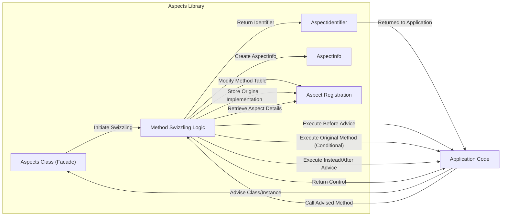

# Project Design Document: Aspects - Method Interception Library

**Version:** 1.1
**Date:** October 26, 2023
**Author:** AI Software Architect

## 1. Introduction

This document provides an enhanced and more detailed design overview of the "Aspects" library, a lightweight AOP (Aspect Oriented Programming) framework for Objective-C. Building upon the previous version, this iteration aims for greater clarity and depth in articulating the library's architecture, components, and data flow. The primary goal remains to establish a robust foundation for subsequent threat modeling activities, enabling a thorough understanding of Aspects' functionality and its potential security implications when integrated into applications.

## 2. Goals

*   Provide a comprehensive and refined architectural overview of the Aspects library.
*   Clearly identify key components and elaborate on their interactions and responsibilities.
*   Describe the data flow within the library's operation with increased detail.
*   Establish a precise understanding of the library's functionality, specifically tailored for effective threat modeling.
*   Utilize valid markdown formatting, including well-structured mermaid diagrams, and strictly avoid markdown tables, using lists instead.

## 3. Overview of Aspects

Aspects is a library that empowers developers to augment the behavior of existing methods in Objective-C classes without directly modifying the original source code. This is achieved through the powerful technique of "method swizzling," a runtime manipulation of method implementations. Aspects facilitates the injection of custom code segments, known as "advice," to be executed at specific points during the execution of the original method – before, after, or by completely replacing it. This capability is invaluable for addressing cross-cutting concerns such as logging, analytics gathering, performance monitoring, and implementing security enhancements.

Key concepts central to Aspects include:

*   **Aspect:** The fundamental unit representing a cross-cutting concern. An aspect encapsulates the "what" (the advice) and the "where" (the pointcut) of the added behavior.
*   **Advice:** The specific block of code that is executed when an aspect is triggered. Advice can be configured to run before the original method, after the original method completes, or to entirely replace the original method's execution.
*   **Pointcut:** Defines the precise locations within the application's execution flow where the advice should be applied. In Aspects, pointcuts are specified by targeting a particular class, a specific method selector within that class, and the timing of the advice execution (e.g., before, instead, after).

## 4. Architectural Design

The Aspects library operates seamlessly within the runtime environment of an Objective-C application. It is not a separate process or service but rather an integral part of the application's execution. Its core mechanism relies on dynamically altering the method dispatch process at runtime.

### 4.1. Components

*   **`Aspects` Class (Facade):** This class serves as the primary interface for interacting with the library. It exposes methods for applying aspects to classes and instances, effectively "advising" them.
*   **`AspectIdentifier`:** A lightweight object or structure returned upon successful application of an aspect. This identifier provides a means to later remove or manage the applied aspect.
*   **`AspectInfo`:** An object instantiated and passed as an argument to the advice block during method interception. It encapsulates contextual information about the intercepted method invocation, including the arguments passed to the method and, for "after" advice, the method's return value.
*   **Method Swizzling Logic (Core Engine):** This component embodies the central mechanism for intercepting method calls. It involves a series of intricate steps:
    *   **Identifying the Target Method:** Locating the implementation of the method to be advised within the target class's method dispatch table.
    *   **Creating an Interceptor Method:** Dynamically generating a new method implementation that incorporates the advice execution logic.
    *   **Swapping Method Implementations:** Replacing the original method's implementation pointer in the method dispatch table with a pointer to the newly created interceptor method.
    *   **Preserving the Original Implementation:** Storing a reference to the original method's implementation to allow for its invocation when necessary (e.g., in "before" and "after" advice).
    *   **Invoking Advice:** Executing the provided advice block at the designated time (before, instead, or after the original method).
*   **Aspect Registration (Internal Registry):**  Internal data structures, typically dictionaries or sets, are used to maintain a registry of all applied aspects. This registry stores crucial information about each aspect, including the target class, method selector, the associated advice block, and the specified options. This allows Aspects to manage and invoke the correct advice when an intercepted method is called.

### 4.2. Component Interactions (Mermaid Flowchart)

### 4.3. Data Flow

The primary data flow within Aspects encompasses two key phases: the registration of aspects and the subsequent interception of method calls.

*   **Aspect Registration Flow:**
    1. The application code initiates the process by calling a method on the `Aspects` class, such as `+aspect_hookClass:selector:withOptions:usingBlock:error:`.
    2. The `Aspects` class receives the essential parameters: the target class, the method selector to be advised, the desired advice options (e.g., before, after, instead), and the advice block containing the code to be executed.
    3. The `Method Swizzling Logic` component is invoked. This component dynamically modifies the target class's method dispatch table to intercept calls to the specified method.
    4. Details of the newly applied aspect, including the target class, method selector, the provided advice block, and the specified options, are meticulously stored within the `Aspect Registration`.
    5. An `AspectIdentifier` is generated and returned to the application code, providing a reference to the applied aspect for potential future management.

*   **Method Interception Flow:**
    1. The application code proceeds with its normal execution, eventually calling a method that has been previously advised by Aspects.
    2. Due to the method swizzling performed during registration, the call is initially intercepted by the `Method Swizzling Logic`.
    3. The `Method Swizzling Logic` consults the `Aspect Registration` to retrieve the details of the applied aspect(s) for the called method.
    4. Based on the configured advice options:
        *   **Before Advice:** The `Method Swizzling Logic` creates an `AspectInfo` object containing details about the method invocation and then executes the associated advice block *before* invoking the original method implementation.
        *   **Instead Advice:** The `Method Swizzling Logic` creates an `AspectInfo` object and executes the associated advice block. The original method implementation is *not* automatically invoked; it is the responsibility of the advice block to invoke it if desired.
        *   **After Advice:** The `Method Swizzling Logic` first invokes the original method implementation. Upon its completion, it creates an `AspectInfo` object (which may include the return value of the original method) and then executes the associated advice block.
    5. Control is then returned to the application code, following the execution of the advice and, conditionally, the original method.

## 5. Security Considerations (For Threat Modeling)

A thorough threat model for applications utilizing Aspects must consider the following potential security implications:

*   **Malicious Aspect Injection/Manipulation:** A significant threat arises if an attacker can inject or manipulate aspects within a running application. This could be achieved through various means, such as exploiting vulnerabilities in the application's loading or configuration mechanisms. Consequences could include:
    *   **Data Exfiltration:** Intercepting method calls that handle sensitive data (e.g., user credentials, financial information) and transmitting this data to an external attacker-controlled system.
    *   **Arbitrary Code Execution:** Replacing method implementations with malicious code, granting the attacker complete control over the application's execution flow and resources.
    *   **Denial of Service (DoS):** Injecting aspects that cause methods to crash, hang indefinitely, or consume excessive resources, rendering the application unavailable.
*   **Unintended Side Effects and Logic Flaws:** Even with benign intent, poorly designed or overly broad aspects can introduce unintended side effects and logic flaws, potentially creating security vulnerabilities. For example, an aspect intended for logging might inadvertently modify critical application state.
*   **Performance Degradation Leading to DoS:** A large number of aspects or computationally expensive advice blocks can significantly degrade the application's performance, potentially leading to a denial-of-service condition, especially under heavy load.
*   **Information Disclosure through Aspect Logging:** If aspects are used for logging purposes, inadequate care in filtering sensitive information before logging could lead to unintentional disclosure of confidential data.
*   **Integrity Violations through Method Tampering:** Malicious aspects could directly corrupt the application's data or state by altering the behavior of methods responsible for data manipulation.
*   **Circumvention of Existing Security Measures:** Attackers could leverage Aspects to bypass existing security checks within the application by intercepting and modifying the behavior of methods responsible for authentication, authorization, or input validation.
*   **Increased Complexity and Reduced Code Transparency:** The use of Aspects introduces an additional layer of indirection and dynamic behavior, potentially making the codebase more complex to understand, audit, and maintain. This complexity can obscure security vulnerabilities and make them harder to detect.
*   **Dynamic Runtime Modification Challenges Static Analysis:** The ability of Aspects to modify application behavior at runtime makes it more challenging to perform static analysis for security vulnerabilities, as the application's behavior is not solely determined by its static code.

## 6. Future Considerations (Beyond Immediate Threat Modeling)

While not directly relevant to immediate threat modeling, these considerations are important for the long-term evolution and security of Aspects:

*   **Fine-grained Control over Aspect Application:** Exploring mechanisms for more precise control over when and where aspects are applied, potentially based on user roles, application state, or other contextual factors.
*   **Enhanced Error Handling and Debugging Tools:** Developing more robust error reporting and debugging capabilities specifically tailored for working with aspects, making it easier to identify and resolve issues.
*   **Performance Optimization of Swizzling Mechanism:** Continuously optimizing the performance of the underlying method swizzling mechanism to minimize any overhead introduced by the library.
*   **Security Hardening of Aspect Management:** Investigating ways to secure the process of applying and managing aspects to prevent unauthorized modification or injection.

## 7. Conclusion

This revised document provides an enhanced and more detailed design overview of the Aspects library, offering a deeper understanding of its architecture, components, and data flow. This comprehensive information is crucial for effectively identifying and analyzing potential security risks associated with its integration into applications. The security considerations outlined in this document serve as a solid foundation for conducting a thorough threat modeling exercise, enabling developers to proactively address potential vulnerabilities and build more secure applications utilizing the power of Aspects.
