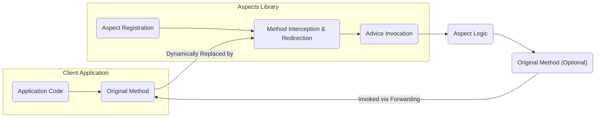
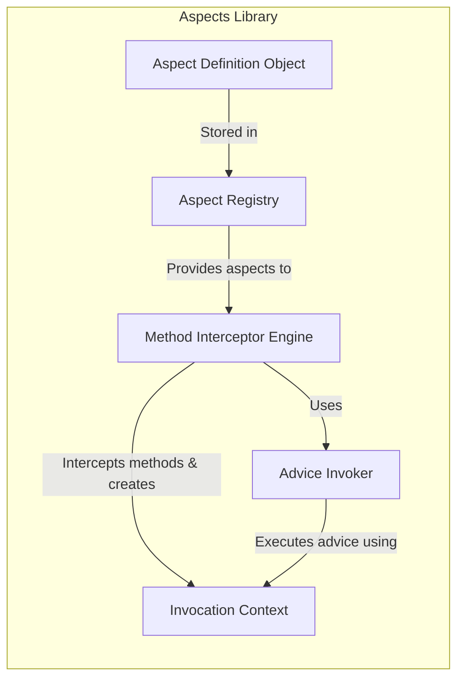
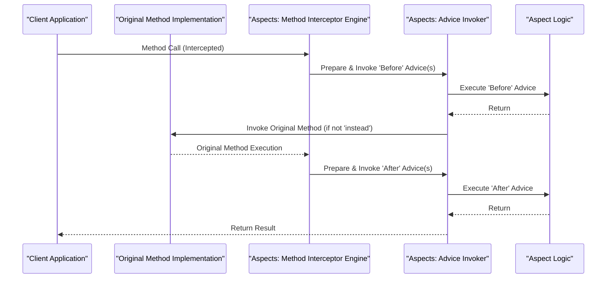

# Project Design Document: Aspects (Objective-C AOP Library)

**Version:** 1.1
**Date:** October 26, 2023
**Author:** AI Software Architect

## 1. Introduction

This document provides a detailed design overview of the "Aspects" project, an Objective-C library for Aspect-Oriented Programming (AOP). This document serves as a foundation for future threat modeling exercises. Aspects enables developers to add new behaviors to existing methods and classes without directly modifying their source code. This is achieved through runtime manipulation techniques, primarily leveraging the Objective-C runtime's capabilities for method interception and replacement.

## 2. Goals and Objectives

The primary goals of the Aspects library are:

* **Non-Invasive Code Modification:** To allow developers to inject behavior into existing code without altering the original source files, promoting cleaner separation of concerns.
* **Modular Implementation of Cross-Cutting Concerns:** To facilitate the implementation of cross-cutting concerns such as logging, analytics, performance monitoring, and security checks in a modular and reusable manner.
* **Enhanced Code Organization and Readability:** To improve the organization and readability of code by separating core business logic from tangential concerns.
* **Dynamic Aspect Management:** To enable the dynamic application and removal of aspects at runtime, offering flexibility in behavior modification.

## 3. Scope

This design document focuses on the core functionality and architectural design of the Aspects library itself. It specifically covers the mechanisms for aspect registration, method interception, and advice execution. This document does not cover:

* **Specific Use Cases:**  Concrete examples of how developers might implement aspects within their applications are outside the scope.
* **Objective-C Runtime Internals:** Detailed explanations of the inner workings of the Objective-C runtime are not included, though the library heavily relies on it.
* **Integration Process:** The steps involved in integrating the Aspects library into a client project (e.g., using dependency management tools) are not detailed here.

## 4. High-Level Architecture

The Aspects library functions by intercepting method invocations at runtime. When an aspect is applied to a specific method, the library dynamically modifies the method's implementation to incorporate the aspect's logic. This interception typically occurs before, after, or instead of the original method execution.

**Key Architectural Elements:**

* **Aspect Registration:** Provides the API for developers to define aspects, specifying the target class, method selector, and the advice logic to be executed.
* **Method Interception and Redirection:** The core mechanism responsible for intercepting method calls. This often involves techniques similar to method swizzling, where the original method's implementation is replaced with an intermediary implementation managed by the Aspects library.
* **Advice Invocation:** The process of executing the aspect's code (the "advice") at the designated point (before, after, or instead of the original method).

## 5. Component-Level Design

This section details the key internal components of the Aspects library and their interactions.

**Component Descriptions:**

* **Aspect Definition Object:** Represents a single registered aspect. It encapsulates information such as:
    * The target class and method selector.
    * The type of advice (e.g., before, instead, after).
    * A reference to the advice logic (typically a block or method).
    * Optional metadata or priority information.
* **Aspect Registry:**  Manages the collection of all registered `Aspect Definition Object` instances. It provides methods for:
    * Adding new aspects.
    * Removing existing aspects.
    * Querying aspects based on class and method.
* **Method Interceptor Engine:** The central component responsible for the runtime manipulation of methods. This engine:
    * Resolves the method implementation using the Objective-C runtime.
    * Dynamically creates or modifies method implementations, often using techniques similar to `method_exchangeImplementations` or by adding intermediary methods.
    * Stores references to the original method implementation for later invocation if needed.
* **Advice Invoker:**  Responsible for orchestrating the execution of the aspect's advice. This component:
    * Determines the order of execution for multiple aspects applied to the same method.
    * Creates an `Invocation Context` object.
    * Invokes the advice logic with the appropriate context.
* **Invocation Context:**  A data structure passed to the advice logic, providing contextual information about the method invocation, including:
    * The target object instance.
    * The method selector.
    * The arguments passed to the method.
    * A mechanism to invoke the original method implementation (for "before" and "after" advice).

## 6. Data Flow

The following sequence diagram illustrates the typical data flow during a method invocation when an aspect is applied:

**Detailed Steps:**

1. **Client Application Initiates Method Call:** The client application calls a method on an object.
2. **Method Interception:** The Aspects library's `Method Interceptor Engine` intercepts the call due to prior runtime manipulation.
3. **Prepare and Invoke 'Before' Advice:** The `Interceptor Engine` delegates to the `Advice Invoker` to execute any registered "before" advice.
4. **Execute 'Before' Advice:** The `Advice Invoker` executes the logic defined in the "before" aspect.
5. **Invoke Original Method (Conditional):** If no "instead" advice is present, the `Advice Invoker` triggers the execution of the original method implementation (often by forwarding the invocation).
6. **Original Method Execution:** The original method's code is executed.
7. **Prepare and Invoke 'After' Advice:** After the original method (or instead of it), the `Interceptor Engine` uses the `Advice Invoker` to execute any registered "after" advice.
8. **Execute 'After' Advice:** The `Advice Invoker` executes the logic defined in the "after" aspect.
9. **Return Result to Client:** The result of the original method (or the aspect's return value in case of "instead" advice) is returned to the client application.

## 7. Security Considerations

The Aspects library, while providing powerful AOP capabilities, introduces several potential security considerations that must be carefully addressed:

* **Abuse of Method Swizzling:**
    * **Unauthorized Behavior Modification:** Malicious or poorly written aspects could alter the intended behavior of critical methods, leading to unexpected application states or security vulnerabilities.
    * **Data Tampering:** Aspects could intercept method calls to modify data being passed or returned, potentially bypassing security checks or corrupting data integrity.
* **Information Disclosure via Aspect Logging:**
    * **Accidental Logging of Sensitive Data:** Aspects implemented for logging or debugging purposes might inadvertently log sensitive information (e.g., user credentials, API keys) if not carefully configured.
    * **Malicious Logging:** A compromised aspect could intentionally log sensitive data to an external location.
* **Bypassing Security Mechanisms:**
    * **Authentication Bypass:** Aspects could be used to intercept authentication-related methods and always return a successful authentication status.
    * **Authorization Bypass:** Aspects could modify the behavior of authorization checks, granting unauthorized access to resources or functionalities.
* **Performance and Denial of Service:**
    * **Resource Exhaustion:** Poorly implemented or excessive aspects could introduce significant performance overhead, potentially leading to denial-of-service conditions.
    * **Infinite Loops:** Aspects that recursively invoke the methods they are advising could create infinite loops, crashing the application.
* **Complexity and Debugging Challenges:**
    * **Increased Attack Surface:** The added layer of indirection introduced by aspects can make it more difficult to reason about the application's behavior and identify potential vulnerabilities.
    * **Obfuscation:** Malicious actors could use aspects to obfuscate malicious code or actions, making detection more challenging.
* **Third-Party Aspect Risks:**
    * **Supply Chain Vulnerabilities:** If an application relies on third-party aspects, the security of the application becomes dependent on the security of those external components.
    * **Backdoors:** Malicious third-party aspects could introduce backdoors or other malicious functionalities.

## 8. Technologies Used

* **Objective-C:** The primary programming language in which the Aspects library is implemented.
* **Objective-C Runtime:** The fundamental runtime environment that provides the necessary APIs and mechanisms for dynamic method manipulation, including:
    * `method_exchangeImplementations` (or similar techniques for method interception).
    * `objc_getClass`, `class_getInstanceMethod`, etc. for runtime introspection.
* **Potentially:** Assembly language or low-level C for highly optimized or platform-specific runtime manipulations.

## 9. Deployment Considerations

The Aspects library is typically deployed as a static library or a framework that is linked into the client application during the build process. The application then utilizes the library's API to register and manage aspects at runtime.

## 10. Potential Risks and Limitations

* **Fragility and Maintenance:** The reliance on runtime method manipulation makes aspects potentially fragile. Changes in the internal implementation of the advised classes in future iOS or macOS versions could break the functionality of aspects. This requires ongoing maintenance and testing.
* **Increased Code Complexity:** While aiming for separation of concerns, the use of aspects can introduce a level of indirection that might make the overall codebase harder to understand and maintain if not used judiciously.
* **Limited Applicability:** Aspects are most effective for addressing cross-cutting concerns that naturally fit the method invocation paradigm. They might not be suitable for all types of application logic.
* **Potential for Conflicts with Other Libraries:** If multiple libraries or frameworks attempt to perform similar runtime method manipulations on the same methods, conflicts and unpredictable behavior can arise. Careful coordination or awareness of such conflicts is necessary.

This improved design document provides a more detailed and refined overview of the Aspects library's architecture and functionality. It emphasizes the key components, data flow, and critically, expands on the security considerations relevant for threat modeling.
