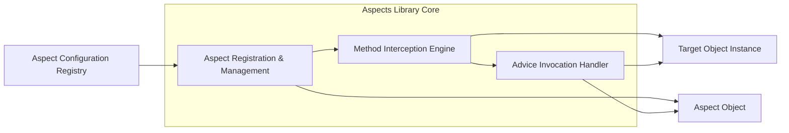
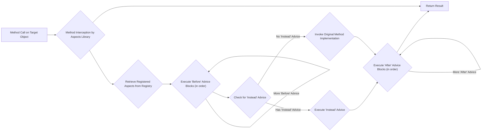

# Project Design Document: Aspects - AOP for Swift

**Version:** 1.1
**Date:** October 26, 2023
**Author:** AI Software Architect

## 1. Introduction

This document provides an enhanced design overview of the "Aspects" project, a Swift library enabling Aspect-Oriented Programming (AOP). This revised document aims for greater clarity and detail regarding the library's architecture, components, and data flow, specifically tailored for effective threat modeling. It builds upon the previous version by providing more specific details and elaborating on potential security implications.

## 2. Goals

* Provide a robust and efficient mechanism to inject custom code execution logic before, after, or instead of existing method invocations in Swift objects.
* Offer a developer-friendly and intuitive API for defining, registering, and managing aspects.
* Support flexible pointcut definitions for precisely targeting specific methods based on various criteria.
* Minimize the runtime performance overhead introduced by the aspect weaving process.
* Ensure thread safety and prevent the introduction of race conditions during aspect registration and execution.

## 3. Non-Goals

* Developing a comprehensive dependency injection container or framework.
* Implementing compile-time aspect weaving; the focus remains on dynamic, runtime weaving.
* Supporting aspect weaving across different processes or application boundaries.
* Providing an overly complex or domain-specific language for defining pointcuts.

## 4. High-Level Architecture

The Aspects library functions by dynamically intercepting method calls at runtime and executing associated advice (the custom code blocks within an aspect). The key interacting components are:

* **Aspects Library Core:** The central module providing the API for aspect management and the runtime logic for method interception and advice execution.
* **Target Objects:** Instances of classes or structs whose method executions are being augmented or modified by aspects.
* **Aspect Objects:** Objects that encapsulate the "advice" – the specific code blocks intended to be executed at defined points during a method's lifecycle.
* **Method Interception Engine:** The underlying mechanism (likely leveraging method swizzling or similar runtime manipulation techniques) responsible for redirecting method calls.
* **Aspect Configuration Registry:** An internal data store holding the registered aspects, their target methods, and the order of execution.

## 5. Detailed Design

### 5.1. Aspect Registration and Management

* **API Endpoints:** The library exposes methods (e.g., `aspect_hook(...)`, `aspect_unhook(...)`) to programmatically register and unregister aspects. These methods typically require:
    * The target object instance or class type.
    * The selector (method signature) of the method to be advised.
    * The aspect object containing the advice to be executed.
    * The execution timing (e.g., `.before`, `.instead`, `.after`).
    * An optional error handling closure.
* **Internal Data Structures:** The library maintains internal data structures, likely using dictionaries or hash maps, to store the registered aspects. These structures are organized to efficiently map:
    * Target object instances or class types to a collection of advised method selectors.
    * Each advised selector to an ordered list of associated aspects and their specified execution timings.
* **Thread Safety Considerations:** The aspect registration and unregistration processes must be inherently thread-safe to prevent race conditions when multiple threads attempt to modify the aspect configuration concurrently. This likely involves the use of locks (e.g., `NSRecursiveLock`) or concurrent data structures to protect the integrity of the `Aspect Configuration Registry`. Atomicity of registration operations is crucial.

### 5.2. Method Interception Engine

* **Runtime Manipulation:** The core of the interception mechanism likely relies on method swizzling or a similar runtime technique provided by the Objective-C runtime (given Swift's interoperability). This involves:
    * Dynamically changing the implementation of the target method at runtime.
    * Replacing the original method's implementation pointer with a pointer to an interceptor function within the Aspects library.
    * Storing a reference to the original method's implementation to allow for its invocation when necessary (especially for `.before` and `.after` advice).
* **Invocation Redirection:** When an advised method is called:
    1. The call is initially routed to the Aspects library's interceptor function due to the swizzling.
    2. The interceptor function retrieves the relevant registered aspects for the target object and method from the `Aspect Configuration Registry`.
    3. It then orchestrates the execution of the registered advice based on their specified timings.
* **Performance Implications:** Method interception inherently introduces a small performance overhead. The library should be designed to minimize this overhead through efficient lookup mechanisms in the `Aspect Configuration Registry` and optimized interceptor function execution. Potential for conflicts with other libraries also performing method swizzling needs consideration.

### 5.3. Advice Invocation Handler

* **Advice Execution Context:** The `Advice Invocation Handler` is responsible for executing the advice blocks defined within the aspect objects. These blocks are executed within the context of the intercepted method call and have access to:
    * The arguments passed to the original method invocation.
    * The target object instance.
    * A mechanism to invoke the original method implementation (specifically for `.instead` advice, allowing it to control whether the original method is executed).
* **Execution Flow Control:** The handler ensures that advice blocks are executed in the correct order based on their registration timing (`.before`, `.instead`, `.after`).
* **Error Handling within Advice:** The library should provide mechanisms to handle exceptions or errors that might occur during the execution of advice blocks. This might involve allowing error handling closures to be registered or providing default error handling behavior to prevent advice failures from crashing the entire application.

### 5.4. Aspect Configuration Registry

* **Centralized Storage:** This component serves as the central repository for all registered aspect configurations.
* **Data Organization:** The registry likely uses nested dictionaries or hash maps for efficient lookup based on target object/class and method selector.
* **Dynamic Updates:** The registry needs to support dynamic updates as aspects are registered and unregistered at runtime.
* **Concurrency Control:**  As mentioned earlier, appropriate concurrency control mechanisms are essential to ensure data integrity in a multithreaded environment.

## 6. Data Flow

The following diagram illustrates the sequence of operations when an advised method is invoked:

## 7. Security Considerations

This section details potential security considerations relevant to the Aspects library, intended to inform subsequent threat modeling activities.

* **Unintended or Malicious Method Interception:**
    * **Threat:** An attacker or a buggy component could register aspects that intercept critical system methods or methods of other sensitive parts of the application, leading to unexpected behavior, data corruption, or security breaches.
    * **Mitigation Strategies:**
        * Implement strict access control mechanisms for aspect registration, ensuring only authorized components can register aspects.
        * Provide clear documentation and guidelines on best practices for defining pointcuts to avoid overly broad or unintended interception.
        * Consider adding mechanisms to verify the source and integrity of code attempting to register aspects.
        * Implement runtime checks or sandboxing for advice code to limit its potential impact.
* **Execution of Malicious Advice:**
    * **Threat:** If an attacker can register a malicious aspect, they can execute arbitrary code within the application's context, potentially leading to data exfiltration, privilege escalation, or denial of service.
    * **Mitigation Strategies:**
        * Secure the aspect registration process rigorously.
        * Implement code signing or other mechanisms to verify the authenticity and integrity of aspect code.
        * Employ static analysis or runtime monitoring to detect potentially malicious behavior within advice code.
        * Enforce the principle of least privilege for advice code, limiting its access to system resources and sensitive data.
* **Information Disclosure through Aspects:**
    * **Threat:** Aspects could be used to intercept method calls and log or transmit sensitive data passed as arguments or returned as results, potentially violating privacy or security policies.
    * **Mitigation Strategies:**
        * Educate developers about the potential for information disclosure through aspects and provide guidelines for responsible usage.
        * Implement mechanisms to audit or monitor the data accessed and processed by registered aspects.
        * Consider providing APIs to sanitize or redact sensitive data within advice code.
* **Performance Degradation Leading to Denial of Service:**
    * **Threat:**  Poorly written or excessive aspects could introduce significant performance overhead, potentially leading to a denial of service by slowing down the application or consuming excessive resources.
    * **Mitigation Strategies:**
        * Provide guidance and best practices for writing efficient aspect code.
        * Implement monitoring and alerting mechanisms to detect performance degradation caused by aspect execution.
        * Consider adding mechanisms to limit the number or complexity of registered aspects.
* **Debugging and Auditing Complexity:**
    * **Threat:** The dynamic nature of aspect weaving can make debugging and auditing more complex, potentially masking malicious activity or making it harder to identify the root cause of issues.
    * **Mitigation Strategies:**
        * Provide robust logging and tracing mechanisms to track aspect registration and execution.
        * Develop debugging tools that allow developers to inspect the registered aspects and their impact on method calls.
        * Implement auditing features to track changes to aspect configurations.

## 8. Deployment Considerations

* **Library Integration:** The Aspects library is typically integrated into Swift projects using dependency management tools like Swift Package Manager or CocoaPods.
* **Runtime Dependency:** The library is a runtime dependency and must be included in the application bundle.
* **Potential Conflicts:**  Care should be taken to avoid conflicts with other libraries that might also employ method swizzling or similar runtime manipulation techniques.
* **No External Services:** The core functionality of the library does not inherently rely on external services or network communication.

## 9. Future Considerations

* **Enhanced Pointcut Language:** Explore the possibility of supporting a more expressive and flexible language for defining pointcuts.
* **Optional Compile-Time Weaving:** Investigate options for offering compile-time weaving as an alternative or optimization for specific use cases.
* **Integration with Logging and Monitoring Frameworks:** Provide seamless integration with existing logging and monitoring solutions for better observability of aspect behavior.
* **Support for Asynchronous Operations:**  Consider how aspects can be effectively applied to asynchronous methods and closures.

This improved design document provides a more detailed and nuanced understanding of the Aspects project, particularly focusing on aspects relevant to security. The enhanced descriptions of components, data flow, and the more specific security considerations will be valuable for conducting thorough threat modeling and implementing appropriate security measures.