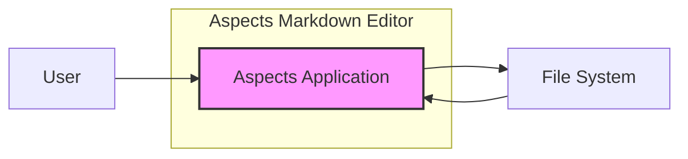

# BUSINESS POSTURE

This project, Aspects, is a minimal, open-source Markdown editor for macOS.

- Business Priorities and Goals:
  - Provide a user-friendly, efficient, and visually appealing Markdown editing experience on macOS.
  - Offer a free and open-source alternative to existing Markdown editors.
  - Potentially build a community around the editor and encourage contributions.
  - Enhance personal branding and portfolio for the developer.

- Business Risks:
  - Limited monetization potential as an open-source, free application.
  - Risk of low user adoption if the application does not meet user expectations or compete effectively with existing solutions.
  - Risk of security vulnerabilities that could damage user trust and reputation.
  - Risk of project abandonment if developer loses interest or resources.

# SECURITY POSTURE

- Security Controls:
  - security control: Code is hosted on GitHub, providing version control and transparency. (Implemented: GitHub Repository)
  - security control: Open-source nature allows for community review and potential security audits. (Implemented: Open Source)
  - security control: Application is distributed as a macOS application, leveraging macOS security features like sandboxing (Assumed, needs verification). (Implemented: macOS Application Distribution - assumed)

- Accepted Risks:
  - accepted risk: Reliance on a single developer for maintenance and security updates.
  - accepted risk: Potential vulnerabilities in third-party libraries or frameworks used by the application.
  - accepted risk: Risk of supply chain attacks if dependencies are compromised.

- Recommended Security Controls:
  - security control: Implement automated security scanning (SAST/DAST) in the development pipeline.
  - security control: Conduct regular security code reviews, especially before releases.
  - security control: Implement a process for reporting and addressing security vulnerabilities.
  - security control: Consider code signing the application to ensure integrity and authenticity.
  - security control: Implement automatic updates mechanism to deliver security patches promptly.

- Security Requirements:
  - Authentication: Not applicable as a local desktop application. User authentication is handled by the macOS operating system.
  - Authorization: Not applicable as a local desktop application. File system permissions managed by macOS handle authorization.
  - Input Validation:
    - Requirement: Sanitize and validate Markdown input to prevent cross-site scripting (XSS) vulnerabilities if rendering HTML previews.
    - Requirement: Validate file paths and operations to prevent path traversal vulnerabilities.
  - Cryptography:
    - Requirement: If storing sensitive data locally (e.g., application settings, potentially encrypted files in the future), use appropriate encryption methods. For this version, likely not applicable.
    - Requirement: Ensure secure communication channels (HTTPS) if the application communicates with external services (e.g., for updates, analytics - if implemented). For this version, likely not applicable.

# DESIGN

## C4 CONTEXT



- Context Diagram Elements:
  - - Name: User
    - Type: Person
    - Description: A user who wants to write and edit Markdown documents on macOS.
    - Responsibilities: Uses Aspects to create, edit, and view Markdown documents. Interacts with the application through the user interface.
    - Security controls: Operating system level user authentication and authorization.

  - - Name: Aspects Application
    - Type: Software System
    - Description: A macOS desktop application for creating, editing, and previewing Markdown documents.
    - Responsibilities: Provides a user interface for Markdown editing, renders Markdown to preview, saves and loads Markdown files from the file system.
    - Security controls: Input validation, secure file handling, potentially application sandboxing by macOS.

  - - Name: File System
    - Type: External System
    - Description: The local file system on the user's macOS machine where Markdown documents are stored.
    - Responsibilities: Stores and retrieves Markdown files. Manages file permissions and access control.
    - Security controls: Operating system level file permissions and access control.

## C4 CONTAINER

```mermaid
flowchart LR
    subgraph "Aspects Markdown Editor"
        subgraph "macOS Application"
            C1["User Interface (Swift/Objective-C)"]
            C2["Markdown Processing Engine (Swift/Objective-C)"]
            C3["File System Interaction (Swift/Objective-C)"]
        end
    end
    U["User"] --> C1
    C1 --> C2
    C1 --> C3
    C2 --> C1
    C3 --> F["File System"]
    F --> C3
    style C1 fill:#f9f9f9,stroke:#333,stroke-width:1px
    style C2 fill:#f9f9f9,stroke:#333,stroke-width:1px
    style C3 fill:#f9f9f9,stroke:#333,stroke-width:1px
    style "macOS Application" fill:#e0e0e0,stroke:#333,stroke-width:2px,stroke-dasharray: 5 5
```

- Container Diagram Elements:
  - - Name: User Interface
    - Type: Application Container
    - Description: The graphical user interface of the Aspects application, built using macOS UI frameworks (likely Swift or Objective-C).
    - Responsibilities: Handles user input (keyboard, mouse), displays the editor and preview, interacts with the Markdown processing engine and file system interaction components.
    - Security controls: Input validation on user inputs, UI framework security features.

  - - Name: Markdown Processing Engine
    - Type: Application Container
    - Description:  Component responsible for parsing Markdown syntax and rendering it into a preview (likely HTML or styled text). Implemented in Swift or Objective-C.
    - Responsibilities: Parses Markdown text, generates preview output, potentially handles syntax highlighting.
    - Security controls: Input validation and sanitization of Markdown input to prevent XSS or other injection vulnerabilities, secure handling of external resources if any (unlikely in this simple editor).

  - - Name: File System Interaction
    - Type: Application Container
    - Description: Component responsible for reading and writing Markdown files to the local file system. Implemented in Swift or Objective-C.
    - Responsibilities: Handles file open, save, and save as operations, interacts with the macOS file system APIs.
    - Security controls: File path validation to prevent path traversal, secure file handling practices, adherence to macOS file system permissions.

## DEPLOYMENT

Deployment is straightforward for a macOS desktop application.

- Deployment Architecture: Standalone macOS Application

```mermaid
flowchart LR
    subgraph "User's macOS Machine"
        subgraph "macOS Operating System"
            D1["Aspects Application Instance"]
        end
    end
    D1 --> OS["macOS OS"]
    OS --> HW["macOS Hardware"]
    style "macOS Operating System" fill:#e0e0e0,stroke:#333,stroke-width:2px,stroke-dasharray: 5 5
```

- Deployment Diagram Elements:
  - - Name: Aspects Application Instance
    - Type: Software Deployment Unit
    - Description: A single instance of the Aspects application running on a user's macOS machine.
    - Responsibilities: Provides Markdown editing functionality to the user.
    - Security controls: Application sandboxing by macOS, code signing (recommended), automatic updates (recommended).

  - - Name: macOS Operating System
    - Type: Operating System
    - Description: The macOS operating system on the user's machine.
    - Responsibilities: Provides the runtime environment for the Aspects application, manages system resources, enforces security policies.
    - Security controls: Operating system level security controls, user authentication, process isolation, file system permissions, application sandboxing.

  - - Name: macOS Hardware
    - Type: Hardware
    - Description: The physical macOS machine (MacBook, iMac, etc.) where the application is deployed.
    - Responsibilities: Provides the physical infrastructure for running the operating system and application.
    - Security controls: Hardware security features (e.g., Secure Enclave on some Macs), physical security of the device.

## BUILD

```mermaid
flowchart LR
    subgraph "Developer Workstation"
        DEV["Developer"] --> CODE["Code Changes"]
        CODE --> VCS[/"Version Control System (GitHub)"/]
    end
    VCS --> BUILD_TRIGGER["Build Trigger (e.g., GitHub Actions)"]
    subgraph "CI/CD Pipeline (GitHub Actions - assumed)"
        BUILD_TRIGGER --> BUILD_ENV["Build Environment (macOS)"]
        BUILD_ENV --> COMPILE["Compile & Build Application"]
        COMPILE --> TESTS["Run Automated Tests"]
        TESTS --> SAST["Static Analysis Security Testing (SAST) - Recommended"]
        SAST --> CODE_SIGN[/"Code Signing (Recommended)"/]
        CODE_SIGN --> ARTIFACTS["Build Artifacts (macOS App)"]
    end
    ARTIFACTS --> DISTRO[/"Distribution (e.g., GitHub Releases, Direct Download)"/]
    style VCS fill:#f9f9f9,stroke:#333,stroke-width:1px
    style BUILD_ENV fill:#f9f9f9,stroke:#333,stroke-width:1px
    style COMPILE fill:#f9f9f9,stroke:#333,stroke-width:1px
    style TESTS fill:#f9f9f9,stroke:#333,stroke-width:1px
    style SAST fill:#f9f9f9,stroke:#333,stroke-width:1px
    style CODE_SIGN fill:#f9f9f9,stroke:#333,stroke-width:1px
    style ARTIFACTS fill:#f9f9f9,stroke:#333,stroke-width:1px
    style DISTRO fill:#f9f9f9,stroke:#333,stroke-width:1px
    style "CI/CD Pipeline (GitHub Actions - assumed)" fill:#e0e0e0,stroke:#333,stroke-width:2px,stroke-dasharray: 5 5
    style "Developer Workstation" fill:#e0e0e0,stroke:#333,stroke-width:2px,stroke-dasharray: 5 5
```

- Build Process Elements:
  - - Name: Developer
    - Type: Person
    - Description: Software developer working on the Aspects project.
    - Responsibilities: Writes code, commits changes to version control.
    - Security controls: Secure development practices, code review.

  - - Name: Code Changes
    - Type: Data
    - Description: Source code modifications made by the developer.
    - Responsibilities: Represents the codebase of the Aspects application.
    - Security controls: Version control system (GitHub) for tracking changes and history.

  - - Name: Version Control System (GitHub)
    - Type: Software Service
    - Description: GitHub repository hosting the Aspects source code.
    - Responsibilities: Stores and manages the codebase, tracks changes, facilitates collaboration.
    - Security controls: Access control, authentication, audit logs provided by GitHub.

  - - Name: Build Trigger (e.g., GitHub Actions)
    - Type: Automation
    - Description: Automated trigger that initiates the build process upon code changes (e.g., push to repository).
    - Responsibilities: Automatically starts the CI/CD pipeline.
    - Security controls: Access control to CI/CD configuration, secure configuration of build triggers.

  - - Name: Build Environment (macOS)
    - Type: Infrastructure
    - Description: macOS environment used to compile and build the application.
    - Responsibilities: Provides the necessary tools and libraries for building the macOS application.
    - Security controls: Secure build environment, access control, regular patching.

  - - Name: Compile & Build Application
    - Type: Build Step
    - Description: Step where the source code is compiled and the macOS application bundle is created.
    - Responsibilities: Transforms source code into an executable application.
    - Security controls: Use of trusted compilers and build tools.

  - - Name: Run Automated Tests
    - Type: Build Step
    - Description: Step where automated tests (unit, integration, UI tests) are executed.
    - Responsibilities: Verifies the functionality and stability of the application.
    - Security controls: Comprehensive test suite to catch potential bugs and vulnerabilities.

  - - Name: Static Analysis Security Testing (SAST) - Recommended
    - Type: Security Tool
    - Description: Recommended step to perform static code analysis to identify potential security vulnerabilities in the source code.
    - Responsibilities: Scans code for security flaws.
    - Security controls: SAST tool configuration and integration into the build pipeline.

  - - Name: Code Signing (Recommended)
    - Type: Security Process
    - Description: Recommended step to sign the application with a developer certificate to ensure code integrity and authenticity.
    - Responsibilities: Digitally signs the application.
    - Security controls: Secure key management for code signing certificates.

  - - Name: Build Artifacts (macOS App)
    - Type: Data
    - Description: The compiled macOS application bundle ready for distribution.
    - Responsibilities: Represents the distributable application.
    - Security controls: Storage in secure artifact repository (if applicable), integrity checks.

  - - Name: Distribution (e.g., GitHub Releases, Direct Download)
    - Type: Distribution Channel
    - Description: Method used to distribute the application to users (e.g., GitHub Releases, direct download from a website).
    - Responsibilities: Makes the application available to users.
    - Security controls: Secure distribution channels (HTTPS), integrity checks (e.g., checksums) for downloaded artifacts.

# RISK ASSESSMENT

- Critical Business Processes:
  - For a free, open-source personal project, there are no critical business processes in the traditional sense. However, maintaining user trust and positive reputation is important for the developer's goals.

- Data to Protect and Sensitivity:
  - User data: Markdown documents created and edited by users.
    - Sensitivity: Potentially sensitive, depending on the content of the documents. Users expect confidentiality and integrity of their local files.
  - Application settings: User preferences and application configuration.
    - Sensitivity: Low to medium, depending on what settings are stored.
  - Source code: The source code of the Aspects application.
    - Sensitivity: Medium, protecting intellectual property and preventing unauthorized modifications.

# QUESTIONS & ASSUMPTIONS

- Questions:
  - Is application sandboxing enabled for Aspects?
  - Is code signing currently implemented for Aspects releases?
  - Are there any plans for future features that might introduce network communication or data storage beyond local files?
  - What is the intended distribution method for the application?

- Assumptions:
  - BUSINESS POSTURE: The primary goal is to provide a useful and well-regarded open-source Markdown editor, rather than direct monetization.
  - SECURITY POSTURE: Current security controls are basic, relying on macOS platform security. There is room for improvement in secure development practices and build pipeline security.
  - DESIGN: The application is a standalone macOS desktop application with no server-side components or external dependencies beyond standard macOS libraries. The application primarily interacts with the local file system.